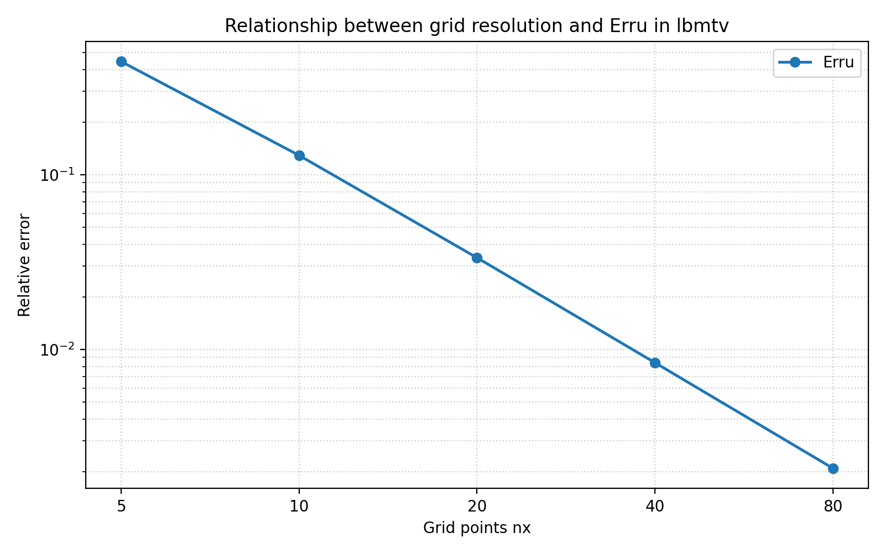

# lbmtv.c 説明ドキュメント

## 概要

[src/sec1/lbmtv.c](../../src/sec1/lbmtv.c) は、2 次元 Taylor vortex flow を D2Q9 の単一緩和時間格子ボルツマン法で計算し、解析解との誤差を評価するサンプルです。周期境界条件のもとで渦が粘性により減衰していく問題を扱っています。

このコードでは、次の 3 つを 1 本のプログラムで行っています。

- Taylor vortex の初期条件を与える
- LBM の collision と streaming を繰り返す
- 解析解と数値解の相対誤差を計算する

## 扱う物理量

- $\rho$: 密度
- $u, v$: 速度成分
- $f_k$: 分布関数
- $f_k^{\mathrm{eq}}$: 平衡分布関数
- $\tau$: 緩和時間
- $\nu$: 動粘性係数

コード内では、解析解を `rhoe`, `ue`, `ve`、数値解を `rho`, `u`, `v` に格納しています。

## 格子モデル

このコードは D2Q9 モデルを使っています。離散速度は次の 9 方向です。

$$
\mathbf{c}_0=(0,0)
$$

$$
\mathbf{c}_1=(1,0),\quad
\mathbf{c}_2=(0,1),\quad
\mathbf{c}_3=(-1,0),\quad
\mathbf{c}_4=(0,-1)
$$

$$
\mathbf{c}_5=(1,1),\quad
\mathbf{c}_6=(-1,1),\quad
\mathbf{c}_7=(-1,-1),\quad
\mathbf{c}_8=(1,-1)
$$

対応する重みは次です。

$$
w_0=\frac{4}{9},\quad
w_{1\sim4}=\frac{1}{9},\quad
w_{5\sim8}=\frac{1}{36}
$$

これは [src/sec1/lbmtv.c](../../src/sec1/lbmtv.c) の `cx`, `cy` と `f0` の計算にそのまま現れています。

## 初期条件

Taylor vortex の初期速度場は次です。

$$
u(x,y,0)=-u_0\cos\left(\frac{2\pi x}{n_x}\right)\sin\left(\frac{2\pi y}{n_y}\right)
$$

$$
v(x,y,0)=u_0\sin\left(\frac{2\pi x}{n_x}\right)\cos\left(\frac{2\pi y}{n_y}\right)
$$

密度場は低マッハ数近似に基づいて次で与えています。

$$
\rho(x,y,0)=1-\frac{3}{4}u_0^2
\left[
\sin\left(\frac{4\pi x}{n_x}\right)
+
\cos\left(\frac{4\pi y}{n_y}\right)
\right]
$$

この部分は [src/sec1/lbmtv.c](../../src/sec1/lbmtv.c) の初期条件ループに対応します。

## 粘性係数

単一緩和時間 BGK モデルでは、格子単位系での動粘性係数は

$$
\nu = \frac{\tau - 0.5}{3}
$$

です。コードでは

$$
\tau = 0.8, \quad \nu = \frac{0.8 - 0.5}{3} = 0.1
$$

として計算しています。

## 平衡分布関数

各方向の平衡分布関数は

$$
f_k^{\mathrm{eq}} = w_k \rho
\left( 1 + 3\,\mathbf{c}_k\cdot\mathbf{u} + \frac{9}{2}(\mathbf{c}_k\cdot\mathbf{u})^2 - \frac{3}{2}\lVert\mathbf{u}\rVert^2 \right)
$$

で与えています。ここで

$$
\mathbf{u}=(u,v), \quad
\lVert\mathbf{u}\rVert^2=u^2+v^2
$$

です。静止粒子の $k=0$ については

$$
f_0^{\mathrm{eq}} = \frac{4}{9}\rho\left(1-\frac{3}{2}\lVert\mathbf{u}\rVert^2\right)
$$

となります。

## 時間発展

このコードでは、1 ステップごとに collision、streaming、巨視量の再計算を行います。

### 1. Collision

BGK 近似による衝突は

$$
f_k^*(\mathbf{x},t)=f_k(\mathbf{x},t)-\frac{f_k(\mathbf{x},t)-f_k^{\mathrm{eq}}(\mathbf{x},t)}{\tau}
$$

です。

### 2. Streaming

衝突後分布を離散速度方向へ 1 格子点移流します。

$$
f_k(\mathbf{x}+\mathbf{c}_k,t+1)=f_k^*(\mathbf{x},t)
$$

実装では `ftmp` に一度退避し、その後 `f[k][in][jn]` に書き戻しています。

### 3. 周期境界条件

端点を超えた格子点は反対側へ回り込ませます。

$$
x < 0 \Rightarrow x \leftarrow n_x-1,
\qquad
x = n_x \Rightarrow x \leftarrow 0
$$

$$
y < 0 \Rightarrow y \leftarrow n_y-1,
\qquad
y = n_y \Rightarrow y \leftarrow 0
$$

### 4. 巨視量の再構成

密度と速度は分布関数から

$$
\rho = \sum_{k=0}^{8} f_k
$$

$$
u = \frac{1}{\rho}\sum_{k=0}^{8} f_k c_{k,x},
\qquad
v = \frac{1}{\rho}\sum_{k=0}^{8} f_k c_{k,y}
$$

として求めます。

## 解析解

Taylor vortex の速度場は粘性減衰により指数関数的に減衰します。このコードでは解析解を

$$
u_e(x,y,t)= -u_0\cos\left(\frac{2\pi x}{n_x}\right)
\sin\left(\frac{2\pi y}{n_y}\right)
\exp\left[-\nu t\left(\left(\frac{2\pi}{n_x}\right)^2+\left(\frac{2\pi}{n_x}\right)^2\right)\right]
$$

$$
v_e(x,y,t)= u_0\sin\left(\frac{2\pi x}{n_x}\right)
\cos\left(\frac{2\pi y}{n_y}\right)
\exp\left[-\nu t\left(\left(\frac{2\pi}{n_x}\right)^2+\left(\frac{2\pi}{n_x}\right)^2\right)\right]
$$

$$
\rho_e(x,y,t)=1-\frac{3}{4}u_0^2
\left[
\sin\left(\frac{4\pi x}{n_x}\right)
+
\cos\left(\frac{4\pi y}{n_y}\right)
\right]
\exp\left[-2\nu t\left(\left(\frac{2\pi}{n_x}\right)^2+\left(\frac{2\pi}{n_x}\right)^2\right)\right]
$$

として評価しています。

実装上は `time` を 1 ステップごとに増やし、`loop1` と `loop2` をそれぞれ `nx` 回まわして、合計 $n_x^2$ ステップ計算します。

## 誤差評価

コードでは速度と密度の相対 $L_2$ 誤差を出力します。

$$
\mathrm{Err}_u =
\sqrt{\frac{\sum (u_e-u)^2}{\sum u_e^2}}
$$

$$
\mathrm{Err}_v =
\sqrt{\frac{\sum (v_e-v)^2}{\sum v_e^2}}
$$

$$
\mathrm{Err}_\rho =
\sqrt{\frac{\sum (\rho_e-\rho)^2}{\sum \rho_e^2}}
$$

プログラムの標準出力と `error` ファイルには、この 3 つの誤差が保存されます。

## 解析結果と評価結果

現状の標準設定では、[src/sec1/lbmtv.c](../../src/sec1/lbmtv.c) は

$$
τ = 0.8, n_x = n_y = 5, u_0 = 0.01
$$

で実行されます。実行終了時に得られた評価結果は次の通りです。

$$
\mathrm{Err}_u = 4.43695468 \times 10^{-1}
$$

$$
\mathrm{Err}_v = 4.39273007 \times 10^{-1}
$$

$$
\mathrm{Err}_\rho = 4.17111026 \times 10^{-8}
$$

また、標準出力には無次元化時間と計算条件が次のように表示されます。

$$
\mathrm{Time} = 0.05, \qquad n_x = 5, \qquad \tau = 0.8
$$

### 結果の解釈

- 密度に対応する誤差 $\mathrm{Err}_\rho$ は非常に小さく、解析解との一致は良好です。
- 一方で速度成分の誤差 $\mathrm{Err}_u$, $\mathrm{Err}_v$ はおよそ $4.4 \times 10^{-1}$ で、速度場には無視できない差が残っています。
- このコードでは格子数が $n_x=n_y=5$ とかなり粗いため、Taylor vortex の減衰を定量的に高精度で再現するというより、LBM の基本実装と解析解比較の流れを確認するための設定になっています。

### 評価の見方

このプログラムを精度検証に使う場合は、次の点を見ると判断しやすくなります。

- `error` に出力される $\mathrm{Err}_u$, $\mathrm{Err}_v$, $\mathrm{Err}_\rho$
- `datautv`, `datavtv`, `datartv` と `datautve`, `datavtve`, `datartve` の差
- 格子数 `nx`, `ny` や緩和時間 `tau` を変えたときの誤差の変化

特にこのコードには `nx = 80, 40, 20, 10, 5` の候補がコメントとして残っているため、格子数依存性を確認する教材として使いやすい構成です。

## 格子点数と誤差の関係

`tau = 0.8` を固定し、`n_x = n_y = 80, 40, 20, 10, 5` の 5 条件で [src/sec1/lbmtv.c](../../src/sec1/lbmtv.c) を実行すると、誤差は次のようになります。

| error | nx=5 | nx=10 | nx=20 | nx=40 | nx=80 |
|---|---:|---:|---:|---:|---:|
| Erru | 4.43695468e-01 | 1.28926936e-01 | 3.34818652e-02 | 8.40077186e-03 | 2.09164843e-03 |
| Errv | 4.39273007e-01 | 1.28897127e-01 | 3.34553577e-02 | 8.46312055e-03 | 2.10621603e-03 |
| Errp | 4.17111026e-08 | 9.75951539e-11 | 1.82823042e-10 | 1.10123955e-10 | 2.36243197e-10 |

この結果の追跡用要約は [docs/sec1/generated/lbmtv_nx_errors.md](generated/lbmtv_nx_errors.md) と [docs/sec1/generated/lbmtv_nx_errors.csv](generated/lbmtv_nx_errors.csv) に保存しています。生の実行出力は従来どおり `outputs/sec1/lbmtv_nx_study` に残ります。

また、格子点数と誤差の関係を示す追跡用グラフは [docs/assets/sec1/lbmtv_nx_errors.png](../assets/sec1/lbmtv_nx_errors.png) に保存しています。

### 結果の傾向

- `Erru` と `Errv` は、格子を細かくするにつれて単調に減少しています。
- 特に `nx = 5` から `nx = 80` へ細分化すると、速度誤差は約 2 桁以上改善しています。
- `Errp` は全体としてかなり小さい一方で、速度誤差ほど単純な単調性は見えません。
- 掲載している図は `Erru` のみを、横軸対数・縦軸対数で可視化したものです。

### 収束次数の近似

格子幅を $h \propto 1/n_x$ とみなし、隣接する 2 つの格子について

$$
p \approx \frac{\log(E_{2h}/E_h)}{\log 2}
$$

で近似収束次数を評価すると、速度誤差に対して次の値が得られます。

| grid pair | p from Erru | p from Errv |
|---|---:|---:|
| 80 -> 40 | 2.005882 | 2.006536 |
| 40 -> 20 | 1.994786 | 1.982976 |
| 20 -> 10 | 1.945102 | 1.945911 |
| 10 -> 5  | 1.783016 | 1.768898 |

この結果から、十分に細かい格子では速度誤差はおおむね 2 次精度に近い収束を示しています。粗い格子側、特に `nx = 10 -> 5` では収束次数がやや低下しており、格子が粗すぎると漸近的な収束領域から外れることが分かります。

密度誤差 `Errp` については値が極めて小さく、丸め誤差や離散化誤差の微妙な影響を受けやすいため、速度誤差ほどきれいな収束次数にはなっていません。このため、本コードの格子収束評価では主に `Erru` と `Errv` を見るのが妥当です。

## 出力ファイル

このプログラムは主に次のファイルを出力します。

- `error`: 速度と密度の相対誤差
- `datautv`, `datavtv`, `datartv`: 数値解
- `datautve`, `datavtve`, `datartve`: 解析解

なお `datartv` と `datartve` は、コード上で `rho/3.0` と `rhoe/3.0` を出力しています。これは格子ボルツマン法での音速平方 $c_s^2 = 1/3$ を意識して圧力相当量として見たいときの書き方です。

## コードの読み方

[src/sec1/lbmtv.c](../../src/sec1/lbmtv.c) は大きく次の順に読めます。

- 初期条件の設定
- 離散速度 `cx`, `cy` の設定
- 平衡分布 `f0` の初期化
- `collision -> streaming -> macro update` の反復
- 解析解との誤差評価
- 出力ファイルの保存

LBM の最小構成を理解する教材として使いやすく、周期境界と解析解を持つため、実装確認にも向いています。