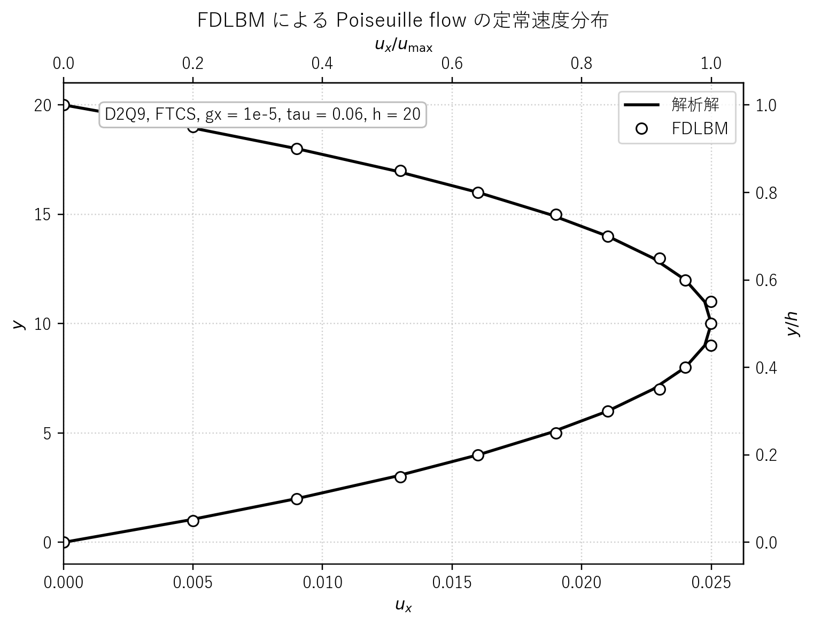
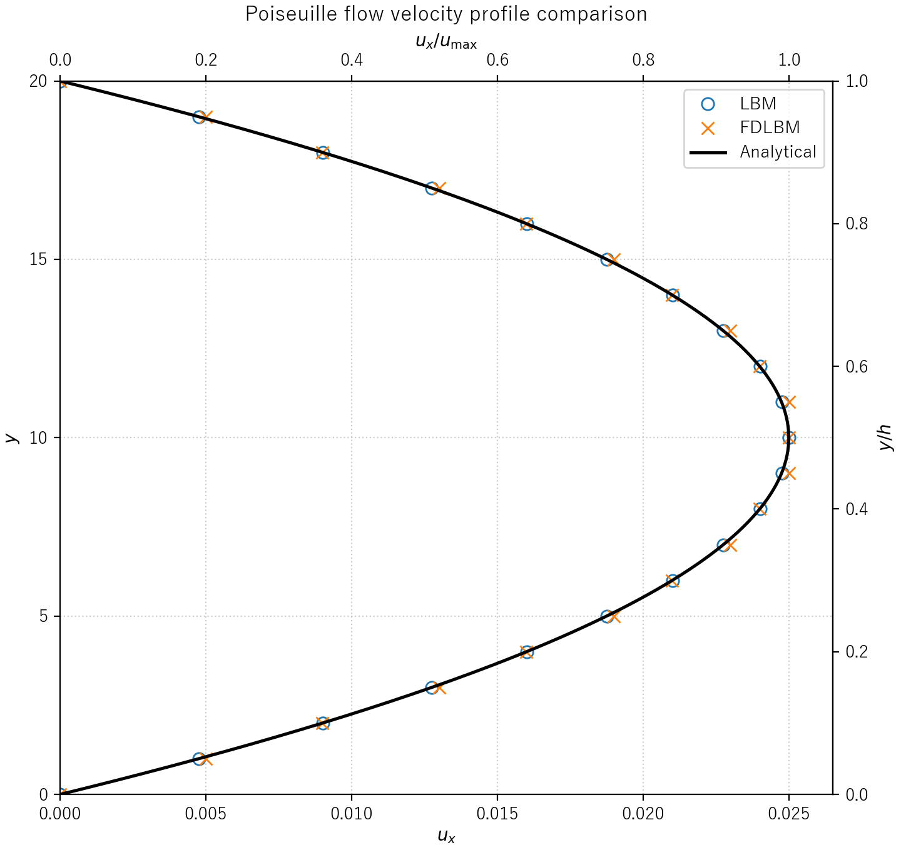

# fdlbm.c 説明ドキュメント

## 概要

[src/sec2/fdlbm.c](../../src/sec2/fdlbm.c) は、2 次元チャネル内の Poiseuille flow を有限差分格子ボルツマン法で解く最小実装です。離散速度には D2Q9 を使いますが、通常の LBM のように分布関数を格子方向へそのまま streaming するのではなく、分布関数の移流項を有限差分で評価し、時間積分を陽的 Euler 法で進めています。

このコードが行っていることは次の 4 点です。

- D2Q9 の平衡分布関数を使って初期分布を与える
- BGK collision と体積力項を計算する
- 移流項を FTCS で離散化して分布関数を更新する
- 速度分布を解析解と比較しながら定常解へ収束させる

## 計算領域と変数

計算領域は x 方向に周期、y 方向に上下壁を持つ 2 次元チャネルです。既定値は

$$
n_x = 20,\quad n_y = 22,\quad \Delta x = \Delta y = 1.0,\quad \Delta t = 0.1
$$

です。コード中の主な変数は以下です。

- $\rho$: 密度
- $u, v$: 現在時刻の速度成分
- $u_n, v_n$: 1 ステップ前の速度成分
- $f_k$: 分布関数
- $f_k^{\mathrm{eq}}$: 平衡分布関数
- $g_x, g_y$: 体積力加速度
- $\tau$: 緩和時間
- $\nu$: 動粘性係数

既定の物理パラメータは

$$
g_x = 10^{-5},\quad g_y = 0,\quad \tau = 0.06
$$

で、コードでは動粘性係数を

$$
\nu = \frac{\tau}{3}
$$

として与えています。したがって既定値では

$$
\nu = 0.02
$$

です。ここは通常の格子単位系 LBM でよく使う

$$
\nu = \frac{\tau - 1/2}{3}
$$

とは異なり、このコードが有限差分時間発展を採っていることに対応しています。

## D2Q9 離散速度

離散速度は D2Q9 で、

$$
\mathbf{c}_0=(0,0)
$$

$$
\mathbf{c}_1=(1,0),\quad
\mathbf{c}_2=(0,1),\quad
\mathbf{c}_3=(-1,0),\quad
\mathbf{c}_4=(0,-1)
$$

$$
\mathbf{c}_5=(1,1),\quad
\mathbf{c}_6=(-1,1),\quad
\mathbf{c}_7=(-1,-1),\quad
\mathbf{c}_8=(1,-1)
$$

です。重みは

$$
w_0=\frac{4}{9},\quad w_{1\sim 4}=\frac{1}{9},\quad w_{5\sim 8}=\frac{1}{36}
$$

です。

## 平衡分布関数

平衡分布関数は D2Q9 の二次近似で

$$
f_k^{\mathrm{eq}} = w_k \rho
\left(
1 + 3\,\mathbf{c}_k\cdot\mathbf{u}
+ \frac{9}{2}(\mathbf{c}_k\cdot\mathbf{u})^2
- \frac{3}{2}|\mathbf{u}|^2
\right)
$$

です。ここで

$$
\mathbf{u}=(u,v),\quad |\mathbf{u}|^2=u^2+v^2
$$

です。実装では $k=0$, $k=1\sim 4$, $k=5\sim 8$ を分けて重みを直接書いています。

## 支配方程式の離散化

このコードの更新は、連続時間の BGK 型離散速度 Boltzmann 方程式

$$
\frac{\partial f_k}{\partial t}
+ c_{k,x}\frac{\partial f_k}{\partial x}
+ c_{k,y}\frac{\partial f_k}{\partial y}
= -\frac{f_k - f_k^{\mathrm{eq}}}{\tau} + F_k
$$

を直接差分化した形になっています。

### 1. 衝突項

まず BGK 緩和項を

$$
\Omega_k = -\frac{f_k - f_k^{\mathrm{eq}}}{\tau}
$$

として計算します。

### 2. 体積力項

体積力はコード中で次の離散形で加えています。

$$
F_k=
\begin{cases}
\rho(c_{k,x}g_x + c_{k,y}g_y)/3 & (k=1,2,3,4) \\
\rho(c_{k,x}g_x + c_{k,y}g_y)/12 & (k=5,6,7,8) \\
0 & (k=0)
\end{cases}
$$

### 3. 移流項

x, y の空間微分は中心差分で近似しています。内部格子点では

$$
\left(\frac{\partial f_k}{\partial x}\right)_{i,j}
\approx
\frac{f_{k,i+1,j}-f_{k,i-1,j}}{2\Delta x}
$$

$$
\left(\frac{\partial f_k}{\partial y}\right)_{i,j}
\approx
\frac{f_{k,i,j+1}-f_{k,i,j-1}}{2\Delta y}
$$

です。これを使うと、コードの一時配列 ftmp は

$$
\mathrm{ftmp}_{k,i,j}=
\Omega_{k,i,j}+F_{k,i,j}
-c_{k,x}\frac{f_{k,i+1,j}-f_{k,i-1,j}}{2\Delta x}
-c_{k,y}\frac{f_{k,i,j+1}-f_{k,i,j-1}}{2\Delta y}
$$

に対応します。

x 方向は周期境界なので

$$
f_{k,-1,j}=f_{k,n_x,j},\quad f_{k,n_x+1,j}=f_{k,0,j}
$$

として扱っています。

### 4. 時間積分

最後に陽的 Euler 法で

$$
f_k^{n+1}=f_k^n + \Delta t\,\mathrm{ftmp}_k^n
$$

と更新します。したがって、この実装全体は FTCS に基づく有限差分 LBM です。

## 巨視量の再構成

更新後の密度と速度は分布関数のモーメントから

$$
\rho = \sum_{k=0}^8 f_k
$$

$$
u = \frac{1}{\rho}\sum_{k=0}^8 c_{k,x} f_k,\quad
v = \frac{1}{\rho}\sum_{k=0}^8 c_{k,y} f_k
$$

として求めています。実装では $k=0$ の寄与は速度に入らないため、速度和は $k=1\sim 8$ のみを足しています。

## 境界条件

### y 方向の分布関数外挿

y 方向端では、まず分布関数更新量に対して 2 次の外挿を入れています。

$$
\mathrm{ftmp}_{k,i,0} = 2\,\mathrm{ftmp}_{k,i,1} - \mathrm{ftmp}_{k,i,2}
$$

$$
\mathrm{ftmp}_{k,i,n_y} = 2\,\mathrm{ftmp}_{k,i,n_y-1} - \mathrm{ftmp}_{k,i,n_y-2}
$$

これは壁面直外の差分値を内部情報から延長する処理です。

### マクロ速度の no-slip 条件

その後、巨視量を再構成したあとで上下壁近傍の速度を直接

$$
u_{i,1}=0,\quad v_{i,1}=0,\quad u_{i,n_y-1}=0,\quad v_{i,n_y-1}=0
$$

に上書きしています。つまりこのコードは、メソスケールでは外挿、マクロスケールでは速度固定という簡潔な壁面処理を採っています。

## 解析解との比較

Poiseuille flow の解析速度分布は、壁面速度が 0 のとき

$$
u(y)=\frac{g_x}{2\nu}y(h-y)
$$

です。このコードでは有効流路幅を

$$
h = n_y - 2
$$

とみなし、中心速度の理論値を

$$
u_{\max}=\frac{g_x}{8\nu}(n_y-2)^2
$$

として表示しています。これは連続式の最大値

$$
u_{\max}=\frac{g_x h^2}{8\nu}
$$

に一致します。

収束後に出力する data には、中心断面 x = n_x/2 での無次元速度

$$
\frac{u(y)}{u_{\max}}
$$

が y 方向に並んで書き出されます。

## 結果図

既定条件で得られる中心断面の定常速度分布を [docs/assets/sec2/fdlbm_profile.png](../assets/sec2/fdlbm_profile.png) に保存しています。○ が [src/sec2/fdlbm.c](../../src/sec2/fdlbm.c) の計算結果、実線が放物線の解析解です。



横軸は x 方向速度 $u_x$、上側の補助軸は無次元速度 $u_x/u_{\max}$、縦軸は物理座標としての壁法線方向位置 $y$、右側の補助軸は無次元高さ $y/h$ です。ここで [src/sec2/fdlbm.c](../../src/sec2/fdlbm.c) の有効流路幅は $h=n_y-2=20$ なので、図では下壁を $y=0$、上壁を $y=20$ とみなす形にそろえています。

読み取りの要点は 3 つあります。

- 分布全体は放物線形を保っており、体積力駆動 Poiseuille flow の定常解を再現している
- 最大速度は $y \approx 10$ の中央付近に現れ、対称性も概ね保たれている
- 壁近傍とピーク近傍では解析解からわずかに外れており、FTCS による移流離散化と簡潔な壁面処理の影響が見える

特にこのコードでは、分布関数の更新量に対する外挿と、再構成後の巨視速度の強制 no-slip を組み合わせています。そのため通常の streaming LBM よりも壁面近傍の取り扱いが直接的で、数値解のずれも図の上下端に出やすくなります。

## lbmpoi.c との比較図

通常の streaming LBM 実装との違いを見るため、[src/sec2/lbmpoi.c](../../src/sec2/lbmpoi.c) と [src/sec2/fdlbm.c](../../src/sec2/fdlbm.c) の中心断面速度分布を同じ物理座標で重ねた図を [docs/assets/sec2/poiseuille_profile_comparison.png](../assets/sec2/poiseuille_profile_comparison.png) に保存しています。



この比較図では、両者とも横軸を物理速度 $u_x$、縦軸を物理座標 $y$ にそろえています。上側と右側には、それぞれ $u_x/u_{\max}$ と $y/h$ の補助軸を付けています。`lbmpoi.c` は格子 streaming をそのまま使う標準的な LBM、`fdlbm.c` は移流項を差分で評価する有限差分 LBM です。

この図の読み方は次の通りです。

- 2 つの数値解がほぼ同じ放物線に重なれば、有限差分化しても主たる定常分布は保たれている
- 中央ピークや壁近傍で差が広がるほど、移流離散化や壁面処理の違いが表に出ている
- `lbmpoi.c` 側は bounce-back に伴う slip の評価と整合しており、`fdlbm.c` 側は外挿と速度固定の組合せによるずれを見比べやすい

### 図の生成手順

[docs/assets/sec2/fdlbm_profile.png](../assets/sec2/fdlbm_profile.png) は、リポジトリのルートで次を実行すると再生成できます。

```powershell
d:/work/LBMcode/.venv/Scripts/python.exe scripts/plot_fdlbm_profile.py
```

このスクリプトは内部で次を順に実行します。

- [src/sec2/fdlbm.c](../../src/sec2/fdlbm.c) をビルドする
- [build/bin/fdlbm.exe](../../build/bin/fdlbm.exe) を [outputs/sec2/fdlbm](../../outputs/sec2/fdlbm) で実行する
- 出力された [outputs/sec2/fdlbm/data](../../outputs/sec2/fdlbm/data) を読み込む
- 図を [outputs/sec2/fdlbm/fdlbm_profile.png](../../outputs/sec2/fdlbm/fdlbm_profile.png) と [docs/assets/sec2/fdlbm_profile.png](../assets/sec2/fdlbm_profile.png) に保存する

[docs/assets/sec2/poiseuille_profile_comparison.png](../assets/sec2/poiseuille_profile_comparison.png) は、リポジトリのルートで次を実行すると再生成できます。

```powershell
d:/work/LBMcode/.venv/Scripts/python.exe scripts/plot_poiseuille_comparison.py
```

このスクリプトは内部で次を順に実行します。

- [src/sec2/lbmpoi.c](../../src/sec2/lbmpoi.c) と [src/sec2/fdlbm.c](../../src/sec2/fdlbm.c) をそれぞれビルドする
- [build/bin/lbmpoi.exe](../../build/bin/lbmpoi.exe) と [build/bin/fdlbm.exe](../../build/bin/fdlbm.exe) を各出力ディレクトリで実行する
- [outputs/sec2/lbmpoi/data](../../outputs/sec2/lbmpoi/data) と [outputs/sec2/fdlbm/data](../../outputs/sec2/fdlbm/data) を読み込む
- 比較図を [outputs/sec2/poiseuille_profile_comparison.png](../../outputs/sec2/poiseuille_profile_comparison.png) と [docs/assets/sec2/poiseuille_profile_comparison.png](../assets/sec2/poiseuille_profile_comparison.png) に保存する

## 収束判定

収束判定は 1 ステップ前との速度差の最大値

$$
\|\Delta \mathbf{u}\|_\infty
=
\max_{i,j}
\sqrt{(u_{i,j}-u_{n,i,j})^2 + (v_{i,j}-v_{n,i,j})^2}
$$

で行っています。コードではこれを norm として監視し、

$$
\mathrm{norm} < 10^{-10},\quad t > 10000
$$

を満たしたら data を書き出して終了します。

## 実装上の見どころ

- 通常の LBM よりも偏微分方程式の差分化が前面に出ており、連続型 Boltzmann 方程式との対応を追いやすいです。
- 一方で移流項に FTCS を使っているため、格子ボルツマン法の厳密 streaming が持つ安定性や単純さは失われます。
- 緩和時間と粘性の関係が通常の streaming LBM と異なるので、[src/sec2/lbmpoi.c](../../src/sec2/lbmpoi.c) との比較対象として読むと違いが明確です。

## 実行方法

リポジトリルートで次を実行します。

```cmd
scripts\run_one.cmd src\sec2\fdlbm.c
```

実行に成功すると、出力は outputs 配下の sec2 用ディレクトリに保存されます。