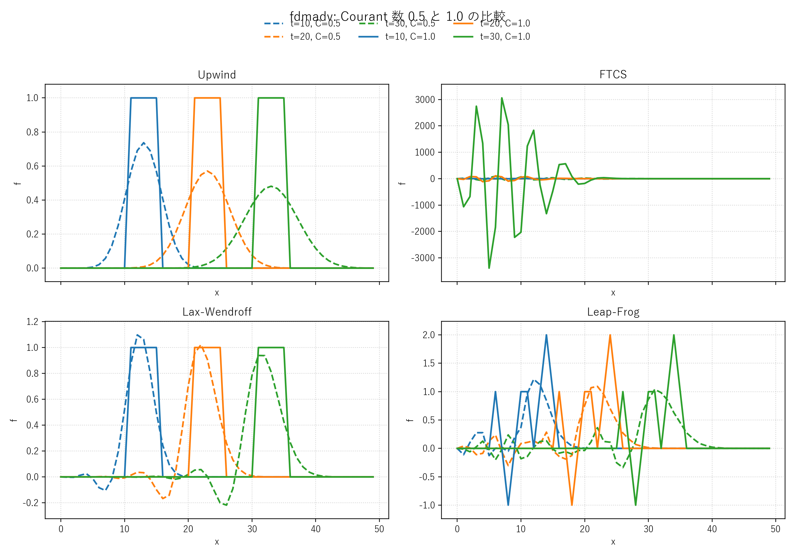

# fdmadv.c 説明ドキュメント

## 概要

[src/sec2/fdmadv.c](../../src/sec2/fdmadv.c) は、1 次元線形移流方程式を有限差分法で解く最小サンプルです。1 つのプログラムの中で 4 種類の時間発展スキームを切り替えられるようになっており、数値拡散や数値分散の違いを比較する教材として使えます。

コードで選べる手法は次の 4 つです。

- Upwind Scheme
- FTCS Scheme
- Lax-Wendroff Scheme
- Leap-Frog Scheme

## 支配方程式

このコードが解いている方程式は、一定速度 $c$ で右向きに移流する 1 次元移流方程式です。

$$
\frac{\partial e}{\partial t} + c\frac{\partial e}{\partial x} = 0
$$

ここで、

- $e(x,t)$: 輸送されるスカラー量
- $c$: 移流速度

です。解析的には、初期分布 $e(x,0)$ が形を保ったまま速度 $c$ で平行移動します。

$$
e(x,t) = e(x-ct,0)
$$

## 格子と変数

コード中では空間を等間隔格子で離散化し、

$$
x_i = i\,\Delta x,
\qquad
t^n = n\,\Delta t
$$

として、格子点 $(x_i,t^n)$ における数値解を $e_i^n$ で表します。

実装上の配列との対応は次です。

- `e[i]`: 現在更新中の値
- `en[i]`: 1 ステップ前の値 $e_i^n$
- `eo[i]`: 2 ステップ前の値 $e_i^{n-1}$

既定値は

$$
\Delta t = 0.5,
\qquad
\Delta x = 1.0,
\qquad
c = 1.0,
\qquad
n_x = 50
$$

です。したがって Courant 数は

$$
\lambda = \frac{c\Delta t}{\Delta x} = 0.5
$$

になります。移流問題ではこの Courant 数が安定性と精度を大きく左右します。

## 初期条件

初期条件は、格子の一部だけ値 1 を持つ矩形波です。コードでは

$$
e_i^0 =
\begin{cases}
1 & (i = 1,2,3,4,5) \\
0 & (\text{otherwise})
\end{cases}
$$

を与えています。これは不連続を含むため、各スキームの数値拡散や振動の違いが見えやすい設定です。

## 各差分スキーム

以下では

$$
\lambda = \frac{c\Delta t}{\Delta x}
$$

を用いて離散式を書きます。

### 1. Upwind Scheme

コードの `flag == 1` は 1 次精度の風上差分です。

$$
e_i^{n+1} = e_i^n - \lambda\left(e_i^n - e_{i-1}^n\right)
$$

$c > 0$ のとき、情報が上流側から来ることを使って後退差分を取っています。特徴は次の通りです。

- 安定で壊れにくい
- 不連続が時間とともに丸まる
- 数値拡散が大きい

Von Neumann 解析では、おおむね

$$
0 \le \lambda \le 1
$$

で安定です。このコードの既定値 $\lambda = 0.5$ はこの範囲に入っています。

### 2. FTCS Scheme

コードの `flag == 2` は Forward Time, Central Space です。

$$
e_i^{n+1} = e_i^n - \frac{\lambda}{2}\left(e_{i+1}^n - e_{i-1}^n\right)
$$

時間は前進差分、空間は中心差分です。実装は簡単ですが、1 次元移流方程式に対しては本質的に不安定です。増幅率 $G$ を調べると

$$
|G|^2 = 1 + \lambda^2 \sin^2(k\Delta x) > 1
$$

となるため、丸め誤差や高波数成分が増幅されます。そのため、時間が進むと解が発散したり非物理振動が成長したりします。

### 3. Lax-Wendroff Scheme

コードの `flag == 3` は 2 次精度の Lax-Wendroff 法です。

$$
e_i^{n+1} = e_i^n
- \frac{\lambda}{2}\left(e_{i+1}^n - e_{i-1}^n\right)
+ \frac{\lambda^2}{2}\left(e_{i+1}^n - 2e_i^n + e_{i-1}^n\right)
$$

これは時間方向の 2 次 Taylor 展開と、方程式

$$
\frac{\partial e}{\partial t} = -c\frac{\partial e}{\partial x}
$$

を使った置換から得られます。2 階微分項に相当する補正が入ることで、FTCS より高精度になります。

特徴は次の通りです。

- 滑らかな解に対して高精度
- 風上差分より数値拡散が小さい
- 不連続近傍では分散誤差による振動が出やすい

安定条件は一般に

$$
|\lambda| \le 1
$$

です。

### 4. Leap-Frog Scheme

コードの `flag == 4` は 2 ステップ法の Leap-Frog です。

$$
e_i^{n+1} = e_i^{n-1} - \lambda\left(e_{i+1}^n - e_{i-1}^n\right)
$$

このスキームは時間中心差分と空間中心差分を組み合わせた形です。精度は高い一方で、偶数ステップと奇数ステップが分離する計算モードを持ち、格子スケールの振動が残りやすい特徴があります。

また、本来の中央差分形は

$$
\frac{e_i^{n+1} - e_i^{n-1}}{2\Delta t} + c\frac{e_{i+1}^n - e_{i-1}^n}{2\Delta x} = 0
$$

なので、整理すると

$$
e_i^{n+1} = e_i^{n-1} - \lambda\left(e_{i+1}^n - e_{i-1}^n\right)
$$

になります。コードはこの式をそのまま実装しています。

安定条件は概ね

$$
|\lambda| \le 1
$$

ですが、初期化の仕方によっては計算モードが混入します。このコードでは `eo` を初期時刻と同じ値で開始しているため、厳密には最初の Leap-Frog ステップは専用の初期化をしていません。教材として挙動を見るには十分ですが、厳密な時間精度を求めるなら最初の 1 ステップは別法で与えるのが一般的です。

## コードの時間発展構造

[src/sec2/fdmadv.c](../../src/sec2/fdmadv.c) では、各表示タイミングの間に 10 ステップ更新しています。1 回の更新が終わるたびに

$$
e_i^{n-1} \leftarrow e_i^n,
\qquad
e_i^n \leftarrow e_i^{n+1}
$$

に相当する代入を行い、次のステップへ進みます。

画面表示は値の大きさを文字数に変換した簡易プロットで、

$$
n_i = \lfloor 5 e_i \rfloor
$$

に相当する個数だけ `o` を並べてプロファイルを可視化しています。

## 境界の扱い

このコードでは、更新ループが `i = 1` から始まっており、左端や右端の格子点は厳密な周期境界処理や流出条件処理を行っていません。したがって、これは境界条件を厳密に検証するコードというより、内部点での差分スキームの性質を見るための簡易サンプルと考えるのが適切です。

特に次の点に注意が必要です。

- Upwind では `i = 0` が更新されない
- FTCS, Lax-Wendroff, Leap-Frog では `i = 0` と `i = nx - 1` が更新されない、または片側参照を避けるため内部点のみ更新される
- 厳密な周期移流を見たい場合は端点のラップ処理を追加する必要がある

## 各手法の見え方

この初期条件に対して、各スキームではおおむね次の挙動が現れます。

- Upwind: 角が丸まり、ピークが低下する
- FTCS: 振動が成長しやすく、不安定になりやすい
- Lax-Wendroff: 形状保持は良いが、不連続の前後に振動が出る
- Leap-Frog: 比較的鋭いが、格子スケールの振動が残ることがある

これは、それぞれの手法が持つ数値拡散と数値分散の差を反映しています。

## Courant 数 0.5 と 1.0 の比較図

`t = 10, 20, 30` における数値解のプロファイルを、縦軸 `f`、横軸 `x` として比較した図を [docs/assets/sec2/fdmadv_courant_compare.png](../assets/sec2/fdmadv_courant_compare.png) に保存しています。

この図では、

- Courant 数 `0.5` を破線
- Courant 数 `1.0` を実線

として重ね描きしています。また、各パネルはそれぞれ Upwind、FTCS、Lax-Wendroff、Leap-Frog に対応しています。

図から読み取れる点は次の通りです。

- Upwind: `C = 1.0` では矩形波がほぼ格子 1 点ずつ平行移動し、`C = 0.5` より数値拡散が小さい
- FTCS: `C = 1.0` では振動が急速に増幅し、`C = 0.5` よりも不安定性が強く現れる
- Lax-Wendroff: `C = 1.0` では形状保持が良く、`C = 0.5` では前後に分散的な振動がやや広がる
- Leap-Frog: どちらの Courant 数でも格子スケールの振動が見えるが、`C = 1.0` の方が振幅が大きくなりやすい

この比較から、同じ差分スキームでも Courant 数を変えるだけで、数値拡散・数値分散・安定性の現れ方が大きく変わることが確認できます。

## まとめ

[src/sec2/fdmadv.c](../../src/sec2/fdmadv.c) は、1 次元移流方程式に対する代表的な有限差分法を短いコードで比較できる教材です。特に重要なのは次の点です。

- Upwind は安定だが拡散的
- FTCS は移流問題では不安定
- Lax-Wendroff は高精度だが振動しやすい
- Leap-Frog は高精度だが計算モードに注意が必要

Courant 数

$$
\lambda = \frac{c\Delta t}{\Delta x}
$$

を変えると、同じスキームでも挙動が大きく変わります。このコードは差分法の基礎挙動を確認する最初の実験用として適しています。