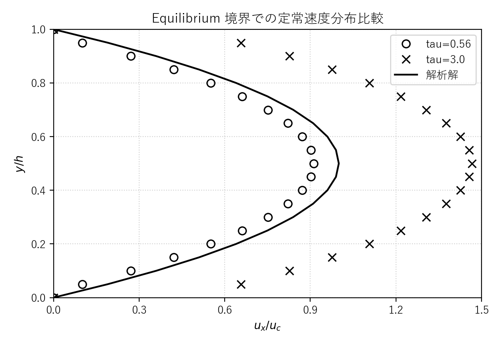
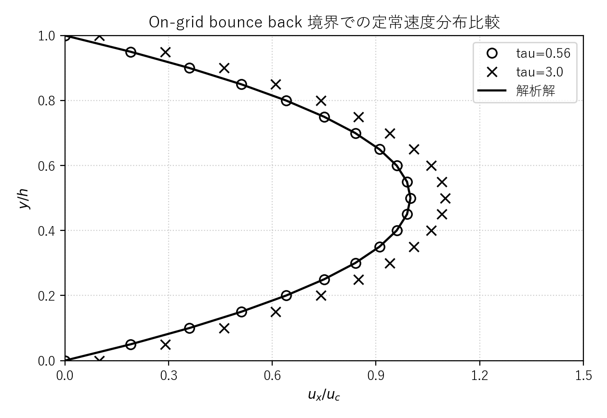
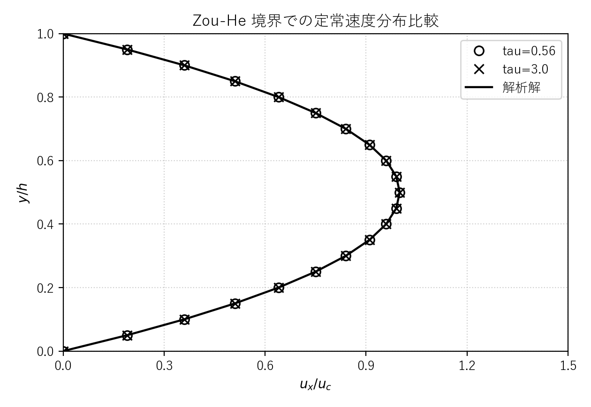
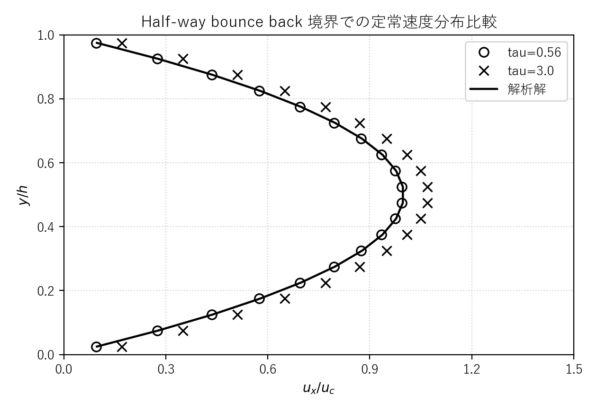
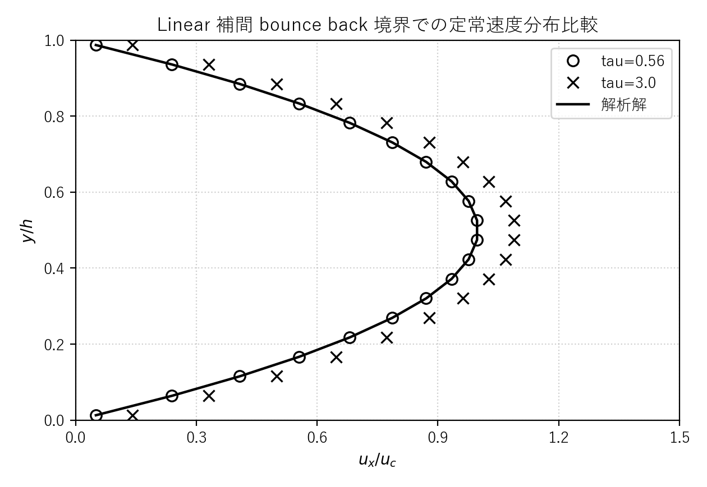
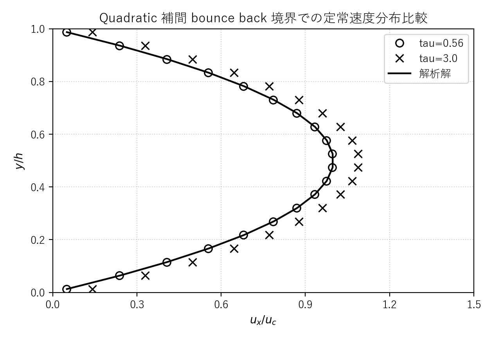
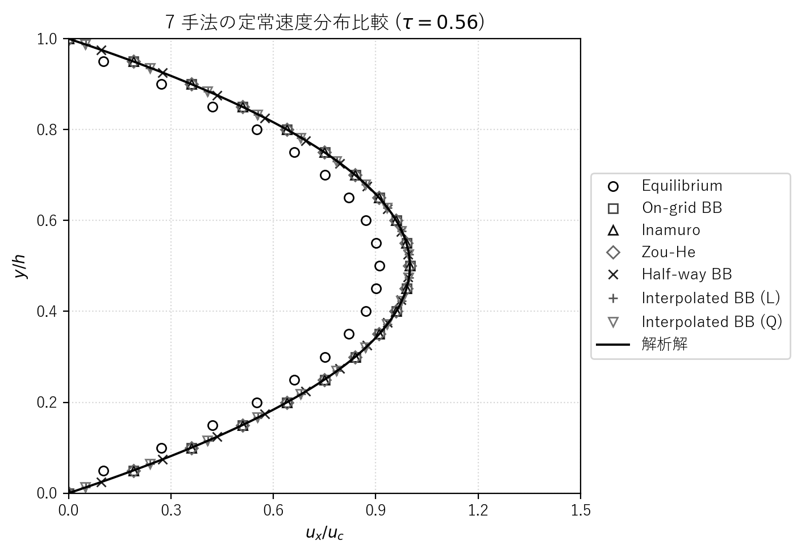
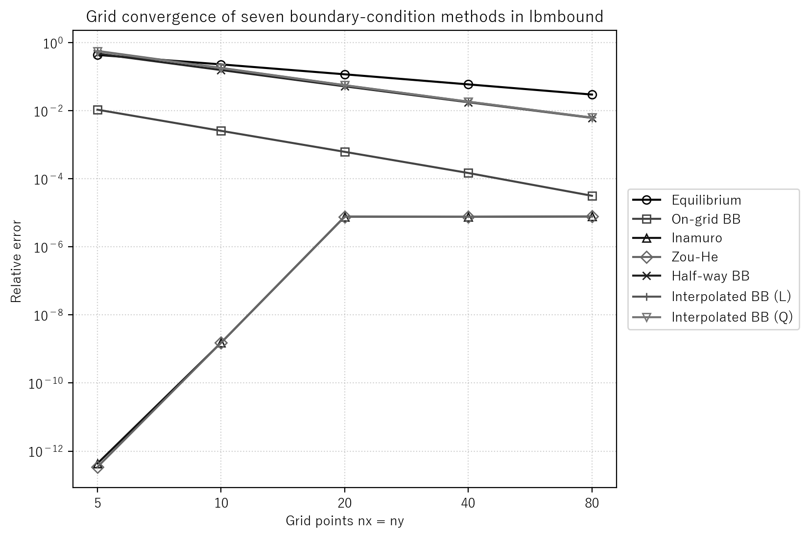

# lbmbound.c 説明ドキュメント

## 概要

[src/sec2/lbmbound.c](../../src/sec2/lbmbound.c) は、2 次元チャネル内 Poiseuille flow を D2Q9 の単一緩和時間格子ボルツマン法で解き、壁面境界条件の違いを比較するサンプルです。x 方向には周期境界条件、上下壁には 7 種類の速度境界条件を切り替えて与え、解析解との相対誤差や壁面 slip を評価します。

このコードでは次の処理を 1 本のプログラムで行っています。

- 体積力駆動 Poiseuille flow の解析解を設定する
- BGK collision、体積力付加、streaming を反復する
- 7 種類の壁面条件を切り替えて適用する
- 解析解との相対誤差と滑り速度を比較する

## 境界条件の選択肢

起動時に `flag` を入力し、次のスキームを選びます。

- `1`: Equilibrium（平衡境界条件、局所平均分布関数モデル）
- `2`: On-grid bounce back（格子点上バウンスバック境界、オングリッドバウンスバックスキーム）
- `3`: No-slip boundary (Inamuro)（Inamuro の滑りなし境界条件、カウンタースリップモデル）
- `4`: Non-equilibrium bounce back (Zou)（Zou-He の非平衡バウンスバック境界、非平衡分布関数に関するバウンスバックスキーム）
- `5`: Half-way bounce back（半格子バウンスバック境界、ハーフウェイバウンスバックスキーム）
- `6`: Interpolated bounce back (Linear)（線形補間バウンスバック境界、インターポレイテッドバウンスバックスキーム）
- `7`: Interpolated bounce back (Quadratic)（二次補間バウンスバック境界、インターポレイテッドバウンスバックスキーム）

`flag = 6, 7` では、壁面位置を表す補間パラメータ $q$ を使います。コード既定値は

$$
q = 0.25
$$

です。

## 扱う物理量

- $\rho$: 密度
- $u, v$: 速度成分
- $u_n, v_n$: 1 ステップ前の速度成分
- $u_e$: 解析解の x 方向速度
- $f_k$: 分布関数
- $f_k^{\mathrm{eq}}$: 平衡分布関数
- $\tau$: 緩和時間
- $\nu$: 動粘性係数
- $g_x, g_y$: 体積力加速度
- $h$: チャネル幅
- $q$: 壁面の格子内位置
- $u_s$: 壁面 slip 補正速度

## 格子モデル

このコードは D2Q9 モデルを使っています。離散速度は

$$
\mathbf{c}_0=(0,0)
$$

$$
\mathbf{c}_1=(1,0),\quad
\mathbf{c}_2=(0,1),\quad
\mathbf{c}_3=(-1,0),\quad
\mathbf{c}_4=(0,-1)
$$

$$
\mathbf{c}_5=(1,1),\quad
\mathbf{c}_6=(-1,1),\quad
\mathbf{c}_7=(-1,-1),\quad
\mathbf{c}_8=(1,-1)
$$

で、重みは

$$
w_0=\frac{4}{9},\quad
w_{1\sim4}=\frac{1}{9},\quad
w_{5\sim8}=\frac{1}{36}
$$

です。

## 物理設定

既定値は

$$
n_x = 20,\quad n_y = 20,\quad g_x = 10^{-5},\quad g_y = 0,\quad \tau = 0.56
$$

です。BGK モデルの動粘性係数は

$$
\nu = \frac{\tau - 0.5}{3}
$$

で与えられるため、既定値では

$$
\nu = 0.02
$$

となります。

コードではまず

$$
h = n_y
$$

と置きますが、half-way bounce back と補間 bounce back では、流路幅と節点配置がずれるため、解析解に使う有効幅を次のように補正しています。

$$
\text{flag}=5: \quad n_y \leftarrow h+1
$$

$$
\text{flag}\ge 6: \quad n_y \leftarrow h+1,\quad h \leftarrow n_y - 2 + 2q
$$

## 解析解

上下壁速度を $u_b, u_t$、壁面法線方向速度を $v_b, v_t$ とすると、体積力駆動チャネル流れの解析解は

$$
u_e(y) = u_b + \frac{y}{h}(u_t-u_b) + \frac{g_x}{2\nu}(h-y)y
$$

です。既定値では $u_b=u_t=v_b=v_t=0$ なので、純粋な放物線分布

$$
u_e(y) = \frac{g_x}{2\nu}(h-y)y
$$

になります。

壁位置の取り方に合わせて、コードは $y$ を次のように置き換えています。

$$
\text{flag}\le 4: \quad y=j
$$

$$
\text{flag}=5: \quad y=j-\frac{1}{2}
$$

$$
\text{flag}\ge 6: \quad y=j-1+q
$$

よって解析速度 `ue` は、実装通り次の 3 形で与えられます。

$$
u_e = \frac{j}{h}u_t + u_b + \frac{g_x}{2\nu}(h-j)j
$$

$$
u_e = \frac{j-1/2}{h}u_t + u_b + \frac{g_x}{2\nu}\left(h+\frac{1}{2}-j\right)\left(j-\frac{1}{2}\right)
$$

$$
u_e = \frac{j-1+q}{h}u_t + u_b + \frac{g_x}{2\nu}(h+1-q-j)(j-1+q)
$$

## 平衡分布関数

平衡分布関数は通常の D2Q9 二次精度近似

$$
f_k^{\mathrm{eq}} = w_k \rho
\left(1 + 3\,\mathbf{c}_k\cdot\mathbf{u} + \frac{9}{2}(\mathbf{c}_k\cdot\mathbf{u})^2 - \frac{3}{2}|\mathbf{u}|^2\right)
$$

を使います。ここで

$$
\mathbf{u}=(u,v),\quad |\mathbf{u}|^2=u^2+v^2
$$

です。

## 時間発展

### 1. Collision

BGK 衝突は

$$
f_k^*(\mathbf{x},t)=f_k(\mathbf{x},t)-\frac{f_k(\mathbf{x},t)-f_k^{\mathrm{eq}}(\mathbf{x},t)}{\tau}
$$

です。

### 2. 体積力付加

衝突後に、コードは離散速度方向ごとに次の力項を加えています。

$$
\Delta f_k=
\begin{cases}
\rho(c_{k,x}g_x+c_{k,y}g_y)/3 & (k=1,2,3,4) \\
\rho(c_{k,x}g_x+c_{k,y}g_y)/12 & (k=5,6,7,8)
\end{cases}
$$

### 3. Streaming

streaming は

$$
f_k(\mathbf{x}+\mathbf{c}_k,t+1)=f_k^*(\mathbf{x},t)+\Delta f_k
$$

で、x 方向は周期境界なので配列端を越えた成分を反対側へ回り込ませています。

### 4. 巨視量の再構成

密度と速度は

$$
\rho = \sum_{k=0}^8 f_k
$$

$$
u = \frac{1}{\rho}\sum_{k=0}^8 f_k c_{k,x},\quad
v = \frac{1}{\rho}\sum_{k=0}^8 f_k c_{k,y}
$$

から求めます。

## 各境界条件の式

以下では、下壁で未知になる入射分布を例に書きます。上壁は上下反転した同種の式です。

### 1. Equilibrium（平衡境界条件）

まず密度を

$$
\rho_w = \frac{f_0+f_1+f_3+2(f_4+f_7+f_8)}{1-v_b}
$$

で求め、壁速度 $(u_b,v_b)$ を用いた平衡分布

$$
f_k \leftarrow f_k^{\mathrm{eq}}(\rho_w,u_b,v_b)
$$

で壁上の全成分を置き直します。壁面の非平衡成分を無視する最も単純な方法です。

#### tau による速度分布比較

`flag = 1` の Equilibrium（平衡境界条件）について、`tau = 0.56` と `tau = 3.0` の 2 条件で中心断面の定常速度分布を比較した図を [docs/assets/sec2/lbmbound_equilibrium_tau_compare.png](../assets/sec2/lbmbound_equilibrium_tau_compare.png) に保存しています。今回は模式図は付けず、速度分布比較だけを示しています。

#### 解析結果の解釈

`tau = 0.56` では解析解よりやや小さい速度分布になり、`tau = 3.0` では逆に解析解を大きく上回るため、緩和時間に対する依存性がかなり強いことが分かります。特に壁面近傍のずれだけでなく断面全体で差が広がっているので、Equilibrium 境界条件はこの条件では定常 Poiseuille 分布を安定に再現しにくく、壁上の分布を平衡分布で単純に置き直すだけでは非平衡成分や slip の影響を十分に抑えられないことを示しています。

#### 図の生成手順

[docs/assets/sec2/lbmbound_equilibrium_tau_compare.png](../assets/sec2/lbmbound_equilibrium_tau_compare.png) は、リポジトリのルートで次を実行すると再生成できます。

```powershell
d:/work/LBMcode/.venv/Scripts/python.exe scripts/plot_lbmbound_equilibrium_tau_compare.py
```

このスクリプトは内部で次を順に実行します。

- `tau = 0.56` と `tau = 3.0` の 2 条件を設定する
- 条件ごとに [src/sec2/lbmbound.c](../../src/sec2/lbmbound.c) をビルドして [build/bin/lbmbound.exe](../../build/bin/lbmbound.exe) を `flag = 1` で実行する
- 生の出力を [outputs/sec2/lbmbound_equilibrium_tau_0_56/data](../../outputs/sec2/lbmbound_equilibrium_tau_0_56/data) と [outputs/sec2/lbmbound_equilibrium_tau_3_0/data](../../outputs/sec2/lbmbound_equilibrium_tau_3_0/data) に保存する
- 速度分布比較図を [docs/assets/sec2/lbmbound_equilibrium_tau_compare.png](../assets/sec2/lbmbound_equilibrium_tau_compare.png) に保存する

図生成スクリプト全体の一覧は [docs/plot_generation.md](../plot_generation.md) にまとめています。

- `tau = 0.56`: ○
- `tau = 3.0`: ×
- 解析解: 実線



### 2. On-grid bounce back（格子点上バウンスバック境界）

未知成分を反対方向成分から直接反射させ、速度補正を加えます。

$$
f_2 = f_4 - \frac{2}{3}\rho_w v_b
$$

$$
f_5 = f_7 - \rho_w\left(-\frac{u_b}{6}-\frac{v_b}{6}\right)
$$

$$
f_6 = f_8 - \rho_w\left(\frac{u_b}{6}-\frac{v_b}{6}\right)
$$

コードでは `cx[k]`, `cy[k]` を使って同じ内容を一般形で書いています。

#### tau による速度分布比較

`flag = 2` の On-grid bounce back（格子点上バウンスバック境界）について、`tau = 0.56` と `tau = 3.0` の 2 条件で中心断面の定常速度分布を比較した図を [docs/assets/sec2/lbmbound_ongrid_tau_compare.png](../assets/sec2/lbmbound_ongrid_tau_compare.png) に保存しています。今回は模式図は付けず、速度分布比較だけを示しています。

#### 解析結果の解釈

2 つの `tau` の分布はいずれも全体として放物線状ですが、Inamuro の滑りなし境界条件と比べると壁面近傍で解析解からのずれが残りやすく、`tau` を変えたときの差もやや見えやすくなります。これは On-grid bounce back が壁面を格子点上に置く単純な反射則であり、壁面 slip を打ち消す追加補正を持たないためです。

#### 図の生成手順

[docs/assets/sec2/lbmbound_ongrid_tau_compare.png](../assets/sec2/lbmbound_ongrid_tau_compare.png) は、リポジトリのルートで次を実行すると再生成できます。

```powershell
d:/work/LBMcode/.venv/Scripts/python.exe scripts/plot_lbmbound_ongrid_tau_compare.py
```

このスクリプトは内部で次を順に実行します。

- `tau = 0.56` と `tau = 3.0` の 2 条件を設定する
- 条件ごとに [src/sec2/lbmbound.c](../../src/sec2/lbmbound.c) をビルドして [build/bin/lbmbound.exe](../../build/bin/lbmbound.exe) を `flag = 2` で実行する
- 生の出力を [outputs/sec2/lbmbound_ongrid_tau_0_56/data](../../outputs/sec2/lbmbound_ongrid_tau_0_56/data) と [outputs/sec2/lbmbound_ongrid_tau_3_0/data](../../outputs/sec2/lbmbound_ongrid_tau_3_0/data) に保存する
- 速度分布比較図を [docs/assets/sec2/lbmbound_ongrid_tau_compare.png](../assets/sec2/lbmbound_ongrid_tau_compare.png) に保存する

図生成スクリプト全体の一覧は [docs/plot_generation.md](../plot_generation.md) にまとめています。

- `tau = 0.56`: ○
- `tau = 3.0`: ×
- 解析解: 実線



### 3. No-slip boundary (Inamuro)（Inamuro の滑りなし境界条件）

Inamuro の方法では、壁近傍密度 `rhod` と補正速度 `us` をまず求めます。

$$
\rho_d = \frac{6(\rho v_b + f_4 + f_7 + f_8)}{1+3v_b+3v_b^2}
$$

$$
u_s = \frac{6(\rho u_b - f_1 + f_3 + f_7 - f_8)}{\rho_d(1+3v_b)} - u_b
$$

その後、未知成分を $(u_b+u_s, v_b)$ を持つ平衡分布

$$
f_2, f_5, f_6 \leftarrow f_k^{\mathrm{eq}}(\rho_d, u_b+u_s, v_b)
$$

として再構成します。コードは上壁でも同じ考え方で符号を反転して使っています。

#### tau による速度分布比較

`flag = 3` の Inamuro の滑りなし境界条件について、`tau = 0.56` と `tau = 3.0` の 2 条件で中心断面の定常速度分布を比較した図を [docs/assets/sec2/lbmbound_inamuro_tau_compare.png](../assets/sec2/lbmbound_inamuro_tau_compare.png) に保存しています。今回は模式図は付けず、速度分布比較だけを示しています。

#### 解析結果の解釈

2 つの `tau` で得られた速度分布はどちらも放物線状の解析解とほぼ重なっており、Inamuro の滑り補正が壁面近傍の速度ずれを小さく抑えていることが分かります。特に `tau = 0.56` と `tau = 3.0` の差が全断面で小さいので、この条件では緩和時間を変えても速度分布の形が大きく崩れにくく、壁面の滑り誤差に対して比較的頑健な境界条件として振る舞っています。

#### 図の生成手順

[docs/assets/sec2/lbmbound_inamuro_tau_compare.png](../assets/sec2/lbmbound_inamuro_tau_compare.png) は、リポジトリのルートで次を実行すると再生成できます。

```powershell
d:/work/LBMcode/.venv/Scripts/python.exe scripts/plot_lbmbound_inamuro_tau_compare.py
```

このスクリプトは内部で次を順に実行します。

- `tau = 0.56` と `tau = 3.0` の 2 条件を設定する
- 条件ごとに [src/sec2/lbmbound.c](../../src/sec2/lbmbound.c) をビルドして [build/bin/lbmbound.exe](../../build/bin/lbmbound.exe) を `flag = 3` で実行する
- 生の出力を [outputs/sec2/lbmbound_inamuro_tau_0_56/data](../../outputs/sec2/lbmbound_inamuro_tau_0_56/data) と [outputs/sec2/lbmbound_inamuro_tau_3_0/data](../../outputs/sec2/lbmbound_inamuro_tau_3_0/data) に保存する
- 速度分布比較図を [docs/assets/sec2/lbmbound_inamuro_tau_compare.png](../assets/sec2/lbmbound_inamuro_tau_compare.png) に保存する

図生成スクリプト全体の一覧は [docs/plot_generation.md](../plot_generation.md) にまとめています。

- `tau = 0.56`: ○
- `tau = 3.0`: ×
- 解析解: 実線


### 4. Non-equilibrium bounce back (Zou)（Zou-He の非平衡バウンスバック境界）

Zou-He 型の非平衡 bounce back では

$$
\rho_w = \frac{f_0+f_1+f_3+2(f_4+f_7+f_8)}{1-v_b}
$$

としたうえで、未知成分を

$$
f_2 = f_4 + \frac{2}{3}\rho_w v_b
$$

$$
f_5 = f_7 - \frac{1}{2}(f_1-f_3) + \rho_w\left(\frac{u_b}{2}+\frac{v_b}{6}\right)
$$

$$
f_6 = f_8 + \frac{1}{2}(f_1-f_3) + \rho_w\left(-\frac{u_b}{2}+\frac{v_b}{6}\right)
$$

で与えます。

#### tau による速度分布比較

`flag = 4` の Zou-He の非平衡バウンスバック境界について、`tau = 0.56` と `tau = 3.0` の 2 条件で中心断面の定常速度分布を比較した図を [docs/assets/sec2/lbmbound_zou_tau_compare.png](../assets/sec2/lbmbound_zou_tau_compare.png) に保存しています。今回は模式図は付けず、速度分布比較だけを示しています。

#### 解析結果の解釈

2 つの `tau` で得られた速度分布はどちらも解析解とほぼ重なっており、この条件では緩和時間を変えても速度分布の形がほとんど崩れないことが分かります。特に `tau = 0.56` と `tau = 3.0` の差が全断面で非常に小さいので、Zou-He の非平衡バウンスバック境界は壁面近傍を含めて安定に Poiseuille 分布を再現しやすく、`tau` 依存が小さい境界条件として振る舞っています。

#### 図の生成手順

[docs/assets/sec2/lbmbound_zou_tau_compare.png](../assets/sec2/lbmbound_zou_tau_compare.png) は、リポジトリのルートで次を実行すると再生成できます。

```powershell
d:/work/LBMcode/.venv/Scripts/python.exe scripts/plot_lbmbound_zou_tau_compare.py
```

このスクリプトは内部で次を順に実行します。

- `tau = 0.56` と `tau = 3.0` の 2 条件を設定する
- 条件ごとに [src/sec2/lbmbound.c](../../src/sec2/lbmbound.c) をビルドして [build/bin/lbmbound.exe](../../build/bin/lbmbound.exe) を `flag = 4` で実行する
- 生の出力を [outputs/sec2/lbmbound_zou_tau_0_56/data](../../outputs/sec2/lbmbound_zou_tau_0_56/data) と [outputs/sec2/lbmbound_zou_tau_3_0/data](../../outputs/sec2/lbmbound_zou_tau_3_0/data) に保存する
- 速度分布比較図を [docs/assets/sec2/lbmbound_zou_tau_compare.png](../assets/sec2/lbmbound_zou_tau_compare.png) に保存する

図生成スクリプト全体の一覧は [docs/plot_generation.md](../plot_generation.md) にまとめています。

- `tau = 0.56`: ○
- `tau = 3.0`: ×
- 解析解: 実線



### 5. Half-way bounce back（半格子バウンスバック境界）

壁を節点の中間に置き、反射後の分布を隣接流体点へ書き込みます。下壁では

$$
f_2(i,1) = f_4(i,0) - \frac{2}{3}\rho_w v_b
$$

$$
f_5(i,1) = f_7(i-1,0) - \rho_w\left(-\frac{u_b}{6}-\frac{v_b}{6}\right)
$$

$$
f_6(i,1) = f_8(i+1,0) - \rho_w\left(\frac{u_b}{6}-\frac{v_b}{6}\right)
$$

となります。コードでは接線方向応力の評価として

$$
\sigma_w = c_{4,x}f_4 - c_{2,x}f_2 + c_{7,x}f_7 - c_{5,x}f_5 + c_{8,x}f_8 - c_{6,x}f_6
$$

も出力しています。

#### tau による速度分布比較

`flag = 5` の Half-way bounce back（半格子バウンスバック境界）について、`tau = 0.56` と `tau = 3.0` の 2 条件で中心断面の定常速度分布を比較した図を [docs/assets/sec2/lbmbound_halfway_tau_compare.png](../assets/sec2/lbmbound_halfway_tau_compare.png) に保存しています。今回は模式図は付けず、速度分布比較だけを示しています。

#### 解析結果の解釈

`tau = 0.56` では解析解にかなり近い一方で、`tau = 3.0` では断面全体で速度がやや大きめになっており、緩和時間に対する依存性が残っていることが分かります。それでも Equilibrium 境界条件よりは解析解への一致が良く、Half-way bounce back は壁を格子点の中間に置くことで壁位置の扱いを改善しつつも、`tau` が大きい条件では依然として速度分布に系統的なずれが現れる境界条件だと解釈できます。

#### 図の生成手順

[docs/assets/sec2/lbmbound_halfway_tau_compare.png](../assets/sec2/lbmbound_halfway_tau_compare.png) は、リポジトリのルートで次を実行すると再生成できます。

```powershell
d:/work/LBMcode/.venv/Scripts/python.exe scripts/plot_lbmbound_halfway_tau_compare.py
```

このスクリプトは内部で次を順に実行します。

- `tau = 0.56` と `tau = 3.0` の 2 条件を設定する
- 条件ごとに [src/sec2/lbmbound.c](../../src/sec2/lbmbound.c) をビルドして [build/bin/lbmbound.exe](../../build/bin/lbmbound.exe) を `flag = 5` で実行する
- 生の出力を [outputs/sec2/lbmbound_halfway_tau_0_56/data](../../outputs/sec2/lbmbound_halfway_tau_0_56/data) と [outputs/sec2/lbmbound_halfway_tau_3_0/data](../../outputs/sec2/lbmbound_halfway_tau_3_0/data) に保存する
- 速度分布比較図を [docs/assets/sec2/lbmbound_halfway_tau_compare.png](../assets/sec2/lbmbound_halfway_tau_compare.png) に保存する

図生成スクリプト全体の一覧は [docs/plot_generation.md](../plot_generation.md) にまとめています。

- `tau = 0.56`: ○
- `tau = 3.0`: ×
- 解析解: 実線



### 6. Interpolated bounce back (Linear)（線形補間バウンスバック境界）

線形補間法では、壁位置 $q$ に応じて 2 つの場合分けを行います。

#### $q \le 0.5$

$$
f_2(i,1)=2q\,f_4(i,0)+(1-2q)f_4(i,1)-\frac{2}{3}\rho_w v_b
$$

$$
f_5(i,1)=2q\,f_7(i-1,0)+(1-2q)f_7(i,1)-\rho_w\left(-\frac{u_b}{6}-\frac{v_b}{6}\right)
$$

$$
f_6(i,1)=2q\,f_8(i+1,0)+(1-2q)f_8(i,1)-\rho_w\left(\frac{u_b}{6}-\frac{v_b}{6}\right)
$$

#### $q > 0.5$

$$
f_2(i,1)=\frac{1}{2q}f_4(i,0)+\frac{2q-1}{2q}f_2(i,2)-\frac{1}{3q}\rho_w v_b
$$

$$
f_5(i,1)=\frac{1}{2q}f_7(i-1,0)+\frac{2q-1}{2q}f_5(i+1,2)-\rho_w\left(-\frac{u_b}{12q}-\frac{v_b}{12q}\right)
$$

$$
f_6(i,1)=\frac{1}{2q}f_8(i+1,0)+\frac{2q-1}{2q}f_6(i-1,2)-\rho_w\left(\frac{u_b}{12q}-\frac{v_b}{12q}\right)
$$

です。

#### tau による速度分布比較

`flag = 6` の Interpolated bounce back (Linear)（線形補間バウンスバック境界）について、`tau = 0.56` と `tau = 3.0` の 2 条件で中心断面の定常速度分布を比較した図を [docs/assets/sec2/lbmbound_ibl_linear_tau_compare.png](../assets/sec2/lbmbound_ibl_linear_tau_compare.png) に保存しています。今回は模式図は付けず、速度分布比較だけを示しています。

#### 解析結果の解釈

`tau = 0.56` では解析解にかなり近い一方で、`tau = 3.0` では断面全体で速度がやや大きめになっており、緩和時間に対する依存性が残っていることが分かります。それでも Equilibrium や On-grid bounce back よりは解析解への一致が良く、線形補間バウンスバックは壁位置を連続的に扱うことで壁面近傍のずれを抑えつつも、`tau` が大きい条件では依然として系統的な過大評価が現れる境界条件だと解釈できます。

#### 図の生成手順

[docs/assets/sec2/lbmbound_ibl_linear_tau_compare.png](../assets/sec2/lbmbound_ibl_linear_tau_compare.png) は、リポジトリのルートで次を実行すると再生成できます。

```powershell
d:/work/LBMcode/.venv/Scripts/python.exe scripts/plot_lbmbound_ibl_linear_tau_compare.py
```

このスクリプトは内部で次を順に実行します。

- `tau = 0.56` と `tau = 3.0` の 2 条件を設定する
- 条件ごとに [src/sec2/lbmbound.c](../../src/sec2/lbmbound.c) をビルドして [build/bin/lbmbound.exe](../../build/bin/lbmbound.exe) を `flag = 6` で実行する
- 生の出力を [outputs/sec2/lbmbound_ibl_linear_tau_0_56/data](../../outputs/sec2/lbmbound_ibl_linear_tau_0_56/data) と [outputs/sec2/lbmbound_ibl_linear_tau_3_0/data](../../outputs/sec2/lbmbound_ibl_linear_tau_3_0/data) に保存する
- 速度分布比較図を [docs/assets/sec2/lbmbound_ibl_linear_tau_compare.png](../assets/sec2/lbmbound_ibl_linear_tau_compare.png) に保存する

図生成スクリプト全体の一覧は [docs/plot_generation.md](../plot_generation.md) にまとめています。

- `tau = 0.56`: ○
- `tau = 3.0`: ×
- 解析解: 実線



### 7. Interpolated bounce back (Quadratic)（二次補間バウンスバック境界）

二次補間法では、$q \le 0.5$ で 3 点二次式を使い、例えば下壁の法線方向成分は

$$
f_2(i,1)=(1+2q)q\,f_4(i,0)+(1+2q)(1-2q)f_4(i,1)-(1-2q)q\,f_4(i,2)-\frac{2}{3}\rho_w v_b
$$

となります。対角成分も同様に 3 点補間で与えます。

$q > 0.5$ では流体側の 3 点を用いて

$$
f_2(i,1)=\frac{1}{(1+2q)q}f_4(i,0)+\frac{2q-1}{q}f_2(i,2)-\frac{2q-1}{2q+1}f_2(i,3)-\frac{2}{3(2q+1)q}\rho_w v_b
$$

を使っています。コード中の `f5`, `f6` も、接線方向に 1 点ずらした同型の式です。

#### tau による速度分布比較

`flag = 7` の Interpolated bounce back (Quadratic)（二次補間バウンスバック境界）について、`tau = 0.56` と `tau = 3.0` の 2 条件で中心断面の定常速度分布を比較した図を [docs/assets/sec2/lbmbound_ibl_quadratic_tau_compare.png](../assets/sec2/lbmbound_ibl_quadratic_tau_compare.png) に保存しています。今回は模式図は付けず、速度分布比較だけを示しています。

#### 解析結果の解釈

`tau = 0.56` では解析解にかなり近い一方で、`tau = 3.0` では断面全体で速度がやや大きめになっており、緩和時間に対する依存性が残っていることが分かります。それでも Equilibrium や On-grid bounce back よりは解析解への一致が良く、二次補間バウンスバックは高次補間で壁位置を扱うことで壁面近傍のずれを抑えつつも、`tau` が大きい条件では依然として系統的な過大評価が現れる境界条件だと解釈できます。

#### 図の生成手順

[docs/assets/sec2/lbmbound_ibl_quadratic_tau_compare.png](../assets/sec2/lbmbound_ibl_quadratic_tau_compare.png) は、リポジトリのルートで次を実行すると再生成できます。

```powershell
d:/work/LBMcode/.venv/Scripts/python.exe scripts/plot_lbmbound_ibl_quadratic_tau_compare.py
```

このスクリプトは内部で次を順に実行します。

- `tau = 0.56` と `tau = 3.0` の 2 条件を設定する
- 条件ごとに [src/sec2/lbmbound.c](../../src/sec2/lbmbound.c) をビルドして [build/bin/lbmbound.exe](../../build/bin/lbmbound.exe) を `flag = 7` で実行する
- 生の出力を [outputs/sec2/lbmbound_ibl_quadratic_tau_0_56/data](../../outputs/sec2/lbmbound_ibl_quadratic_tau_0_56/data) と [outputs/sec2/lbmbound_ibl_quadratic_tau_3_0/data](../../outputs/sec2/lbmbound_ibl_quadratic_tau_3_0/data) に保存する
- 速度分布比較図を [docs/assets/sec2/lbmbound_ibl_quadratic_tau_compare.png](../assets/sec2/lbmbound_ibl_quadratic_tau_compare.png) に保存する

図生成スクリプト全体の一覧は [docs/plot_generation.md](../plot_generation.md) にまとめています。

- `tau = 0.56`: ○
- `tau = 3.0`: ×
- 解析解: 実線



## 7 手法の比較

#### tau による速度分布比較

`tau = 0.56` に固定して、7 つの境界条件で得られた中心断面の定常速度分布を 1 枚にまとめた図を [docs/assets/sec2/lbmbound_all_methods_tau_056.png](../assets/sec2/lbmbound_all_methods_tau_056.png) に保存しています。各手法の差が見やすいように、模式図は付けず速度分布だけを重ね描きしています。

#### 図の生成手順

[docs/assets/sec2/lbmbound_all_methods_tau_056.png](../assets/sec2/lbmbound_all_methods_tau_056.png) は、リポジトリのルートで次を実行すると再生成できます。

```powershell
d:/work/LBMcode/.venv/Scripts/python.exe scripts/plot_lbmbound_all_methods_tau_056.py
```

このスクリプトは内部で次を順に実行します。

- [src/sec2/lbmbound.c](../../src/sec2/lbmbound.c) をビルドして [build/bin/lbmbound.exe](../../build/bin/lbmbound.exe) を生成する
- `tau = 0.56` に固定し、`flag = 1` から `flag = 7` までの 7 条件で [build/bin/lbmbound.exe](../../build/bin/lbmbound.exe) を実行する
- 生の出力を [outputs/sec2/lbmbound_tau_0_56_summary](../../outputs/sec2/lbmbound_tau_0_56_summary) 配下に保存する
- 図を [docs/assets/sec2/lbmbound_all_methods_tau_056.png](../assets/sec2/lbmbound_all_methods_tau_056.png) に保存する

図生成スクリプト全体の一覧は [docs/plot_generation.md](../plot_generation.md) にまとめています。




## 格子収束

`tau = 0.56` を固定し、`n_x = n_y = 80, 40, 20, 10, 5` の 5 条件で [src/sec2/lbmbound.c](../../src/sec2/lbmbound.c) を実行したときの相対誤差を比較できます。結果の表は [docs/sec2/generated/lbmbound_nx_errors.md](../sec2/generated/lbmbound_nx_errors.md) と [docs/sec2/generated/lbmbound_nx_errors.csv](../sec2/generated/lbmbound_nx_errors.csv) に保存し、図は [docs/assets/sec2/lbmbound_nx_errors.png](../assets/sec2/lbmbound_nx_errors.png) に保存しています。

#### 図の生成手順

[docs/assets/sec2/lbmbound_nx_errors.png](../assets/sec2/lbmbound_nx_errors.png) は、リポジトリのルートで次を実行すると再生成できます。

```powershell
d:/work/LBMcode/.venv/Scripts/python.exe scripts/plot_lbmbound_nx_study.py
```

このスクリプトは内部で次を順に実行します。

- [src/sec2/lbmbound.c](../../src/sec2/lbmbound.c) をビルドして [build/bin/lbmbound.exe](../../build/bin/lbmbound.exe) を生成する
- `tau = 0.56` を固定し、`n_x = n_y = 5, 10, 20, 40, 80` の 5 条件と `flag = 1` から `flag = 7` までの 7 条件で [build/bin/lbmbound.exe](../../build/bin/lbmbound.exe) を実行する
- 生の出力を [outputs/sec2/lbmbound_nx_study](../../outputs/sec2/lbmbound_nx_study) 配下に保存する
- 集計表を [docs/sec2/generated/lbmbound_nx_errors.md](../sec2/generated/lbmbound_nx_errors.md) と [docs/sec2/generated/lbmbound_nx_errors.csv](../sec2/generated/lbmbound_nx_errors.csv) に保存する
- 図を [docs/assets/sec2/lbmbound_nx_errors.png](../assets/sec2/lbmbound_nx_errors.png) に保存する

図生成スクリプト全体の一覧は [docs/plot_generation.md](../plot_generation.md) にまとめています。

この集計では、`n_x` に応じて反復上限 `max_time = max(100000, 100 n_x^2)` を与え、各ケースの最終 `norm` と収束成否を `run.log` に残します。集計表では未収束ケースに `*` を付け、図では赤い外枠マーカーで別扱いにします。



## 読み方の要点

このコードの主眼は「同じ Poiseuille flow に対して、壁面の置き方と未知分布の再構成法を変えると誤差と slip がどう変わるか」を比較することです。特に `flag = 5, 6, 7` は壁面を格子点の中間または任意位置に置く扱いで、`q` を変えると解析解評価点も変わるため、`ny` と `h` の補正を合わせて読む必要があります。

## 誤差評価

解析解との相対 $L_2$ 誤差は

$$
\mathrm{err} = \sqrt{\frac{\sum_{i,j}(u_e(i,j)-u(i,j))^2}{\sum_{i,j}u_e(i,j)^2}}
$$

で計算されています。

また、収束判定に使う変化量は

$$
\mathrm{norm} = \max_{i,j}\sqrt{(u_{i,j}^{n}-u_{i,j}^{n-1})^2 + (v_{i,j}^{n}-v_{i,j}^{n-1})^2}
$$

です。

## slip 評価式

コードは各スキームについて、数値 slip と理論式を比較しています。無次元化には Poiseuille 最大速度

$$
u_{\max}=\frac{g_x h^2}{8\nu}
$$

を使います。

### Equilibrium, On-grid bounce back（平衡境界条件、格子点上バウンスバック境界）

$$
\mathrm{Slip}=\frac{u(x_c,0)}{u_{\max}},\quad
\mathrm{Slip}_{\mathrm{th}}=\frac{8\tau(2\tau-1)}{3h^2}
$$

### Half-way bounce back（半格子バウンスバック境界）

$$
\mathrm{Slip}=\frac{u(x_c,1)-u_e(x_c,1)}{u_{\max}},\quad
\mathrm{Slip}_{\mathrm{th}}=\frac{16\tau^2-20\tau+3}{3h^2}
$$

### Interpolated bounce back (Linear)（線形補間バウンスバック境界）

$$
\mathrm{Slip}_{\mathrm{th}}=\frac{16\tau^2-8\tau-24q\tau+12q-12q^2}{3h^2}
$$

### Interpolated bounce back (Quadratic)（二次補間バウンスバック境界）

$$
\mathrm{Slip}_{\mathrm{th}}=\frac{16\tau^2-8\tau-24q\tau+12q^2}{3h^2}
$$

ここで $x_c=n_x/2$ は中心断面位置です。

## 出力ファイル

収束条件

$$
\mathrm{norm} < 10^{-10},\quad t > 10000
$$

を満たすと、次のファイルを出力します。

- `data`: 中心断面速度 $u(x_c,j)/u_{\max}$
- `error`: 相対誤差 `err`
- `slipbb.txt`: on-grid bounce back の slip
- `sliphbb.txt`: half-way bounce back の slip
- `slipibb.txt`: interpolated bounce back の slip

`data` は `flag <= 4` では全節点、`flag >= 5` では壁外の仮想節点を除いた内部点のみを書き出します。