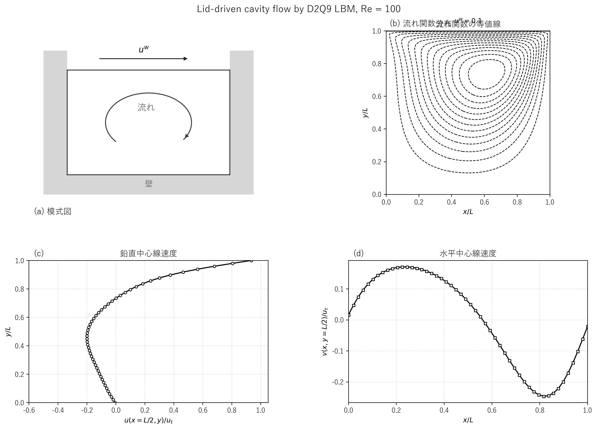
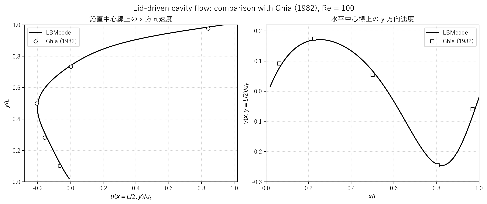
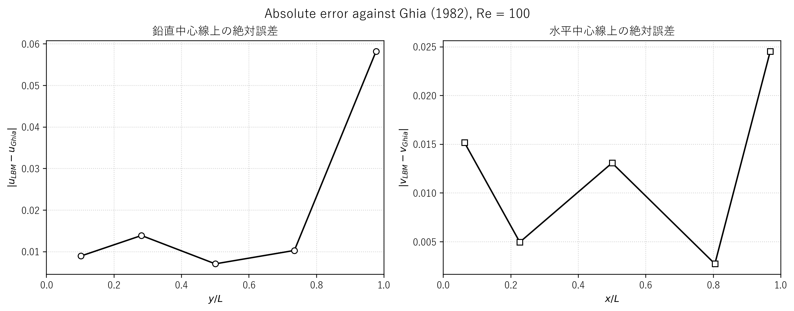
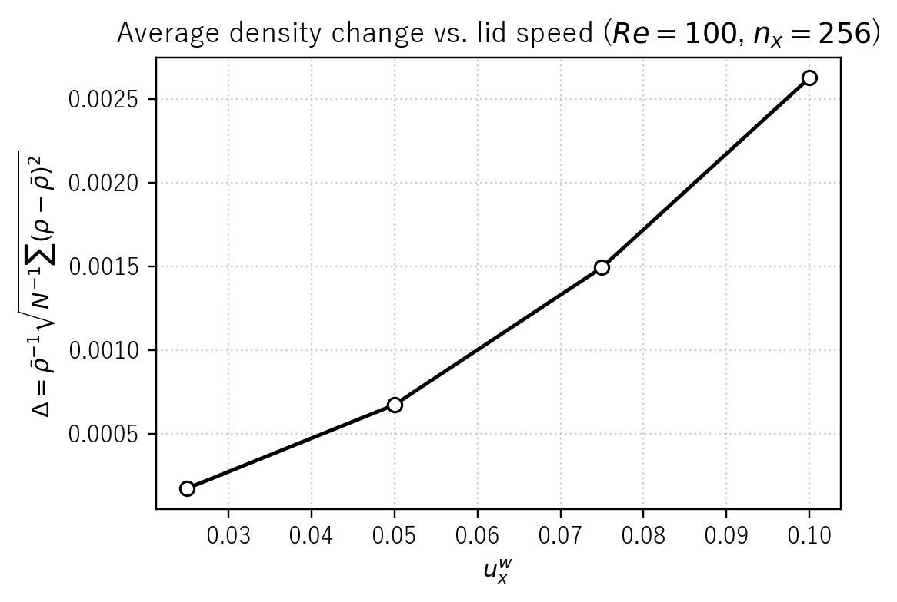

# lbmcavi.c 説明ドキュメント

## 概要

[src/sec2/lbmcavi.c](../../src/sec2/lbmcavi.c) は、2 次元 lid-driven cavity flow を D2Q9 の単一緩和時間格子ボルツマン法で解くサンプルです。上壁のみを一定速度で動かし、左右壁と下壁には bounce-back を課して、キャビティ内部に主渦を形成します。

この文書では、次の点を順に説明します。

- 対象問題と D2Q9-BGK モデルの対応
- 境界条件と収束判定の実装方法
- compressibility error の定義と出力内容
- 代表図、実行例、Ghia 既知値との比較結果

このコードでは、次の処理を 1 本のプログラムで行っています。

- 一様密度・静止流から計算を開始する
- BGK collision と streaming を反復する
- 上壁に移動壁境界条件、左右壁と下壁に half-way bounce-back を与える
- 収束後に密度誤差、速度場、流れ関数を出力する

タイトルにある compressibility error は、弱圧縮性 LBM における密度変動の大きさを評価するための量で、コード中の `err` として計算されています。

## 扱う物理量

| 記号 | 意味 |
| --- | --- |
| $\rho$ | 密度 |
| $u, v$ | 速度成分 |
| $u_n, v_n$ | 1 ステップ前の速度成分 |
| $u_t, v_t$ | 上壁速度 |
| $f_k$ | 分布関数 |
| $f_k^{\mathrm{eq}}$ | 平衡分布関数 |
| $\tau$ | 緩和時間 |
| $\nu$ | 動粘性係数 |
| $Re$ | Reynolds 数 |
| $\psi$ | 流れ関数 |
| $\mathrm{err}$ | 密度変動に基づく圧縮性誤差指標 |

## 対象問題

正方キャビティ内の 2 次元流れを考えます。連続体としては、非圧縮性 Navier-Stokes 方程式

$$
\nabla\cdot\mathbf{u}=0
$$

$$
\frac{\partial \mathbf{u}}{\partial t} + (\mathbf{u}\cdot\nabla)\mathbf{u}
= -\frac{1}{\rho_0}\nabla p + \nu \nabla^2 \mathbf{u}
$$

を満たす流れで、境界条件は

$$
\mathbf{u}(x,0)=(0,0),\quad
\mathbf{u}(0,y)=(0,0),\quad
\mathbf{u}(L,y)=(0,0)
$$

$$
\mathbf{u}(x,L)=(u_t,v_t)
$$

です。このコードでは既定値として

$$
u_t = 0.1,\quad v_t = 0,\quad Re = 100
$$

を使っています。

## 格子モデル

このコードは D2Q9 モデルを使っています。離散速度は

$$
\mathbf{c}_0=(0,0)
$$

$$
\mathbf{c}_1=(1,0),\quad
\mathbf{c}_2=(0,1),\quad
\mathbf{c}_3=(-1,0),\quad
\mathbf{c}_4=(0,-1)
$$

$$
\mathbf{c}_5=(1,1),\quad
\mathbf{c}_6=(-1,1),\quad
\mathbf{c}_7=(-1,-1),\quad
\mathbf{c}_8=(1,-1)
$$

で、重みは

$$
w_0=\frac{4}{9},\quad
w_{1\sim4}=\frac{1}{9},\quad
w_{5\sim8}=\frac{1}{36}
$$

です。[src/sec2/lbmcavi.c](../../src/sec2/lbmcavi.c) の `cx`, `cy` と `f0` の定義はこれに対応しています。

## 格子幅と Reynolds 数

コードの格子点数は

$$
n_x=n_y=51
$$

で、配列サイズは番兵込みで `DIM = 52` です。代表長さとしてキャビティ一辺の内部格子幅

$$
L = n_x - 1
$$

を使い、Reynolds 数

$$
Re = \frac{u_t L}{\nu}
$$

から動粘性係数を

$$
\nu = \frac{u_t (n_x-1)}{Re}
$$

と定めています。既定値では

$$
\nu = \frac{0.1\times 50}{100} = 0.05
$$

です。

BGK モデルの緩和時間は

$$
\nu = \frac{\tau - 0.5}{3}
$$

なので、コードでは

$$
\tau = 3\nu + 0.5 = 0.65
$$

となります。

## 平衡分布関数

平衡分布関数は標準的な D2Q9 の二次精度近似で、

$$
f_k^{\mathrm{eq}} = w_k \rho
\left(1 + 3\,\mathbf{c}_k\cdot\mathbf{u} + \frac{9}{2}(\mathbf{c}_k\cdot\mathbf{u})^2 - \frac{3}{2}|\mathbf{u}|^2\right)
$$

です。ここで

$$
\mathbf{u}=(u,v),\quad |\mathbf{u}|^2=u^2+v^2
$$

です。コードでは `k=0`, `k=1..4`, `k=5..8` に分けてこの式をそのまま実装しています。

## 時間発展

1 ステップはおおむね次の順に進みます。

### 1. Collision

BGK 衝突は

$$
f_k^*(\mathbf{x},t)=f_k(\mathbf{x},t)-\frac{f_k(\mathbf{x},t)-f_k^{\mathrm{eq}}(\mathbf{x},t)}{\tau}
$$

です。

### 2. Streaming

streaming は

$$
f_k(\mathbf{x}+\mathbf{c}_k,t+1)=f_k^*(\mathbf{x},t)
$$

です。実装では一度 `ftmp` に退避してから移流させています。

コード中には配列端で折り返す処理がありますが、これは streaming を単純化するための実装上の処理で、その後に左右壁・上下壁の境界条件で壁面近傍の分布を上書きします。したがって、最終的な物理境界は周期境界ではなくキャビティ壁です。

### 3. 巨視量の再構成

密度と速度は

$$
\rho = \sum_{k=0}^{8} f_k
$$

$$
u = \frac{1}{\rho}\sum_{k=0}^{8} f_k c_{k,x},\quad
v = \frac{1}{\rho}\sum_{k=0}^{8} f_k c_{k,y}
$$

から求めています。

## 境界条件

### 左右壁と下壁

左壁、右壁、下壁には half-way bounce-back を与えています。たとえば左壁では、壁に入る成分を反対方向の成分で置き換えて

$$
f_1(1,j)=f_3(0,j)
$$

$$
f_5(1,j)=f_7(0,j-1),\quad
f_8(1,j)=f_6(0,j+1)
$$

としています。右壁と下壁も同様で、壁面上の no-slip 条件を与えています。

### 上壁の移動壁条件

上壁では速度 $(u_t,v_t)$ を持つ moving wall 条件を与えています。まず上壁密度を

$$
\rho_w =
\frac{f_0+f_1+f_3+2(f_2+f_5+f_6)}{1+v_t}
$$

で求め、未知成分を

$$
f_4(i,n_y-1)=f_2(i,n_y)-\frac{2}{3}\rho_w v_t
$$

$$
f_7(i,n_y-1)=f_5(i+1,n_y)-\frac{1}{6}\rho_w (u_t+v_t)
$$

$$
f_8(i,n_y-1)=f_6(i-1,n_y)+\frac{1}{6}\rho_w (u_t-v_t)
$$

に相当する形で与えています。コードでは `cx[k]`, `cy[k]` を使って

$$
f_k^{\mathrm{unk}} = f_{\bar{k}}^{\mathrm{known}} - \alpha_k \rho_w (\mathbf{c}_k\cdot\mathbf{u}_w)
$$

という形に書かれており、軸方向で $\alpha_k=2/3$、対角方向で $\alpha_k=1/6$ です。

### 角点処理

四隅は通常の壁更新だけでは未知成分が不足するため、コードでは角の一部を平衡分布、静止壁側の角を定数

$$
f_{\mathrm{diag}}=\frac{1}{36}
$$

で補っています。これは角点の数値安定化のための簡便な処理です。

## 収束判定

連続する 2 ステップの速度差の最大値

$$
\mathrm{Norm} = \max_{i,j}\sqrt{(u_{i,j}^{n}-u_{i,j}^{n-1})^2 + (v_{i,j}^{n}-v_{i,j}^{n-1})^2}
$$

を計算し、

$$
\mathrm{Norm} < 10^{-12},\quad \mathrm{time} > 10000
$$

を満たしたら反復を打ち切って後処理へ進みます。外側ループは 400 回、内側ループは 500 回なので、最大 200000 ステップまで回す構造です。

## Compressibility Error

このコードの主題は、弱圧縮性 LBM において cavity flow で生じる密度変動を評価することです。まず内部点の平均密度を

$$
\bar{\rho} = \frac{1}{(n_x-1)(n_y-1)}\sum_{i=1}^{n_x-1}\sum_{j=1}^{n_y-1} \rho_{i,j}
$$

で定義します。続いて、平均密度で正規化した RMS 量

$$
\varepsilon_\rho =
\frac{1}{\bar{\rho}}
\sqrt{\frac{1}{(n_x-1)(n_y-1)}
\sum_{i=1}^{n_x-1}\sum_{j=1}^{n_y-1}(\rho_{i,j}-\bar{\rho})^2}
$$

を計算します。これがコード中の `err` です。

読み方としては、次の 2 段階に分けると追いやすくなります。

- まず内部点の平均密度 $\bar{\rho}$ を求める
- 次に各格子点の偏差 $(\rho-\bar{\rho})$ の RMS を $\bar{\rho}$ で正規化する

出力ファイル `error` には現在、

$$
(u_t,\bar{\rho},\Delta_{\mathrm{RMS}},\mathrm{err})
$$

の 4 列が保存されます。ここで

- $\Delta_{\mathrm{RMS}} = \bar{\rho}^{-1}\sqrt{N^{-1}\sum (\rho-\bar{\rho})^2}$

です。本コードでは `err` と $\Delta_{\mathrm{RMS}}$ を同じ値として扱っています。

Mach 数が十分小さいとき、密度変動は概ね

$$
\rho - \rho_0 = O(Ma^2)
$$

となるので、この `err` は lid 速度を上げたときの compressibility 影響を見る指標として使えます。
D2Q9 格子では格子音速は

$$
c_s = \frac{1}{\sqrt{3}} \approx 0.57735
$$

なので、この節での Mach 数は

$$
Ma = \frac{u_x^{w}}{c_s} = \sqrt{3}u_x^{w}
$$

です。

## 流れ関数

収束後には流れ関数 `sf` も計算しています。2 次元非圧縮流れでは

$$
u = \frac{\partial \psi}{\partial y},\quad
v = -\frac{\partial \psi}{\partial x}
$$

です。コードでは $u=\partial\psi/\partial y$ を y 方向に数値積分して流れ関数を再構成しています。実装式は

$$
\psi_{i,j} = \psi_{i,j-2} + \frac{u_{i,j}+4u_{i,j-1}+u_{i,j-2}}{3}
$$

で、2 格子幅ごとの Simpson 型積分に相当します。その後、

$$
\psi \leftarrow \frac{\psi}{u_t(n_x-1)}
$$

で無次元化して、最大値と最小値を標準出力に表示します。

## 図

[docs/assets/sec2/lbmcavi_streamfunction.png](../assets/sec2/lbmcavi_streamfunction.png) は、既定条件 `Re = 100`, `u_t = 0.1` で得られた 4 パネル図です。左上に参考画像に寄せた模式図、右上に流れ関数等値線、下段に鉛直・水平中心線速度を配置し、論文の図版に近い体裁で読み取れるようにしています。主渦は cavity 中央よりやや右上に位置し、中心線速度も lid-driven cavity に典型的な分布を示します。



図 2.14　上壁移動正方キャビティ流れの模式図、流れ関数等値線、および中心線速度分布。既定条件は $Re = 100$、$u_t = 0.1$ であり、右上パネルでは主渦が cavity 中央よりやや右上に形成される様子を確認できる。

この図で見ておくとよい点は次の 3 つです。

- 模式図で境界条件の配置をすぐ確認できる
- 流れ関数等値線から主渦の位置と回転方向を確認できる
- 中心線速度分布から Ghia 比較に使う代表断面を確認できる

この図は、リポジトリのルートで次を実行すると再生成できます。

```powershell
cmd /c scripts\run_one.cmd src\sec2\lbmcavi.c
d:/work/LBMcode/.venv/Scripts/python.exe scripts/plot_lbmcavi_streamfunction.py
```

## 出力ファイル

[src/sec2/lbmcavi.c](../../src/sec2/lbmcavi.c) は収束後に次を出力します。

- `error`: $u_t$, $\bar{\rho}$, $\Delta_{\mathrm{RMS}}$, `err`
- `datau`: 無次元 x 方向速度 $u/u_t$
- `datav`: 無次元 y 方向速度 $v/u_t$
- `datas`: 無次元流れ関数 $\psi/(u_t(n_x-1))$

今回の実行例では、[scripts/run_one.cmd](../../scripts/run_one.cmd) により [outputs/sec2/lbmcavi](../../outputs/sec2/lbmcavi) に保存されます。

## run_one.cmd の出力先

[scripts/run_one.cmd](../../scripts/run_one.cmd) は、既定ではソースの親ディレクトリ名を sec 名として使い、`outputs/sec名/実行ファイル名` へ出力します。したがって

```powershell
cmd /c scripts\run_one.cmd src\sec2\lbmcavi.c
```

の出力先は [outputs/sec2/lbmcavi](../../outputs/sec2/lbmcavi) です。旧配置ディレクトリは整理済みで、以後は [outputs/sec2/lbmcavi](../../outputs/sec2/lbmcavi) を正規出力先とします。

## 実行例

リポジトリのルートで次を実行します。

```powershell
cmd /c scripts\run_one.cmd src\sec2\lbmcavi.c
```

既定値では `n_x = n_y = 51`, `Re = 100`, `u_t = 0.1`, `\tau = 0.65` で計算し、200000 ステップまで反復した後に後処理へ進みます。実行時の最終出力は次のとおりです。

| 項目 | 値 |
| --- | ---: |
| Time | 200000 |
| Norm | $3.433697\times 10^{-9}$ |
| Error | $2.281298\times 10^{-3}$ |
| $Re$ | 100.00 |
| $u_t$ | 0.100 |
| $\tau$ | 0.650 |
| $\psi_{\max}$ | $1.07565967\times 10^{-3}$ |
| $\psi_{\min}$ | $-9.63283283\times 10^{-2}$ |

また、出力ファイル [outputs/sec2/lbmcavi/error](../../outputs/sec2/lbmcavi/error) には

```text
1.00000000e-01, 9.99857812e-01, 2.28129787e-03, 2.28129787e-03
```

のように

- 1 列目: $u_t$
- 2 列目: $\bar{\rho}$
- 3 列目: $\Delta_{\mathrm{RMS}}$
- 4 列目: `err`

が保存されます。`datas` の最小値が負になることは、主渦が時計回りに形成されていることに対応しています。

## Ghia 既知値との比較

中心線速度の代表値は、Ghia, Ghia, Shin (1982) の lid-driven cavity ベンチマークと比較できます。以下では Re = 100 の既知値に対して、[outputs/sec2/lbmcavi/datau](../../outputs/sec2/lbmcavi/datau) と [outputs/sec2/lbmcavi/datav](../../outputs/sec2/lbmcavi/datav) から中心線上を線形補間した数値を並べています。

同じ内容は CSV として [docs/sec2/generated/lbmcavi_ghia_re100_comparison.csv](generated/lbmcavi_ghia_re100_comparison.csv) にも保存しています。

[docs/assets/sec2/lbmcavi_ghia_compare.png](../assets/sec2/lbmcavi_ghia_compare.png) には、中心線の連続分布と Ghia の既知点を重ねた比較グラフを載せています。鉛直中心線では中央付近から下側でよく一致し、差がやや大きいのは上壁直下の点です。水平中心線でも全体形状はよく一致しており、右壁近傍で差がやや大きくなります。



図 2.15　Re = 100 における Ghia (1982) 既知値との中心線速度比較。実線は本コードの中心線速度分布、白抜きマーカーは Ghia の代表点である。鉛直中心線では上壁近傍、水平中心線では右壁近傍で差がやや大きいが、全体として既知解の形状を良好に再現している。

[docs/assets/sec2/lbmcavi_ghia_error.png](../assets/sec2/lbmcavi_ghia_error.png) には、同じ比較から得た絶対誤差の分布を示しています。誤差のピークは鉛直中心線では $y/L=0.9766$、水平中心線では $x/L=0.9688$ に現れ、いずれも壁近傍での差が支配的であることが分かります。



図 2.16　Ghia (1982) 既知値に対する中心線速度の絶対誤差。壁近傍で誤差が増え、内部領域では比較的小さいことを示している。

比較結果の要点だけ先に読むなら、次の 2 点です。

- 中心線速度の全体形状は Re = 100 の既知解を良好に再現している
- ずれが目立つのは上壁近傍と右壁近傍で、急な速度勾配の影響が大きい

代表点での比較値を表にすると次のとおりです。

### 鉛直中心線上の x 方向速度比較

| $y/L$ | 本コード $u(x=L/2,y)/u_t$ | Ghia (1982) | $\lvert \Delta \rvert$ |
| --- | ---: | ---: | ---: |
| 0.9766 | 0.78297360 | 0.84123 | 0.05825640 |
| 0.7344 | -0.00698724 | 0.00332 | 0.01030724 |
| 0.5000 | -0.19873046 | -0.20581 | 0.00707954 |
| 0.2813 | -0.14271770 | -0.15662 | 0.01390230 |
| 0.1016 | -0.05537852 | -0.06434 | 0.00896148 |

### 水平中心線上の y 方向速度比較

| $x/L$ | 本コード $v(x,y=L/2)/u_t$ | Ghia (1982) | $\lvert \Delta \rvert$ |
| --- | ---: | ---: | ---: |
| 0.9688 | -0.08361421 | -0.05906 | 0.02455421 |
| 0.8047 | -0.24259277 | -0.24533 | 0.00273723 |
| 0.5000 | 0.06762880 | 0.05454 | 0.01308880 |
| 0.2266 | 0.17010621 | 0.17507 | 0.00496379 |
| 0.0625 | 0.07713349 | 0.09233 | 0.01519651 |

全体として Re = 100 の既知解をよく再現しており、差が比較的大きいのは上壁近傍の $u$ と右壁近傍の $v$ です。これは格子数が 51 × 51 と比較的粗いこと、境界近傍の勾配が急であることの影響を受けています。

## 上壁速度と平均密度変化

平均密度変化は、Hou の記法に合わせて

$$
\Delta = \frac{1}{\bar{\rho}}\sqrt{\frac{1}{N}\sum (\rho-\bar{\rho})^2}
$$

と定義します。ここで $\bar{\rho}$ は内部点の平均密度、$N$ は平均に使う格子点数です。上壁速度 $u_x^{w}$ を変えたときの関係は [docs/assets/sec2/lbmcavi_density_change_vs_uwx.png](../assets/sec2/lbmcavi_density_change_vs_uwx.png) のようになります。この図では [src/sec2/lbmcavi.c](../../src/sec2/lbmcavi.c) を $u_x^{w} = 0.025, 0.050, 0.075, 0.100$、$n_x = n_y = 256$ で実行し、各ケースの内部平均密度 $\bar{\rho}$ と密度変動から $\Delta$ を計算しています。



図 2.17　上壁速度 $u_x^{w}$ に対する平均密度変化 $\Delta = \bar{\rho}^{-1}\sqrt{N^{-1}\sum (\rho-\bar{\rho})^2}$ の関係。今回の設定では $u_x^{w}$ の増加とともに密度変動が大きくなり、圧縮性誤差指標 $\Delta$ も増加している。

対応する数値は [docs/sec2/generated/lbmcavi_density_change_vs_uwx.csv](generated/lbmcavi_density_change_vs_uwx.csv) に保存しています。列は `uwx, rho_avg, delta_rms, compressibility_error` です。今回の関係が完全な単調増加にならないのは、このコードでは Reynolds 数 `Re = 100` を固定しているため、$u_x^{w}$ を変えると動粘性係数 $\nu$ と緩和時間 $\tau$ も同時に変わるからです。

読み取りの要点は次のとおりです。

- $u_x^{w}$ を大きくすると、全体として $\Delta$ も増える
- ただし完全な単調増加ではなく、$Re = 100$ 固定の影響で $\nu$ と $\tau$ も同時に変化する

図 2.17 の数値を表にすると次のようになります。もし厳密に $\Delta \propto Ma^2$ なら、最後の $\Delta_{\mathrm{RMS}}/Ma^2$ 列はほぼ一定になります。比較用に、教科書表 2.1 に載っている値も参考列として併記します。

| $u_x^{w}$ | $c_s$ | $Ma=u_x^{w}/c_s$ | $\bar{\rho}$ | $\Delta_{\mathrm{RMS}}$ | 教科書 表 2.1 | $\Delta_{\mathrm{RMS}}/Ma^2$ |
| --- | ---: | ---: | ---: | ---: | ---: | ---: |
| 0.025 | 0.57735 | 0.043301 | 0.99998730 | $1.7142\times 10^{-4}$ | $1.6395\times 10^{-6}$ | 0.091424 |
| 0.050 | 0.57735 | 0.086603 | 1.00047006 | $6.7127\times 10^{-4}$ | $5.9074\times 10^{-6}$ | 0.089503 |
| 0.075 | 0.57735 | 0.129904 | 1.00144728 | $1.49187\times 10^{-3}$ | $1.2870\times 10^{-5}$ | 0.088407 |
| 0.100 | 0.57735 | 0.173205 | 1.00197176 | $2.62463\times 10^{-3}$ | $2.2422\times 10^{-5}$ | 0.087488 |

ここで教科書表 2.1 の列は参考値であり、本節で用いている $\Delta_{\mathrm{RMS}}$ と完全に同じ定義量であることを前提にはしていません。

さらに、指定された 2 組の上壁速度について比を取ると次のようになります。ここではそれぞれ「後者の値 ÷ 前者の値」で計算しています。

| 比較区間 | $\Delta_{\mathrm{RMS}}$ の比 | 教科書 表 2.1 の比 |
| --- | ---: | ---: |
| 0.025-0.050 | 3.915937 | 3.603172 |
| 0.050-0.100 | 3.909947 | 3.795578 |

この図は、リポジトリのルートで次を実行すると再生成できます。

```powershell
d:/work/LBMcode/.venv/Scripts/python.exe scripts/plot_lbmcavi_density_change.py
```

## このコードの見どころ

- lid-driven cavity という代表的ベンチマークを、最小構成の D2Q9-BGK で実装している
- 上壁のみを moving wall 条件、他 3 辺を bounce-back で処理しており、境界条件の違いを読み取りやすい
- 圧力や渦度ではなく密度偏差 `err` を直接出力するので、低 Mach 条件から外れたときの compressibility の影響を追いやすい
- 流れ関数の最小値を確認することで、主渦強度の比較にも使える