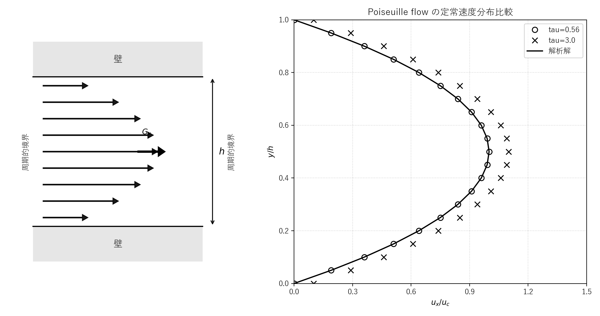

# lbmpoi.c 説明ドキュメント

## 概要

[src/sec2/lbmpoi.c](../../src/sec2/lbmpoi.c) は、2 次元チャネル内の Poiseuille flow を D2Q9 の単一緩和時間格子ボルツマン法で計算するサンプルです。圧力差の代わりに x 方向の一様体積力を与え、上下壁では bounce-back による no-slip 条件を課しています。

このコードでは、次の 4 つを 1 本のプログラムで行っています。

- 一様密度・静止流から計算を開始する
- BGK collision、体積力付加、streaming を反復する
- 上下壁に bounce-back 条件を課して平行平板間流れを形成する
- 定常到達後に中心断面の速度分布を `data` に保存する

## 扱う物理量

- $\rho$: 密度
- $u, v$: 速度成分
- $f_k$: 分布関数
- $f_k^{\mathrm{eq}}$: 平衡分布関数
- $\tau$: 緩和時間
- $\nu$: 動粘性係数
- $g_x, g_y$: 体積力加速度
- $h$: チャネル幅

コード中では、現在ステップの速度を `u`, `v`、1 ステップ前の速度を `un`, `vn` に保持し、両者の差から収束判定用の `norm` を計算しています。

## 格子モデル

このコードは D2Q9 モデルを使っています。離散速度は次の 9 方向です。

$$
\mathbf{c}_0=(0,0)
$$

$$
\mathbf{c}_1=(1,0),\quad
\mathbf{c}_2=(0,1),\quad
\mathbf{c}_3=(-1,0),\quad
\mathbf{c}_4=(0,-1)
$$

$$
\mathbf{c}_5=(1,1),\quad
\mathbf{c}_6=(-1,1),\quad
\mathbf{c}_7=(-1,-1),\quad
\mathbf{c}_8=(1,-1)
$$

重みは

$$
w_0=\frac{4}{9},\quad
w_{1\sim4}=\frac{1}{9},\quad
w_{5\sim8}=\frac{1}{36}
$$

で、これは [src/sec2/lbmpoi.c](../../src/sec2/lbmpoi.c) の `cx`, `cy`, `f0` の初期化にそのまま対応しています。

## 物理設定

デフォルトの設定値は次です。

$$
n_x = 20,\quad n_y = 20,\quad g_x = 10^{-5},\quad g_y = 0,\quad \tau = 0.56
$$

動粘性係数は BGK モデルの関係式

$$
\nu = \frac{\tau - 0.5}{3}
$$

から計算されます。したがって既定値では

$$
\nu = \frac{0.56 - 0.5}{3} = 0.02
$$

です。またコードではチャネル幅を

$$
h = n_y
$$

としています。

## 平衡分布関数

平衡分布関数は通常の 2 次精度の D2Q9 形を使っています。

$$
f_k^{\mathrm{eq}} = w_k \rho
\left( 1 + 3\,\mathbf{c}_k\cdot\mathbf{u} + \frac{9}{2}(\mathbf{c}_k\cdot\mathbf{u})^2 - \frac{3}{2}\lVert\mathbf{u}\rVert^2 \right)
$$

ここで

$$
\mathbf{u}=(u,v),\quad \lVert\mathbf{u}\rVert^2=u^2+v^2
$$

です。静止粒子の成分は

$$
f_0^{\mathrm{eq}} = \frac{4}{9}\rho\left(1-\frac{3}{2}\lVert\mathbf{u}\rVert^2\right)
$$

となります。

## 時間発展

このコードの 1 ステップは、おおむね次の順に進みます。

### 1. Collision

BGK 緩和は

$$
f_k^*(\mathbf{x},t)=f_k(\mathbf{x},t)-\frac{f_k(\mathbf{x},t)-f_k^{\mathrm{eq}}(\mathbf{x},t)}{\tau}
$$

です。

### 2. 体積力の付加

collision 後に x 方向体積力を分布関数へ直接加えています。コードでは軸方向と対角方向で係数を分け、

$$
\Delta f_k =
\begin{cases}
\rho\,(c_{k,x}g_x + c_{k,y}g_y)/3 & (k=1,2,3,4) \\
\rho\,(c_{k,x}g_x + c_{k,y}g_y)/12 & (k=5,6,7,8)
\end{cases}
$$

を加えています。今回の設定では $g_y=0$ なので、主に x 方向流れを駆動します。

### 3. Streaming

分布関数を離散速度方向へ 1 格子点移流します。

$$
f_k(\mathbf{x}+\mathbf{c}_k,t+1)=f_k^*(\mathbf{x},t)+\Delta f_k
$$

x 方向には周期境界条件を使っており、配列端を超えた成分は反対側に回り込みます。

### 4. 壁面 bounce-back 条件

下壁 $j=0$、上壁 $j=n_y$ では、壁に向かう成分を反射させています。

$$
f_2(i,0) \leftarrow f_4(i,0),\quad
f_5(i,0) \leftarrow f_7(i,0),\quad
f_6(i,0) \leftarrow f_8(i,0)
$$

$$
f_4(i,n_y) \leftarrow f_2(i,n_y),\quad
f_7(i,n_y) \leftarrow f_5(i,n_y),\quad
f_8(i,n_y) \leftarrow f_6(i,n_y)
$$

これにより上下壁で no-slip に近い条件を与えています。

### 5. 巨視量の再構成

密度と速度は

$$
\rho = \sum_{k=0}^{8} f_k
$$

$$
u = \frac{1}{\rho}\sum_{k=0}^{8} f_k c_{k,x},\quad
v = \frac{1}{\rho}\sum_{k=0}^{8} f_k c_{k,y}
$$

で求めています。

## 解析解との対応

平行平板間の定常 Poiseuille flow では、x 方向体積力 $G_x$ を受ける速度分布は放物線になります。壁面を $y=0, h$ とすると、連続体の解析解は

$$
u_{\mathrm{exact}} = \frac{G_x}{2\nu} y (h-y)
$$

です。コード中の `gx` は、この式の $G_x$ に対応します。この最大値は中央の $y=h/2$ で現れ、

$$
u_{\max}=\frac{g_x h^2}{8\nu}
$$

となります。コードの

$$
\frac{g_x}{8\nu} h^2
$$

という式は、この解析解の最大速度を表しています。

中心断面速度をこの最大速度で無次元化すると

$$
\frac{u(y)}{u_{\max}} = 4\frac{y}{h}\left(1-\frac{y}{h}\right)
$$

となり、`data` ファイルにはこの無次元速度分布が保存されます。

## 壁面 slip の評価

このコードは壁面速度そのものではなく、無次元化した slip 速度も出力します。標準出力の 2 行目では

$$
\mathrm{Slip} = \frac{u(n_x/2,0)}{g_x h^2 /(8\nu)}
$$

を表示し、括弧内には理論式

$$
\mathrm{Slip}_{\mathrm{th}} = \frac{8\tau(2\tau-1)}{3 n_y^2}
$$

を出しています。これは halfway bounce-back に由来する格子幅オーダーの壁面ずれを確認するための量です。

## 収束判定

定常到達の判定には、連続する 2 ステップの速度差の最大値

$$
\mathrm{Norm} = \max_{i,j}\sqrt{(u_{i,j}^{n}-u_{i,j}^{n-1})^2 + (v_{i,j}^{n}-v_{i,j}^{n-1})^2}
$$

を使っています。コードでは

- `norm < 1.0 \times 10^{-10}`
- `time > 10000`

の両方を満たした時点で `data` を保存して終了します。

## 標準設定での実行結果

[src/sec2/lbmpoi.c](../../src/sec2/lbmpoi.c) を既定値で実行すると、収束直前に次のような結果が得られます。

$$
\mathrm{Time} = 23800,\quad \mathrm{Norm} = 9.88728162 \times 10^{-11}
$$

$$
U_{\max,\mathrm{num}} = 2.501100 \times 10^{-2},\quad
U_{\max,\mathrm{th}} = 2.5000 \times 10^{-2}
$$

$$
\mathrm{Slip}_{\mathrm{num}} = 4.480000 \times 10^{-4},\quad
\mathrm{Slip}_{\mathrm{th}} = 4.4800 \times 10^{-4}
$$

数値最大速度と解析解の最大速度はよく一致しており、壁面 slip もコード内の理論式と一致しています。

また、出力ファイル [outputs/sec2/lbmpoi/data](../../outputs/sec2/lbmpoi/data) には、中心断面 $x=n_x/2$ の無次元速度分布が 21 点分保存されます。先頭と末尾の値が約 $4.48\times 10^{-4}$、中央が約 $1.00044$ であり、放物線分布に小さな slip が乗った形になっています。

### 解析結果の解釈

- この結果から、[src/sec2/lbmpoi.c](../../src/sec2/lbmpoi.c) は Poiseuille flow の基本的な放物線速度分布を正しく再現できていることが分かります。
- 最大流速が解析解とよく一致していることは、体積力の与え方と巨視量の再構成が期待どおりに機能していることを示しています。
- 一方で壁面では完全にゼロ速度にはならず、ごく小さな slip が残ります。これは halfway bounce-back に由来する離散化誤差であり、このコードではその大きさも理論式と整合しています。
- したがって本プログラムは、Poiseuille flow に対する LBM の基本挙動を確認する教材として適しており、特に壁面境界条件の影響を定量的に観察できる点に特徴があります。

## tau による定常速度分布比較

`tau = 0.56` と `tau = 3.0` の 2 条件で [src/sec2/lbmpoi.c](../../src/sec2/lbmpoi.c) を実行し、定常速度分布を解析解と比較した図を [docs/assets/sec2/lbmpoi_tau_compare.png](../assets/sec2/lbmpoi_tau_compare.png) に保存しています。図は左に模式図、右に計算結果を配置しており、模式図は教科書の図 2.7 に合わせて、上下壁、左右の周期的境界、体積力 $G_x$、放物線状の流速分布を示す形にしています。

### 図の生成手順

[docs/assets/sec2/lbmpoi_tau_compare.png](../assets/sec2/lbmpoi_tau_compare.png) は、リポジトリのルートで次を実行すると再生成できます。

```powershell
d:/work/LBMcode/.venv/Scripts/python.exe scripts/plot_lbmpoi_tau_compare.py
```

このスクリプトは内部で次を順に実行します。

- `tau = 0.56` と `tau = 3.0` の 2 条件を設定する
- 条件ごとに [src/sec2/lbmpoi.c](../../src/sec2/lbmpoi.c) をビルドして [build/bin/lbmpoi.exe](../../build/bin/lbmpoi.exe) を実行する
- 生の出力を [outputs/sec2/lbmpoi_tau_0_56/data](../../outputs/sec2/lbmpoi_tau_0_56/data) と [outputs/sec2/lbmpoi_tau_3_0/data](../../outputs/sec2/lbmpoi_tau_3_0/data) に保存する
- 左側の模式図と右側の速度分布比較図を合成して [docs/assets/sec2/lbmpoi_tau_compare.png](../assets/sec2/lbmpoi_tau_compare.png) に保存する

図生成スクリプト全体の一覧は [docs/plot_generation.md](../plot_generation.md) にまとめています。

- `tau = 0.56`: ○
- `tau = 3.0`: ×
- 解析解: 実線

横軸は各条件の流速を、それぞれの解析解から得られる最大流速

$$
u_c = \frac{G_x h^2}{8\nu}
$$

で正規化した $u_x/u_c$ です。縦軸は流路幅方向の無次元位置 $y/h$ です。この正規化では解析解は

$$
\frac{u_{\mathrm{exact}}}{u_c} = 4\frac{y}{h}\left(1-\frac{y}{h}\right)
$$

となるため、`tau` に依らず 1 本の曲線として表せます。図の表示範囲は横軸 `0.0` から `1.5`、縦軸 `0.0` から `1.0` に固定しています。



この比較に用いた生の実行結果は [outputs/sec2/lbmpoi_tau_0_56/data](../../outputs/sec2/lbmpoi_tau_0_56/data) と [outputs/sec2/lbmpoi_tau_3_0/data](../../outputs/sec2/lbmpoi_tau_3_0/data) に保存されます。`tau = 3.0` の結果が解析解よりやや右側に出ているのは、緩和時間が大きい条件では壁面 slip の影響が強く、無次元化後も中心付近の速度が解析解より大きめに残るためです。追跡対象の図だけを `docs/assets/sec2` に置き、再生成可能な実行結果は `outputs/sec2` に分離しています。

## 標準出力の見方

各 200 ステップごとに、コードは次の 3 種類の情報を表示します。

- `Time`, `Norm`: 定常解への収束状況
- `Umax`: 中央速度と解析解の最大速度の比較
- `Slip`: 壁面速度の無次元値と理論値の比較

その後に表示される `-` と `0` の文字列は、中心断面の速度分布を簡易的な横棒グラフとして表したものです。中央ほど `-` が長くなり、Poiseuille の放物線分布を視覚的に確認できます。

## 出力ファイル

このプログラムは収束後に次のファイルを出力します。

- `data`: 中心断面の無次元速度分布

[scripts/run_one.cmd](../../scripts/run_one.cmd) で実行した場合、このファイルは [outputs/sec2/lbmpoi/data](../../outputs/sec2/lbmpoi/data) に保存されます。

## コードの読み方

[src/sec2/lbmpoi.c](../../src/sec2/lbmpoi.c) は大きく次の順に読むと把握しやすいです。

- 格子点数、体積力、緩和時間などの設定
- D2Q9 の離散速度と平衡分布の初期化
- `collision -> force -> propagation -> bounce-back -> macro update` の反復
- `norm` による定常判定
- `Umax`、`Slip`、中心断面速度分布の出力

Poiseuille flow に対する LBM の基本構成、bounce-back 壁条件、体積力駆動、解析解との比較を 1 本で確認できる教材になっています。