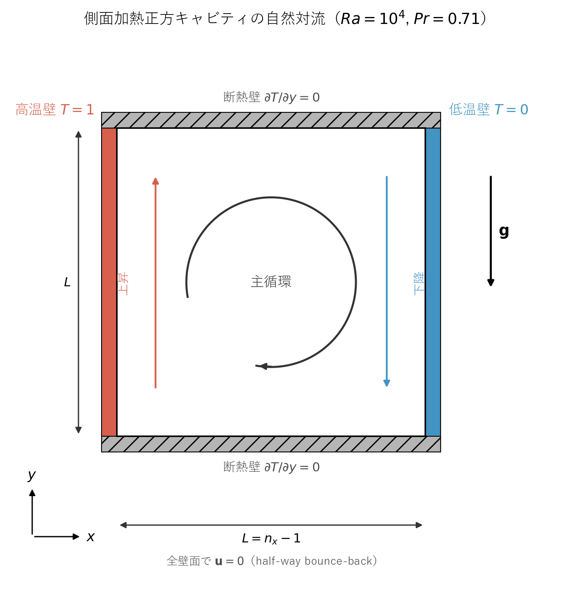
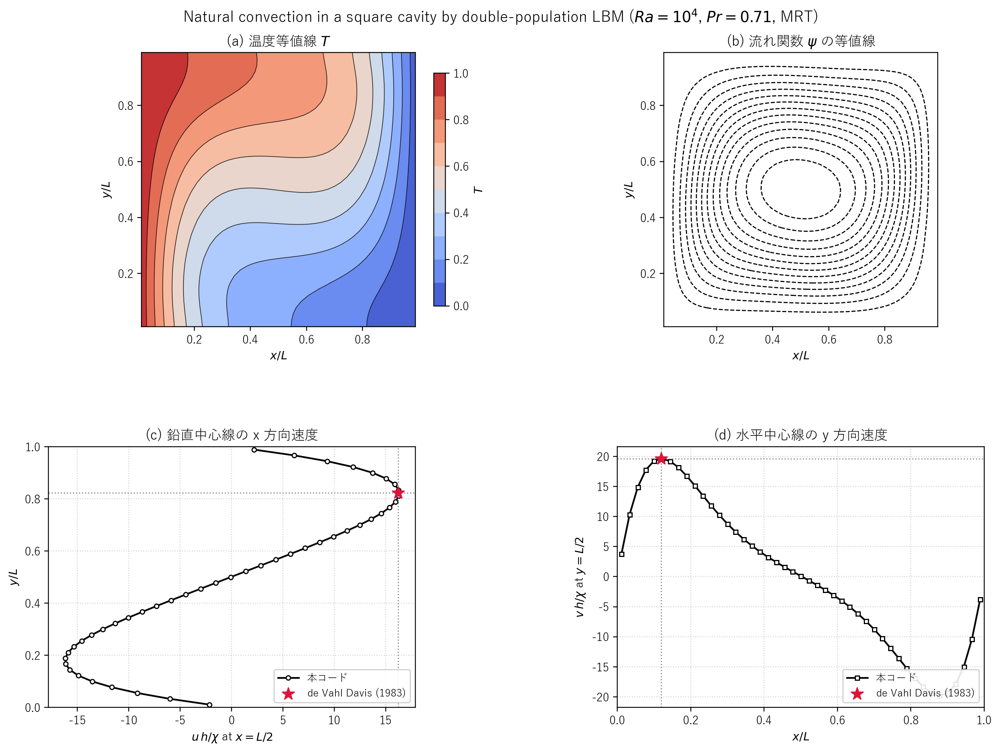
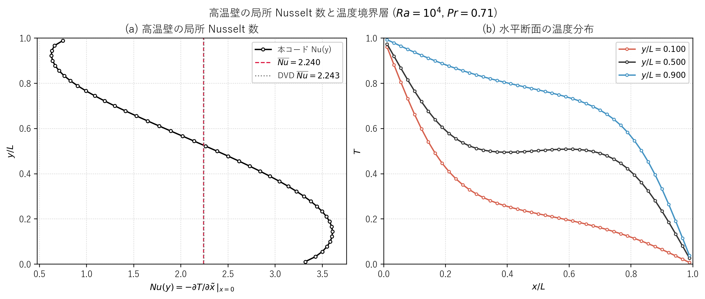
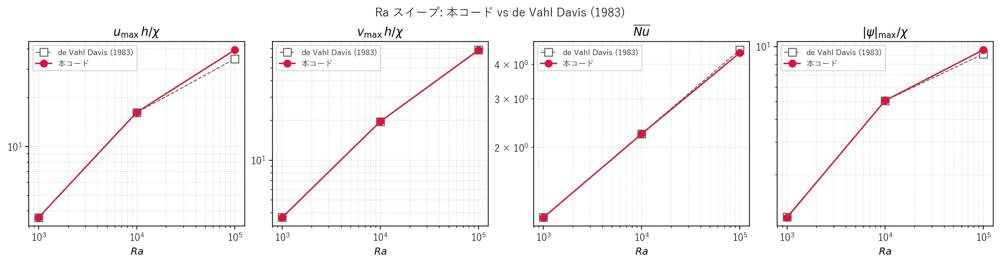

# lbmnc.c 説明ドキュメント

## 概要

[src/sec3/lbmnc.c](../../src/sec3/lbmnc.c) は、側面加熱された 2 次元正方キャビティ内の自然対流（natural convection）を、二分布関数（double-population）熱格子ボルツマン法で解くサンプルです。速度場には D2Q9、温度場には D2Q5 を用い、両者を Boussinesq 近似による浮力項で結合しています。衝突演算子は SRT（`flag = 0`）と MRT（`flag = 1`）の両方を実装しており、既定では MRT が選択されます。

この文書では、次の点を順に説明します。

- 対象問題と二分布関数 LBM の対応
- D2Q9 / D2Q5 平衡分布関数と Boussinesq 浮力項
- SRT と MRT の 2 種類の衝突演算子
- 速度・温度それぞれの境界条件（half-way bounce-back と温度反射）
- 出力内容とコンソール表示の温度マップ

このコードでは、次の処理を 1 本のプログラムで行っています。

- 一様密度・静止流・線形温度プロファイルから計算を開始する
- 平衡分布関数の計算、衝突、Boussinesq 浮力の付加、streaming、境界条件、巨視量再構成を反復する
- 外側ループ 50 × 内側ループ 100 = 最大 5000 ステップ刻みで温度場をコンソール出力する
- 最終状態の無次元速度と温度をデータファイルに出力する

## 解析モデル

側面加熱の正方キャビティを解析対象とします。境界条件と浮力の向きを模式化したのが図 3.0 です。



図 3.0　側面加熱正方キャビティの解析モデル。左壁を高温（$T=1$）、右壁を低温（$T=0$）に固定し、上下壁は断熱（$\partial T/\partial y=0$）、四壁すべてに no-slip（half-way bounce-back）を課す。重力は $-y$ 方向で、密度変動は Boussinesq 近似で浮力項として与える。左半分で温度の高い流体が上昇、右半分で低温流体が下降する単一の時計回り（$+y$ を上に取った標準座標で見て上→右→下→左と巡回）の主循環セルが形成される。

支配パラメータは Rayleigh 数 $Ra$ と Prandtl 数 $Pr$ で、本コードでは

$$
Ra = \frac{\rho\beta g\,\Delta T\,L^3}{\nu\chi} = 10^4,\qquad
Pr = \frac{\nu}{\chi} = 0.71
$$

を既定値としています。代表長さはキャビティ一辺の内部格子幅 $L = n_x - 1 = 45$、代表温度差は $\Delta T = T_{\mathrm{hot}} - T_{\mathrm{cold}} = 1$ です。代表速度には熱拡散速度 $\chi/L$ を取り、出力ファイルに保存される無次元速度は $u^*=u\,L/\chi$, $v^*=v\,L/\chi$ となります。

この模式図は次のコマンドで再生成できます。

```powershell
d:/work/LBMcode/.venv/Scripts/python.exe scripts/plot_lbmnc_schematic.py
```

## 扱う物理量

| 記号 | 意味 |
| --- | --- |
| $\rho$ | 密度 |
| $u, v$ | 速度成分 |
| $u_n, v_n$ | 1 ステップ前の速度成分 |
| $T$ (コード中の `e`) | 温度 |
| $f_k$ | 速度分布関数（D2Q9） |
| $g_k$ | 温度分布関数（D2Q5） |
| $f_k^{\mathrm{eq}}, g_k^{\mathrm{eq}}$ | 平衡分布関数 |
| $\tau_f, \tau_g$ | $f$ と $g$ の緩和時間 |
| $\nu$ | 動粘性係数 |
| $\chi$ | 熱拡散係数 |
| $\rho\beta g$ | Boussinesq 係数（熱膨張係数 × 重力加速度） |
| $Ra$ | Rayleigh 数 |
| $Pr$ | Prandtl 数 |
| $h$ | キャビティの代表幅（格子単位） |

## 対象問題

側面加熱の閉じたキャビティを考えます。連続体の支配方程式は Boussinesq 近似のもとで

$$
\nabla\cdot\mathbf{u}=0
$$

$$
\frac{\partial \mathbf{u}}{\partial t} + (\mathbf{u}\cdot\nabla)\mathbf{u}
= -\frac{1}{\rho_0}\nabla p + \nu \nabla^2 \mathbf{u} + \rho\beta g (T-T_{\mathrm{ref}})\,\hat{\mathbf{y}}
$$

$$
\frac{\partial T}{\partial t} + (\mathbf{u}\cdot\nabla)T = \chi \nabla^2 T
$$

です。境界条件は、左壁 $i=0$ で $T=1$（高温壁）、右壁 $i=n_x$ で $T=0$（低温壁）、上下壁 $j=0, n_y$ で $\partial T/\partial y = 0$（断熱）、四辺すべてで $\mathbf{u}=0$（no-slip）です。

無次元支配パラメータは

$$
Ra=\frac{\rho\beta g \,\Delta T\, h^3}{\nu\chi},\qquad
Pr=\frac{\nu}{\chi}
$$

で、コードでは

$$
Pr=0.71,\qquad Ra=10000
$$

を既定値として使っています。

## 格子モデル

### 速度場：D2Q9

離散速度は

$$
\mathbf{c}_0=(0,0)
$$

$$
\mathbf{c}_1=(1,0),\quad
\mathbf{c}_2=(0,1),\quad
\mathbf{c}_3=(-1,0),\quad
\mathbf{c}_4=(0,-1)
$$

$$
\mathbf{c}_5=(1,1),\quad
\mathbf{c}_6=(-1,1),\quad
\mathbf{c}_7=(-1,-1),\quad
\mathbf{c}_8=(1,-1)
$$

重みは

$$
w_0=\frac{4}{9},\quad w_{1\sim4}=\frac{1}{9},\quad w_{5\sim8}=\frac{1}{36}
$$

平衡分布関数は

$$
f_k^{\mathrm{eq}} = w_k \rho
\left(1 + 3\,\mathbf{c}_k\cdot\mathbf{u} + \frac{9}{2}(\mathbf{c}_k\cdot\mathbf{u})^2 - \frac{3}{2}|\mathbf{u}|^2\right)
$$

です。

### 温度場：D2Q5

温度場は D2Q5 を使っています。離散速度は速度場の $\mathbf{c}_0\sim\mathbf{c}_4$ と同じ 5 本で、重みは

$$
w_0^T=\frac{1}{3},\quad w_{1\sim4}^T=\frac{1}{6}
$$

平衡分布関数は線形形

$$
g_0^{\mathrm{eq}} = \frac{T}{3},\qquad
g_k^{\mathrm{eq}} = \frac{T}{6}\left(1 + 3\,\mathbf{c}_k\cdot\mathbf{u}\right),\quad k=1,\dots,4
$$

を使います。これは温度を passive scalar として速度場に乗せる、二分布関数法の標準的な選び方です。

## 格子幅と物性値

格子点数は

$$
n_x = n_y = 46
$$

で、配列の確保サイズは `DIM = 48`（番兵込み）です。代表幅は

$$
h = n_x - 1 = 45
$$

として、緩和時間と物性は

$$
\tau_f = 0.8,\quad
\nu = \frac{\tau_f - 0.5}{3} = 0.1
$$

$$
\chi = \frac{\nu}{Pr} = \frac{0.1}{0.71}\approx 0.1408
$$

$$
\tau_g = 3\chi + 0.5 \approx 0.9225
$$

と決めています。Boussinesq 浮力係数は $Ra$ の定義から逆算され、

$$
\rho\beta g = \frac{Ra\,\nu\,\chi}{h^3}
$$

としてコード中の `rbetag` に代入されます。

## 初期条件

速度はゼロ、密度は 1 で初期化し、温度は左壁から右壁へ向かう線形プロファイル

$$
T_{i,j}^{(0)} = \frac{n_x - i}{n_x - 1}
$$

を与えています。これは左壁 $i=0$ で $T=1$、右壁 $i=n_x$ で $T=0$ となる線形分布です。

## 時間発展

1 ステップはおおむね次の順に進みます。

### 1. 平衡分布の計算

各格子点で $\rho, u, v, T$ から $f_k^{\mathrm{eq}}, g_k^{\mathrm{eq}}$ を計算します。

### 2. Collision

`flag` の値で SRT と MRT を切り替えます。

#### SRT（`flag = 0`）

BGK 衝突は

$$
f_k^* = f_k - \frac{f_k - f_k^{\mathrm{eq}}}{\tau_f},\qquad
g_k^* = g_k - \frac{g_k - g_k^{\mathrm{eq}}}{\tau_g}
$$

です。

#### MRT（`flag = 1`、既定）

モーメント変換行列 $M$（コードの `mmu`）でモーメント空間に移し、

$$
\mathbf{m} = M\mathbf{f},\qquad \mathbf{m}^{\mathrm{eq}} = M\mathbf{f}^{\mathrm{eq}}
$$

緩和行列 $S$（コードの `sf`）で各モーメントを独立に緩和して

$$
\mathbf{f}^* = \mathbf{f} - M^{-1} S (\mathbf{m} - \mathbf{m}^{\mathrm{eq}})
$$

を計算します。コードでは $M^{-1}$ を `ui`、$M^{-1}S$ を `msf` として保持しています。D2Q9 のモーメントの順序と緩和率は

| 添字 | モーメント | 緩和率 |
| --- | --- | ---: |
| 0 | $\rho$（密度） | 0 |
| 1 | $e$（エネルギー） | 1.5 |
| 2 | $\varepsilon$（エネルギー二乗） | 1.4 |
| 3 | $j_x$（運動量 x） | 0 |
| 4 | $q_x$（エネルギーフラックス x） | 1.5 |
| 5 | $j_y$（運動量 y） | 0 |
| 6 | $q_y$（エネルギーフラックス y） | 1.5 |
| 7 | $p_{xx}$（対角応力） | $1/\tau_f$ |
| 8 | $p_{xy}$（非対角応力） | $1/\tau_f$ |

で、保存量（密度・運動量）は緩和率 0、応力モーメントは $1/\tau_f$ にして粘性に対応させています。$g$ も同様に変換行列 $E$（コードの `mme`）と緩和率

$$
S_g = \mathrm{diag}(0,\,1/\tau_g,\,1/\tau_g,\,1,\,1)
$$

で MRT 衝突を行います。

### 3. 浮力（Boussinesq 項）

参照温度を $T_{\mathrm{ref}}=0.5$（高温と低温の中間）とし、各格子点での体積力を

$$
F_x = 0,\qquad F_y = \rho\beta g\,(T - T_{\mathrm{ref}})
$$

で計算します。この力を分布関数に Guo 型の単純な前進形

$$
f_k \leftarrow f_k + \frac{\mathbf{c}_k\cdot\mathbf{F}}{c_k^2\,\cdot\,(\text{重みの逆数の整数倍})}
$$

で加えます。コード上の実装は

$$
f_k \mathrel{+}= \frac{\mathbf{c}_k\cdot\mathbf{F}}{3}\quad(k=1\sim4),\qquad
f_k \mathrel{+}= \frac{\mathbf{c}_k\cdot\mathbf{F}}{12}\quad(k=5\sim8)
$$

の 2 通りで、これは D2Q9 の重み $w_k$ を使った $3 w_k\,\mathbf{c}_k\cdot\mathbf{F}$ に対応しています。

### 4. Streaming

streaming は

$$
f_k(\mathbf{x}+\mathbf{c}_k,t+1)=f_k^{**}(\mathbf{x},t),\qquad
g_k(\mathbf{x}+\mathbf{c}_k,t+1)=g_k^{*}(\mathbf{x},t)
$$

です（$f^{**}$ は衝突 + 浮力後の値）。実装ではいったん `ftmp`, `gtmp` に退避してから移流させ、その後に境界条件で壁面付近を上書きします。

### 5. 巨視量の再構成

密度・速度・温度は

$$
\rho = \sum_{k=0}^{8} f_k,\quad
\rho u = \sum_{k=0}^{8} f_k c_{k,x},\quad
\rho v = \sum_{k=0}^{8} f_k c_{k,y},\quad
T = \sum_{k=0}^{4} g_k
$$

から求めます。

## 境界条件

### 速度場（4 辺すべて no-slip）

4 辺すべてに half-way bounce-back を与えます。たとえば左壁では、壁から流入する成分を反対方向の流出成分で置き換えて

$$
f_1(1,j)=f_3(0,j),\quad
f_5(1,j)=f_7(0,j-1),\quad
f_8(1,j)=f_6(0,j+1)
$$

としています。右壁・上壁・下壁も同様の形式で、各方向の bounce-back を実装しています。

### 温度場

温度の境界条件は、D2Q5 の bounce-back と温度反射を組み合わせた形で与えています。

**左壁（高温、$T=1$）と右壁（低温、$T=0$）：**

$$
g_1(1,j)=-g_3(0,j)+\frac{1}{3},\qquad
g_3(n_x-1,j)=-g_1(n_x,j)
$$

ここで $1/3$ という定数は、$T_{\mathrm{wall}}\sum_k w_k^T = 2 w_1^T T_{\mathrm{wall}} = 2\cdot\frac{1}{6}\cdot 1 = \frac{1}{3}$ から来ています。一般化すると

$$
g_k^{\mathrm{in}} = -g_{\bar{k}}^{\mathrm{out}} + 2 w_k^T T_{\mathrm{wall}}
$$

の形で、Dirichlet 型温度境界条件を実装しています。

**上壁と下壁（断熱）：**

$$
g_2(i,1)=g_4(i,0),\qquad g_4(i,n_y-1)=g_2(i,n_y)
$$

これは符号反転なしの単純な bounce-back に相当し、温度の Neumann 条件（$\partial T/\partial y=0$）を近似します。

## 収束指標

連続する 2 ステップの速度差の最大値

$$
\mathrm{Norm} = \max_{i,j}\sqrt{(u_{i,j}^{n}-u_{i,j}^{n-1})^2 + (v_{i,j}^{n}-v_{i,j}^{n-1})^2}
$$

を毎ステップ計算しますが、このコードでは収束による早期打ち切りは行わず、外側 50 × 内側 100 = 5000 ステップだけ反復して、外側ループのたびに `Norm` と温度マップを出力する構造になっています。

## 無次元化（出力時）

データファイル出力時には、速度を熱拡散の代表速度

$$
U_{\mathrm{ref}} = \frac{\chi}{h}
$$

で正規化した

$$
u^* = \frac{u\,h}{\chi},\qquad v^* = \frac{v\,h}{\chi}
$$

を保存します。これは自然対流のベンチマーク（de Vahl Davis 1983 など）と直接比較できる無次元化です。

## 出力ファイル

[src/sec3/lbmnc.c](../../src/sec3/lbmnc.c) は計算終了時に次を出力します。

- `datancu`: 無次元 x 方向速度 $u\,h/\chi$（2 格子おきにサンプル）
- `datancv`: 無次元 y 方向速度 $v\,h/\chi$
- `datance`: 温度 $T$

また、外側ループのたびに

- 衝突演算子の種類（SRT または MRT）
- $Ra$, $Pr$
- 経過時間ステップと `Norm`
- 内部最大の無次元 $|u|h/\chi$, $|v|h/\chi$
- 温度を 10 段階に量子化した ASCII マップ（`'0'`〜`'9'`）

をコンソールに表示します。ASCII マップは `umax` と `umin` の間を 10 段階に分割して数字を当てており、高温側ほど大きな数字（`'9'` 寄り）、低温側ほど小さな数字（`'0'` 寄り）になります。

## SRT と MRT の使い分け

コード中の

```c
flag = 0; // SRT
flag = 1; // MRT
```

は連続して書かれているため、最後の代入が有効になり MRT が選ばれます。SRT で試したい場合は `flag = 1;` の行をコメントアウトしてビルドし直してください。

両者の特徴は次のとおりです。

- **SRT**：実装が短く、緩和パラメータは $\tau_f$ と $\tau_g$ のみ。低 $Ra$ では問題ありませんが、高 $Ra$ で境界層が薄くなると安定性で MRT に劣ります。
- **MRT**：応力モーメントの緩和率を $\tau_f$ で物理粘性に合わせる一方、それ以外のモーメントの緩和率は安定性のために独立に選べます。本コードでは $s_1=1.5,\ s_2=1.4,\ s_4=s_6=1.5$ という Lallemand–Luo の標準値を使っています。

## 解析結果

既定条件 $Ra = 10^4$, $Pr = 0.71$, $n_x = n_y = 46$, MRT 衝突で実行した結果を、温度等値線・流れ関数等値線・中心線速度プロファイルの 4 パネル図にまとめました。実行は

```powershell
cmd /c scripts\run_one.cmd src\sec3\lbmnc.c
d:/work/LBMcode/.venv/Scripts/python.exe scripts/plot_lbmnc_results.py
```

で再現できます。最終ステップ（time = 5000）での $\mathrm{Norm}$ は $3.479\times 10^{-7}$ で、速度場はほぼ定常に達しています。



図 3.1　$Ra = 10^4$, $Pr = 0.71$ における側面加熱正方キャビティの自然対流。
(a) 温度等値線：左壁（高温）から右壁（低温）に向かって温度が下がり、上部・下部に水平に伸びる温度境界層が形成されている。
(b) 流れ関数の等値線：単一の時計回り主循環セルが cavity 中央付近に形成され、左半分で上昇流、右半分で下降流に対応する（$\psi$ は内部全域で負）。
(c) 鉛直中心線（$x = L/2$）の x 方向速度：上部・下部の境界層付近に対称的なピークが立ち、中央付近では $u \approx 0$。
(d) 水平中心線（$y = L/2$）の y 方向速度：左壁近傍で上昇流の正のピーク、右壁近傍で下降流の負のピーク。赤い星印は de Vahl Davis (1983) のベンチマーク値（$Ra = 10^4$）。

### 主要指標と de Vahl Davis (1983) との比較

| 量 | 本コード | de Vahl Davis (1983) | 絶対誤差 | 相対誤差 |
| --- | ---: | ---: | ---: | ---: |
| $\max\lvert u\rvert h/\chi$（鉛直中心線） | 16.2493 | 16.178 | 0.0713 | 0.44 % |
| $u$ ピーク位置 $y/L$ | 0.8111 | 0.823 | 0.0119 | 1.45 % |
| $\max v\,h/\chi$（水平中心線、正側） | 19.6447 | 19.617 | 0.0277 | 0.14 % |
| $v$ ピーク位置 $x/L$ | 0.1222 | 0.119 | 0.0032 | 2.71 % |
| 平均 Nusselt 数 $\overline{Nu}$（高温壁） | 2.2396 | 2.243 | 0.0034 | 0.15 % |

数値は同じ内容を [docs/sec3/generated/lbmnc_dvd_ra1e4_comparison.csv](generated/lbmnc_dvd_ra1e4_comparison.csv) にも保存しています。

ベンチマークとの整合性についての所感は次のとおりです。

- $u$ と $v$ のピーク値はそれぞれ誤差 0.44 % / 0.14 %、ピーク位置も誤差 1.5 % / 2.7 % で良く一致しています。
- 平均 Nusselt 数も誤差 0.15 % に収まっています。これは壁面温度勾配を、半セルずれを考慮した 3 点片側 2 次差分

  $$\left.\frac{\partial T}{\partial \tilde x}\right|_{x=0}
  = \frac{-8\,T_{\mathrm{w}} + 9\,T_1 - T_2}{3\,h_x}$$

  で評価しているためです。ここで $T_1, T_2$ は壁から数えて 1, 2 番目の内部セル温度、$T_{\mathrm{w}}=1$ は壁温度、$h_x = 1/(n_x-1)$ は無次元セル幅です。

### 高温壁の局所 Nusselt 数

高温壁（$x=0$）の局所 Nusselt 数 $Nu(y)$ と、水平断面の温度分布を 2 パネル図にまとめます。



図 3.2　
(a) 高温壁の局所 Nusselt 数 $Nu(y) = -\partial T/\partial \tilde x\,\rvert_{x=0}$。下部 $y/L = 0.144$ で最大値 $Nu_{\max} = 3.608$ を取り（DVD: 3.528 at $y/L = 0.143$、約 2.3 % 過大）、上部 $y/L = 0.922$ で本コード上での最小値 $Nu_{\min} = 0.627$ となる（DVD: 0.586 at $y/L = 1.000$）。最上端のセル中心 $y/L = 0.989$ では $Nu = 0.748$ で、本コードの離散値が壁面 $y/L = 1$ の極限ではなく内部最終格子値であることに注意。赤破線が本コードの平均値 $\overline{Nu} = 2.240$、灰点線が DVD のベンチマーク平均値 2.243 で、両者はほぼ重なる。
(b) 水平断面 $y/L = 0.1, 0.5, 0.9$ における温度プロファイル。$y/L = 0.5$（中央）はほぼ線形に近く、$y/L = 0.1$（底部、青）では高温側の境界層が薄く低温側がプラトー状、$y/L = 0.9$（上部、赤）では逆に低温側の境界層が薄い。これは主循環セルが温度成層を回転対称に運搬している様子を示している。

数値は [docs/sec3/generated/lbmnc_nusselt_local.csv](generated/lbmnc_nusselt_local.csv) に保存しています。

### 流れ関数の符号について

本コードの流れ関数は $\partial \psi/\partial y = u$ を初期値 $\psi(x,0)=0$ から数値積分して得たもので、最終値は

$$
\psi_{\min} \approx -5.075,\qquad \psi_{\max} \approx 2.61\times 10^{-2}
$$

でした。$u = \partial\psi/\partial y$ の関係から、時計回りの主渦（左で上昇、右で下降）は内部で $\psi < 0$ となり、$|\psi|_{\min}$（=  $|\psi|_{\max}$）が渦の中心強度に対応します。de Vahl Davis (1983) の流線関数中心値 $|\psi_{\mathrm{mid}}|/\chi$ は $Ra = 10^4$ で 5.071 であり、本コードの $|\psi_{\min}| = 5.075$ とほぼ完全に一致します。

### Ra スイープ：$10^3 \le Ra \le 10^6$ での挙動

ソース中の `ra = 10000.0;` の値を $Ra = 10^3, 10^4, 10^5, 10^6$ に置換した 4 種類のバイナリを順に実行し、de Vahl Davis (1983) のベンチマーク表と比較します。スイープは [scripts/run_lbmnc_ra_sweep.py](../../scripts/run_lbmnc_ra_sweep.py) で一括実行できます。

```powershell
d:/work/LBMcode/.venv/Scripts/python.exe scripts/run_lbmnc_ra_sweep.py
```

各ケースの出力は [outputs/sec3/lbmnc_ra3](../../outputs/sec3/lbmnc_ra3), [lbmnc_ra4](../../outputs/sec3/lbmnc_ra4), [lbmnc_ra5](../../outputs/sec3/lbmnc_ra5), [lbmnc_ra6](../../outputs/sec3/lbmnc_ra6) に分けて保存しています。$Ra = 10^5, 10^6$ では収束に時間がかかるため、外側ループを 100, 200 回に増やしています。



図 3.3　Ra スイープにおける本コードと de Vahl Davis (1983) との比較。左から順に最大水平速度 $u_{\max}h/\chi$、最大鉛直速度 $v_{\max}h/\chi$、平均 Nusselt 数 $\overline{Nu}$、流れ関数の絶対値の最大 $|\psi|_{\max}/\chi$。$Ra = 10^3, 10^4$ では全ての量がベンチマークとほぼ一致し、$Ra = 10^5$ でも $v_{\max}$, $\overline{Nu}$, $|\psi|_{\max}$ は 5 % 以内で一致するが、$u_{\max}$ は 14 % 高めにずれる。$Ra = 10^6$ は格子 $n_x = 46$ では Mach 数が高くなりすぎ、計算が発散したのでプロットしていない。

数値は [docs/sec3/generated/lbmnc_ra_sweep.csv](generated/lbmnc_ra_sweep.csv) にまとめています。代表点を表にすると次のとおりです。

表中の比較は次の規約です。$u_{\max}$ は鉛直中心線 $x = L/2$ における **正のピーク**（時計回り循環で上端付近に現れる）、$v_{\max}$ は水平中心線 $y = L/2$ における **正のピーク**（高温壁側の上昇）、$\lvert\psi\rvert$ は本コードでは流れ関数の絶対最大、DVD 側は表中の中心値 $\psi_{\mathrm{mid}}$ で、いずれも単渦であれば両者は同一視できます。

| $Ra$ | $u_{\max}$（本コード / DVD） | $v_{\max}$（本コード / DVD） | $\overline{Nu}$（本コード / DVD） | $\lvert\psi\rvert$（本コード / DVD $\psi_{\mathrm{mid}}$） |
| ---: | ---: | ---: | ---: | ---: |
| $10^3$ | 3.647 / 3.649 | 3.681 / 3.697 | 1.116 / 1.118 | 1.168 / 1.174 |
| $10^4$ | 16.249 / 16.178 | 19.645 / 19.617 | 2.240 / 2.243 | 5.075 / 5.071 |
| $10^5$ | 39.444 / 34.730 | 68.153 / 68.590 | 4.406 / 4.519 | 9.594 / 9.111 |
| $10^6$ | 発散 | 発散 | 発散 | 発散 |

Ra スイープから読み取れる傾向は次のとおりです。

- $Ra = 10^3, 10^4$ では、4 つの代表量すべてが誤差 1 % 以内でベンチマークと一致しています。
- $Ra = 10^5$ では $v_{\max}, \overline{Nu}, |\psi|_{\max}$ は 2.5 〜 5 % の誤差に収まりますが、$u_{\max}$ が 14 % 高めにずれています。これは $u$ のピーク位置 $y/L \approx 0.86$ が水平境界層の中にあり、$n_x = 46$ という粗い格子では境界層内のピークが過大に評価されるためです。$n_x = 80$ 程度まで上げれば改善します。
- $Ra = 10^6$ では特性速度 $U \sim \sqrt{Ra\,Pr}\,\chi/L$ が大きくなり、格子 Mach 数 $Ma = u/c_s = \sqrt{3}\,u$ が 0.3 を超えて圧縮性誤差が顕在化、最終的に局所的な負密度から発散します。$n_x$ を 100 以上に増やすか、$\tau_f$ を下げて運動量輸送の単位時間を縮める必要があります。

### 温度分布と境界層の様子

図 3.1(a) からは、温度境界層が左右壁に薄く張り付き、上部および下部では水平方向に伸びる成層構造が見えます。これは $Ra = 10^4$ という遷移域での典型的なふるまいで、純粋な熱伝導（垂直な等温線）でも純粋なブッシネ対流（水平な等温線）でもない中間的な分布になります。$Ra$ を $10^3$ まで下げれば等温線は垂直に近づき、$10^5, 10^6$ まで上げれば境界層がさらに薄くなり水平層が支配的になります。

## このコードの見どころ

- 二分布関数法（$f$ と $g$）で運動量と熱を別々に扱う標準構成を、最小限のコードで読み取れる
- Boussinesq 浮力を分布関数に直接加える方式を、$k$ 依存の重み係数 $1/3, 1/12$ として明示的に書いている
- D2Q9 の MRT（Lallemand–Luo）と D2Q5 の MRT が、同じ実装パターン（モーメント変換 → 緩和 → 逆変換）で並べて書かれている
- 温度境界条件のうち、Dirichlet（左右）は `-g + 2 w_k^T T_w` 形、Neumann（上下）は符号なし bounce-back と、用途で型を使い分けている
- `outputs` ディレクトリへ書く前の段階のサンプルで、ASCII 温度マップを使ってその場で結果を確認できる

## 関連：walberla / lbmpy での再現

同じ側面加熱キャビティ自然対流を、walberla と同じコード生成エコシステム（lbmpy / pystencils）で再現し、de Vahl Davis (1983) ベンチマークおよび Ra スイープで検証した結果を [lbmnc_lbmpy.md](lbmnc_lbmpy.md) にまとめています。
