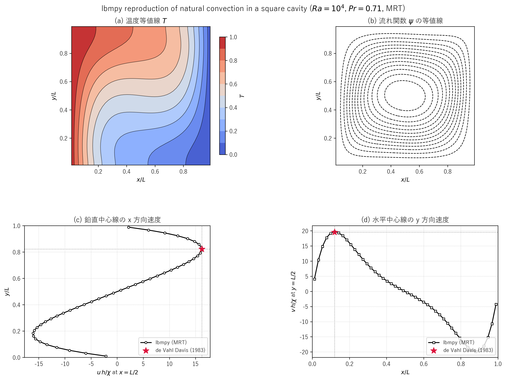
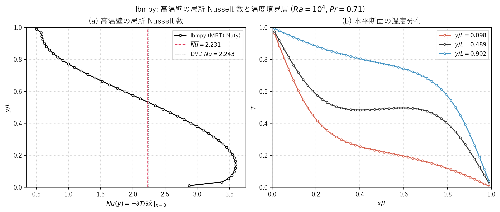
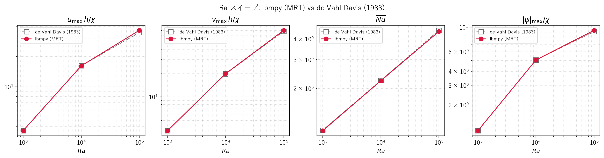

# lbmnc.c の walberla / lbmpy 再現

## 概要

[src/sec3/lbmnc.c](../../src/sec3/lbmnc.c) は、側面加熱正方キャビティの自然対流を二分布関数熱格子ボルツマン法（D2Q9 速度場 + D2Q5 温度場）で解く C サンプルです（詳細は [lbmnc.md](lbmnc.md)）。この文書では、同じ問題を **walberla と同じコード生成エコシステムである [lbmpy](https://pycodegen.pages.i10git.cs.fau.de/lbmpy/) / [pystencils](https://pycodegen.pages.i10git.cs.fau.de/pystencils/)** で再現し、de Vahl Davis (1983) のベンチマークで検証します。

walberla 本体は C++ のシミュレーション框架で、近年は **lbmpy/pystencils が LBM カーネルを Python から生成し、それを walberla アプリにコンパイルする**のが標準ワークフローです。本再現はその「lbmpy 単体」経路にあたり、walberla 本体をビルドせずに、まったく同じ式・コード生成基盤を使って純 Python（numpy + MSVC でコンパイルしたカーネル）でシミュレーションを走らせます。

実装は [scripts/lbmnc_lbmpy.py](../../scripts/lbmnc_lbmpy.py) にあります。

## C 実装との対応

| 項目 | lbmnc.c | lbmpy 再現 |
| --- | --- | --- |
| 速度場 | D2Q9, SRT/MRT | D2Q9, SRT/MRT（`Method.SRT` / `Method.MRT`） |
| 温度場 | D2Q5, SRT/MRT | **D2Q9** 移流拡散（1 次平衡, `equilibrium_order=1`） |
| 結合 | 浮力 $f_y=\rho\beta g(T-0.5)$ を分布関数へ付加 | `force=(0, rbetag*(T-0.5))`（温度場を参照する記号式） |
| 温度の移流 | 平衡分布に速度 $u,v$ を乗せる | `velocity_input` で流体場の速度を温度 LB に供給 |
| 速度境界 | 四壁 half-way bounce-back | 四壁 `NoSlip` |
| 温度境界 | 左右 Dirichlet, 上下断熱 | 左右 `DiffusionDirichlet(1/0)`, 上下 `NeumannByCopy` |

lbmpy 1.4 には D2Q5 ステンシルが標準で無いため、温度場は **D2Q9 の移流拡散**として実装しています。D2Q9 の音速二乗は $c_s^2=1/3$ で lbmnc.c の D2Q5（同じく $c_s^2=1/3$）と一致するため、緩和時間 $\tau_g=3\chi+0.5$ がそのまま使え、巨視的な移流拡散方程式としては等価です。

物性は lbmnc.c と同一です。

$$
Pr=0.71,\quad \tau_f=0.8,\quad \nu=\frac{\tau_f-0.5}{3}=0.1,\quad
\chi=\frac{\nu}{Pr}\approx0.1408,\quad \tau_g=3\chi+0.5\approx0.9225
$$

緩和率は $\omega_f=1/\tau_f=1.25$, $\omega_g=1/\tau_g\approx1.084$、Boussinesq 係数は $\rho\beta g = Ra\,\nu\,\chi/L^3$、代表長さは流体セル数 $L=N$（half-way bounce-back で壁は半セル外側）としています。

## セットアップ（この環境では適用済み）

1. コード生成スタックを `.venv` に導入します。

   ```powershell
   d:/work/LBMcode/.venv/Scripts/python.exe -m pip install lbmpy pystencils sympy pyevtk
   ```

2. pystencils は CPU カーネルを MSVC（`cl.exe`）でコンパイルします。pystencils 1.4 同梱の Visual Studio 検出は VS 2017 以降のレイアウト（`VC\Auxiliary\Build\vcvarsall.bat`）で壊れているため、`.venv\Lib\site-packages\pystencils\cpu\msvc_detection.py` に 2 か所の修正が必要です（本環境では適用済み）。

   - `get_environment_from_vc_vars_file`: コマンド全体をもう一段の引用符で囲み（`f'cmd /c ""{vc_vars_file}" {arch} && set"'`）、出力を `utf-16le` ではなく `mbcs` でデコードする。
   - `get_vc_vars_path_via_environment_variable`: レガシーパスが無い場合に新レイアウト（`VC\Auxiliary\Build\vcvarsall.bat`）とファイルシステム探索へフォールバックする。

   `.venv` を作り直すとこのパッチは失われます。詳細は [scripts/lbmnc_lbmpy.py](../../scripts/lbmnc_lbmpy.py) の冒頭コメントを参照してください。パッチを当てない場合は、`vcvars64.bat` を読み込んだシェル（"Developer Command Prompt for VS" など、`cl.exe` が PATH に通った状態）から実行してください。

## 実行方法

```powershell
# Ra = 1e4, MRT を実行し、フィールドと VTK を outputs/sec3/lbmnc_lbmpy/ に出力
d:/work/LBMcode/.venv/Scripts/python.exe scripts/lbmnc_lbmpy.py

# 結果図と比較 CSV を生成
d:/work/LBMcode/.venv/Scripts/python.exe scripts/plot_lbmnc_lbmpy_results.py

# Ra スイープ（1e3〜1e6, MRT）
d:/work/LBMcode/.venv/Scripts/python.exe scripts/run_lbmnc_lbmpy_ra_sweep.py
```

シミュレーションは流体ステップと温度ステップを 1 つの pystencils data handling 上で交互に進め、共有フィールド `u`, `T` を介して結合します。$Ra=10^4$ では約 14000 ステップで $\max|\Delta u| < 10^{-9}$ に収束します。

## 解析結果（$Ra=10^4$, $Pr=0.71$, MRT）



図 3.4　lbmpy による側面加熱正方キャビティ自然対流（$Ra=10^4$）。
(a) 温度等値線、(b) 流れ関数の等値線（単一の時計回り主循環セル）、(c) 鉛直中心線の x 方向速度、(d) 水平中心線の y 方向速度。赤い星印は de Vahl Davis (1983) のベンチマーク値。[lbmnc.md](lbmnc.md) の図 3.1（C 実装）とほぼ同一の分布が得られています。

### de Vahl Davis (1983) との比較

| 量 | lbmpy | de Vahl Davis (1983) | 相対誤差 |
| --- | ---: | ---: | ---: |
| $\max\lvert u\rvert h/\chi$（鉛直中心線） | 16.149 | 16.178 | 0.18 % |
| $u$ ピーク位置 $y/L$ | 0.815 | 0.823 | 0.95 % |
| $\max v\,h/\chi$（水平中心線） | 19.738 | 19.617 | 0.62 % |
| $v$ ピーク位置 $x/L$ | 0.120 | 0.119 | 0.47 % |
| 平均 Nusselt 数 $\overline{Nu}$（高温壁） | 2.231 | 2.243 | 0.51 % |

数値は [docs/sec3/generated/lbmnc_lbmpy_dvd_ra1e4_comparison.csv](generated/lbmnc_lbmpy_dvd_ra1e4_comparison.csv) に保存しています。全項目が誤差 1 % 以内で、C 実装（[lbmnc.md](lbmnc.md) の対応表）と同等の精度です。

### 高温壁の局所 Nusselt 数



図 3.5　(a) 高温壁の局所 Nusselt 数 $Nu(y)$ と平均値 $\overline{Nu}=2.231$（DVD 2.243）。(b) 水平断面 $y/L=0.1, 0.5, 0.9$ の温度分布。Nusselt 数は半セルずれを考慮した 3 点片側 2 次差分で評価しています（[lbmnc.md](lbmnc.md) と同じ規約）。

## Ra スイープ

`Ra` を $10^3, 10^4, 10^5, 10^6$ と変えて MRT で実行し、de Vahl Davis (1983) と比較します。



図 3.6　Ra スイープ（lbmpy MRT vs DVD）。左から最大水平速度、最大鉛直速度、平均 Nusselt 数、流れ関数の絶対最大。

数値は [docs/sec3/generated/lbmnc_lbmpy_ra_sweep.csv](generated/lbmnc_lbmpy_ra_sweep.csv) にあります。

| $Ra$ | $u_{\max}$（lbmpy / DVD） | $v_{\max}$（lbmpy / DVD） | $\overline{Nu}$（lbmpy / DVD） | $\lvert\psi\rvert$（lbmpy / DVD） |
| ---: | ---: | ---: | ---: | ---: |
| $10^3$ | 3.650 / 3.649 | 3.699 / 3.697 | 1.109 / 1.118 | 1.174 / 1.174 |
| $10^4$ | 16.149 / 16.178 | 19.738 / 19.617 | 2.231 / 2.243 | 5.070 / 5.071 |
| $10^5$ | 36.491 / 34.730 | 70.484 / 68.590 | 4.446 / 4.519 | 9.356 / 9.111 |
| $10^6$ | 発散 | 発散 | 発散 | 発散 |

- $Ra=10^3, 10^4$ では 4 つの代表量すべてが誤差 1 % 以内で一致します。
- $Ra=10^5$ では $v_{\max}, \overline{Nu}, |\psi|$ が 3 % 以内、$u_{\max}$ が約 5 % 高めにずれます。これは $u$ ピークが薄い水平境界層内にあり、$N=46$ の粗い格子で過大評価されるためで、C 実装（同条件で $u_{\max}$ が約 14 % 過大）よりむしろ良好です。
- $Ra=10^6$ は $N=46$ では格子 Mach 数が高すぎて発散します（C 実装と同じ挙動）。

## VTK 出力（ParaView 可視化）

`scripts/lbmnc_lbmpy.py` は収束フィールドを VTK ImageData（`.vti`）としても出力します。これは walberla がネイティブに書き出す形式と同じで、ParaView でそのまま開けます。

```
outputs/sec3/lbmnc_lbmpy/vtk/lbmnc_lbmpy_00000000.vti   # u, T, rho を格納
```

## このドキュメントの位置づけ

- 対象問題・支配方程式・物性の詳細は [lbmnc.md](lbmnc.md) を参照してください。
- 本ドキュメントは「C 実装と同じ物理を walberla / lbmpy エコシステムで再現できる」ことを、ベンチマーク一致と Ra スイープで示すものです。
- 次の発展として、`lbmpy_walberla` を使った walberla 用 C++ カーネル生成や、より細かい格子（$N\gtrsim80$）での高 $Ra$ 再現が考えられます。
