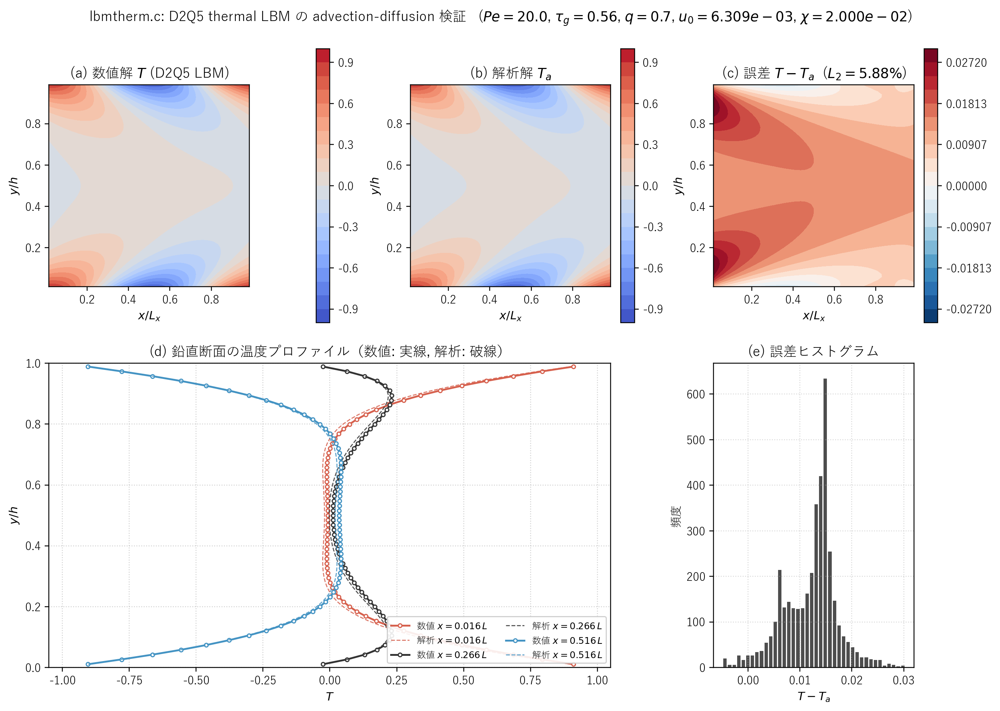

# lbmtherm.c 説明ドキュメント

## 概要

[src/sec3/lbmtherm.c](../../src/sec3/lbmtherm.c) は、一様水平速度 $u_0$ で流れる 2 次元チャネル内の温度場（advection-diffusion 場）を D2Q5 熱格子ボルツマン法で解き、複素指数モードの解析解と比較するベンチマーク用コードです。壁面は上下に配置し、壁面位置が格子点から半セル分以下にオフセットされる場合（サブグリッド壁）にも対応できるよう、補間型の半過程 bounce-back を実装しています。

この文書では、次の点を順に説明します。

- 対象の advection-diffusion 方程式と解析解の構成
- D2Q5 モデルと平衡分布
- サブグリッド壁オフセット $q$ と補間 bounce-back（Dirichlet / Neumann）
- 数値解と解析解の比較結果

## 解析モデル

無限に長いチャネル（$x$ 方向に周期、$y$ 方向に上下壁）で、定常 advection-diffusion 方程式

$$
u_0\,\frac{\partial T}{\partial x}
= \chi \left(\frac{\partial^2 T}{\partial x^2} + \frac{\partial^2 T}{\partial y^2}\right)
$$

を考えます。境界条件は、Dirichlet 型では上下壁で温度を波数 $k = 2\pi/L_x$ の余弦波

$$
T(x, 0) = T(x, h) = \cos(k x)
$$

に固定します。Neumann 型では同様の正弦変調を持つ温度勾配を与えます。代表 Peclet 数は

$$
Pe = \frac{u_0\,h}{\chi}
$$

で、コード中の既定値は

$$
Pe = 20.0,\qquad q = 0.7,\qquad \tau_g = 0.56,\qquad k = \frac{2\pi}{n_x}
$$

です。ここで $\chi = (\tau_g - 0.5)/3 = 0.02$、$h = n_y - 2 + 2q$ がチャネル幅、$u_0 = Pe\,\chi/h$ で代表速度が決まります。

## 解析解

解を $T(x, y) = \mathrm{Re}\!\left[e^{i k x}\,f(y)\right]$ と分離変数すると、$f(y)$ の常微分方程式は

$$
f''(y) - \beta^2 f(y) = 0,\qquad
\beta = k\,\sqrt{1 + i\,\dfrac{u_0}{\chi\,k}}
$$

となり、$\beta$ は複素波数です。Dirichlet 境界 $f(0) = f(h) = 1$ の下で

$$
f(y) = \frac{\sinh(\beta\,y) + \sinh\!\bigl(\beta\,(h - y)\bigr)}{\sinh(\beta\,h)}
$$

が解析解です。Neumann 境界（壁面で温度勾配指定）の場合も対応する関数形が得られ、コード中の `complex_exp`, `complex_div`, `complex_sqrt_value` などのヘルパで計算しています。本コードは C で書かれているため、自前の複素数構造体 `complex_double` を定義しています。

## 格子モデル（D2Q5）

離散速度は

$$
\mathbf{c}_0 = (0,0),\quad
\mathbf{c}_1 = (1,0),\quad
\mathbf{c}_2 = (0,1),\quad
\mathbf{c}_3 = (-1,0),\quad
\mathbf{c}_4 = (0,-1)
$$

で、重みは $w_0 = 1/3,\ w_{1\sim4} = 1/6$ です。平衡分布関数は

$$
g_0^{\mathrm{eq}} = \frac{T}{3},\qquad
g_k^{\mathrm{eq}} = \frac{T}{6}\,(1 + 3\,\mathbf{c}_k\cdot\mathbf{u}),\quad k = 1,\dots,4
$$

で、ここで $\mathbf{u} = (u_0, 0)$ は与えられた一様水平速度です。lbmnc.c との違いは、速度場を解かず、$\mathbf{u}$ を外部から与えている点です。BGK 衝突は

$$
g_k^* = g_k - \frac{g_k - g_k^{\mathrm{eq}}}{\tau_g}
$$

で、streaming は周期境界条件付きで実装されています。

## サブグリッド壁と補間 bounce-back

壁面が格子点上ではなく、最近接の流体格子から距離 $q$（$0 \le q \le 1$）だけ外側にあると考えます。$q = 0.5$ がいわゆる半過程 bounce-back に対応し、$q \neq 0.5$ の場合には壁面値を 2 次精度で再現するために 3 セル分の補間を行います。

Dirichlet 境界（$T_{\mathrm{wall}} = \cos(k x)$）に対する補間式は、コード中で

$$
g_2(i, 1) =
2(q - 1)\,g_4(i, 0)
- \frac{(2q - 1)^2}{2q + 1}\,g_4(i, 1)
+ \frac{2(2q - 1)}{2q + 1}\,g_2(i, 2)
+ \frac{3 - 2q}{2q + 1}\,\frac{\cos(k x_i)}{3}
$$

の形（および対称な上壁の式）で実装されています。最後の項 $\cos(k x_i)/3$ の係数 $1/3$ は、Dirichlet 反射

$$
g_k^{\mathrm{in}} = -g_{\bar k}^{\mathrm{out}} + 2\,w_k\,T_{\mathrm{wall}}
$$

における $2 w_2 = 1/3$ から来ています。Neumann 境界の場合は係数が変わり、最後の項が $2\cos(k x_i)/(h(2q+1))\cdot\chi$ になります。

## 時間発展

毎ステップ次の処理を行います。

1. 平衡分布の計算（$g_k^{\mathrm{eq}}$）。
2. BGK 衝突。
3. Streaming（$x$ 方向は周期、$y$ 方向は壁面）。
4. 上下壁に補間 bounce-back 境界条件を適用。
5. 温度の再構成 $T = \sum_{k=0}^{4} g_k$。
6. 前ステップとの差 $\mathrm{Norm} = \max_{i,j} |T - T_{\text{prev}}|$ を記録。

外側ループ 100 回 × 内側ループ 500 回 = 50000 ステップで反復します。

## 誤差評価

定常状態に到達した後、内部格子点 $i = 1\dots n_x-1,\ j = 1\dots n_y-1$ で相対 L2 誤差

$$
\varepsilon_{L_2} =
\sqrt{\frac{\sum_{i,j}(T_{i,j} - T^{a}_{i,j})^2}{\sum_{i,j}(T^{a}_{i,j})^2}}
$$

を計算し、コンソールに `Error = ...` として出力します。さらに ASCII 図で数値解と解析解を 10 段階階調表示し、左右に並べて比較できるようにしています。

## 解析結果

既定条件 $Pe = 20, \tau_g = 0.56, q = 0.7, n_x = n_y = 64$、Dirichlet 境界で実行した結果を次の図にまとめます。

```powershell
cmd /c scripts\run_one.cmd src\sec3\lbmtherm.c
d:/work/LBMcode/.venv/Scripts/python.exe scripts/plot_lbmtherm_results.py
```



図 3.4　lbmtherm.c による advection-diffusion 検証結果。(a) D2Q5 LBM の数値解 $T$、(b) 解析解 $T_a$、(c) 差分 $T - T_a$（相対 $L_2$ 誤差は 5.88 %）。下段 (d) $x = 0.016\,L,\ 0.266\,L,\ 0.516\,L$ の鉛直断面プロファイル（実線が数値解、破線が解析解）、(e) 内部点での誤差分布のヒストグラム。誤差は壁近傍に集中しており、これは $q = 0.7$ のサブグリッド壁オフセットを補間 bounce-back で扱う際の二次精度の打ち切り誤差に対応する。

### 数値指標

| 量 | 値 |
| --- | ---: |
| Grid | 64 × 64 |
| Time | 50000 |
| $Pe$ | 20.0 |
| $\tau_g$ | 0.56 |
| $q$ | 0.7 |
| 相対 $L_2$ 誤差 | $5.88\times 10^{-2}$ |
| $L_\infty$ 誤差 | $3.02\times 10^{-2}$ |

数値解と解析解の対応はコンソール出力でも確認でき、例えば $i = n_x/2$ で

```
eb[2] = -7.6924e-01 (-7.6870e-01),  et[1] = -9.0255e-01 (-9.0096e-01)
eb[2] = -9.0255e-01 (-9.0096e-01),  eb[1] = -7.6924e-01 (-7.6870e-01)
  (Numerical)             (Analytical)
```

のように、壁近傍 1, 2 セルでの値が小数点以下 3 桁まで解析解と一致しています。

### 出力ファイル

[src/sec3/lbmtherm.c](../../src/sec3/lbmtherm.c) は内部格子点の温度 $T_{i,j}$ を [outputs/sec3/lbmtherm/datae](../../outputs/sec3/lbmtherm) に保存します。1 行が固定 $j$、各行に $i = 1, 2, \ldots, n_x-1$ の値が並ぶ形式で、計 $(n_y-1)\times(n_x-1) = 63\times 63$ の数値が書かれます。

## このコードの見どころ

- D2Q5 thermal LBM の最小構成（速度場を別途解かない）に絞ったベンチマーク。lbmnc.c と組み合わせて読むと、両者の役割分担が見えやすい。
- 解析解を内部で計算しているため、複素演算を自前の `complex_double` 構造体で実装している。教科書的な複素数演算の C 実装としても参考になる。
- サブグリッド壁を 2 次精度で扱う interpolated bounce-back の係数 $(2q-1)/(2q+1)$ などが、コード上に直接書かれているため、係数の意味と導出に立ち入った勉強がしやすい。
- 数値解と解析解を同じグリッド上で並べてアスキー出力するため、コンパイル直後の挙動チェックが容易。
