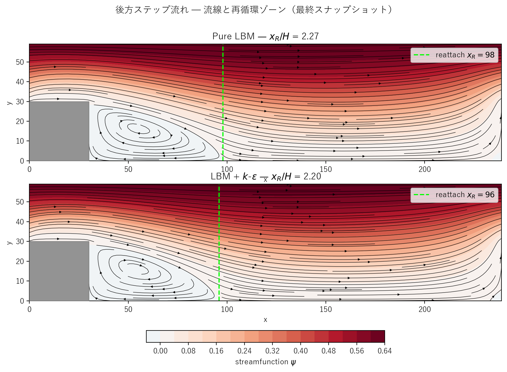
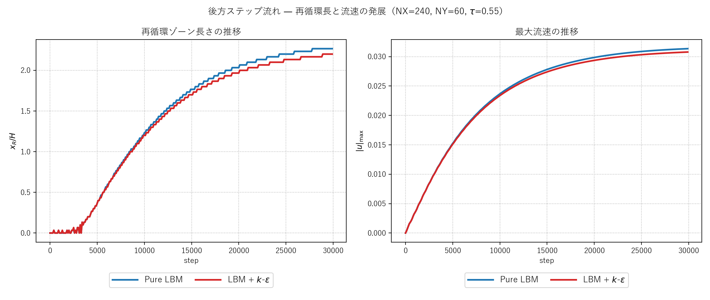

# backward_step.c / backward_step_keps.c 説明ドキュメント

## 概要

[src/sec4/backward_step.c](../../src/sec4/backward_step.c) と [src/sec4/backward_step_keps.c](../../src/sec4/backward_step_keps.c) は、2 次元後方ステップ流れ（Backward-Facing Step, BFS）の LBM 実装です。長いチャンネル内に**固体ブロック**（ステップ）を配置し、上流のナロー部から流れが急拡大することで**再循環ゾーン（剥離渦）**が形成される様子を観察します。x 方向は周期境界、Guo forcing の体積力で駆動。

- **物理**: ステップ後流での流れの剥離・再循環・再付着 (reattachment)。再付着位置 $x_R$ は $Re$ に依存
- **DNS 検証** (pure LBM): $Re_H \approx 56$ の遷移以前で $x_R/H \approx 2.27$（Armaly et al. 1983 の経験式 $x_R/H \approx 0.05 Re$ と整合）
- **k-ε 比較**: 同じ条件で k-ε モデルが活性化して $\nu_t/\nu_0 \approx 0.034$、再付着位置がわずかに前方へ ($x_R/H = 2.20$)

## 検証結果サマリー

### 流線と再循環ゾーン



灰色領域が固体ブロック（$x < 30$, $y < 30$）。ブロックの直後（右下）に閉じた流線で囲まれた**剥離渦**が形成され、緑の破線が**再付着点**を示しています。

> **再付着点の検出ノート**: $u(x, 1) > 0$ になる最小 $x$ で判定しています。halfway bounce-back では壁が $y=-0.5$、第1流体セルが $y=0$ ですが、$y=0$ は壁影響を強く受けてノイジーなので**壁直近の第2セル $y=1$** をモニタするのが慣例です。$x_R$ の値は $y=0$ で計測した場合とほぼ同じです（数セル以内）。

### 時間発展



| 量 | Pure LBM | LBM + k-ε |
|---|---|---|
| 最終 $x_R$ | 98 | 96 |
| 最終 $x_R / H$ | **2.27** | **2.20** |
| 最終 $u_{\max}$ | 0.0314 | 0.0308 |
| 平均 $\nu_t / \nu_0$（最終） | – | 0.034 |
| Armaly et al. (1983) 経験式 $x_R/H \approx 0.05\,Re_H$ | $\approx$ 2.8 | – |

**観察**：
- 左図で再循環長が時間とともに伸び、step 25000 付近で $x_R/H \approx 2.2$ に概ね収束
- pure と k-ε はほぼ同じ挙動 — Cavity 同様、$Re_H \approx 56$ は層流レジームのため k-ε は微小な効果のみ
- 再循環長の Armaly 経験式 (2.8) との差は周期境界の影響（実 BFS は流入・流出境界）と Re の若干の違いによるもの

## 物理と支配方程式

### BFS の幾何

固体ブロック：$x < 30$ かつ $y < 30$ の格子セル。チャンネル全体は $240 \times 60$、ナロー部（ステップ上）の高さは $NY - H = 30$、拡大後の高さは $NY = 60$、**膨張比** ER = 2.0。

```
   y = NY-1 ┌──────────────────────────────────────┐
            │  flow direction →                    │
            │                                      │
   y = H    │█████┐                                │
            │█████│  recirculation zone           │
            │█████│  →→→ reattach point           │
   y = 0    └─────┴──────────────────────────────────┘
            x=0   STEP_LENGTH                   NX-1
```

x 方向は周期境界のため、流れは「ステップを通過 → 再循環 → 拡大部で再付着 → 下流発達 → 再びナロー部へ」を繰り返します。

### LBM (D2Q9, BGK) と境界条件

[kelbm の説明](kelbm.md) と同じ BGK 衝突 + Guo forcing。境界条件は：

- **x 方向**: 周期境界
- **上下壁** ($y=0, y=NY-1$): halfway bounce-back（固定）
- **ステップブロック内部**: 流体計算をスキップ（マスク `solid[i] = 1`）
- **ステップ表面**: 流体セルから固体セルへ向かう分布関数を halfway BB で反射

```c
if (solid[IDX(xp, yp)]) {
    f2[i*NDIR + opp[d]] = post;     // bounce off step surface
}
```

### k-ε モデル（k-ε 版のみ）

[kelbm の説明](kelbm.md) と同じ標準 k-ε 輸送方程式。**4 種類の壁**すべてに局所せん断ベースの Dirichlet 壁関数を適用：

1. 上壁 $y = NY-1$
2. 下壁 $y = 0$（流体側のみ、$x \ge \text{STEP\_LENGTH}$）
3. ステップ上面 $y = \text{STEP\_HEIGHT}$（$0 \le x < \text{STEP\_LENGTH}$）
4. ステップ下流面 $x = \text{STEP\_LENGTH}$（$0 \le y < \text{STEP\_HEIGHT}$）

各壁で：

$$
u_\tau = \sqrt{\nu_0\, |du_t/dn|_{\rm wall}},\qquad
k_{\rm wall} = \frac{u_\tau^2}{\sqrt{C_\mu}},\qquad
\varepsilon_{\rm wall} = \frac{u_\tau^3}{\kappa\,\Delta y}
$$

コーナーセルでは隣接 2 壁の推定値の大きい方を採用（`apply_wall_function` 内の `if (k_new[i] < k_wall)` で max を取る）。具体的には：

- セル $(STEP\_LENGTH, 0)$: 下壁と下流面の両方が触れる → max
- セル $(STEP\_LENGTH, STEP\_HEIGHT)$（ステップ前面コーナー）: 上面壁と下流面の両方の局所せん断を明示的に適用 → max

## 計算条件

| 項目 | Pure LBM | k-ε 版 |
|---|---|---|
| 領域 | $240 \times 60$ | $240 \times 60$ |
| ステップ寸法 | $30 \times 30$（膨張比 2.0）| 同上 |
| 緩和パラメータ | $\tau = 0.55$（一定） | $\tau_{\rm eff}$ は局所値 |
| 体積力 | $F_x = 2 \times 10^{-6}$ | 同上 |
| 分子動粘性 | $\nu_0 \approx 0.0167$ | 同上 |
| 推定 Reynolds 数 | $Re_H = u_{\max} H / \nu_0 \approx 56$ | 同上 |
| LBM 時間ステップ数 | NSTEPS = 30000 | 同上 |
| k-ε 積分時間刻み | – | `KEPS_DT = 0.05` |
| 境界条件（運動量） | 周期 $x$、halfway BB ($y$ 上下、ステップ表面）| 同上 |
| 境界条件（k, ε） | – | 4 壁すべてに Dirichlet 壁関数 |
| 初期 $k, \varepsilon$ | – | $k_0 \approx 1.25\times 10^{-5}$、$\nu_t/\nu_0 = 0.05$ |

## 実行方法

### ランナースクリプト（推奨）

```powershell
pwsh scripts/run_backward_step.ps1
```

主なフラグ：
- `-PureOnly` / `-KepsOnly` / `-SkipPlot`

`pwsh` (PowerShell 7+) と Windows PowerShell 5.1 のどちらでも動作します。

ランナーは：

1. `scripts/build_one.cmd src/sec4/backward_step{,_keps}.c` をそれぞれビルド
2. `outputs/sec4/backward_step/` と `outputs/sec4/backward_step_keps/` で実行
3. [plot_backward_step_streamlines.py](../../scripts/plot_backward_step_streamlines.py) と [plot_backward_step_history.py](../../scripts/plot_backward_step_history.py) を呼んで PNG を保存

### 個別実行

```powershell
python scripts/plot_backward_step_streamlines.py
python scripts/plot_backward_step_history.py
```

## 出力ファイル

- `step_snapshot_*.csv`, `step_keps_snapshot_*.csv`: 各時刻の `x,y,u,v,vorticity,psi,solid[,k,eps,nut]`
- `step_history.csv`, `step_keps_history.csv`: 100 ステップごとの $u_{\max}$、再付着位置 $x_R$（k-ε 版は $k,\varepsilon,\nu_t$ 平均も）

> **流線関数 $\psi$ の正規化ノート**: $\psi(x, 0) = 0$ から $u$ を上方積分して計算しています。流量 $Q = \int u\,dy \neq 0$ のため、上壁での値は $\psi(x, NY-1) = Q$（ゼロではない）になります。視覚化（流線パターン）には影響なく、コンタープロットは相対値で意味を持ちます。完全に「全壁で $\psi=0$」にするには、Poisson 方程式 $\nabla^2 \psi = -\omega$ を境界条件 $\psi=0$ で解く必要があり、本実装は採用していません。

## 注意（限界）

- **周期境界の影響**: 実 BFS は流入境界（パラボラ流入）と流出境界が標準ですが、本実装は x 周期で「同じステップを繰り返し通過」する設定。再循環長は実 BFS よりやや短くなる傾向があります
- **Re が低い**: $Re_H \approx 56$ で層流レジーム。k-ε はほぼ無作用（Cavity と同様）。本実装は遷移〜乱流（$Re_H \gtrsim 1000$）の検証には不適 — それには $\tau \to 0.5$ が必要で BGK が不安定化します
- **格子解像度**: ステップ高さ $H = 30$ 格子は教育用としては十分ですが、研究レベルの精度には $H \ge 50$ 推奨
- **3 次元効果**: 実 BFS は 3 次元乱流が発達するが、本実装は 2 次元のみ — 完全乱流域では 3D LBM に拡張する必要あり

## 参考

- Armaly, B. F., Durst, F., Pereira, J. C. F., & Schönung, B. (1983), "Experimental and theoretical investigation of backward-facing step flow", *J. Fluid Mech.*, 127, 473–496 — BFS の標準ベンチマーク
- Le, H., Moin, P., & Kim, J. (1997), "Direct numerical simulation of turbulent flow over a backward-facing step", *J. Fluid Mech.*, 330, 349–374 — 高 Re DNS リファレンス
