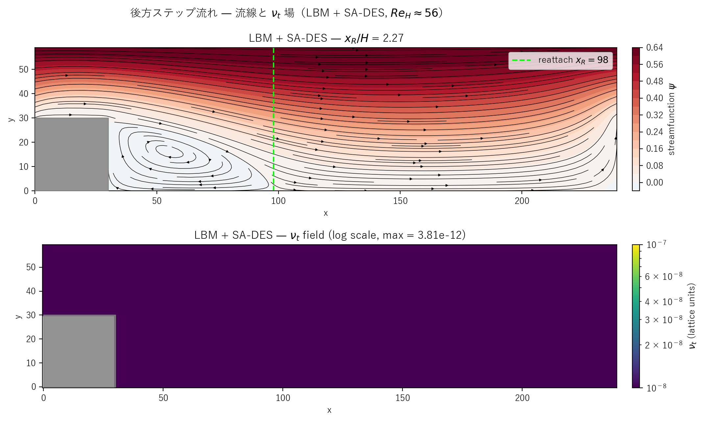
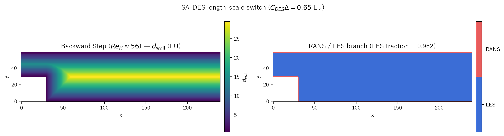

# backward_step_des.c 説明ドキュメント

## 概要

[src/sec4/backward_step_des.c](../../src/sec4/backward_step_des.c) は、[backward_step.c](backward_step.md) と同じチャンネル + ステップ ジオメトリ（$STEP_L = STEP_H = 30$）・体積力・周期 x 境界に **Spalart-Allmaras DES97** を結合した実装です。length-scale switch

$$
\tilde d = \min(d_{\rm wall},\,C_{DES}\,\Delta),\quad C_{DES} = 0.65,\ \Delta = 1 \text{ LU}
$$

で壁近傍 RANS / バルク LES のハイブリッド作動を行います。$Re_H \approx 56$ の層流剥離流域で、SA-DES は $f_{v1}$ cutoff により完全に「眠った」状態を保ち、再付着長 $x_R/H$ が **pure LBM と一致**します。本シリーズの DES 3 ケース（cavity, karman, step）すべてで同じ「DES sleeps」結論が得られました。

## 検証結果サマリー

### 流線と $\nu_t$ 場



上：流線関数 $\psi$ と剥離 → 再付着の再循環泡（reattach x = 98、$x_R/H = 2.27$）。下：$\nu_t$ 場（log scale）。最大 $3.8\times 10^{-12}$ — 完全に sleeping。

### 抑制効果

| 量 | Pure LBM | k-ε | LES | **DES** |
|---|---|---|---|---|
| 再付着長 $x_R/H$（最終）| 2.267 | 2.200 | 2.267 | 2.267 |
| pure 比 | 1.000 | 0.971 | 1.000 | **1.000** |
| 平均 $\nu_t/\nu_0$（履歴）| – | $\sim 0.034$ | $\sim 10^{-3}$ | $\sim 10^{-10}$ |
| 平均 $\tilde\nu/\nu_0$（最終）| – | – | – | $\sim 1.0\times 10^{-2}$ |
| LES branch fraction | – | – | – | 0.962 |

DES は pure LBM と $x_R/H$ が完全一致（小数 3 桁まで）。LES もこの $Re_H$ では実質無作用（pure 比 1.000）で、k-ε のみが 3% 短縮します。

### 物理的解釈

$Re_H = 56$ の BFS は**完全層流の剥離流**で、再付着泡は時間的に静止します。Armaly et al. (1983) の実験では $Re_H \lesssim 400$ で 2D 層流、$400 \lesssim Re_H \lesssim 1200$ で 3D 過渡、$Re_H > 1200$ で完全 3D 乱流という整理です。本ケースは最も穏やかな**層流域**に属し、SGS モデル / RANS モデルの活躍場所ではありません。

DES の length-scale switch は機能しており、剥離せん断層・コーナー渦・再付着付近を含む全 fluid 領域の 96.2% が LES branch で作動。それでも SA は $\chi \sim 0.01$ までしか上がらず、$\nu_t$ は $f_{v1}$ cutoff で $\sim 10^{-10}$ に抑え込まれます。

| モデル | 設計思想 | BFS での挙動 |
|---|---|---|
| Pure LBM | DNS（2D 範囲内）| 層流再付着泡を正確に再現 |
| k-ε | 時間平均流向け RANS（壁関数）| 壁関数注入で軽い散逸付与 |
| LES (Smagorinsky)| 瞬時応答型 SGS | せん断層で $\nu_t$ 出るが影響無視可 |
| **SA-DES** | 1 方程式 + $f_{v1}$ cutoff | **pure LBM と区別不能**な layered sleep |

## RANS / LES region map



左：$d_{\rm wall}$ 場（LU）。上下壁・ステップ天面・ステップ右面のそれぞれから最短距離。ステップ convex corner $(STEP_L-0.5, STEP_H-0.5)$ は Euclidean 距離で扱っています。

右：RANS/LES マップ。赤い 1 セル幅のリボンが壁・ステップ表面に沿って走り、それ以外（96.2%）が LES branch。剥離せん断層・再付着点・コーナー渦は全て LES 領域。length-scale switch の幾何は本ケースで明確に可視化されています。

## SA-DES モデル実装

`update_sa_des()`（[backward_step_des.c#L162-L234](../../src/sec4/backward_step_des.c#L162-L234)）は cavity_des / karman_des と同じ SA 輸送 + DES 切替を使用。本ケース固有の点：

- **周期 x**: `(x+1+NX)%NX` / `(x-1+NX)%NX` で SA の対流項・拡散項を計算
- **L 字 fluid 領域**: ステップ右上角を超える領域（$x \geq STEP_L \wedge y \geq STEP_H$）では convex corner の Euclidean 距離が $d_{\rm wall}$ を決める
- **mirror BC**: solid 隣接セルでは `if (solid[ixp]) ixp = i;` で勾配にミラー反射

壁距離の解析式（[backward_step_des.c#L72-L98](../../src/sec4/backward_step_des.c#L72-L98)）:

```
d_top = NY - y - 0.5
d_bot = y + 0.5
if x < STEP_L:   d_step = y - STEP_H + 0.5             (above step top)
elif y < STEP_H: d_step = x - STEP_L + 0.5             (right of step)
else:            d_step = sqrt(dx^2 + dy^2)            (past corner)
d_wall = min(d_top, d_bot, d_step)
```

## 計算条件

| 項目 | 値 |
|---|---|
| 領域 | $240 \times 60$ |
| ステップ寸法 | $30 \times 30$ LU |
| 緩和時間 | $\tau = 0.55$ |
| 体積力 | $F_x = 2\times 10^{-6}$ |
| 分子動粘性 | $\nu_0 \approx 0.0167$ |
| $u_{\max}$（最終） | 0.0314 |
| $Re_H = u_{\max} H/\nu_0$ | 56 |
| SA 定数 | 標準（$c_{b1}=0.1355$, $c_{b2}=0.622$, $\sigma=2/3$, $\kappa=0.41$, $c_{v1}=7.1$）|
| $C_{DES}$ | 0.65 |
| $\Delta_{LES}$ | 1 LU |
| SA 時間ステップ | $dt = 0.05$ |
| $\tilde\nu$ 初期値 | $3\,\nu_0$（標準 SA 自由流値）|
| $\tilde\nu$ 壁 BC | mirror（destruction 項で自然抑制）|
| 時間ステップ数 | NSTEPS = 30000 |
| 履歴間隔 | 100 ステップ |
| スナップショット | step = 0, 2683, 7589, 13942, 21466, 30000 |

## 実行方法

```powershell
# DES 版のみ
.\scripts\run_backward_step.ps1 -DesOnly

# 全 variant（pure, k-ε, LES, DES）
.\scripts\run_backward_step.ps1
```

出力先：`outputs/sec4/backward_step_des/`

## 出力ファイル

- `step_des_snapshot_*.csv`: `x,y,u,v,vorticity,psi,solid,nut,nu_tilde,d_wall,d_tilde`
- `step_des_history.csv`: 100 ステップごとに `step,u_max,reattach_x,nut_mean,nu_tilde_mean,les_frac`

## 参考

- Spalart & Allmaras (1992), AIAA Paper 92-0439
- Spalart, Jou, Strelets & Allmaras (1997), DES97 原典, *Advances in DNS/LES*
- Armaly, Durst, Pereira & Schönung (1983), "Experimental and theoretical investigation of backward-facing step flow", *J. Fluid Mech.*
- [backward_step.md](backward_step.md): pure / k-ε 版の詳細
- [backward_step_les.md](backward_step_les.md): Smagorinsky LES 版（実質無作用）
- [cavity_des.md](cavity_des.md), [karman_des.md](karman_des.md): 姉妹 DES ケース
- [les_summary.md](les_summary.md), [keps_summary.md](keps_summary.md): クロスケース比較
