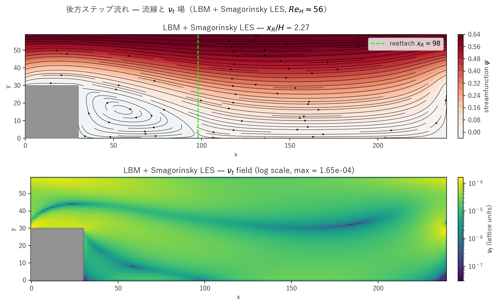

# backward_step_les.c 説明ドキュメント

## 概要

[src/sec4/backward_step_les.c](../../src/sec4/backward_step_les.c) は、[backward_step.c](backward_step.md) と同じチャンネル＋ステップジオメトリ（`STEP_LENGTH=30, STEP_HEIGHT=30`、x 周期、上下壁 halfway BB、`solid[]` マスク）に標準 **Smagorinsky LES** を結合した実装です。$Re_H \approx 56$ の層流ステップ後流では k-ε / pure / LES のいずれも再付着長 $x_R/H \approx 2.2$ をほぼ同値で予測し、本質的に層流である本ケースで LES が**不要なほど眠った**ままで一致する様子を確認できます。

$$
\nu_t = (C_s\,\Delta)^2 \sqrt{2 S_{ij}S_{ij}},\quad C_s = 0.16,\ \Delta = 1 \text{ LU}
$$

$\tau_{\rm eff} = 1/2 + 3(\nu_0 + \nu_t)$ で BGK 衝突に取り込み。solid セルの隣では勾配計算でミラー（ゼロ勾配）反射。

## 検証結果サマリー

### 流線と $\nu_t$ 場



上：流線関数とステップ後流の再循環ゾーン。緑破線が再付着位置 $x_R$。下：$\nu_t$ 場（log scale）。**再循環ゾーンを囲うせん断層に沿って $\nu_t$ が局所的に立ち上がる**様子が明確で、これは Smagorinsky が「歪み速度の大きい領域」を選択的に検出するという物理的に正しい挙動を示しています。それ以外の領域（再循環セル内部、フリー流れ部）では $\nu_t$ がほぼゼロ。

### 主要量

| 量 | Pure LBM | k-ε | **LES** |
|---|---|---|---|
| 再付着長 $x_R/H$（最終） | 2.27 | 2.20 | 2.27 |
| pure 比 | 1.000 | 0.971 | **1.000** |
| 平均 $\nu_t/\nu_0$（履歴） | – | $\sim 0.034$ | $9.5\times 10^{-4}$ |
| $\nu_t/\nu_0$（最終） | – | – | $1.3\times 10^{-3}$ |

LES の $\nu_t/\nu_0 \approx 0.001$ は k-ε の 0.034 の 1 桁以上下。再付着長は pure LBM と区別できないレベルで一致します。

### 物理的解釈

$Re_H \approx 56$ は BFS の **層流再循環**域で、Armaly 実験で $Re_H \lesssim 400$ は完全に 2D 層流。本ケースでは：

- ステップ後流に発達する**せん断層**で $\|S\|$ が局所的に立ち上がり、ここで $\nu_t$ がわずかに増加
- それ以外（cavity-like な再循環セル内部、フリー流れ域）では $\|S\| \approx 0$ で $\nu_t \approx 0$
- 全体平均で $\nu_t/\nu_0 \approx 0.001$ と微小

k-ε の壁関数による $k$ 注入は流れ場全域に拡散され $\nu_t/\nu_0 = 0.034$ になりますが、これは**注入された散逸**であり LES のような**局所応答型**ではありません。LES が「ステップ後流以外でほぼ無作用」となるのが物理的に妥当な挙動です。

## Smagorinsky モデル実装

`update_les()`（[backward_step_les.c#L106-L132](../../src/sec4/backward_step_les.c#L106-L132)）の手順：

1. 周期境界（x）と壁/solid（y、step）でミラー処理した近傍インデックス
2. 速度勾配を 2 次中心差分（solid 隣接はミラー反射）
3. $\|S\| = \sqrt{2 S_{ij}S_{ij}}$
4. $\nu_t = C_s^2 \|S\|$ を `nut_field[i]` に格納
5. solid セルは $\nu_t = 0$

k-ε 版の壁関数（上壁、下壁、ステップ上面、ステップ下流面、ステップ前縁の corner cell 計 5 領域）と $k$, $\varepsilon$ シード／ $k_{\rm new}, \varepsilon_{\rm new}$ バッファが**すべて不要**。コード行数 29% 減。

## 計算条件

| 項目 | 値 |
|---|---|
| 領域 | $240 \times 60$ |
| ステップ | $30 \times 30$ |
| 緩和時間（基準） | $\tau = 0.55$ |
| 体積力 | $F_x = 2\times 10^{-6}$ |
| Smagorinsky 定数 | $C_s = 0.16$ |
| 分子動粘性 | $\nu_0 \approx 0.0167$ |
| $u_{\max}$（最終） | 0.0313 |
| $Re_H = u_{\max} H/\nu_0$ | 56 |
| 境界条件 | x: 周期、y: halfway BB、step: solid マスク |
| 時間ステップ数 | NSTEPS = 30000 |
| スナップショット | step = 0, 2683, 7589, 13942, 21466, 30000 |

## 実行方法

```powershell
# LES 版のみ
.\scripts\run_backward_step.ps1 -LesOnly

# 全 variant
.\scripts\run_backward_step.ps1
```

出力先：`outputs/sec4/backward_step_les/`

## 出力ファイル

- `step_les_snapshot_*.csv`: `x,y,u,v,vorticity,psi,solid,nut`
- `step_les_history.csv`: 100 ステップごとに `step,u_max,reattach_x,nut_mean`

`reattach_x` は y=1（ステップ底面の 1 セル上）で $u > 0$ になる最小 x 座標。

## 参考

- Armaly, Durst, Pereira & Schönung (1983), "Experimental and theoretical investigation of backward-facing step flow", *J. Fluid Mech.*
- Smagorinsky (1963), "General circulation experiments with the primitive equations", *Monthly Weather Review*
- [backward_step.md](backward_step.md): pure / k-ε 版の詳細
- [les_summary.md](les_summary.md), [keps_summary.md](keps_summary.md): クロスケース比較
