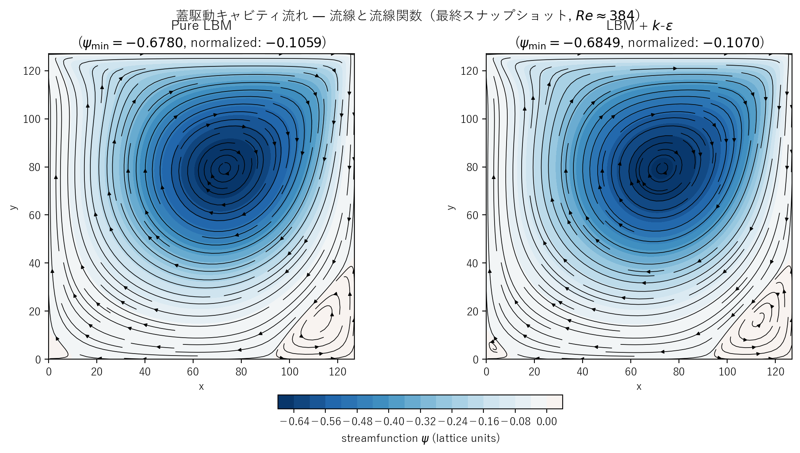
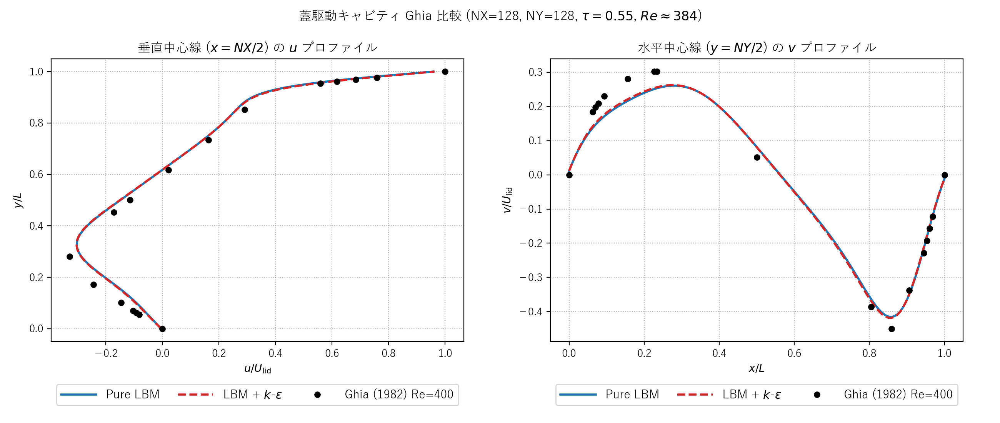

# cavity.c / cavity_keps.c 説明ドキュメント

## 概要

[src/sec4/cavity.c](../../src/sec4/cavity.c) と [src/sec4/cavity_keps.c](../../src/sec4/cavity_keps.c) は、2次元の蓋駆動キャビティ流れ（Lid-Driven Cavity）の LBM 実装です。正方領域の上端壁を一定速度で動かし、内部に**主再循環渦**と**コーナー副渦**を形成します。Ghia, Ghia & Shin (1982) の中心線速度プロファイルとの比較で実装の妥当性を検証できます。

- **物理**: 4 壁で囲まれたキャビティの上端のみが速度 $U_{\rm lid}$ で動く（半すべり境界 = halfway bounce-back）
- **DNS 検証** (pure LBM): $Re \approx 384$ で Ghia (1982) Re=400 ベンチマークと中心線速度がほぼ一致
- **k-ε 比較**: Re=384 は基本的に層流のため、k-ε による修正は微小（1% 以内）— RANS が層流レジームでは大きな効果を持たないことの可視化

## 検証結果サマリー

### 流線関数と渦構造



両ケースとも：
- **主渦**: キャビティ中央やや右下に中心を持つ大きな再循環渦
- **副渦**: 右下コーナーに小さな逆回転の副渦（Re ≥ ~100 で発生する古典的構造）
- **左下コーナー**: さらに小さな三次渦の兆候（より高解像度で観察可能）

| 量 | Pure LBM | LBM + k-ε |
|---|---|---|
| 最大流速 $\|u\|_{\max}$ | 0.0482 | 0.0483 |
| 最大流速 $\|v\|_{\max}$ | 0.0312 | 0.0314 |
| 主渦強度 $\psi_{\min}$ | -0.6779 | -0.6849 |
| 正規化 $\psi/(U_{\rm lid} L)$ | **-0.106** | -0.107 |
| Ghia (1982) Re=400 参照 | -0.114 | – |
| 比 (k-ε / pure) | – | **1.01** |
| 平均 $\nu_t/\nu_0$（最終） | – | 0.039 |

主渦強度の Ghia 参照との 7% 差は、$Re$ がやや低い（384 vs 400）ことと NSTEPS=30000 で完全収束に至っていないこと（緩やかに増加中）が主因です。

### Ghia (1982) ベンチマーク比較



中心線（垂直 $x = NX/2$ の $u(y)$、水平 $y = NY/2$ の $v(x)$）を Ghia, Ghia, Shin (1982) Table I/II の Re=400 データと比較。pure LBM（青実線）と k-ε（赤破線）はほぼ重なり、Ghia 参照点（黒丸）に良く一致しています。

### 観察ポイント

- **k-ε は層流域でほぼ無作用**: $Re=384$ は遷移以前の層流レジームで、$\nu_t/\nu_0 \approx 0.04$ と小さく、流れ場の主構造（主渦・副渦）は pure LBM と同じ。これは「RANS モデルが層流に適用された場合、過剰散逸せず物理的に妥当な振る舞いを示す」良性ケース
- これに対し Kelvin-Helmholtz では同じ k-ε モデルが 21% の振幅減少をもたらしました — 遷移流れには過剰散逸となる、という対比

## 物理と支配方程式

### 蓋駆動キャビティの定式

正方領域 $[0, L] \times [0, L]$ で：
- 上端壁 $y = L$: $u_{\rm wall} = (U_{\rm lid}, 0)$
- 他の3壁: $\mathbf{u}_{\rm wall} = 0$（no-slip）
- 静止状態 $\mathbf{u} \equiv 0$ から駆動

定常状態でレイノルズ数 $Re = U_{\rm lid} L / \nu$ に依存して：
- $Re \lesssim 100$: 主渦 1 つのみ
- $Re \approx 400-1000$: 主渦 + 右下副渦（本実装の状態）
- $Re \gtrsim 5000$: 副渦が複数化、左下にも形成
- $Re \gtrsim 10000$: 完全乱流

### LBM (D2Q9, BGK) と境界条件

[kelbm の説明](kelbm.md) と同じ BGK 衝突。境界条件は：

#### 固定壁（下・左・右）
標準 halfway bounce-back: 流体セルから壁へ向かう分布関数 $f^{\rm post}_d$ を反対方向に反射 $f^{\rm post}_d \to f^{\rm post}_{\bar d}$（同じセルに残る）。

#### 動く壁（上端、Ladd 補正付き halfway bounce-back）
動壁では壁速度 $\mathbf{u}_{\rm wall}$ による運動量補正を加えた反射：

$$
f^{\rm post}_{\bar d} = f^{\rm post}_d - \frac{2 w_d \rho \,(\mathbf{c}_d \cdot \mathbf{u}_{\rm wall})}{c_s^2}
= f^{\rm post}_d - 6 w_d \rho \,c_{d,x} U_{\rm lid}
$$

（$c_s^2 = 1/3$、$\mathbf{u}_{\rm wall} = (U_{\rm lid}, 0)$）

これにより上端壁を通過する momentum が流体に渡され、駆動力となります。

### k-ε モデル（k-ε 版のみ）

[kelbm の説明](kelbm.md) と同じ標準 k-ε 輸送方程式。**4 壁すべてに局所壁関数を Dirichlet で適用**：

$$
k_{\rm wall} = \frac{u_\tau^2}{\sqrt{C_\mu}},\qquad
\varepsilon_{\rm wall} = \frac{u_\tau^3}{\kappa\,\Delta y}
$$

$u_\tau$ は各壁の局所せん断から推定：

$$
u_\tau = \sqrt{\nu_0 \cdot |du_t/dn|_{\rm wall}}
$$

ここで $u_t$ は壁接線方向速度、$dn$ は壁法線方向距離。上端壁では $|du_t/dn| \approx |U_{\rm lid} - u(y=NY-1)| / 0.5$、他壁では $|u_t(\text{first cell})| / 0.5$。

コーナー（2 壁の合流点）では両壁の推定値の大きい方を採用。

## 計算条件

| 項目 | Pure LBM | k-ε 版 |
|---|---|---|
| 領域 | $128 \times 128$ | $128 \times 128$ |
| 緩和パラメータ | $\tau = 0.55$（一定） | $\tau_{\rm eff}$ は局所値 |
| 蓋速度 | $U_{\rm lid} = 0.05$ | $U_{\rm lid} = 0.05$ |
| 分子動粘性 | $\nu_0 = 1/60 \approx 0.0167$ | 同上 |
| Reynolds 数 | $Re = U_{\rm lid} L / \nu_0 \approx 384$ | 同上 |
| LBM 時間ステップ数 | NSTEPS = 30000 | 同上 |
| k-ε 積分時間刻み | – | `KEPS_DT = 0.05` |
| 境界条件（運動量） | 4 壁 halfway BB（上は Ladd 動壁補正、他は固定）| 同上 |
| 境界条件（k, ε） | – | 4 壁すべてに Dirichlet 壁関数（局所 $u_\tau$）|
| 初期 $k, \varepsilon$ | – | $k_0 = 5\times 10^{-3} U_{\rm lid}^2$、$\varepsilon_0$ は $\nu_t/\nu_0=0.05$ になるよう設定 |

## 実行方法

### ランナースクリプト（推奨）

```powershell
pwsh scripts/run_cavity.ps1
```

主なフラグ：
- `-PureOnly`: pure LBM 版だけ実行
- `-KepsOnly`: k-ε 版だけ実行
- `-SkipPlot`: プロット生成をスキップ

`pwsh` (PowerShell 7+) と Windows PowerShell 5.1 のどちらでも動作します。

ランナーは内部で次を行います：

1. `scripts/build_one.cmd src/sec4/cavity{,_keps}.c` をそれぞれビルド
2. `outputs/sec4/cavity/` と `outputs/sec4/cavity_keps/` で実行
3. [plot_cavity_streamlines.py](../../scripts/plot_cavity_streamlines.py) と [plot_cavity_centerline.py](../../scripts/plot_cavity_centerline.py) を呼んで PNG を保存

### 個別実行

```powershell
python scripts/plot_cavity_streamlines.py
python scripts/plot_cavity_centerline.py
```

## 出力ファイル

- `cavity_snapshot_*.csv`, `cavity_keps_snapshot_*.csv`: 各時刻の `x,y,u,v,vorticity,psi[,k,eps,nut]`
- `cavity_history.csv`, `cavity_keps_history.csv`: 100 ステップごとの $\|u\|_\max$、$\|v\|_\max$、$\psi_\min$（k-ε 版は $k,\varepsilon,\nu_t$ の平均も）

## 注意（限界）

- **収束**: NSTEPS=30000 で **概ね定常** に達するが、$\psi_\min$ が緩やかに変化中（30000 ステップで -0.678）。完全収束にはさらに長い積分が必要。Ghia 参照値 -0.114 との 7% 差はこの未収束分が支配的
- **Re**: $Re=384$ は Ghia の Re=400 と完全一致しないため、$U_{\rm lid}=0.0521$ に上げれば Re=400 ぴったりになる。本パラメータは Mach 安全マージンを優先
- **k-ε**: 層流レジーム（$Re=384$）では k-ε はほぼ無作用。乱流レジーム ($Re \gtrsim 10000$) で k-ε の意義が出るが、それには $\tau \to 0.5$ が必要で BGK が不安定化する
- **副渦の解像度**: $128\times 128$ で右下副渦は見えるが、左下や上左の三次渦は解像度不足で曖昧。$256\times 256$ 以上の解像度推奨

## 参考

- Ghia, U., Ghia, K. N., & Shin, C. T. (1982), "High-Re solutions for incompressible flow using the Navier-Stokes equations and a multigrid method", *J. Comput. Phys.*, 48(3), 387–411 — 標準ベンチマーク
- Ladd, A. J. C. (1994), "Numerical simulations of particulate suspensions via a discretized Boltzmann equation. Part 1", *J. Fluid Mech.*, 271, 285–309 — 動壁 halfway bounce-back の標準実装
