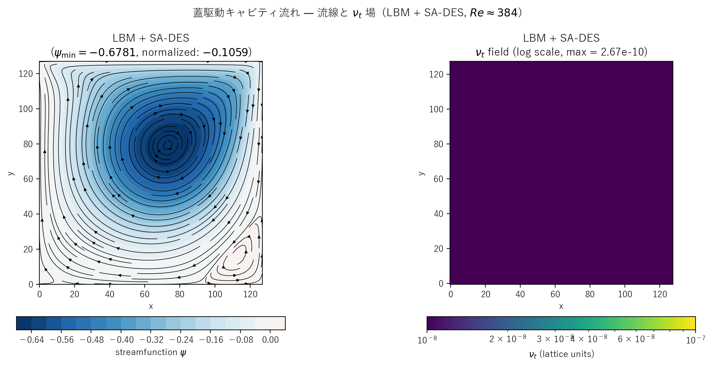

# cavity_des.c 説明ドキュメント

## 概要

[src/sec4/cavity_des.c](../../src/sec4/cavity_des.c) は、[cavity.c](cavity.md) と同じ蓋駆動 cavity ジオメトリ（4 壁 halfway BB、上端 $U_{\rm lid} = 0.05$）に **Spalart-Allmaras DES97** を結合した実装です。SA の壁距離 $d$ を length-scale switch

$$
\tilde d = \min(d,\,C_{DES}\,\Delta),\quad C_{DES} = 0.65,\ \Delta = 1 \text{ LU}
$$

で置換することで、壁近傍では SA-RANS、バルクでは Smagorinsky 相当の LES として作動するハイブリッドモデルになります。

$Re \approx 384$ の層流域では、[cavity_les.md](cavity_les.md) と同様にモデルが「眠った」状態に留まり、Pure / k-ε / LES と結果が一致することを確認します。SA 特有の $f_{v1}$ カットオフのため、DES は LES よりさらに深く眠ります（$\nu_t/\nu_0 \sim 10^{-10}$）。

## SA-DES モデル実装

`update_sa_des()`（[cavity_des.c#L121-L185](../../src/sec4/cavity_des.c#L121-L185)）の手順：

1. 速度勾配と $\|S\| = \sqrt{2 S_{ij} S_{ij}}$
2. SA closure functions: $\chi = \tilde\nu/\nu_0$、$f_{v1} = \chi^3/(\chi^3 + c_{v1}^3)$、$f_{v2} = 1 - \chi/(1+\chi f_{v1})$
3. 修正歪み速度 $\tilde S = \|S\| + (\tilde\nu/(\kappa^2 \tilde d^2))\,f_{v2}$
4. wall function $r = \tilde\nu/(\tilde S\,\kappa^2\,\tilde d^2)$、$g = r + c_{w2}(r^6-r)$、$f_w = g[(1+c_{w3}^6)/(g^6+c_{w3}^6)]^{1/6}$
5. SA 輸送方程式（陽的 Euler、$dt = 0.05$）：

$$
\frac{\partial\tilde\nu}{\partial t} + \mathbf{u}\cdot\nabla\tilde\nu = c_{b1}\tilde S\tilde\nu - c_{w1}f_w\left(\frac{\tilde\nu}{\tilde d}\right)^2 + \frac{1}{\sigma}\bigl[(\nu_0 + \tilde\nu)\nabla^2\tilde\nu + (1+c_{b2})|\nabla\tilde\nu|^2\bigr]
$$

6. $\nu_t = \tilde\nu\,f_{v1}$ を `nut_field[]` に格納
7. BGK 衝突に $\tau_{\rm eff} = 1/2 + 3(\nu_0 + \nu_t)$ で取り込み

SA 定数は標準値（$c_{b1}=0.1355$, $c_{b2}=0.622$, $\sigma = 2/3$, $\kappa=0.41$, $c_{w2}=0.3$, $c_{w3}=2$, $c_{v1}=7.1$、$c_{w1} = c_{b1}/\kappa^2 + (1+c_{b2})/\sigma \approx 3.24$）。対流項は k-ε 版と同じく 1 次風上、拡散項は中心差分です。

### DES length-scale switch

壁距離は halfway BB の規約（壁は cell-face、0.5 LU オフセット）に従い

$$
d(x,y) = \min(x+0.5,\,NX-x-0.5,\,y+0.5,\,NY-y-0.5)
$$

として `initialize()` で 1 度だけ計算。$d < C_{DES}\Delta = 0.65$ の cell（4 壁第 1 セル＝1 行/列ぶん）は RANS 領域、それ以外はすべて LES 領域。本ケースでは LES fraction = **96.9%**（128×128 のうち RANS は外周 1 セル分のみ）。

### 壁での $\tilde\nu$

mirror BC（Neumann zero-gradient）を採用。$\tilde\nu = 0$ Dirichlet は陽に課さず、destruction 項 $c_{w1}f_w(\tilde\nu/\tilde d)^2$ が壁近傍で $1/d^2$ に増大して自然に $\tilde\nu$ を抑制することに任せます。本層流域では $\|S\|$ が小さく production もそもそも小さいため、destruction 優位で十分機能します。

## 検証結果サマリー

### 流線と $\nu_t$ 場



左：流線関数 $\psi$ コンターと流線。主渦 + 右下 corner 渦の構造は cavity_les と全く同じ。右：$\nu_t$ 場（log scale）。最大でも $\sim 10^{-10}$ — LES（最大 $\sim 10^{-3.5}$）より 7 桁小さい。SA の $f_{v1} = \chi^3/(\chi^3 + c_{v1}^3)$ が $\chi \ll c_{v1} = 7.1$ で急速にゼロへ落ちるため、$\tilde\nu$ が小さくなると $\nu_t = \tilde\nu f_{v1}$ は実質ゼロまで沈み込みます。

### 主要量

| 量 | Pure LBM | k-ε | LES | **DES** |
|---|---|---|---|---|
| $\psi_{\min}$（最終ステップ） | −0.6779 | −0.6851 | −0.6795 | −0.6779 |
| pure 比 | 1.000 | 1.011 | 1.002 | **1.000** |
| 平均 $\nu_t/\nu_0$（履歴平均） | – | $\sim 0.04$ | $1.2\times 10^{-3}$ | $\sim 10^{-9}$ |
| $\nu_t/\nu_0$（最終） | – | – | $1.3\times 10^{-3}$ | $1.5\times 10^{-10}$ |
| $\tilde\nu/\nu_0$（最終） | – | – | – | $1.0\times 10^{-2}$ |
| LES branch fraction | – | – | – | 0.969 |

DES は pure LBM と区別がつかない結果（$\psi_{\min}$ の差 $< 0.01\%$）。$\tilde\nu/\nu_0 \approx 0.01$ まで decay しているが、$f_{v1}(\chi=0.01) \sim 10^{-8}$ で $\nu_t$ は実質ゼロ。

### SA 状態量の decay

初期は標準 SA 自由流値 $\chi = 3$（$\tilde\nu/\nu_0 = 3$、$\nu_t/\nu_0 \approx 0.21$）でシード。その後の decay：

| step | $\tilde\nu/\nu_0$ | $\nu_t/\nu_0$ | $\psi_{\min}$ |
|---:|---:|---:|---:|
| 0      | 3.0     | 0.21       | 0       |
| 100    | 0.61    | $4\times 10^{-4}$ | −0.047 |
| 500    | 0.17    | $2\times 10^{-6}$ | −0.105 |
| 1 000  | 0.10    | $3\times 10^{-7}$ | −0.170 |
| 5 000  | 0.033   | $4\times 10^{-9}$ | −0.400 |
| 10 000 | 0.020   | $9\times 10^{-10}$ | −0.532 |
| 30 000 | 0.010   | $1.5\times 10^{-10}$ | −0.678 |

$\chi$ が 3 → 0.6 に落ちた段階（step 100）で既に $f_{v1}$ cliff を抜けて $\nu_t$ が 5 桁低下。以降は SA destruction + diffusion で $\tilde\nu$ がゆっくり減衰しますが、$\nu_t$ への寄与は最初の数百ステップで既にほぼゼロです。

### 物理的解釈

| モデル | $\nu_t/\nu_0$ | $\psi_{\min}$ 抑制 | モデルの「眠さ」 |
|---|---|---|---|
| Pure LBM | 0 | — | 物理ベースライン |
| k-ε | $0.04$ | 1.1% | 壁関数注入で覚醒気味 |
| LES (Smagorinsky) | $0.001$ | 0.2% | 局所応答で控えめ |
| **SA-DES** | $\sim 10^{-10}$ | $\sim 0\%$ | $f_{v1}$ cutoff で深い眠り |

LES と DES の差は **モデル設計の違い**から来ます：

- **Smagorinsky** は $\nu_t = (C_s\Delta)^2 |S|$ の代数モデル。$|S|$ さえ非ゼロなら $\nu_t$ も非ゼロ
- **SA-DES** は輸送方程式で進化する $\tilde\nu$ に $f_{v1}(\chi)$ という「乱流レベル判定」をかけてから $\nu_t$ を出す。$\chi < c_{v1}$（低乱流）では $f_{v1}$ が急減し $\nu_t$ がほぼ消える

層流域では「乱流レベルが低い」という SA の判定が正しく働き、SGS / RANS としての介入を行わない——これが DES の**正しい挙動**です。LES が局所応答で「ほぼ眠る」のに対し、DES は乱流量の輸送 + 判定で「**完全に**眠る」と言える結果になります。

## 計算条件

| 項目 | 値 |
|---|---|
| 領域 | $128 \times 128$ |
| 緩和時間（基準） | $\tau = 0.55$ |
| 蓋速度 | $U_{\rm lid} = 0.05$ |
| 分子動粘性 | $\nu_0 \approx 0.0167$ |
| $Re$ | $U_{\rm lid} \cdot NX / \nu_0 \approx 384$ |
| SA 定数 | 標準（$c_{b1}=0.1355$, $c_{b2}=0.622$, $\sigma=2/3$, $\kappa=0.41$, $c_{v1}=7.1$）|
| $C_{DES}$ | 0.65 |
| $\Delta_{LES}$ | 1 LU |
| SA 時間ステップ | $dt = 0.05$ |
| 境界条件 | 4 壁 halfway BB、上壁 Ladd 動壁補正 |
| $\tilde\nu$ 壁 BC | mirror（destruction 項で自然抑制）|
| $\tilde\nu$ 初期値 | $3\,\nu_0$（標準 SA 自由流値） |
| 時間ステップ数 | NSTEPS = 30000 |
| スナップショット | step = 0, 2683, 7589, 13942, 21466, 30000 |

## 実行方法

```powershell
# DES 版のみ
.\scripts\run_cavity.ps1 -DesOnly

# 全 variant（pure + k-ε + LES + DES）
.\scripts\run_cavity.ps1
```

出力先：`outputs/sec4/cavity_des/`

## 出力ファイル

- `cavity_des_snapshot_*.csv`: `x,y,u,v,vorticity,psi,nut,nu_tilde,d_wall,d_tilde`
- `cavity_des_history.csv`: 100 ステップごとに `step,u_max,v_max,psi_min,nut_mean,nu_tilde_mean,les_frac`

## 物理的限界

- **DES97 の "grey area"**: 壁近傍の RANS 領域から LES 領域への遷移で $\nu_t$ が不連続的に変化するため、境界層がある程度発達した流れでは modeled stress depletion (MSD) を起こす。これは DDES (Delayed DES, Spalart 2006) や IDDES で改善されたが、本実装は元祖 DES97 で MSD は cavity の低 $Re$ では現れない
- **格子依存**: $C_{DES}\Delta$ が「LES branch のフィルタ幅」になるため、$\Delta$ を変えると bulk の $\nu_t$ レベルも変わる。LBM の格子間隔 = 1 LU を採用しているため、$\Delta$ の選択は格子細分化と直結
- **2D 限定**: 真の DES は 3D での乱流構造を解像する前提のため、2D での DES は方法論的検証目的に留まる
- **層流レジームでの非作動**: 本ケースのように $\|S\|$ が小さい流れでは SA が眠り続けるため、DES の利点（壁モデル + LES 解像）は発現しない。DES が映えるのは [karman](karman.md) や [backward_step](backward_step.md) のような剥離渦を伴う高 $Re$ 流れ

## 参考

- Spalart-Allmaras 原典: Spalart & Allmaras (1992) "A one-equation turbulence model for aerodynamic flows", AIAA Paper 92-0439
- DES97: Spalart, Jou, Strelets & Allmaras (1997) "Comments on the feasibility of LES for wings, and on a hybrid RANS/LES approach", *Advances in DNS/LES*
- DDES: Spalart, Deck, Shur, Squires, Strelets & Travin (2006) "A new version of detached-eddy simulation, resistant to ambiguous grid densities", *Theor. Comput. Fluid Dyn.*
- [cavity.md](cavity.md): pure / k-ε 版の詳細
- [cavity_les.md](cavity_les.md): Smagorinsky LES 版の詳細
- [les_summary.md](les_summary.md), [keps_summary.md](keps_summary.md): クロスケース比較
