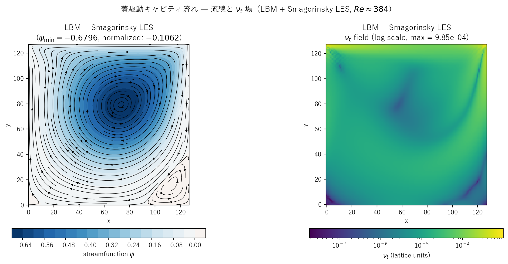

# cavity_les.c 説明ドキュメント

## 概要

[src/sec4/cavity_les.c](../../src/sec4/cavity_les.c) は、[cavity.c](cavity.md) と同じ蓋駆動 cavity ジオメトリ（4 壁 halfway BB、上端 $U_{\rm lid} = 0.05$）に標準 **Smagorinsky LES** を結合した実装です。$Re \approx 384$ の層流域では k-ε 版・pure LBM・LES 版いずれも結果がほぼ一致し、SGS モデルが**ほぼ眠った**状態で動作することを確認できます。

$$
\nu_t = (C_s\,\Delta)^2 \sqrt{2 S_{ij}S_{ij}},\quad C_s = 0.16,\ \Delta = 1 \text{ LU}
$$

$\tau_{\rm eff} = 1/2 + 3(\nu_0 + \nu_t)$ で BGK 衝突に取り込み。van Driest 減衰は導入していないため壁第 1 セルで $\nu_t$ がゼロにならないが、$\|S\|$ 自体が小さい本ケースでは実害なし。

## 検証結果サマリー

### 流線と $\nu_t$ 場



左：流線関数 $\psi$ コンターと流線。主渦が cavity 中心やや右上に位置し、右下に小さな corner 渦が形成されます。右：$\nu_t$ 場（log scale）。壁近傍と corner 渦領域で局所的にやや高いが、最大でも $\sim 10^{-3.5}$（$\nu_t/\nu_0 \sim 10^{-2}$）程度。流れ場の支配的な特徴は分子粘性のみで決まることが視覚的に確認できます。

### 主要量

| 量 | Pure LBM | k-ε | **LES** |
|---|---|---|---|
| $\psi_{\min}$（最終ステップ） | −0.6779 | −0.6851 | −0.6795 |
| pure 比 | 1.000 | 1.011 | **1.002** |
| 平均 $\nu_t/\nu_0$（履歴平均） | – | $\sim 0.04$ | $1.2\times 10^{-3}$ |
| $\nu_t/\nu_0$（最終） | – | – | $1.3\times 10^{-3}$ |

LES の $\nu_t/\nu_0 \approx 0.001$ は分子粘性比で 0.1% 程度。k-ε の 4% と比べても 1 桁以上小さく、流れ場への影響は実質ゼロ（$\psi_{\min}$ で 0.2% 増加のみ）。

### 物理的解釈

$Re \approx 384$ の cavity は**層流定常**の典型例で、内部に 1 つの主渦と上流側の小さな corner 渦を持ちます。乱流的な速度変動は存在せず、SGS モデルが付与すべき追加散逸も本質的に不要です。

| モデル | $\nu_t/\nu_0$ | $\psi_{\min}$ 抑制 | 評価 |
|---|---|---|---|
| Pure LBM | 0 | — | 物理的ベースライン |
| k-ε | 0.04 | 1.1% | 壁関数注入で若干の散逸付与 |
| **LES** | **0.001** | **0.2%** | 実質無作用（妥当） |

LES が「眠った」状態を保つこと自体が SGS モデルの**正しい挙動**——格子で十分解像されている流れに対し SGS が介入すべきでない、という設計思想と一致します。

## Smagorinsky モデル実装

`update_les()`（[cavity_les.c#L98-L122](../../src/sec4/cavity_les.c#L98-L122)）の手順：

1. 速度勾配を片側差分（壁）／中心差分（バルク）で算出
2. $\|S\| = \sqrt{2 S_{ij}S_{ij}}$
3. $\nu_t = C_s^2 \|S\|$ をセルごとに `nut_field[i]` に格納

k-ε 版の `apply_wall_function`（4 壁分の Dirichlet $k$, $\varepsilon$ 注入と corner cell の `max` ロジック）と $k$, $\varepsilon$ シードが**すべて不要**。コード行数 30% 減。

## 計算条件

| 項目 | 値 |
|---|---|
| 領域 | $128 \times 128$ |
| 緩和時間（基準） | $\tau = 0.55$ |
| 蓋速度 | $U_{\rm lid} = 0.05$ |
| Smagorinsky 定数 | $C_s = 0.16$ |
| 分子動粘性 | $\nu_0 \approx 0.0167$ |
| $Re$ | $U_{\rm lid} \cdot NX / \nu_0 \approx 384$ |
| 境界条件 | 4 壁 halfway BB、上壁 Ladd 動壁補正 |
| 時間ステップ数 | NSTEPS = 30000 |
| スナップショット | step = 0, 2683, 7589, 13942, 21466, 30000 |

## 実行方法

```powershell
# LES 版のみ
.\scripts\run_cavity.ps1 -LesOnly

# 全 variant
.\scripts\run_cavity.ps1
```

出力先：`outputs/sec4/cavity_les/`

## 出力ファイル

- `cavity_les_snapshot_*.csv`: `x,y,u,v,vorticity,psi,nut`
- `cavity_les_history.csv`: 100 ステップごとに `step,u_max,v_max,psi_min,nut_mean`

## 参考

- Ghia, Ghia & Shin (1982), "High-Re solutions for incompressible flow using the Navier-Stokes equations and a multigrid method", *J. Comp. Phys.*
- Smagorinsky (1963), "General circulation experiments with the primitive equations", *Monthly Weather Review*
- [cavity.md](cavity.md): pure / k-ε 版の詳細
- [les_summary.md](les_summary.md), [keps_summary.md](keps_summary.md): クロスケース比較
