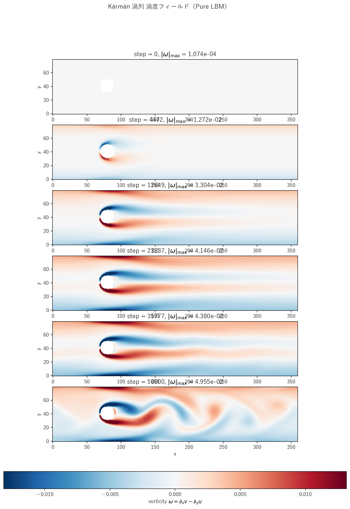
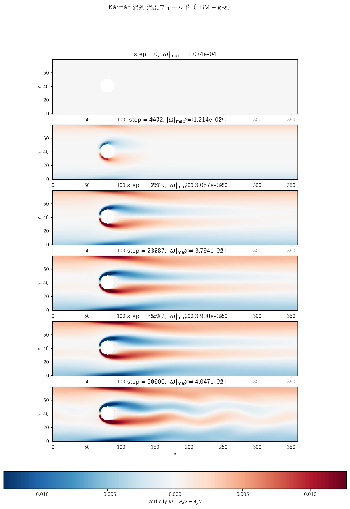
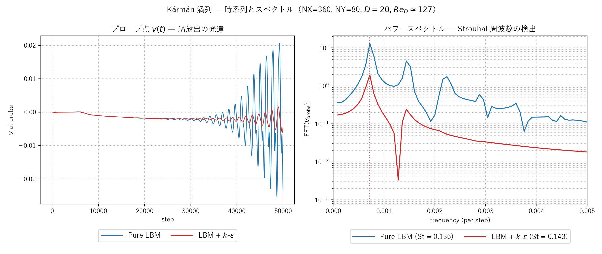

# karman.c / karman_keps.c / karman_les.c 説明ドキュメント

## 概要

[src/sec4/karman.c](../../src/sec4/karman.c)、[src/sec4/karman_keps.c](../../src/sec4/karman_keps.c)、[src/sec4/karman_les.c](../../src/sec4/karman_les.c) は、2 次元 Kármán 渦列（vortex street）の LBM 実装です。長いチャンネル内に**円柱障害物**を置き、Guo forcing で流れを駆動。臨界 Reynolds 数（自由流で $Re_c \approx 47$、本実装の閉じ込め配置で $Re_c \approx 60$–70）を超えると円柱の後流が **Hopf 分岐**を起こし、上下の渦が周期的に放出されます。

- **物理**: 円柱後流の再循環不安定 → 周期的渦放出（Strouhal 周波数）
- **DNS 検証** (pure LBM): $Re_D \approx 130$ で Strouhal 数 $St \approx 0.14$（自由流文献値 0.165 に対し閉じ込め効果でやや低い）
- **k-ε 比較**: $\nu_t$ で渦放出振幅が 86% 抑制される — 周期不安定への RANS の過剰散逸の最も劇的なケース
- **LES 比較**: Smagorinsky は 14% 抑制に留まり、渦放出の物理を保持 — 「unsteady 周期流に LES が適切」を本シリーズで最も明確に示すケース（[karman_les.md](karman_les.md)）

## 検証結果サマリー

### 渦放出のスナップショット

#### Pure LBM


時間発展：
- `step = 0`: 初期摂動のみ（円柱周りに小さな v 渦をシード）
- `step ~ 5000-15000`: 後流が定常 wake から不安定化を開始
- `step ~ 25000-50000`: **上下交互の渦放出**が完成、典型的な Kármán 渦列パターン

#### LBM + k-ε


同じ初期条件・カラースケール。$\nu_t$ により**渦が早期に散逸**する傾向（壁関数 + 円柱表面壁関数で k が注入され、ν_t が後流に伝搬）。

#### LBM + Smagorinsky LES


LES 版は渦放出を**明瞭に保持**。Smagorinsky は瞬時 $\|S\|$ 応答型のため、k-ε のような時間積分による $\nu_t$ 蓄積が起きず、周期渦構造を保ったまま高波数のみを減衰します。

### 時系列とスペクトル解析



| 量 | Pure LBM | LBM + k-ε | LBM + LES |
|---|---|---|---|
| 最終 $u_{\max}$ | 0.106 | 0.100 | 0.105 |
| プローブ位置 $(x, y)$ | (200, 50) | (200, 50) | (200, 50) |
| ピーク周波数（per step）| $7.2\times 10^{-4}$ | $7.2\times 10^{-4}$ | $7.2\times 10^{-4}$ |
| **Strouhal 数 $St = f D / U$** | **0.136** | **0.143** | **0.137** |
| $v_{\rm probe}$ 振幅（半 PtoP）| 0.0229 | 0.00386 | 0.0198 |
| **振幅比 (model / pure)** | – | **0.17**（83% 抑制）| **0.86**（14% 抑制）|
| 平均 $\nu_t/\nu_0$ | – | 0.048 | $3.8\times 10^{-3}$ |
| 推定 $Re_D$ | 127 | 120 | 126 |

**観察ポイント**：
- 左図：v_probe(t) は初期は小さく、step 25000 付近から振幅が育ち始め、最終 5000 ステップで定常的な周期振動に達する → 典型的な Hopf 分岐後の極限サイクル
- 右図：パワースペクトルにシャープなピーク → 単一周波数の Kármán 周期
- 自由流での経験式 $St \approx 0.165$ に対し本実装は低め — チャンネル閉じ込め (D/NY = 0.25) で渦周期が長くなる典型的傾向

## 物理と支配方程式

### Kármán 渦列の概要

円柱周りの非定常流れの最も古典的な現象。Reynolds 数 $Re_D = U D / \nu$ に応じた振る舞い：

- $Re_D < 47$（自由流）: **定常 wake** — 円柱後ろに対称な再循環ダイポール
- $47 < Re_D \lesssim 200$: **層流渦放出** — 上下交互に渦が剥離、Strouhal 数 $St \approx 0.16$–$0.21$
- $Re_D > 200$: **3D 不安定** — 純 2D シミュレーションは限界
- $Re_D > 1000$: 完全乱流後流

本実装は閉じ込め配置（$D/NY = 0.25$）のため臨界 Re が上昇し、$Re_D \approx 60$–70 で shedding が始まります。

### 計算ドメインと幾何

```
   y = NY-1 ┌──────────────────────────────────────────┐
            │                                          │
            │        ●           wake →                │   y = CY+R
            │       ╱ ╲                                │
            │      ●   ●                               │   y = CY
            │       ╲ ╱                                │   y = CY-R
            │        ●                                 │
            │   probe location: (PROBE_X, PROBE_Y)     │
   y = 0    └──────────────────────────────────────────┘
            x=0   CX                                  NX-1
```

円柱は $(CX, CY) = (80, 41)$ に直径 $D = 2R = 20$。$CY$ をチャンネル中心 $y = 39.5$ から 1.5 単位ずらして対称性を破ります。`solid[]` マスクで `(x-CX)² + (y-CY)² ≤ R²` のセルを固体マーク。

### LBM (D2Q9, BGK) と境界条件

[kelbm の説明](kelbm.md) と同じ BGK + Guo forcing。境界：

- **x 方向**: 周期境界（流れが循環）
- **y 方向**（上下壁）: halfway bounce-back
- **円柱表面**: solid マスクで halfway bounce-back（**staircase 近似**）

円柱の staircase 表現は連続曲面に比べやや粗いが、$D = 20$ 格子なら教育用としては十分。

### 初期摂動

円柱の wake 領域に**反対称な v 摂動**を Gaussian 包絡で付与してshedding をトリガー：

$$
v_0(x, y) = 5\!\times\!10^{-4} \cdot \mathrm{sign}(y - CY) \cdot \exp\bigl(-r^2/200\bigr),\quad r = \sqrt{(x-CX-25)^2 + (y-CY)^2}
$$

CY-offset だけだと shedding 発達が極めて遅い（$10^5$ ステップ以上）ため、明示摂動で線形不安定モードを直接励起します。

### k-ε モデル（k-ε 版のみ）

[kelbm の説明](kelbm.md) と同じ標準 k-ε 輸送方程式。**3 種類の壁面**に Dirichlet 壁関数：

1. 上下壁: 局所 |u| からの $u_\tau$
2. **円柱表面（staircase）**: 固体セルに隣接する流体セルすべてに局所速度 $|u|$ ベースの $u_\tau$ を適用

円柱周りの staircase 境界での「接線方向」は座標軸とは一致しないため、$u_\tau$ 推定では速度全体 $|u|$ を proxy として使用（精度は粗いが、$k$ 注入の機能としては成立）。

### Smagorinsky LES モデル（LES 版のみ）

標準 Smagorinsky SGS（瞬時応答型）：

$$
\nu_t = (C_s\,\Delta)^2 \sqrt{2\,S_{ij}S_{ij}},\quad C_s = 0.16,\ \Delta = 1 \text{ LU}
$$

solid セル（円柱内部）に隣接する勾配計算では `if (solid[ixp]) ixp = i;` で zero-gradient ミラー反射。壁関数なし（瞬時 $\|S\|$ から代数的に $\nu_t$ を決定）。詳細は [karman_les.md](karman_les.md)。

## 計算条件

| 項目 | Pure LBM | k-ε 版 | LES 版 |
|---|---|---|---|
| 領域 | $360 \times 80$ | 同上 | 同上 |
| 円柱中心 | $(80, 41)$ | 同上 | 同上 |
| 円柱直径 | $D = 20$（$R = 10$） | 同上 | 同上 |
| 緩和パラメータ | $\tau = 0.55$（一定） | $\tau_{\rm eff}$ は局所値 | $\tau_{\rm eff}$ は局所値 |
| 体積力 | $F_x = 6\!\times\!10^{-6}$ | 同上 | 同上 |
| 分子動粘性 | $\nu_0 \approx 0.0167$ | 同上 | 同上 |
| LBM 時間ステップ数 | NSTEPS = 50000 | 同上 | 同上 |
| SGS / RANS 定数 | – | $C_\mu=0.09$, $C_{\varepsilon 1}=1.44$, $C_{\varepsilon 2}=1.92$ | $C_s=0.16$ |
| 初期摂動 | Gaussian (amp $5\!\times\!10^{-4}$, $\sigma\sim 14$) | 同上 | 同上 |
| プローブ位置 | $(200, 50)$ — 6$D$ 下流、上 wake 内 | 同上 | 同上 |
| プローブ間隔 | 5 ステップ | 同上 | 同上 |
| 境界条件（SGS） | – | 上下壁＋円柱表面に Dirichlet 壁関数 | なし（標準 Smagorinsky）|
| 推定 $Re_D$ | $\approx 130$ | $\approx 120$ | $\approx 126$ |

## 実行方法

### ランナースクリプト（推奨）

```powershell
pwsh scripts/run_karman.ps1
```

主なフラグ: `-PureOnly` / `-KepsOnly` / `-LesOnly` / `-SkipPlot`（三択は同時指定不可）。`pwsh` (PowerShell 7+) と Windows PowerShell 5.1 のどちらでも動作。

ランナーは：
1. `scripts/build_one.cmd src/sec4/karman{,_keps,_les}.c` をビルド
2. `outputs/sec4/karman{,_keps,_les}/` で実行（NSTEPS=50000、各 ~3 分）
3. [plot_karman_snapshots.py](../../scripts/plot_karman_snapshots.py) `[pure|keps|les]` と [plot_karman_spectrum.py](../../scripts/plot_karman_spectrum.py) を呼んで PNG を保存

### 個別実行

```powershell
python scripts/plot_karman_snapshots.py pure
python scripts/plot_karman_snapshots.py keps
python scripts/plot_karman_snapshots.py les
python scripts/plot_karman_spectrum.py
```

## 出力ファイル

- `karman_snapshot_*.csv`, `karman_keps_snapshot_*.csv`, `karman_les_snapshot_*.csv`: 各時刻の `x,y,u,v,vorticity,solid[,k,eps,nut]`（LES 版は `nut` のみ）
- `karman_probe.csv`, `karman_keps_probe.csv`, `karman_les_probe.csv`: 5 ステップごとの $u_{\max}$、プローブ点の $u, v$、$\nu_t$ 平均（k-ε 版は $k,\varepsilon$ 平均も）

## 注意（限界）

- **閉じ込め効果**: チャンネル封鎖比 $D/NY = 0.25$ は中程度の閉じ込め。自由流の経験式 $St=0.165$ より低い周波数（長い周期）になる傾向。完全自由流に近づけるなら $NY \ge 8D$ 推奨
- **Staircase 円柱**: 連続曲面の bounce-back（Bouzidi 補間など）に比べ精度が粗い。半径方向の解像度 $R = 10$ で粗い境界が見える。研究レベルには Bouzidi または曲面境界スキームへの拡張推奨
- **Re と次元**: $Re_D = 130$ は 2D shedding 領域。実際の 3D 円柱流れは $Re > 200$ で 3D 不安定（Mode A, B）が現れるため、本 2D 実装は 200 近辺までが上限
- **k-ε の物理的妥当性**: 渦放出は本質的に**非定常**で**周期的**な現象なので、本来の RANS（時間平均）の使い方とは外れます。本実装は k-ε モデルの「過剰散逸により渦を smearing する」性質を観察するもの
- **LES の物理的妥当性**: Smagorinsky は瞬時 $\|S\|$ 応答型のため、unsteady 周期流に対し k-ε より遥かに穏やかな振幅抑制（14% vs 86%）。Karman 渦放出を保持しつつ高波数散逸を補完する用途に適切

## 参考

- Roshko, A. (1954), "On the development of turbulent wakes from vortex streets", *NACA Report* 1191 — 古典実験
- Williamson, C. H. K. (1996), "Vortex dynamics in the cylinder wake", *Annu. Rev. Fluid Mech.*, 28, 477–539 — 包括レビュー
- Bouzidi, M., Firdaouss, M., & Lallemand, P. (2001), "Momentum transfer of a Boltzmann-lattice fluid with boundaries", *Phys. Fluids*, 13(11), 3452–3459 — 曲面 bounce-back
- Smagorinsky, J. (1963), "General circulation experiments with the primitive equations", *Monthly Weather Review*, 91(3), 99–164 — Smagorinsky SGS 原典
- [karman_les.md](karman_les.md), [les_summary.md](les_summary.md), [keps_summary.md](keps_summary.md) — クロスケース／LES 詳細
