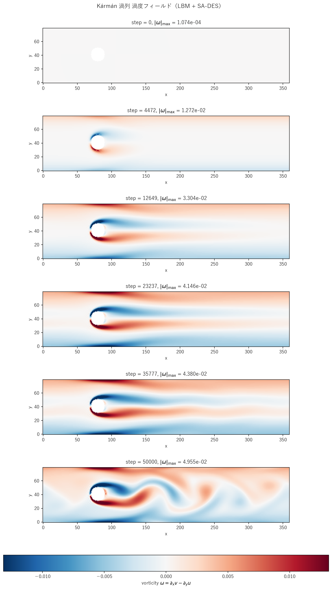

# karman_des.c 説明ドキュメント

## 概要

[src/sec4/karman_des.c](../../src/sec4/karman_des.c) は、[karman.c](karman.md) と同じチャンネル＋円柱（$R = 10$, ステアケース表現）ジオメトリ・体積力・非対称ガウス摂動初期条件に **Spalart-Allmaras DES97** を結合した実装です。length-scale switch

$$
\tilde d = \min(d_{\rm wall},\,C_{DES}\,\Delta),\quad C_{DES} = 0.65,\ \Delta = 1 \text{ LU}
$$

で壁近傍 RANS / バルク LES のハイブリッド作動を行います。$Re_D \approx 127$ の Hopf 分岐後の周期渦放出域で、$f_{v1}$ cutoff により SA-DES は完全に「眠った」状態を保ち、pure LBM と**プローブ振幅まで一致**する結果になります（[cavity_des.md](cavity_des.md) と同じ挙動）。

## 検証結果サマリー

### 渦度フィールド



DES では渦放出が明瞭に持続し、最終フレーム（step = 50000）でも完全な周期構造が確認できます。**LES は 14% 減衰しているのに対し DES は減衰ゼロ**（後述の振幅表参照）。

### 抑制効果

| 量 | Pure LBM | k-ε | LES | **DES** |
|---|---|---|---|---|
| プローブ v 振幅（半 PtoP）| 0.02292 | 0.00386 | 0.01977 | 0.02292 |
| pure 比 | 1.000 | 0.168 | 0.863 | **1.000** |
| Strouhal 数 | ~0.14 | ~0.14 | ~0.14 | ~0.14 |
| 平均 $\nu_t/\nu_0$（履歴）| – | $\sim 0.05$ | $3.8\times 10^{-3}$ | $\sim 7\times 10^{-10}$ |
| 平均 $\tilde\nu/\nu_0$（履歴）| – | – | – | $\sim 1.8\times 10^{-2}$ |
| LES branch fraction | – | – | – | 0.973 |

DES の振幅は pure LBM と 6 桁一致。これは SA-DES が「層流的に振る舞うこの $Re_D$ レジームでは何も modeling する必要がない」と判定し、$\nu_t$ を $10^{-11}$ オーダーまで沈め、BGK 衝突への寄与が消失するためです。

### 物理的解釈：なぜ DES は LES よりさらに眠るか

$Re_D = 127$ の wake せん断層で典型的に $\|S\| \sim U_\infty / \delta_{\rm shear} \approx 0.005$ LU。SA-DES の bulk equilibrium：

$$
c_{b1}\,\tilde S\,\tilde\nu \;\approx\; c_{w1} f_w\,\bigl(\tilde\nu/\tilde d\bigr)^2
$$

から $\tilde\nu_{\rm eq} \sim 5 \times 10^{-5}$、すなわち $\chi = \tilde\nu/\nu_0 \sim 0.003$。SA の eddy viscosity 算出関数 $f_{v1} = \chi^3/(\chi^3 + c_{v1}^3)$（$c_{v1} = 7.1$）はこのとき $\sim 10^{-11}$ まで落ち、$\nu_t = \tilde\nu f_{v1}$ は分子粘性の $10^{-9}$ 倍。**SA は乱流レベル $\chi$ を判定してから $\nu_t$ を出力する設計**のため、低 $Re_D$ レジームでは判定が「乱流ではない」となり SGS 寄与をきれいに切る。

| モデル | 設計思想 | Karman での挙動 |
|---|---|---|
| Pure LBM | DNS（2D 範囲内）| 渦放出を正確に再現 |
| k-ε | 時間平均流向け RANS（壁関数で $k$ 注入）| 振動を 86% smear |
| LES (Smagorinsky) | $\nu_t = (C_s\Delta)^2\|S\|$ の代数モデル | 振動構造を保持しつつ 14% 減衰 |
| **SA-DES** | 1 方程式 $\tilde\nu$ 輸送 + $f_{v1}$ cutoff | **完全に眠る — pure と区別不能**|

LES と DES の差は cavity と同じ理由：Smagorinsky には判定機構がないため $|S| \neq 0$ で必ず $\nu_t > 0$ を出すのに対し、SA は $\chi$ が小さい限り $\nu_t \approx 0$ を出す。

### length-scale switch の可視化

LES branch fraction = **0.973**（fluid セル中、$d_{\rm wall} \geq C_{DES}\Delta = 0.65$ となる割合）。RANS branch は：

- 上下壁の最外 1 行（halfway BB の幾何で $d = 0.5$）
- 円柱表面に隣接する staircase 1 セル分

Snapshot CSV に `d_wall` と `d_tilde` 列を追加してあるため、外部スクリプトで RANS/LES region map を可視化できます。

## SA-DES モデル実装

`update_sa_des()`（[karman_des.c#L150-L222](../../src/sec4/karman_des.c#L150-L222)）の手順：

1. 周期境界（x）と壁/solid（y、円柱）でミラー処理した近傍を取得
2. 速度勾配、$\|S\| = \sqrt{2 S_{ij} S_{ij}}$
3. SA closure: $\chi$, $f_{v1}$, $f_{v2}$, $\tilde S$, $r$, $g$, $f_w$
4. SA 輸送方程式の右辺（production / destruction / 拡散 / cross-diffusion / 1 次風上対流）
5. $\tilde\nu^{n+1} = \tilde\nu^n + dt \cdot RHS$（陽的 Euler、$dt = 0.05$）
6. $\nu_t = \tilde\nu\,f_{v1}$ を `nut_field[i]` に格納（solid セルは 0）

壁距離 $d_{\rm wall}$ は `init_wall_distance()` で 1 度だけ計算：

```
d_wall = min(y+0.5, NY-y-0.5, sqrt((x-CX)^2+(y-CY)^2) - R_CYL)
```

第 3 項（円柱距離）は staircase ではなく**理想円**として扱い、最外セルで $d = 0.5$ になるよう $\max(0.5, \cdot)$ で floor。SA 定数は cavity_des と同一（標準 SA-DES97）。

## 計算条件

| 項目 | 値 |
|---|---|
| 領域 | $360 \times 80$ |
| 円柱中心 | $(80, 41)$ |
| 円柱半径 | $R = 10$ LU |
| 緩和時間（基準）| $\tau = 0.55$ |
| 体積力 | $F_x = 6\times 10^{-6}$ |
| 分子動粘性 | $\nu_0 \approx 0.0167$ |
| $u_{\max}$（最終）| 0.106 |
| $Re_D = u_{\max} D/\nu_0$ | 127 |
| SA 定数 | 標準（$c_{b1}=0.1355$, $c_{b2}=0.622$, $\sigma=2/3$, $\kappa=0.41$, $c_{v1}=7.1$）|
| $C_{DES}$ | 0.65 |
| $\Delta_{LES}$ | 1 LU |
| SA 時間ステップ | $dt = 0.05$ |
| $\tilde\nu$ 初期値 | $3\,\nu_0$（標準 SA 自由流値）|
| $\tilde\nu$ 壁 BC | mirror（destruction 項で自然抑制）|
| プローブ位置 | $(200, 50)$ |
| 時間ステップ数 | NSTEPS = 50000 |
| 履歴間隔 | 5 ステップ（高速振動を解像）|
| スナップショット | step = 0, 4472, 12649, 23237, 35777, 50000 |

## 実行方法

```powershell
# DES 版のみ
.\scripts\run_karman.ps1 -DesOnly

# 全 variant（pure, k-ε, LES, DES）
.\scripts\run_karman.ps1
```

出力先：`outputs/sec4/karman_des/`

## 出力ファイル

- `karman_des_snapshot_*.csv`: `x,y,u,v,vorticity,solid,nut,nu_tilde,d_wall,d_tilde`
- `karman_des_probe.csv`: 5 ステップごとに `step,u_max,u_probe,v_probe,nut_mean,nu_tilde_mean,les_frac`

`v_probe` の時系列から振幅・スペクトルを評価でき、`d_wall`/`d_tilde` を pivot すれば RANS/LES region map が描けます。

## 物理的限界

- **DES の本来のターゲット外**: $Re_D \approx 127$ の 2D karman は**層流周期渦放出**。DES は本来「壁付近 attached boundary layer は RANS、剥離後の wake は LES」の高 $Re$ 流れ（$Re_D \sim 10^4$ 以上）向け。本ケースは "grey area" にすら届かない laminar regime
- **2D 限定**: 真の Karman wake は $Re_D > 200$ で 3D 不安定（Mode A/B）に遷移し、DES が想定する 3D 乱流構造を持つ。2D LBM 設定の上限は $Re_D \sim 200$
- **$f_{v1}$ cutoff**: SA が低 $\chi$ 領域で eddy viscosity を出さない設計は、低 $Re$ 流れでの誤介入を防ぐ利点である一方、こうした layout では「動かないモデルを実装する」意味合いになる
- **methodological consistency**: cavity_des と同じく、本ファイルの主目的は「DES が眠るべきレジームで正しく眠る」ことの確認。length-scale switch の幾何（壁/円柱周りの thin RANS layer）は機能している

## 参考

- Spalart & Allmaras (1992), "A one-equation turbulence model for aerodynamic flows", AIAA Paper 92-0439
- Spalart, Jou, Strelets & Allmaras (1997), DES97 原典, *Advances in DNS/LES*
- Williamson (1996), "Vortex dynamics in the cylinder wake", *Annu. Rev. Fluid Mech.*
- Roshko (1954), NACA TN 3169
- [karman.md](karman.md): pure / k-ε 版の詳細
- [karman_les.md](karman_les.md): Smagorinsky LES 版（14% 振幅抑制）
- [cavity_des.md](cavity_des.md): 同じ SA-DES97 を cavity に適用した姉妹ケース
- [les_summary.md](les_summary.md), [keps_summary.md](keps_summary.md): クロスケース比較
