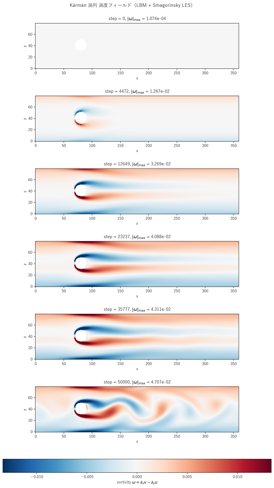

# karman_les.c 説明ドキュメント

## 概要

[src/sec4/karman_les.c](../../src/sec4/karman_les.c) は、[karman.c](karman.md) と同じチャンネル＋円柱（$R = 10$, ステアケース表現）ジオメトリ・体積力・非対称ガウス摂動初期条件に標準 **Smagorinsky LES** を結合した実装です。$Re_D \approx 126$ の Hopf 分岐後の周期渦放出域で、k-ε 版が振幅を **86% 抑制**するのに対し、Smagorinsky 版は **14% 抑制**に留まり Strouhal 数を含む渦放出を物理的に保持します。本シリーズで k-ε と LES の差が最も劇的に現れるケース。

$$
\nu_t = (C_s\,\Delta)^2 \sqrt{2 S_{ij}S_{ij}},\quad C_s = 0.16,\ \Delta = 1 \text{ LU}
$$

$\tau_{\rm eff} = 1/2 + 3(\nu_0 + \nu_t)$ で BGK 衝突に取り込み。円柱表面は staircase なので $\nu_t$ も staircase で評価。

## 検証結果サマリー

### 渦度フィールド



LES では渦放出が明瞭に持続し、後期フレーム（step ≥ 35000）でも明瞭な周期構造が確認できます。

### 抑制効果

| 量 | Pure LBM | k-ε | **LES** |
|---|---|---|---|
| プローブ v 振幅（半 PtoP） | 0.0229 | 0.00386 | 0.0198 |
| pure 比 | 1.000 | 0.168 | **0.863** |
| Strouhal 数 | ~0.14 | ~0.14 | ~0.14 |
| 平均 $\nu_t/\nu_0$（履歴） | – | $\sim 0.05$ | $3.8\times 10^{-3}$ |
| 最大 $\nu_t/\nu_0$（履歴） | – | – | $4.8\times 10^{-3}$ |

**主要所見**：
- k-ε は振幅を 86% 削り渦放出を実質破壊（後流が時間平均流に近い状態へ）
- LES は振幅を 14% 削るのみで周期構造を保持
- 周波数（Strouhal）は両モデルとも変わらない（時間平均ジオメトリで決まるため）

### 物理的解釈

Karman 渦放出は **Hopf 分岐後の周期極限軌道**で、$Re_D \gtrsim 47$ で発生し $Re_D \lesssim 200$ で 2D に留まります。本ケース $Re_D = 126$ はその中央域。

| モデル | 設計思想 | Karman での挙動 |
|---|---|---|
| Pure LBM | DNS（2D 範囲内） | 渦放出を正確に再現 |
| k-ε | 時間平均流向け RANS | 時間平均化作用で振動を smear |
| **LES** | 瞬時応答型 SGS | 振動構造を保持しつつ高波数のみ減衰 |

これは標準 k-ε が**周期不安定の捕捉に向かない**という理論的限界の最も明確な実証であり、LES が**渦放出のような unsteady 周期流に対し適切な選択肢**であることを示します。

## Smagorinsky モデル実装

`update_les()`（[karman_les.c#L106-L132](../../src/sec4/karman_les.c#L106-L132)）の手順：

1. 周期境界（x）と壁/solid（y、円柱）でミラー処理した近傍
2. solid 隣接セルで速度勾配が staircase 由来の不連続を持つ可能性に対し、`if (solid[ixp]) ixp = i;` 等でミラー反射
3. $\|S\| = \sqrt{2 S_{ij}S_{ij}}$
4. $\nu_t = C_s^2 \|S\|$ を `nut_field[i]` に格納（solid セルは 0）

k-ε 版の壁関数（上下壁＋円柱表面の `apply_wall_function`）と $k, \varepsilon$ 関連配列／seed が**すべて不要**。コード行数 27% 減。

## 計算条件

| 項目 | 値 |
|---|---|
| 領域 | $360 \times 80$ |
| 円柱中心 | $(80, 41)$ |
| 円柱半径 | $R = 10$ LU |
| 緩和時間（基準） | $\tau = 0.55$ |
| 体積力 | $F_x = 6\times 10^{-6}$ |
| Smagorinsky 定数 | $C_s = 0.16$ |
| 分子動粘性 | $\nu_0 \approx 0.0167$ |
| $u_{\max}$（最終） | 0.105 |
| $Re_D = u_{\max} D/\nu_0$ | 126 |
| プローブ位置 | $(200, 50)$ |
| 時間ステップ数 | NSTEPS = 50000 |
| 履歴間隔 | 5 ステップ（高速振動を解像） |
| スナップショット | step = 0, 4472, 12649, 23237, 35777, 50000 |

## 実行方法

```powershell
# LES 版のみ
.\scripts\run_karman.ps1 -LesOnly

# 全 variant（pure, k-ε, LES）
.\scripts\run_karman.ps1
```

出力先：`outputs/sec4/karman_les/`

## 出力ファイル

- `karman_les_snapshot_*.csv`: `x,y,u,v,vorticity,solid,nut`
- `karman_les_probe.csv`: 5 ステップごとに `step,u_max,u_probe,v_probe,nut_mean`

`v_probe` の時系列から振幅とスペクトルを評価できます。

## 参考

- Williamson (1996), "Vortex dynamics in the cylinder wake", *Annu. Rev. Fluid Mech.* — 2D/3D 遷移を含む
- Roshko (1954), NACA TN 3169 — 円柱後流の Strouhal データ
- Smagorinsky (1963), "General circulation experiments with the primitive equations", *Monthly Weather Review*
- [karman.md](karman.md): pure / k-ε 版の詳細
- [les_summary.md](les_summary.md), [keps_summary.md](keps_summary.md): クロスケース比較
