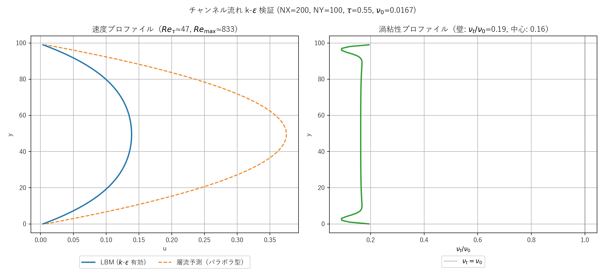
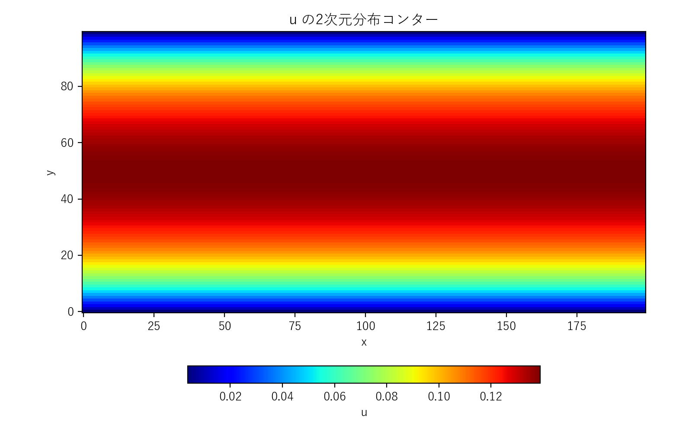
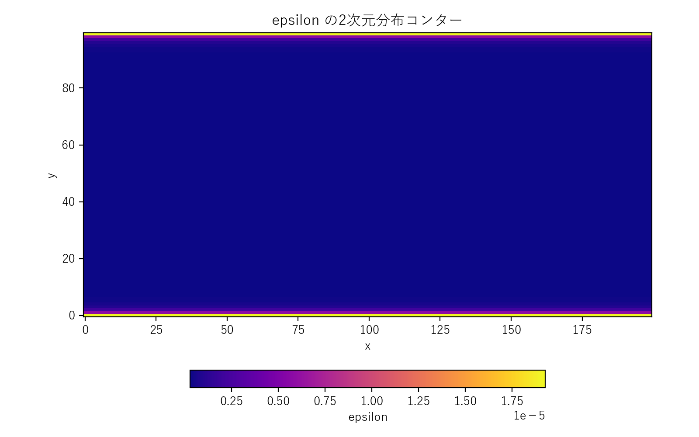

### 比較図サンプル



左図：LBM計算（青）と層流 Poiseuille 予測（橙破線）の比較。$k$-$\varepsilon$ が活性化していれば、$\nu_t$ により実効粘性が増し、LBM プロファイルは層流予測より低く・平坦になります。

右図：渦粘性 $\nu_t/\nu_0$ の y 方向分布。壁関数で $k_{\text{wall}} = u_\tau^2/\sqrt{C_\mu}$、$\varepsilon_{\text{wall}} = u_\tau^3/(\kappa\,\Delta y)$ を Dirichlet 注入し、バルク全域で $\nu_t/\nu_0 \approx 0.15$–$0.20$ の渦粘性が発達しています。
## 検証方法（k-ε 活性化の比較）

本コードは $k$-$\varepsilon$ モデルが活性化する遷移域（$Re_\tau \approx 47$）に設定されています。検証では数値解と**層流予測**（パラボラ型）を比較し、$\nu_t$ による減速を観測します。

### 比較プロットの作成

付属スクリプト [scripts/plot_kelbm_compare_theory.py](../../scripts/plot_kelbm_compare_theory.py) を実行すると、左右2枚のサブプロットを描画します：

- **左**: 速度 $u(y)$ のプロファイル
  - LBM 計算値（実線）
  - 層流 Poiseuille 予測 $u_{\mathrm{lam}}(y) = u_{\max}^{\mathrm{lam}} \left[1 - \left(\dfrac{y - y_c}{NY/2}\right)^2\right]$、$u_{\max}^{\mathrm{lam}} = F_x H^2 / (8\nu_0)$（破線）
- **右**: 渦粘性比 $\nu_t/\nu_0 = C_\mu k^2/(\varepsilon \nu_0)$ の y 方向分布

$k$-$\varepsilon$ が無効なら層流予測と一致するはずですが、本パラメータでは $u_{\max}^{\mathrm{lam}} = 0.375$ が LBM の Mach 安定限界（$|u| \lesssim 0.1$）を超えるため、$\nu_t$ による減速がなければ計算は破綻します。実際には $\nu_t \neq 0$ により $u_{\max} \approx 0.139$ で安定するため、この差自体が k-ε モデルの正常動作を示します。

#### 実行例

ビルド・シミュレーション・プロット生成を一括で行うランナースクリプトを使うのが推奨です：

```powershell
pwsh scripts/run_kelbm.ps1
```

これは内部で次を実行します：

1. `scripts/build_one.cmd src/sec4/kelbm.c` で `build/bin/kelbm.exe` をビルド
2. `outputs/sec4/kelbm/` 配下で `kelbm.exe` を実行し `kelbm_output.csv` を生成
3. プロットスクリプト 4 本（[plot_kelbm_compare_theory.py](../../scripts/plot_kelbm_compare_theory.py)、[plot_kelbm_contour.py](../../scripts/plot_kelbm_contour.py)、[plot_kelbm_centerline.py](../../scripts/plot_kelbm_centerline.py)、[plot_kelbm_output.py](../../scripts/plot_kelbm_output.py)）を順次実行し、PNG を `outputs/sec4/` と `docs/assets/sec4/` に保存

`-SkipPlot` を渡すとプロット生成をスキップ。プロット単体で再生成したい場合は個別に Python スクリプトを呼べます：

```powershell
python scripts/plot_kelbm_compare_theory.py
```

#### 画像ファイル

`outputs/sec4/kelbm_compare_theory.png`（出力アーカイブ）と `docs/assets/sec4/kelbm_compare_theory.png`（ドキュメント参照用）の両方に同じ画像が保存されます。

---

## シミュレーション結果の2次元分布コンター

速度 $u$ の2次元分布：


$k$ の2次元分布：


$\varepsilon$ の2次元分布：


### コンター図で確認するポイント

- $u$: 流れ方向に並進不変（x 方向に均一）、$y$ 方向にプロファイルを示す。層流予測のパラボラより**平坦化**していれば $\nu_t$ が効いている
- $k$: 壁関数注入により壁近傍で最大、バルクではほぼ一定値に近づく
- $\varepsilon$: 壁近傍で大きく、バルクでは小さい（壁で生成された乱流エネルギーが散逸する形）
# kelbm.c 説明ドキュメント

## 概要

[src/sec4/kelbm.c](../../src/sec4/kelbm.c) は、2 次元格子ボルツマン法（LBM）に $k$-$\varepsilon$ 乱流モデルを組み合わせた、ポアズイユ型チャンネル流れのテストケースです。x 方向は周期境界、y 方向は上下壁（ハーフウェイ bounce-back）とし、x 方向に一定の体積力をかけて駆動します。速度場 $u,v$、乱流エネルギー $k$、散逸率 $\varepsilon$ を出力し、解析解（パラボラ型速度分布）との比較で実装の妥当性を検証できます。

## 支配方程式

### 1. LBM（D2Q9）

分布関数 $f_k$ の進化はBGK近似と外力項（Guoスキーム）の下、

$$
f_k(\mathbf{x}+\mathbf{c}_k, t+1) = f_k(\mathbf{x}, t) - \omega \left[f_k(\mathbf{x}, t) - f_k^{\mathrm{eq}}(\mathbf{x}, t)\right] + F_k
$$

で与えられます。ここで

- $\mathbf{c}_k$: D2Q9 格子速度
- $\omega = 1/\tau$: 緩和パラメータ
- $f_k^{\mathrm{eq}}$: 平衡分布関数
- $F_k$: 外力ソース項

平衡分布関数は

$$
f_k^{\mathrm{eq}} = w_k \rho \left[1 + 3(\mathbf{c}_k \cdot \mathbf{u}) + \frac{9}{2}(\mathbf{c}_k \cdot \mathbf{u})^2 - \frac{3}{2}|\mathbf{u}|^2\right]
$$

外力ソース項（Guo et al. 2002）は

$$
F_k = \left(1 - \frac{\omega}{2}\right) w_k \left[3(\mathbf{c}_k - \mathbf{u}) + 9(\mathbf{c}_k \cdot \mathbf{u})\,\mathbf{c}_k\right] \cdot \mathbf{F}
$$

で、本コードでは $\mathbf{F} = (F_x, 0)$、$F_x = 5\times 10^{-6}$ を $x$ 方向に一様に与えます。マクロ速度はハーフステップ補正

$$
\rho \mathbf{u} = \sum_k f_k \mathbf{c}_k + \frac{\Delta t}{2}\,\mathbf{F}
$$

で計算します（$\Delta t = 1$ in lattice units）。

### 2. 標準 $k$-$\varepsilon$ モデル

本コードは対流・拡散・生成・散逸項を含む標準型 $k$-$\varepsilon$ 輸送方程式に加え、第1流体セルへの高 Re 壁関数（Dirichlet）を実装しています。

#### 生成項

乱流動粘性とひずみ速度テンソルを用いて、

$$
P_k = \nu_t\, S^2,\qquad \nu_t = C_\mu\, \frac{k^2}{\varepsilon}
$$

ここで $S^2 = 2\, S_{ij} S_{ij}$ は対称ひずみ速度テンソル $S_{ij} = \tfrac{1}{2}(\partial_i u_j + \partial_j u_i)$ の自乗ノルム。2次元では

$$
S^2 = 2\bigl(S_{11}^2 + S_{22}^2\bigr) + 4\, S_{12}^2,\quad
S_{11} = \frac{\partial u}{\partial x},\ \ S_{22} = \frac{\partial v}{\partial y},\ \ S_{12} = \frac{1}{2}\!\left(\frac{\partial u}{\partial y} + \frac{\partial v}{\partial x}\right)
$$

速度勾配は2次中心差分で評価します。

#### 輸送方程式

$$
\frac{\partial k}{\partial t} + \mathbf{u}\cdot\nabla k
= \nabla\!\cdot\bigl(D_k \nabla k\bigr) + P_k - \varepsilon
$$

$$
\frac{\partial \varepsilon}{\partial t} + \mathbf{u}\cdot\nabla \varepsilon
= \nabla\!\cdot\bigl(D_\varepsilon \nabla \varepsilon\bigr)
+ C_{\varepsilon 1}\frac{P_k\,\varepsilon}{k} - C_{\varepsilon 2}\frac{\varepsilon^2}{k}
$$

実効拡散係数は $D_k = \nu_0 + \nu_t/\sigma_k$、$D_\varepsilon = \nu_0 + \nu_t/\sigma_\varepsilon$。LBM分子動粘性は $\nu_0 = c_s^2(\tau - 1/2) = (\tau - 1/2)/3$ で、本実装の $\tau=0.55$ では $\nu_0 \approx 0.0167$ です。

#### モデル定数

| 定数 | 値 |
| --- | --- |
| $C_\mu$ | 0.09 |
| $C_{\varepsilon 1}$ | 1.44 |
| $C_{\varepsilon 2}$ | 1.92 |
| $\sigma_k$ | 1.0 |
| $\sigma_\varepsilon$ | 1.3 |

#### 離散化と時間発展

時間発展は陽的Euler法（$\Delta t = 0.01$ 固定）。対流項は1次風上差分、拡散項は2次中心差分で離散化されます：

$$
k^{n+1} = k^n + \Delta t \left[
D_k\, \nabla^2 k - (\mathbf{u}\cdot\nabla k)_{\text{upwind}} + P_k - \varepsilon^n
\right]
$$

$$
\varepsilon^{n+1} = \varepsilon^n + \Delta t \left[
D_\varepsilon\, \nabla^2 \varepsilon - (\mathbf{u}\cdot\nabla \varepsilon)_{\text{upwind}}
+ C_{\varepsilon 1}\frac{P_k\,\varepsilon^n}{k^n} - C_{\varepsilon 2}\frac{(\varepsilon^n)^2}{k^n}
\right]
$$

数値安定性のため、各ステップ後に $k,\varepsilon \ge 10^{-8}$ の下限を課します（ゼロ割回避にはさらに $10^{-12}$ の正則化を加算）。

#### 壁関数（Dirichlet）

第1流体セル（halfway bounce-back の壁から $\Delta y = 0.5$）に対して、対数領域の局所平衡から得られる値を毎ステップ Dirichlet 上書きします：

$$
k_{\mathrm{wall}} = \frac{u_\tau^2}{\sqrt{C_\mu}},\qquad
\varepsilon_{\mathrm{wall}} = \frac{u_\tau^3}{\kappa\,\Delta y}
$$

ここで $\kappa = 0.41$（von Karman 定数）、摩擦速度は力学平衡 $u_\tau = \sqrt{F_x\,\delta}$（$\delta = NY/2$）から評価しています。これにより壁近傍で $k$ が枯渇しないため、$\nu_t = C_\mu k^2/\varepsilon$ がバルクまで伝搬して非自明な渦粘性プロファイルが立ち上がります。

形式的には高 Re 壁関数は $y^+ = u_\tau \Delta y / \nu_0 \gtrsim 30$ で有効ですが、本ケースでは $y^+_1 \approx 0.5$ で範囲外です。実態としては「k-ε ソース項を壁付近で有限に保つための注入器」として作用しており、低 Re k-ε モデル（Launder-Sharma など）で置き換えるとより物理的に正確になります。

## 変数と配列

- `f[NX*NY*NDIR]`: 分布関数 $f_k$
- `u[NX*NY], v[NX*NY]`: 速度場
- `rho[NX*NY]`: 密度場
- `k[NX*NY]`: 乱流エネルギー
- `eps[NX*NY]`: 乱流散逸率

## 計算条件

- 計算領域: $200 \times 100$ 格子（`NX = 200, NY = 100`、x方向：流れ方向、y方向：壁法線方向）
- 時間ステップ数: `NSTEPS = 30000`
- 緩和パラメータ: $\tau = 0.55$（$\omega = 1/\tau \approx 1.818$）、LBM分子動粘性 $\nu_0 = (\tau - 1/2)/3 \approx 0.0167$
- 体積力: $F_x = 5\times 10^{-6}$ ($x$ 方向、Guo forcing で印加)
- 初期条件: $u = v = 0$、$\rho = 1$、$k$, $\varepsilon$ は壁関数値で初期化（$k_0 = u_\tau^2/\sqrt{C_\mu}$, $\varepsilon_0 = u_\tau^3/(\kappa\Delta y)$）
- 境界条件
  - $x$ 方向: 周期境界
  - $y$ 方向（$y=0$ と $y=NY-1$）: ハーフウェイ bounce-back（壁面は $y=-0.5$ と $y=NY-0.5$）
  - $k,\varepsilon$: バルクは Neumann ゼロ勾配、第1流体セル（$y=0$ と $y=NY-1$）は壁関数で Dirichlet 設定

### 摩擦速度と $Re_\tau$

体積力との力学平衡から摩擦速度は：

$$
u_\tau = \sqrt{F_x \, \delta},\quad \delta = NY/2
$$

本パラメータでは $u_\tau \approx 0.0158$、$\nu_0 \approx 0.0167$ なので

$$
Re_\tau = \frac{u_\tau\, \delta}{\nu_0} \approx 47
$$

（遷移域、完全乱流の典型値 $Re_\tau \gtrsim 180$ には届かないが、$k$-$\varepsilon$ モデルの活性化は確認できる）

## 出力

- `kelbm_output.csv` に $u,v,k,\varepsilon$ を全格子点で出力

## 参考式

### D2Q9 格子速度と重み

$$
\begin{align*}
&\mathbf{c}_0 = (0,0) \\
&\mathbf{c}_1 = (1,0),\ \mathbf{c}_2 = (0,1),\ \mathbf{c}_3 = (-1,0),\ \mathbf{c}_4 = (0,-1) \\
&\mathbf{c}_5 = (1,1),\ \mathbf{c}_6 = (-1,1),\ \mathbf{c}_7 = (-1,-1),\ \mathbf{c}_8 = (1,-1)
\end{align*}
$$

$$
w_0 = \frac{4}{9},\quad w_{1\sim4} = \frac{1}{9},\quad w_{5\sim8} = \frac{1}{36}
$$

## 検証結果（k-ε 活性化の確認）

| 量 | 値 | 備考 |
|---|---|---|
| $u_{\max}$ (LBM) | 0.139 | $k$-$\varepsilon$ 有効 |
| $u_{\max}$ (層流予測) | 0.375 | $u_{\max} = F_x H^2/(8\nu_0)$ |
| $u_{\max}$ 比 (LBM/層流) | **0.37** | $\nu_t$ による実効粘性増加で減速 |
| $Re_\tau$ | 47 | 遷移域 |
| $Re_{\max}$ ($u_{\max} H/\nu_0$) | 833 | |
| $\nu_t/\nu_0$ (バルク中央) | 0.16 | 渦粘性が分子粘性の16% |
| $\nu_t/\nu_0$ (壁関数値) | 0.19 | 壁関数注入で安定 |
| $k$ レンジ | $9.5\times 10^{-5}$–$8.3\times 10^{-4}$ | バルク〜壁 |
| $\varepsilon$ レンジ | $3.0\times 10^{-7}$–$1.9\times 10^{-5}$ | バルク〜壁 |

層流予測（$u_{\max}$=0.375）は LBM の Mach 数安定限界を超えるため、もし $k$-$\varepsilon$ が無効なら計算は破綻するはずです。実際は $\nu_t$ による減速で安定に定常解に収束し、$u_{\max} \approx 0.139$ に落ち着いています。これは「$k$-$\varepsilon$ モデルが流れを物理的に正しく抑制している」ことの直接的な証拠です。

## 注意

- $Re_\tau \approx 47$ は**遷移域**であり、完全乱流（典型 $Re_\tau \gtrsim 180$）ではありません。本コードは $k$-$\varepsilon$ 実装の活性化検証としては有効ですが、対数則 $u^+ = (1/\kappa)\ln y^+ + B$ の再現や DNS 統計との比較には不適です。
- 完全乱流レジームには $\tau \to 0.5$（$\nu_0 \to 0$）が必要ですが、BGK 衝突演算子は $\tau \approx 0.5$ で不安定化します。MRT/regularized 衝突や Smagorinsky 型 LES などへの変更が必要です。
- 実装した壁関数（halfway bounce-back の第1流体セルに $k$, $\varepsilon$ を Dirichlet 設定）は $y^+ \gtrsim 30$ の対数領域で有効な「高 Re 壁関数」です。本ケースでは $y^+_1 = u_\tau \cdot \Delta y / \nu_0 \approx 0.5$ と著しく小さく、形式的には適用範囲外です。低 Re k-ε モデル（Launder-Sharma など）への拡張で改善できます。
- それでも、本実装は「対流・拡散・生成・散逸を含む標準 $k$-$\varepsilon$ 輸送方程式」を機能させ、層流予測から大きく外れた現実的な乱流抑制効果を再現できることを示しています。
