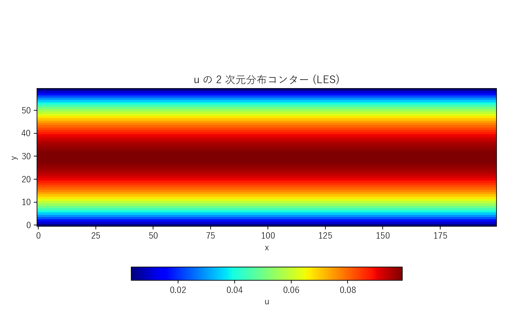
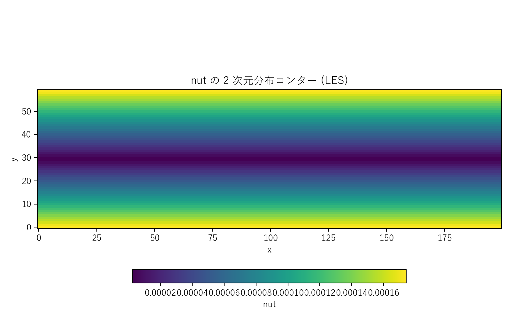

# kelbm_les.c 説明ドキュメント

## 概要

[src/sec4/kelbm_les.c](../../src/sec4/kelbm_les.c) は、[kelbm.c](kelbm.md) と同じチャンネル流れジオメトリ・境界条件・体積力に標準型 **Smagorinsky LES** を結合した実装です。$k$-$\varepsilon$ 輸送方程式と壁関数は持たず、サブグリッド渦粘性は局所歪み速度から代数的に決定されます：

$$
\nu_t = (C_s\,\Delta)^2 \sqrt{2 S_{ij}S_{ij}},\quad C_s = 0.16,\ \Delta = 1 \text{ LU}
$$

BGK 衝突への結合は kelbm の k-ε 版とは異なり**有効緩和時間 $\tau_{\rm eff}$ 経由**で行います（[kelbm.c](../../src/sec4/kelbm.c) は $\tau$ 定数で $\nu_t$ をフィードバックしない実装）：

$$
\tau_{\rm eff}(\mathbf{x}, t) = \tfrac{1}{2} + 3(\nu_0 + \nu_t)
$$

## 検証結果サマリー

### 場の分布





$\nu_t$ は壁で最大、チャンネル中心で最小という Smagorinsky の素直な応答を示します。壁関数なしのため壁第 1 セルでも $\nu_t$ がゼロにならない一方、$\|S\|$ が小さい中央域では $\nu_t \approx 0$ となります。$u$ は層流 Poiseuille への発達途上のため、まだパラボラに達していません。

### 主要量

| 量 | 値 | 備考 |
|---|---|---|
| $u_{\max}$ (LES) | 0.0993 | NSTEPS=30000 時点 |
| $u_{\max}$ (層流予測) | 0.135 | $u_{\max} = F_x H^2/(8\nu_0)$ |
| $u_{\max}$ 比 (LES/層流) | 0.74 | k-ε 版と同等（過渡） |
| $\nu_t/\nu_0$ (バルク平均) | 0.005 | k-ε 版の 0.16 より 1 桁以上小 |
| $\nu_t/\nu_0$ (最大) | 0.010 | せん断層直上 |
| $Re_\tau$ | 22 | 低レイノルズ域 |

**重要な所見**: LES と k-ε の比 `u_max/u_lam = 0.74` は同じ値ですが、これは**両方とも未収束過渡値**です。層流定常時間 $T \sim H^2/\nu_0 \approx 2.2\times 10^5$ ステップに対し NSTEPS=30000 は 1/7 程度しか進んでいません。

LES では $\nu_t/\nu_0 \approx 0.005$ と分子粘性比で 0.5% 程度しか上乗せされておらず、k-ε 版の 16% と大きく異なります。すなわち本ケースで観測される速度抑制は **SGS の追加散逸ではなく、層流 Poiseuille 流への発達途上である**ことを意味します。

完全乱流チャンネル ($Re_\tau \gtrsim 180$) には $\nu_0 \to 0$（$\tau \to 0.5$）が必要で BGK では不安定化します。LES 本来の活用には MRT/regularized 衝突演算子と $Re_\tau \sim 180$ の十分高い Re が必要です。

## Smagorinsky モデル実装

`update_les()`（[kelbm_les.c#L91-L120](../../src/sec4/kelbm_les.c#L91-L120)）の手順：

1. 速度勾配を 2 次中心差分で算出（壁では片側差分）
2. ひずみ速度テンソル $S_{ij} = \tfrac{1}{2}(\partial_i u_j + \partial_j u_i)$ から $|S| = \sqrt{2 S_{ij}S_{ij}}$
3. $\nu_t = C_s^2\,|S|$ をセルごとに `nut_field[i]` に格納
4. 次の `stream_collide_with_les()` で $\tau_{\rm eff}$ に取り込み

**特徴**：
- 輸送方程式なし → 状態変数 $k$, $\varepsilon$ を持たない（メモリ削減 36%）
- 安定性制限なし → KEPS_DT のような追加時間刻みが不要
- 壁関数なし → 壁第 1 セルで $\nu_t$ がゼロにならない（標準 Smagorinsky の既知の弱点）

## 計算条件

| 項目 | 値 | 備考 |
|---|---|---|
| 領域 | $200 \times 60$ | kelbm.c と同じ |
| 緩和時間（基準） | $\tau = 0.55$ | 局所 $\tau_{\rm eff}$ に置換 |
| 体積力 | $F_x = 5\times 10^{-6}$ | 同上 |
| Smagorinsky 定数 | $C_s = 0.16$ | 標準値 |
| フィルタ幅 | $\Delta = 1$ LU | 格子間隔 |
| 分子動粘性 | $\nu_0 = (\tau-1/2)/3 \approx 0.0167$ | |
| 境界条件 | x: 周期、y: halfway BB | 壁関数なし |
| 時間ステップ数 | NSTEPS = 30000 | k-ε 版と同じ |

## 実行方法

```powershell
# LES 版のみ
.\scripts\run_kelbm.ps1 -LesOnly

# k-ε 版と LES 版を両方
.\scripts\run_kelbm.ps1
```

出力先：`outputs/sec4/kelbm_les/kelbm_les_output.csv`（`x,y,u,v,nut`）。

## 出力ファイル

- `kelbm_les_output.csv`: 最終ステップの 2D 場（u, v, nut）

## 参考

- Smagorinsky (1963), "General circulation experiments with the primitive equations", *Monthly Weather Review*
- Yu, Girimaji & Luo (2005), "DNS and LES of decaying isotropic turbulence with and without frame rotation using lattice Boltzmann method", *J. Comp. Phys.*
- [keps_summary](keps_summary.md), [les_summary](les_summary.md) — クロスケース比較
