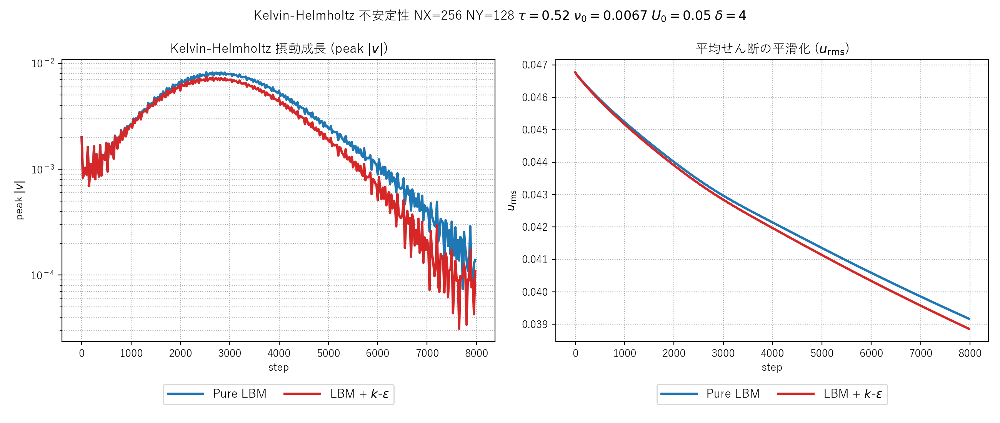
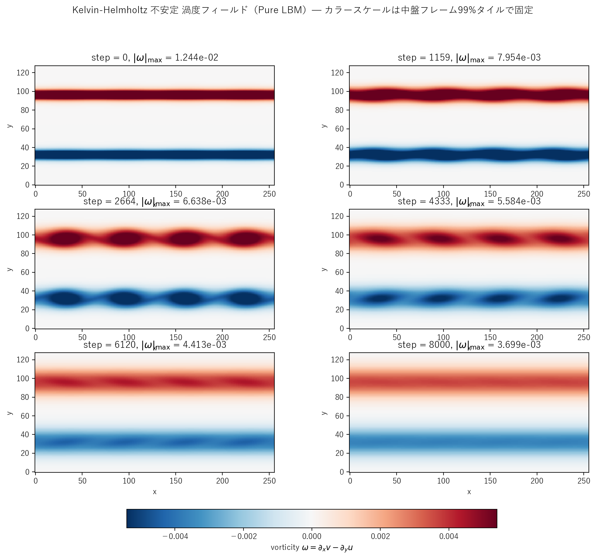

# kelvin_helmholtz.c / kelvin_helmholtz_keps.c 説明ドキュメント

## 概要

[src/sec4/kelvin_helmholtz.c](../../src/sec4/kelvin_helmholtz.c) と [src/sec4/kelvin_helmholtz_keps.c](../../src/sec4/kelvin_helmholtz_keps.c) は、2次元 Kelvin-Helmholtz 不安定性の LBM シミュレーションです。互いに逆向きの x 速度を持つ2層のせん断流に微小な v 摂動を与え、線形不安定モードが指数成長して**渦巻き構造（猫の目渦）**を形成するプロセスを観察します。

- **物理**: 平均速度勾配 $du/dy$ が大きい層で、波長 $\lambda \sim 14\delta$ 付近のモードが線形不安定になり指数成長 → 飽和 → 渦合体 → 散逸
- **DNS 検証** (pure LBM): モード 4 摂動が成長して 4 つの猫目渦を形成するのを確認
- **k-ε 比較**: $\nu_t$ で渦が早めに散逸する様子を観察 — RANS が遷移流に過剰散逸となる典型例

## 検証結果サマリー

### 摂動成長と平均場の平滑化



| 量 | Pure LBM | LBM + k-ε |
|---|---|---|
| 初期 $\max\|v\|$ | $2.0\times 10^{-3}$ | $2.0\times 10^{-3}$ |
| ピーク $\max\|v\|$ | $8.22\times 10^{-3}$（step 2525）| $7.43\times 10^{-3}$（step 2525）|
| 成長率（線形位相） | 約 4.1× / 2500 ステップ | 約 3.7× / 2500 ステップ |
| 最終 $\max\|v\|$（step 8000） | $1.39\times 10^{-4}$ | $1.10\times 10^{-4}$ |
| 最終比 (k-ε / pure) | – | **0.79** |
| $\nu_t/\nu_0$（最終平均） | – | 0.054 |

**観察**：
- 左図（log スケール）: 両者とも step 0 〜 2500 で**3〜4倍に指数成長**（線形不安定モード）、その後**飽和・減衰** — 典型的な KH 振る舞い
- 右図: $u_{\mathrm{rms}}$（平均せん断強度の指標）は両者とも単調減少 — 渦合体と粘性で平均場が混合される
- k-ε 版は $\nu_t/\nu_0 \approx 0.05$ の追加散逸で、ピーク振幅が pure より 10% 低く、最終振幅は 21% 低い

### 渦度フィールドのスナップショット

#### Pure LBM



進行：
- `step = 0`: 2本の水平せん断層（赤=正、青=負の渦度）
- `step = 1159`: 線形成長期、層がうねり始める
- `step = 2664`: **猫の目渦が完成** — モード4の摂動に対応して 4 つの渦が形成
- `step = 4333`: 渦が saturate、わずかに広がる
- `step = 6120-8000`: 粘性で渦が smearing、層が混合された厚い帯になる

#### LBM + k-ε


同じ初期条件・カラースケール。$\nu_t$ が**わずかに早く渦を smearing** させますが、ピーク時の渦構造はほぼ同じです。これは標準 k-ε が遷移流れには過剰散逸となる傾向を可視化しています。

## 物理と支配方程式

### 線形 Kelvin-Helmholtz 理論

$\tanh$ 型せん断層 $u(y) = U_0 \tanh(y/\delta)$ に対して、線形安定性解析によると：

$$
\sigma_{\max} \approx 0.19 \cdot \frac{U_0}{\delta},\qquad k_{\mathrm{opt}}\, \delta \approx 0.45,\qquad \lambda_{\mathrm{opt}} \approx 14\delta
$$

本実装では $U_0 = 0.05$, $\delta = 4$ なので、$\sigma_{\max} \approx 2.4\!\times\!10^{-3}$/step、$\lambda_{\mathrm{opt}} \approx 56$。

### 計算ドメインと初期条件

完全周期境界の正方ボックス $NX \times NY$ に**逆向きの2層**を置きます：

$$
u(y) = \begin{cases}
+U_0 \tanh\bigl((y - NY/4)/\delta\bigr), & 0 \le y < NY/2 \\
-U_0 \tanh\bigl((y - 3NY/4)/\delta\bigr), & NY/2 \le y < NY
\end{cases}
$$

各層に Gaussian 包絡で局所化した摂動を加えます：

$$
v(x, y) = A \cdot \sin\bigl(M\,k_x\, x\bigr) \cdot \bigl[ e^{-\bigl((y - NY/4)/\sigma\bigr)^2} - e^{-\bigl((y - 3NY/4)/\sigma\bigr)^2} \bigr]
$$

ここで $A=2\!\times\!10^{-3}$、$M=4$（モード番号）、$\sigma=8$。

### LBM (D2Q9, BGK) と k-ε

[kelbm の説明](kelbm.md)と同じ BGK 衝突 + [taylor_green の説明](taylor_green.md) と同じ局所変動 $\tau_{\mathrm{eff}}$ 結合。両ファイルから違うのは：
- 外力なし（自由減衰／不安定発展）
- 全方向周期境界（壁関数なし）
- 初期 $k, \varepsilon$ は $\nu_t/\nu_0 = 0.05$ になるよう小さめに設定（線形不安定モードを潰さない）

## 計算条件

| 項目 | Pure LBM | k-ε 版 |
|---|---|---|
| 領域 | $256 \times 128$ | $256 \times 128$ |
| 緩和パラメータ | $\tau = 0.52$（一定） | $\tau_{\mathrm{eff}} = 1/2 + 3(\nu_0+\nu_t)$（変動） |
| 速度ジャンプの片側 | $U_0 = 0.05$ | $U_0 = 0.05$ |
| せん断層厚さ | $\delta = 4$ | $\delta = 4$ |
| 分子動粘性 | $\nu_0 = (\tau-1/2)/3 \approx 0.0067$ | 同上 |
| Re（せん断ベース） | $2 U_0 \delta/\nu_0 = 60$ | 同上 |
| 摂動モード番号 | $M = 4$（$\lambda = 64 = 16\delta$、最不安定 $14\delta$ に近い）| 同上 |
| 摂動振幅 | $A = 0.04 U_0 = 2\!\times\!10^{-3}$ | 同上 |
| 摂動 Gaussian 包絡 | $\sigma = 8$ | 同上 |
| LBM 時間ステップ数 | NSTEPS = 8000 | NSTEPS = 8000 |
| k-ε 積分時間刻み | – | `KEPS_DT = 0.05` |
| 境界条件 | 全方向周期 | 全方向周期 |
| 初期 $k, \varepsilon$ | – | $k_0 = 2\!\times\!10^{-3} U_0^2$, $\varepsilon_0$ は $\nu_t/\nu_0=0.05$ になるよう設定 |

## 実行方法

### ランナースクリプト（推奨）

```powershell
pwsh scripts/run_kelvin_helmholtz.ps1
```

主なフラグ：
- `-PureOnly`: pure LBM 版だけ実行
- `-KepsOnly`: k-ε 版だけ実行
- `-SkipPlot`: プロット生成をスキップ

`pwsh` (PowerShell 7+) と Windows PowerShell 5.1 のどちらでも動作します。

ランナーは内部で次を行います：

1. `scripts/build_one.cmd src/sec4/kelvin_helmholtz{,_keps}.c` をそれぞれビルド
2. `outputs/sec4/kelvin_helmholtz/` と `outputs/sec4/kelvin_helmholtz_keps/` で実行
3. [plot_kelvin_helmholtz_growth.py](../../scripts/plot_kelvin_helmholtz_growth.py) と [plot_kelvin_helmholtz_snapshots.py](../../scripts/plot_kelvin_helmholtz_snapshots.py) `[pure|keps]` を呼んで PNG を保存

### 個別実行

```powershell
python scripts/plot_kelvin_helmholtz_growth.py
python scripts/plot_kelvin_helmholtz_snapshots.py pure
python scripts/plot_kelvin_helmholtz_snapshots.py keps
```

## 出力ファイル

- `kh_snapshot_*.csv`, `kh_keps_snapshot_*.csv`: 各時刻の `x,y,u,v,vorticity[,k,eps,nut]`
- `kh_history.csv`, `kh_keps_history.csv`: 25 ステップごとの $\max\|v\|$ と $u_{\mathrm{rms}}$（k-ε 版は $k,\varepsilon,\nu_t$ の領域平均も）

## 注意（限界）

- 本実装は完全周期境界で $\tanh$ 型 2 層せん断を扱います。実用 KH 問題（航空機翼のせん断剥離、海洋密度成層など）では境界条件と背景流れが異なるため、量的比較には個別の調整が必要です
- 摂動は決定論的（単一モード sin 波）なので、複数モードや乱数励起による「自然な」遷移とは異なります
- $\tau = 0.52$ は BGK 安定限界 $\tau > 0.5$ ぎりぎりです。さらに低い $\tau$ で高 Re にしたい場合は MRT/regularized 衝突演算子への切り替えを推奨
- k-ε は本来定常せん断流向け RANS モデル — 遷移過程の渦巻き形成には過剰散逸となる傾向がある（本ケースで観察された通り）。LES（Smagorinsky など）の方が物理的に妥当

## 参考

- Kelvin (1871), "Hydrokinetic solutions and observations", *Phil. Mag.*, 42, 362–377
- Helmholtz (1868), "Über discontinuirliche Flüssigkeitsbewegungen", *Monatsber. König. Preuss. Akad. Wiss. Berlin*, 23, 215–228
- Drazin & Reid (1981), *Hydrodynamic Stability* — 線形理論の標準テキスト
