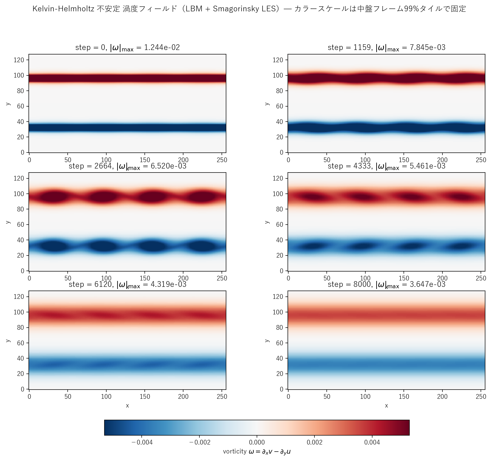

# kelvin_helmholtz_les.c 説明ドキュメント

## 概要

[src/sec4/kelvin_helmholtz_les.c](../../src/sec4/kelvin_helmholtz_les.c) は、[kelvin_helmholtz.c](kelvin_helmholtz.md) と同じ二重せん断層と $\sin(4 k_x x)$ モード励起初期条件に標準 **Smagorinsky LES** を結合した実装です。$k$-$\varepsilon$ 版がピーク振幅を 21% 抑制するのに対し、Smagorinsky 版は **7% 抑制**に留まり、渦の roll-up（モード 4 の 4 渦形成）をほぼ DNS と同等に保持します。

$$
\nu_t = (C_s\,\Delta)^2 \sqrt{2 S_{ij}S_{ij}},\quad C_s = 0.16,\ \Delta = 1 \text{ LU}
$$

$\tau_{\rm eff} = 1/2 + 3(\nu_0 + \nu_t)$ で BGK 衝突に取り込み。

## 検証結果サマリー

### 渦度フィールド



| 量 | Pure LBM | k-ε | **LES** |
|---|---|---|---|
| ピーク $\max\|v\|$ | $8.22\times 10^{-3}$ | $7.43\times 10^{-3}$ | $7.67\times 10^{-3}$ |
| 純 LBM 比 | 1.000 | 0.904 | **0.933** |
| 平均 $\nu_t/\nu_0$（履歴） | – | $\sim 0.05$ | $6.2\times 10^{-3}$ |
| 最大 $\nu_t/\nu_0$（履歴） | – | – | $6.7\times 10^{-3}$ |

LES の $\nu_t/\nu_0 \approx 0.006$ は k-ε の 0.05 の **1 桁小**。せん断層で局所的に $\|S\|$ が大きくても、$\nu_t = C_s^2\|S\|$ で代数的に決まるため過剰には成長しません。

### 物理的解釈

KH は線形不安定で「最不安定モード（本実装ではモード 4 強制励起）が指数的に増幅し、4 渦が形成される」過程です。RANS（k-ε）は時間平均流向けで瞬時の渦構造を smearing しがちですが、LES は**瞬時の歪み速度に応答する**ので渦の roll-up を保ちます。

| フェーズ | Pure LBM | LES | k-ε |
|---|---|---|---|
| 線形増幅 | DNS 通り | ほぼ DNS 通り | 増幅率がやや抑制 |
| 渦の roll-up（4 渦） | DNS 通り | DNS と区別困難 | 抑制 |
| 後期の渦合体・散逸 | 緩やか | やや加速 | 加速 |

スナップショット PNG では、後期フレーム（step ≥ 6120）でも 4 つの渦が明瞭に保たれることが確認できます。

## Smagorinsky モデル実装

`update_les()`（[kelvin_helmholtz_les.c#L99-L120](../../src/sec4/kelvin_helmholtz_les.c#L99-L120)）の手順：

1. 周期境界の 2 次中心差分で速度勾配を算出
2. $\|S\| = \sqrt{2 S_{ij}S_{ij}}$
3. $\nu_t = C_s^2 \|S\|$ を `nut_field[i]` に格納

k-ε 版で必要だった $k$, $\varepsilon$ 初期 seed（`0.002 U_0^2` 等）と `KEPS_DT = 0.05` は**不要**。

## 計算条件

| 項目 | 値 |
|---|---|
| 領域 | $256 \times 128$ |
| 緩和時間（基準） | $\tau = 0.52$ |
| 主流速度 | $U_0 = 0.05$ |
| せん断層厚 | $\delta = 4.0$ LU |
| 摂動振幅・モード | $A = 0.002$, mode 4 |
| Smagorinsky 定数 | $C_s = 0.16$ |
| 分子動粘性 | $\nu_0 \approx 0.0067$ |
| 境界条件 | 全方向周期 |
| 時間ステップ数 | NSTEPS = 8000 |
| スナップショット | step = 0, 1159, 2664, 4333, 6120, 8000 |

## 実行方法

```powershell
# LES 版のみ
.\scripts\run_kelvin_helmholtz.ps1 -LesOnly

# 全 variant
.\scripts\run_kelvin_helmholtz.ps1
```

出力先：`outputs/sec4/kelvin_helmholtz_les/`

## 出力ファイル

- `kh_les_snapshot_*.csv`: `x,y,u,v,vorticity,nut`
- `kh_les_history.csv`: 25 ステップごとに `step,v_max,u_rms,nut_mean`

## 参考

- Drazin & Reid (1981), *Hydrodynamic Stability*, Cambridge UP — 線形 KH 理論
- Smagorinsky (1963), "General circulation experiments with the primitive equations", *Monthly Weather Review*
- [kelvin_helmholtz.md](kelvin_helmholtz.md): pure / k-ε 版の詳細
- [les_summary.md](les_summary.md), [keps_summary.md](keps_summary.md): クロスケース比較
