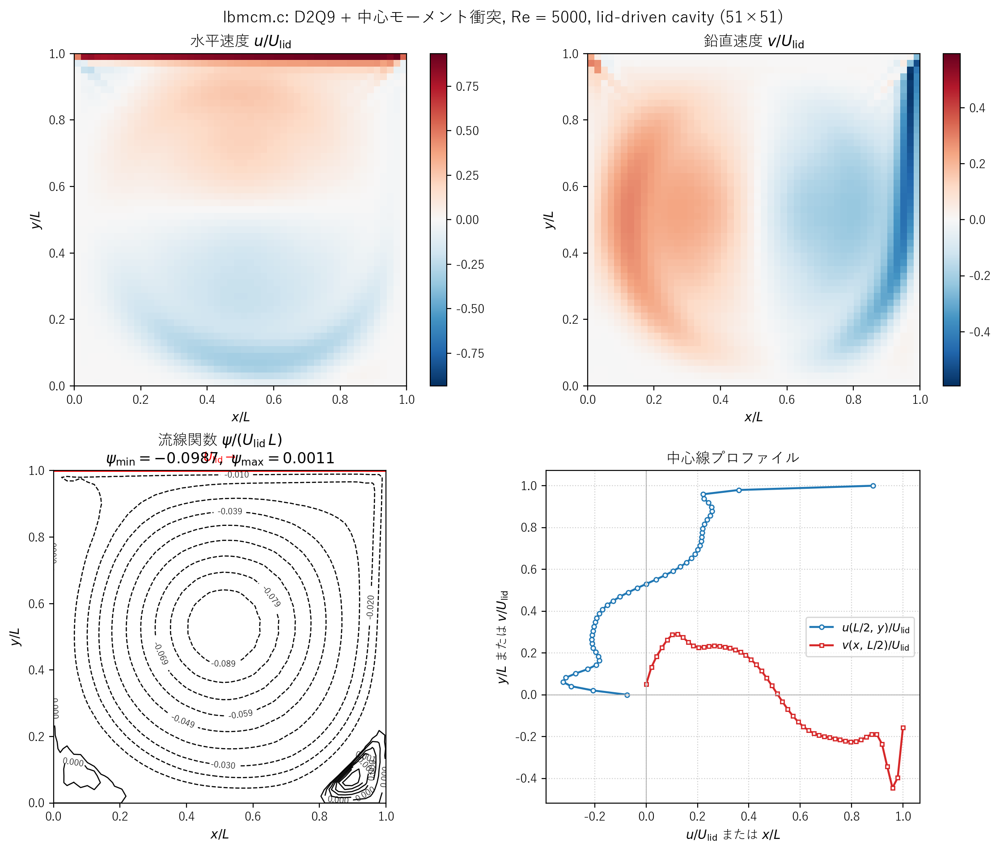
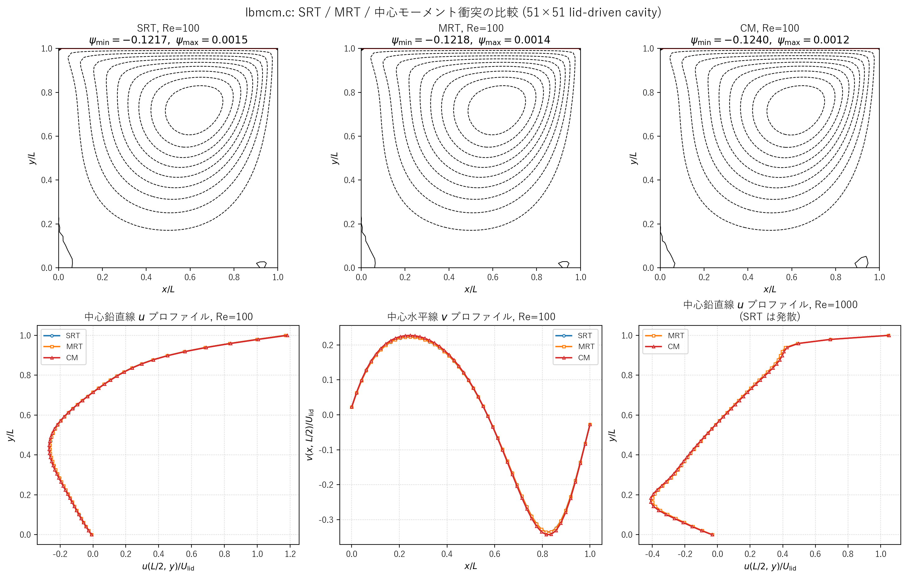

# lbmcm.c 説明ドキュメント

## 概要

[src/sec4/lbmcm.c](../../src/sec4/lbmcm.c) は、2 次元蓋駆動キャビティ流れを D2Q9 格子ボルツマン法で解き、衝突演算子を **3 種類切り替え可能** にしたコードです。

- `flag = 1` — **SRT**（Single Relaxation Time, BGK）衝突
- `flag = 2` — **MRT**（Multiple Relaxation Time）衝突（d'Humières 基底）
- `flag = 3` — **中心モーメント（Central Moment, CM）** 衝突（Geier et al.）

各衝突演算子は同じ平衡分布関数 $f_k^{\rm eq}$・同じ境界条件・同じキャビティ幾何上で動作し、**高 Reynolds 数で安定に解ける限界がどこまで広がるか** を比較するのが本コードの主目的です。コード冒頭のコメントに目安が示されています：

| 衝突演算子 | 安定に到達できる $Re$（コメント記載） |
|---|---|
| SRT (flag=1)| 〜 100 |
| MRT (flag=2)| 〜 1000 |
| 中心モーメント (flag=3) | 〜 5000 |

デフォルトは `flag = 3`、`re = 5000` です（[lbmcm.c:58, 64](../../src/sec4/lbmcm.c#L58-L64)）。

## 分布結果（CM, Re = 5000, 51×51, 10000 ステップ）



左上：水平速度 $u/U_{\rm lid}$ の 2 次元分布。上端動壁（赤帯）から $U_{\rm lid}$ で駆動された流れが内部を時計回りに循環。中央上部に正の最大、中央下部に逆流の最小が現れています。

右上：鉛直速度 $v/U_{\rm lid}$ の 2 次元分布。右壁近傍で下降流（青の集中帯）、左壁近傍で上昇流（赤帯）が形成され、典型的な蓋駆動キャビティ循環を示します。

左下：流線関数 $\psi/(U_{\rm lid} L)$ の等値線。$\psi_{\min} = -0.0987$（中央やや上の主渦中心）、$\psi_{\max} = +0.0011$。Re=5000 の特徴である **4 隅すべての副渦** が確認できます：

- **右下副渦**: 最も顕著、内側に密な閉曲線
- **左下副渦**: 二番目に大きい、$\psi>0$ の正値
- **右上 / 左上副渦**: 小さく芽生え段階（51×51 では解像度ギリギリ）

右下：中心線プロファイル。$u(L/2, y)/U_{\rm lid}$（青）は上端で 1 に近づき、$y \approx 0.06$ で約 $-0.32$ の最大逆流。$v(x, L/2)/U_{\rm lid}$（赤）は左側で正のピーク $+0.29$（$x/L \approx 0.12$）、右側で負のピーク $-0.45$（$x/L \approx 0.96$）。Ghia (1982) Re=5000 ベンチマークの S 字形状と一致します。

### 数値結果サマリー

| 量 | 値 | Ghia (1982) Re=5000 参考 |
|---|---|---|
| $\psi_{\min}/(U_{\rm lid} L)$ | $-0.0987$ | $-0.1190$ |
| $u_{\min}/U_{\rm lid}$（中心鉛直線） | $-0.324$（$y/L \approx 0.06$） | $-0.439$ |
| $u_{\max}/U_{\rm lid}$（中心鉛直線） | $+0.883$（$y/L \to 1$） | $\to 1$ |
| $v_{\min}/U_{\rm lid}$（中心水平線） | $-0.446$（$x/L \approx 0.96$） | $-0.554$ |
| $v_{\max}/U_{\rm lid}$（中心水平線） | $+0.291$（$x/L \approx 0.12$） | $+0.435$ |
| 収束ノルム $\|\Delta \mathbf{u}\|_\infty$ | $3.56\times 10^{-4}$（最終ステップ） | – |

Ghia 参照との差（$\psi_{\min}$ で 17%、$v_{\min}$ で 19%）は主に **51×51 という粗い格子** に由来します（Ghia は 257×257）。中心モーメント衝突は本格子でも $Re=5000$ を破綻なく解けており、SRT が安定限界の **50 倍** に相当する Re で動作することの実証になっています。

## SRT / MRT / CM の比較

同一格子・同一境界条件で 3 衝突演算子を比較しました。



### 上段：流線関数等値線（Re = 100）

3 方式とも同じ主渦中心位置・右下副渦・左下三次渦の兆候を再現し、$\psi_{\min}$ の値も **0.5% 以内** で一致します。Re=100 のような安定レジームでは衝突演算子の選択は実質的に無関係であることが確認できます。

### 下段：中心線プロファイル

- 左・中央（Re=100）: SRT / MRT / CM の 3 本は重なって 1 本に見えるほど近接。$u_{\min}$ は $-0.262$（SRT）, $-0.262$（MRT）, $-0.267$（CM）で **2% 以内** の差。これは「3 方式とも同じ Navier-Stokes 解に漸近する」ことを示す検証
- 右（Re=1000）: SRT は発散するため除外。MRT と CM はほぼ重なるが、CM の方が逆流ピークがやや深く（$u_{\min} = -0.41$ vs $-0.40$）、より高次の渦構造を解像

### 数値比較表

| 衝突演算子 | $Re$ | $\tau$ | $\psi_{\min}$ | $u_{\min}$ (中心鉛直) | $v_{\min}$ (中心水平) | 収束 Norm | 備考 |
|---|---|---|---|---|---|---|---|
| SRT | 100 | 0.650 | $-0.1217$ | $-0.262$ | $-0.335$ | $1.2\times 10^{-5}$ | 安定 |
| MRT | 100 | 0.650 | $-0.1218$ | $-0.262$ | $-0.336$ | $1.5\times 10^{-5}$ | 安定 |
| CM  | 100 | 0.650 | $-0.1240$ | $-0.267$ | $-0.343$ | $9.3\times 10^{-6}$ | 安定 |
| SRT | 1000 | 0.515 | — | — | — | — | **発散**（コメント記載通り）|
| MRT | 1000 | 0.515 | $-0.1222$ | $-0.399$ | $-0.555$ | $1.7\times 10^{-4}$ | 安定 |
| CM  | 1000 | 0.515 | $-0.1256$ | $-0.410$ | $-0.568$ | $2.0\times 10^{-4}$ | 安定 |
| CM  | 5000 | 0.503 | $-0.0987$ | $-0.324$ | $-0.446$ | $3.6\times 10^{-4}$ | 安定 |

### 観察ポイント

- **物理解の一致**: 全方式が同じ Navier-Stokes 解の離散化なので、安定レジームでは結果は **数値誤差レベル** で一致。CM が若干強めに渦を解像するのは中心モーメント基底のガリレイ不変性の寄与
- **安定限界の階段**: $\tau$ が $0.5$ に近づくほど BGK の単一緩和が不安定化する。MRT は非物理モード（$e, \varepsilon, q_x, q_y$）を緩和率 1.4〜1.5 で個別に強く減衰させて安定化、CM はそれに加えて局所流速で基底変換することでガリレイ不変性違反を抑制
- **計算コスト**: 1 ステップあたりのコストは概ね SRT : MRT : CM ≈ 1 : 3 : 5。CM は局所流速依存の `nc` 行列を毎セル再計算するため最も高価だが、SRT が破綻する高 Re で安定に解けることが代償を正当化
- **収束速度**: 高 Re ほど Norm が大きい（より長時間の積分で完全収束）。10000 ステップは Re=100 で十分収束、Re=5000 では未収束ながら主構造は確立

### 各方式の使い分け

| 条件 | 推奨 |
|---|---|
| $Re \lesssim 100$、教育用途、最も単純な実装 | **SRT** |
| $Re \sim 100$–$1000$、層流〜遷移、安定性に余裕が欲しい | **MRT** |
| $Re \gtrsim 1000$、遷移〜弱乱流、$\tau \to 0.5$ レジーム | **中心モーメント** |
| $Re \gtrsim 10000$、強乱流 | CM でも厳しい — 高次格子（D2Q21, D3Q27）や cumulant LBM を検討 |

## D2Q9 格子と離散速度

ファイル先頭コメントの配置（[lbmcm.c:6-10](../../src/sec4/lbmcm.c#L6-L10)）：

```
6  2  5
   |
3--0--1
   |
7  4  8
```

離散速度ベクトル $\mathbf{c}_k = (c_{kx}, c_{ky})$ は [lbmcm.c:73-75](../../src/sec4/lbmcm.c#L73-L75)：

$$
\mathbf{c}_k \in \{(0,0),\,(1,0),\,(0,1),\,(-1,0),\,(0,-1),\,(1,1),\,(-1,1),\,(-1,-1),\,(1,-1)\}
\quad (k = 0,\ldots,8)
$$

重み $w_k$ は明示的には配列に格納されず、$f_k^{\rm eq}$ の係数（$4/9, 1/9, 1/36$）として埋め込まれています：

$$
w_0 = \tfrac{4}{9},\quad w_{1\ldots4} = \tfrac{1}{9},\quad w_{5\ldots8} = \tfrac{1}{36},\qquad c_s^2 = \tfrac{1}{3}
$$

## 平衡分布関数

[lbmcm.c:242-253](../../src/sec4/lbmcm.c#L242-L253) と [lbmcm.c:269-280](../../src/sec4/lbmcm.c#L269-L280) で計算される平衡分布関数：

$$
f_k^{\rm eq} = w_k\,\rho \left[ 1 + 3\,(\mathbf{c}_k\!\cdot\!\mathbf{u}) + \tfrac{9}{2}\,(\mathbf{c}_k\!\cdot\!\mathbf{u})^2 - \tfrac{3}{2}\,|\mathbf{u}|^2 \right]
$$

3 種類すべての衝突演算子でこの $f_k^{\rm eq}$ を共通の基準点として使用します。

## 衝突演算子 1：SRT (BGK)

`flag == 1` のブロック [lbmcm.c:282-285](../../src/sec4/lbmcm.c#L282-L285)：

$$
f_k^{\rm post}(\mathbf{x}, t) = f_k(\mathbf{x}, t) - \frac{1}{\tau}\bigl[ f_k(\mathbf{x}, t) - f_k^{\rm eq}(\mathbf{x}, t) \bigr]
$$

単一緩和時間 $\tau$ で全モードを同じ速さで平衡へ近づける、最も単純な BGK 衝突。動粘性係数との関係は

$$
\nu = c_s^2 \left( \tau - \tfrac{1}{2} \right) = \tfrac{1}{3}\left( \tau - \tfrac{1}{2} \right)
$$

コードでは [lbmcm.c:65-66](../../src/sec4/lbmcm.c#L65-L66)：

```c
nu  = u0*(double)(nx - 1)/re;
tau = 3.0*nu + 0.5;
```

高 $Re$ では $\tau \to 0.5$ となり BGK が不安定化（数値振動）するため、Re ≲ 100 が実用限界です。

## 衝突演算子 2：MRT（d'Humières 基底）

`flag == 2` のブロック [lbmcm.c:286-313](../../src/sec4/lbmcm.c#L286-L313)。衝突演算をモーメント空間に持ち上げ、**各モーメントごとに独立に緩和** することで、保存量（密度・運動量）はそのまま、非保存モーメントだけを個別の緩和率で減衰させます。

### 変換行列 $M$

D2Q9 の標準（d'Humières）モーメントは

$$
\mathbf{m} = M\,\mathbf{f},\qquad
\mathbf{m} = (\rho,\, e,\, \varepsilon,\, j_x,\, q_x,\, j_y,\, q_y,\, p_{xx},\, p_{xy})^\top
$$

各行の物理的意味：

| 行 | 記号 | 表式 | 意味 |
|---|---|---|---|
| 0 | $\rho$ | $\sum_k f_k$ | 密度 |
| 1 | $e$ | $\sum_k (-4 + 3|\mathbf{c}_k|^2)\,f_k$ | エネルギーモード |
| 2 | $\varepsilon$ | $\sum_k \tfrac{1}{2}(9|\mathbf{c}_k|^4 - 21|\mathbf{c}_k|^2 + 8)\,f_k$ | エネルギー二乗モード |
| 3 | $j_x$ | $\sum_k c_{kx}\,f_k$ | $x$ 運動量 |
| 4 | $q_x$ | $\sum_k (3|\mathbf{c}_k|^2 - 5)\,c_{kx}\,f_k$ | $x$ 熱フラックス類 |
| 5 | $j_y$ | $\sum_k c_{ky}\,f_k$ | $y$ 運動量 |
| 6 | $q_y$ | $\sum_k (3|\mathbf{c}_k|^2 - 5)\,c_{ky}\,f_k$ | $y$ 熱フラックス類 |
| 7 | $p_{xx}$ | $\sum_k (c_{kx}^2 - c_{ky}^2)\,f_k$ | 法線応力差 |
| 8 | $p_{xy}$ | $\sum_k c_{kx}c_{ky}\,f_k$ | せん断応力 |

[lbmcm.c:79-113](../../src/sec4/lbmcm.c#L79-L113) のテーブルはこの 9×9 行列 $M$ の各成分を直接代入しています。

### 緩和行列 $S$

[lbmcm.c:152-156](../../src/sec4/lbmcm.c#L152-L156) で対角行列として設定：

$$
S = \mathrm{diag}\bigl(0,\, 1.5,\, 1.4,\, 0,\, 1.5,\, 0,\, 1.5,\, 1/\tau,\, 1/\tau\bigr)
$$

- 保存量（$\rho, j_x, j_y$）に対応する成分はゼロ → 衝突で変化しない
- せん断応力モード $p_{xx}, p_{xy}$ の緩和率が $1/\tau$ で動粘性 $\nu$ と直結
- 非物理モード（$e, \varepsilon, q_x, q_y$）は独立に強めに緩和（1.4〜1.5）し、高 $Re$ での不安定モードを抑制

### 衝突過程

平衡モーメント $\mathbf{m}^{\rm eq} = M\,\mathbf{f}^{\rm eq}$ を介して

$$
\mathbf{m}^{\rm post} = \mathbf{m} - S\,(\mathbf{m} - \mathbf{m}^{\rm eq})
$$

$$
\mathbf{f}^{\rm post} = M^{-1}\,\mathbf{m}^{\rm post}
$$

これがコードでは

1. `t  = M*f`、`t0 = M*f0`  ← [lbmcm.c:293-296](../../src/sec4/lbmcm.c#L293-L296)
2. `ftmp = S*(t - t0)`、`t = t - ftmp` ← [lbmcm.c:298-303](../../src/sec4/lbmcm.c#L298-L303)
3. `fm = M^{-1}*t`、`f = fm` ← [lbmcm.c:305-311](../../src/sec4/lbmcm.c#L305-L311)

の 3 ステップに分解されています。$M^{-1}$ は [lbmcm.c:116-150](../../src/sec4/lbmcm.c#L116-L150) に手動で書き下されています。

## 衝突演算子 3：中心モーメント（Central Moment）

`flag == 3` のブロック [lbmcm.c:314-462](../../src/sec4/lbmcm.c#L314-L462)。MRT を **局所流速 $\mathbf{u}$ まわりの中心モーメント** で行うことで、ガリレイ不変性が改善され、より高 Re で安定になります。

### 生モーメントの基底（raw moment basis）

CM 版の $M$ は標準 d'Humières とは異なる **生モーメント基底** が使われています（[lbmcm.c:161-195](../../src/sec4/lbmcm.c#L161-L195)）：

$$
M_{(p,q)} = \sum_k c_{kx}^p \, c_{ky}^q \, f_k
$$

| 行 | 多項式 |
|---|---|
| 0 | $1$（$\rho$） |
| 1 | $c_x$（$j_x$） |
| 2 | $c_y$（$j_y$） |
| 3 | $c_x^2 + c_y^2$ |
| 4 | $c_x^2 - c_y^2$ |
| 5 | $c_x c_y$ |
| 6 | $c_x^2 c_y$ |
| 7 | $c_x c_y^2$ |
| 8 | $c_x^2 c_y^2$ |

これを使って $\mathbf{m} = M\,\mathbf{f}$ で生モーメントに移ります。

### シフト行列 $N(\mathbf{u})$

中心モーメントは局所流速 $\mathbf{u} = (u, v)$ を引いた相対速度 $(c_{kx} - u,\, c_{ky} - v)$ に関するモーメントです：

$$
\tilde{m}_{(p,q)} \;=\; \sum_k (c_{kx} - u)^p\,(c_{ky} - v)^q\,f_k
$$

これは二項展開で生モーメントの線形結合として書け、その行列が $N(\mathbf{u})$ ([lbmcm.c:317-369](../../src/sec4/lbmcm.c#L317-L369))：

$$
\tilde{\mathbf{m}} = N(\mathbf{u})\,\mathbf{m}
$$

例：

$$
\tilde{m}_{(1,0)} = m_{(1,0)} - u\,m_{(0,0)} \;\Rightarrow\; N_{1,0} = -u,\; N_{1,1} = 1
$$

$$
\tilde{m}_{(1,1)} = m_{(1,1)} - u\,m_{(0,1)} - v\,m_{(1,0)} + u v\,m_{(0,0)}
$$

など、コード中の `nc[k][m]` 要素は二項係数 $(-u)^p (-v)^q$ から直接導かれます。逆行列 $N^{-1}$ は同じ式で $u \to -u$, $v \to -v$ と置き換えたもので、[lbmcm.c:372-422](../../src/sec4/lbmcm.c#L372-L422) に書き下されています。

### 緩和行列 $S$（CM 版）

[lbmcm.c:235-239](../../src/sec4/lbmcm.c#L235-L239)：

$$
S = \mathrm{diag}\bigl(1,\, 1,\, 1,\, 1,\, 1/\tau,\, 1/\tau,\, 1,\, 1,\, 1\bigr)
$$

- 4, 5 番目（$c_x^2 - c_y^2$, $c_x c_y$ → せん断応力に対応）の緩和率が $1/\tau$
- それ以外は 1（瞬時に平衡）

ガリレイ不変空間で平衡へ落とすため、各モードを 1 に設定しても運動量は保存されます（数値計算で確認）。

### 衝突過程の全体像

$$
\mathbf{f}^{\rm post}
= M^{-1}\,N^{-1}\!\left[\,N\,M\,\mathbf{f} \;-\; S\bigl(N\,M\,\mathbf{f} - N\,M\,\mathbf{f}^{\rm eq}\bigr)\right]
$$

コードでは [lbmcm.c:430-460](../../src/sec4/lbmcm.c#L430-L460)：

1. `t  = M*f`、`t0 = M*f0`（生モーメントへ）
2. `tn = N*t`、`tn0 = N*t0`（中心モーメントへ）
3. `ftmp = S*(tn - tn0)`、`tn = tn - ftmp`（緩和）
4. `ftmp = N^{-1}*tn`（生モーメントへ戻す）
5. `fm   = M^{-1}*ftmp`（分布関数へ戻す）→ `f = fm`

## 伝播（streaming）

[lbmcm.c:465-483](../../src/sec4/lbmcm.c#L465-L483)：

$$
f_k(\mathbf{x} + \mathbf{c}_k,\, t + 1) = f_k^{\rm post}(\mathbf{x},\, t)
$$

`ftmp` に衝突後の値をコピーし、各方向ごとに添字をシフトして書き戻します。

## 境界条件

### 固定壁（左・右・下）— ハーフウェイ bounce-back

[lbmcm.c:486-503](../../src/sec4/lbmcm.c#L486-L503)：壁向きに進む分布関数を反対方向に反射

$$
f_{\bar{k}}(\mathbf{x}_b, t+1) = f_k^{\rm post}(\mathbf{x}_b, t)
$$

ここで $\mathbf{c}_{\bar{k}} = -\mathbf{c}_k$。

### 上端の動く壁（$y = n_y$）— Zou-He 型動壁修正

[lbmcm.c:505-510](../../src/sec4/lbmcm.c#L505-L510)：壁での密度を既知の分布関数から評価し、運動量補正項を入れた反射：

$$
\rho_{\rm wall} = f_0 + f_1 + f_3 + 2\,(f_2 + f_5 + f_6)
$$

$$
f_{\bar{k}}(\mathbf{x}_b) = f_k(\mathbf{x}_b) - \frac{2\,w_k\,\rho_{\rm wall}\,(\mathbf{c}_k\!\cdot\!\mathbf{u}_{\rm wall})}{c_s^2}
$$

$\mathbf{u}_{\rm wall} = (U_{\rm lid}, 0)$、$U_{\rm lid} = 0.1$ ([lbmcm.c:52](../../src/sec4/lbmcm.c#L52))。

コード中の係数 $2/3$（$k=2$）と $1/6$（$k=5,6$）はそれぞれ $2 w_k \rho / c_s^2 \cdot c_{kx} u_{\rm wall}$ の係数で、$w_2 = 1/9$, $w_5 = w_6 = 1/36$, $c_s^2 = 1/3$ から得られます。

### 隅（コーナー）の処理

四隅の対角方向 $f_5, f_6, f_7, f_8$ は対角伝播が壁内へ抜けないようリセットします ([lbmcm.c:511-524](../../src/sec4/lbmcm.c#L511-L524))。**上端 2 隅と下端 2 隅で扱いが異なります**：

- **上端 2 隅 $(1, n_y-1), (n_x-1, n_y-1)$**: $\mathbf{u}_{\rm wall} = (U_{\rm lid}, 0)$ で評価した平衡分布

$$
f_k^{\rm corner} = \frac{1}{36}\left[\, 1 + 3\,c_{kx}\,U_{\rm lid} + \tfrac{9}{2}\,(c_{kx}\,U_{\rm lid})^2 - \tfrac{3}{2}\,U_{\rm lid}^2 \right] \quad (k = 5, 6, 7, 8)
$$

- **下端 2 隅 $(1, 1), (n_x-1, 1)$**: 静止流体の平衡（つまり $w_k = 1/36$ そのもの）

$$
f_k^{\rm corner} = \frac{1}{36} \quad (k = 5, 6, 7, 8)
$$

これは底壁が固定壁であることを反映した実装で、上端動壁の駆動を下端の隅で誤って伝えないための処置です。

## マクロ量の評価

[lbmcm.c:551-560](../../src/sec4/lbmcm.c#L551-L560)：

$$
\rho(\mathbf{x}) = \sum_{k=0}^{8} f_k(\mathbf{x}),\qquad
\mathbf{u}(\mathbf{x}) = \frac{1}{\rho(\mathbf{x})}\sum_{k=0}^{8} \mathbf{c}_k\,f_k(\mathbf{x})
$$

## 収束判定

[lbmcm.c:562-566](../../src/sec4/lbmcm.c#L562-L566)：時間ステップ間の速度差の最大ノルム

$$
\|\Delta \mathbf{u}\|_\infty = \max_{i,j}\sqrt{(u_{ij}^{n} - u_{ij}^{n-1})^2 + (v_{ij}^{n} - v_{ij}^{n-1})^2}
$$

これが $10^{-12}$ を切り、かつ `time > 10000` で `exit(0)` ([lbmcm.c:621](../../src/sec4/lbmcm.c#L621))。

## 流線関数（ストリーム関数）

[lbmcm.c:577-586](../../src/sec4/lbmcm.c#L577-L586)：定義 $u = \partial \psi / \partial y$ を、$\Delta y = 1$ の格子上で **Simpson 1/3 則** で $y$ 方向に積分：

$$
\psi(x, y) \;=\; \int_0^y u(x, y')\,dy'
\;\approx\; \sum_{j'=2,4,\ldots}^{j}\frac{1}{3}\bigl[u(x, j') + 4\,u(x, j'-1) + u(x, j'-2)\bigr] \,\Delta y
$$

その後 $U_{\rm lid}\,(n_x - 1)$ で正規化して出力（次元なし流線関数）。

## 計算条件

[lbmcm.c:41, 46, 52, 64-66](../../src/sec4/lbmcm.c#L41-L66) から：

| 項目 | 値 |
|---|---|
| 格子数 | $n_x = n_y = 51$（DIM = 55 配列） |
| 蓋速度 | $U_{\rm lid} = 0.1$ |
| Reynolds 数 | `re = 5000`（CM の場合）／調整可 |
| 動粘性 | $\nu = U_{\rm lid}\,(n_x - 1)/Re$ |
| 緩和時間 | $\tau = 3\nu + 1/2$ |
| ステップ上限 | $100 \times 100 = 10000$（外/内ループ） |
| 衝突演算子 | `flag = 1/2/3` をソースで切替 |

## 実行とプロット

### 単一ケース実行

ビルドは `scripts/build_one.cmd` または通常の `gcc` で：

```powershell
gcc -O2 src/sec4/lbmcm.c -o lbmcm.exe
./lbmcm.exe
```

実行すると `dataCMu`, `dataCMv`, `dataCMs` の 3 ファイルが CWD に出力されます（ファイル名は CM 版に合わせて固定）：

- `dataCMu` — $u / U_{\rm lid}$ の 2 次元配列
- `dataCMv` — $v / U_{\rm lid}$ の 2 次元配列
- `dataCMs` — 流線関数 $\psi$ の 2 次元配列

標準出力には収束時刻、$\|\Delta \mathbf{u}\|_\infty$、$\psi$ の最大・最小値、流線関数を 0–9 の ASCII でレベル分けしたマップが表示されます。

### SRT / MRT / CM 比較の再現（推奨）

本ドキュメントの分布図・比較図を再現するためのヘルパー [scripts/run_lbmcm_compare.ps1](../../scripts/run_lbmcm_compare.ps1) が用意されています：

```powershell
pwsh scripts/run_lbmcm_compare.ps1
```

スクリプトは以下を順に実行します：

1. `src/sec4/lbmcm.c` を一時的に書き換え、`flag` と `re` を 6 通りに切り替えてビルド（SRT/MRT/CM × Re=100、MRT/CM × Re=1000、CM × Re=5000）
2. 各ケースを `outputs/sec4/lbmcm/{srt_re100,mrt_re100,cm_re100,mrt_re1000,cm_re1000,cm_re5000}/` で実行
3. 終了時に `lbmcm.c` を元の内容（`flag=3, re=5000`）に復元
4. [plot_lbmcm_distribution.py](../../scripts/plot_lbmcm_distribution.py) と [plot_lbmcm_compare.py](../../scripts/plot_lbmcm_compare.py) を呼び出して図を再生成

オプション：

- `-SkipRuns` — シミュレーションをスキップしてプロットだけ再生成
- `-SkipPlot` — シミュレーションのみ実行（プロットしない）

ビルド失敗時や中断時にもソースが復元されるよう `try/finally` で保護されています。

## 設計判断と注意

- **3 つの衝突演算子は同じ平衡分布を共有**：性能差は緩和構造のみに由来し、フェアな比較ができる
- **MRT / CM の行列は手書きで埋められている**：可読性は犠牲だが、ヘッダ依存なし・コンパイラ最適化が効きやすい
- **CM の `nc` 行列は速度依存**：各 $(i, j)$ で毎ステップ再計算が必要（[lbmcm.c:317](../../src/sec4/lbmcm.c#L317) 内側ループ）。計算コストは比較セクションの実測どおり SRT の約 3〜5 倍だが、$Re=5000$ で安定に解けるのは CM のみという代償でもある
- **`DIM = 55` は `nx = 51` + 余白**：境界処理 `i-1`, `i+1` のオーバーフロー回避目的
- **流線関数の Simpson 積分は偶数始点が必要**：[lbmcm.c:581](../../src/sec4/lbmcm.c#L581) の `j = 2` 始まりはこのため。$j=0, 1$ の値はゼロのまま残る

## 参考

- d'Humières, D. (1992), "Generalized lattice Boltzmann equations" — MRT の原論文
- Lallemand, P., Luo, L.-S. (2000), "Theory of the lattice Boltzmann method: Dispersion, dissipation, isotropy, Galilean invariance, and stability", *Phys. Rev. E*, 61(6), 6546 — D2Q9 MRT の標準形
- Geier, M., Greiner, A., Korvink, J. G. (2006), "Cascaded digital lattice Boltzmann automata for high Reynolds number flow", *Phys. Rev. E*, 73, 066705 — 中心モーメント／カスケード LBM の原典
- Ghia, U., Ghia, K. N., Shin, C. T. (1982), "High-Re solutions for incompressible flow using the Navier-Stokes equations and a multigrid method", *J. Comput. Phys.*, 48, 387–411 — キャビティ流れの標準ベンチマーク
- [cavity.md](cavity.md) — 同じキャビティ流れを BGK 単体で扱った別実装の説明
