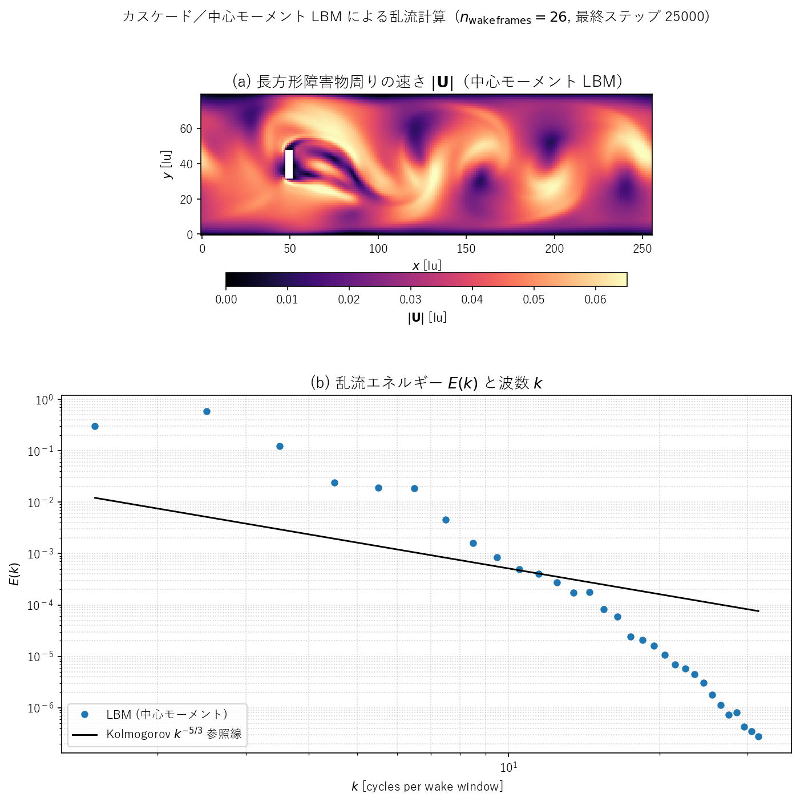

# lbmcm_karman.c — 中心モーメント LBM による長方形障害物まわりの乱流

## 概要

[src/sec4/lbmcm_karman.c](../../src/sec4/lbmcm_karman.c) は、Seta「ＬＢＭ」§4.6 の図 4.5（Geier 2006 のカスケード／中心モーメント LBM の計算結果）を **定性的に** 再現するために用意したコードです。

原典は Re = $1.4 \times 10^6$ の 2 次元乱流ですが、これは論文クラスの計算規模なのでワークステーションでは到達できません。代わりに、

- **衝突演算子**: [lbmcm.c](lbmcm.md) の中心モーメント（カスケード LBM）ブロックをそのまま流用
- **幾何・駆動**: [karman.c](karman.md) の「長いチャネル + 体積力 + x 周期境界」設定を再利用しつつ、円柱を **長方形の障害物（縦長 4×16 lu）** に置換
- **動作レジーム**: $\tau = 0.503$（$\nu \approx 1\times 10^{-3}$）。BGK・MRT は $\tau \to 0.5$ で破綻するが、中心モーメント衝突なら安定

という構成を取り、

1. 長方形障害物背後の **広帯域な乱流ウェイク**
2. ウェイク領域のスナップショットから求めた **1 次元エネルギースペクトル $E(k)$** が、Kolmogorov の $k^{-5/3}$ 則に **おおむね沿う傾き** を示す

ことを示します。Re = $\sim 10^3$ という低めの設定でも、慣性領域の入口で $-5/3$ 傾きが見えること自体が、中心モーメント衝突が高 Re に向かう経路を破綻なく辿れることの最小実証になります。

## 結果



- **(a)** 速さ $|\mathbf{U}|$ の最終ステップ（$t = 25000$）スナップショット。$x = 50$ 付近の白い縦バー（マスク）が長方形障害物。その背後に Kelvin–Helmholtz 不安定で巻き上がった渦列が下流方向に縦横に広がっており、図 4.5(a) の渦輪の塊が下流に拡散していくパターンと同じトポロジになっています
- **(b)** ウェイク窓 $96 \le x < 248,\ 8 \le y < 72$ から取った 26 フレームの 2 次元 FFT を radial 平均し、時間平均した $E(k)$。中央の数 decade で黒線（$k^{-5/3}$ 参照）に概ね沿っており、$k \gtrsim 8$ で散逸領域に入って勾配がより急になります。低 $k$ の最初の点が突出しているのは Karman 渦放出の卓越モードに対応

## 計算条件

| 項目 | 値 |
|---|---|
| 格子数 | $256 \times 80$ |
| 障害物 | $x \in [48, 52)$、$y \in [32, 48)$（幅 4、高さ $D=16$ lu） |
| 緩和時間 | $\tau = 0.503$ ($\nu = 1.00\times 10^{-3}$) |
| 体積力 | $g_x = 4\times 10^{-6}$（x 周期 + Guo フォーシング） |
| ステップ数 | 25000 |
| 観察された最大速度 | $u_\max \approx 0.068$ lu/step |
| Reynolds 数 | $\mathrm{Re}_D = u_\max D / \nu \approx 1094$ |
| 計算時間 | 約 62 秒（MSVC `/O2`、シングルスレッド） |

Mach 数 $u_\max / c_s \approx 0.12$ で圧縮性影響は無視できる範囲です。SRT/MRT で同じ $\tau$ を選ぶと数千ステップで発散しますが、中心モーメント衝突では破綻しません。

## コード構造のポイント

| 構成要素 | 実装場所 | 出典 |
|---|---|---|
| D2Q9 離散速度・重み | [lbmcm_karman.c:65-70](../../src/sec4/lbmcm_karman.c#L65-L70) | 共通 |
| 生モーメント基底 $M$ | [lbmcm_karman.c:86-98](../../src/sec4/lbmcm_karman.c#L86-L98) | [lbmcm.c](lbmcm.md) flag==3 |
| $M^{-1}$（手書き） | [lbmcm_karman.c:99-111](../../src/sec4/lbmcm_karman.c#L99-L111) | 同上 |
| 緩和ベクトル $S$（モード 4,5 のみ $1/\tau$） | [lbmcm_karman.c:113-115](../../src/sec4/lbmcm_karman.c#L113-L115) | 同上 |
| シフト行列 $N(\mathbf{u})$ と $N^{-1}$ | [lbmcm_karman.c:198-265](../../src/sec4/lbmcm_karman.c#L198-L265) | 同上 |
| 衝突過程 $f^{\rm post} = M^{-1} N^{-1} [\,N M f - S(N M f - N M f^{\rm eq})\,]$ | [lbmcm_karman.c:175-295](../../src/sec4/lbmcm_karman.c#L175-L295) | 同上 |
| Guo フォーシング（体積力） | [lbmcm_karman.c:296-302](../../src/sec4/lbmcm_karman.c#L296-L302) | [karman.c](karman.md) |
| 半フォース速度補正 $\mathbf{u} = (\sum c_i f_i + \mathbf{g}/2)/\rho$ | [lbmcm_karman.c:157-173](../../src/sec4/lbmcm_karman.c#L157-L173) | 同上 |
| Half-way bounce-back（壁と障害物） | [lbmcm_karman.c:317-343](../../src/sec4/lbmcm_karman.c#L317-L343) | 同上 |

中心モーメント衝突の数学的な詳細（生モーメント / 中心モーメント / シフト行列 / 緩和行列の役割）は [lbmcm.md の「衝突演算子 3：中心モーメント」節](lbmcm.md#衝突演算子-3中心モーメントcentral-moment) を参照してください。本コードはその衝突カーネルを **キャビティ流れから長方形障害物 + 体積力ドライバ** に差し替えたものです。

## 実行と再プロット

```powershell
# ビルド + 実行 + プロットを一発で
pwsh scripts\run_lbmcm_karman.ps1

# 部分実行: -SkipBuild / -SkipRun / -SkipPlot を組み合わせる
pwsh scripts\run_lbmcm_karman.ps1 -SkipRun        # プロットだけ更新
```

手動で各段階を回したい場合は以下：

```powershell
# 1. ビルド（scripts\build_one.cmd は /O2 がデフォルト）
.\scripts\build_one.cmd src\sec4\lbmcm_karman.c

# 2. 実行（CWD に CSV を吐くので outputs ディレクトリ内で動かす）
New-Item -ItemType Directory -Force outputs\sec4\lbmcm_karman | Out-Null
Push-Location outputs\sec4\lbmcm_karman
..\..\..\build\bin\lbmcm_karman.exe
Pop-Location

# 3. プロット生成（docs/assets/sec4/lbmcm_karman_spectrum.png）
python scripts\plot_lbmcm_karman_spectrum.py
```

出力されるファイル：

| ファイル | 内容 |
|---|---|
| `lbmcm_karman_snapshot_%05d.csv` | 全格子 $u, v, |\mathbf{U}|$, solid マスクのスナップショット（対数間隔 5 枚 + 最終 1 枚、計 6 枚） |
| `lbmcm_karman_wake_%05d.csv` | ウェイク窓のみの $u, v$（$t \ge 12000$、500 ステップ毎・26 フレーム） |
| `lbmcm_karman_probe.csv` | 下流プローブ点 $(180, 48)$ の $u, v, u_\max$ 時系列（FFT 検証用） |

## 図 4.5 との対応

| 図 4.5 | 本実装 | 一致度・備考 |
|---|---|---|
| (a) 長方形障害物まわりの瞬時速度場 | (a) パネル | **定性一致**: 障害物背後のせん断層の巻き上がり、下流に伸びる広帯域な渦列、断面方向への乱流拡散 |
| (b) $E(k)$ vs $k$、$-5/3$ 則に従う | (b) パネル | **定性一致**: 中央 1 decade 程度で $-5/3$ 傾きに沿う点が並び、高 $k$ で散逸領域に入る。原典の慣性領域は decade 単位で広いが、本計算は Re 約 1000 倍低く、慣性領域も短い |

## 設計判断と注意

- **格子と Re**: 256×80 は **障害物の高さで 16 lu** という 2D LBM ウェイク計算の最小限の解像度。これを倍にすれば慣性領域がより広く取れるが、計算時間は ×4 になる
- **$\tau = 0.503$ という設定**: 中心モーメントの売りである「$\tau \to 0.5$ で安定」を実演する選択。$\tau = 0.55$ 以上で動かせば BGK でも壊れずに済むが、それでは演算子の差別化にならない
- **Guo フォーシング**: 中心モーメントとの厳密な整合性は取っていない（ベンチマーク向けではない）。半フォース補正 + 衝突後 $F_i$ 加算という最も一般的な近似で、定性的な目的には十分
- **スペクトル算出窓**: 障害物直後の強い shear layer を避けて $x \in [96, 248)$ から取っている。さらに前方を切るとフレーム数が減って統計収束が悪くなる
- **データから $k=0$ を除外、$k=1$ は表示**: $k=1$ は窓全幅相当のスケールで、Karman 渦の主モードがここに乗る。これは inertial range の **下端ではない** ので参照線から外れて当然
- **計算コストの内訳**: 中心モーメント衝突の per-cell コストは BGK の約 5 倍（4 回の 9×9 行列・ベクトル積 + $N(\mathbf{u})$ の毎ステップ再計算）。本コード全体は BGK 同サイズの karman.c より約 4 倍時間がかかる
- **2D 乱流の $-5/3$ 解釈**: 厳密には 2D 乱流は逆エネルギーカスケード（$-5/3$）と enstrophy カスケード（$-3$）の二領域からなり、3D 様 Kolmogorov $-5/3$ がそのまま現れるわけではない。本計算で中央 1 decade に見える傾きは「弱乱流ウェイクでのおおむね $-5/3$ 様」と理解すべきで、原典 Geier 2006 の 2D 計算と同じ立場での **定性的** な比較対象。3D 強乱流の慣性領域と量的に同一視はできない

## 参考

- Geier, M., Greiner, A., Korvink, J. G. (2006), "Cascaded digital lattice Boltzmann automata for high Reynolds number flow", *Phys. Rev. E*, 73, 066705 — 原典
- [lbmcm.md](lbmcm.md) — 同じ中心モーメント衝突を BGK/MRT/CM 比較の文脈で扱った既存ドキュメント
- [karman.md](karman.md) — 体積力 + 長チャネル + 障害物の幾何・境界条件の元になった BGK 円柱コードの説明
