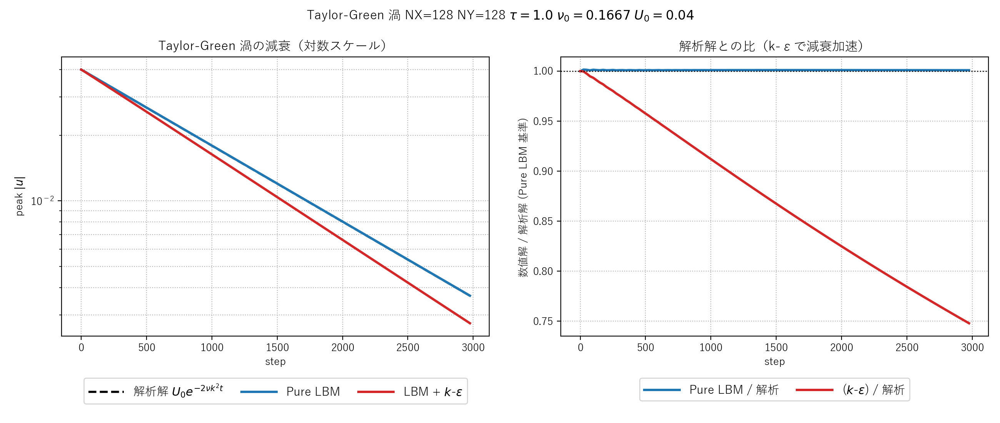
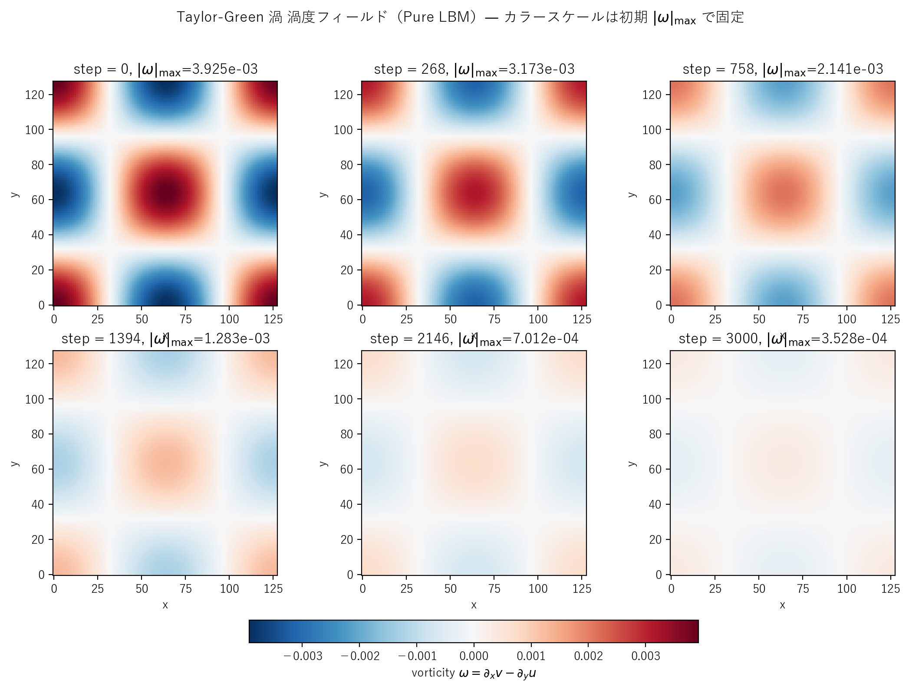
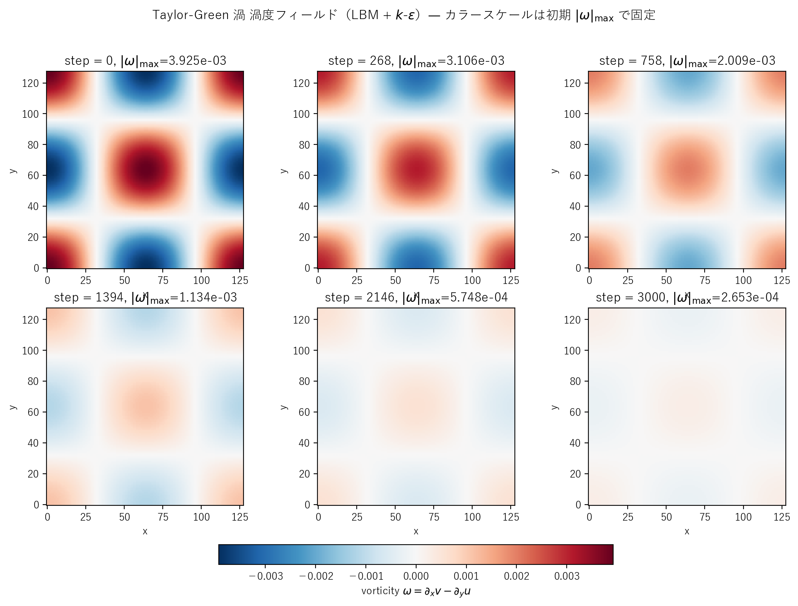

# taylor_green.c / taylor_green_keps.c 説明ドキュメント

## 概要

[src/sec4/taylor_green.c](../../src/sec4/taylor_green.c) と [src/sec4/taylor_green_keps.c](../../src/sec4/taylor_green_keps.c) は、2次元 Taylor-Green 渦（Taylor & Green 1937）の LBM シミュレーションです。完全周期境界・外力なし・正弦波型の初期速度場から始め、4つの定在渦が粘性で指数減衰する古典問題を再現します。

- **解析解**：$u(x,y,t) = U_0 \,e^{-2\nu k^2 t} \cdot (-\cos kx \sin ky)$、$v(x,y,t) = U_0 \,e^{-2\nu k^2 t} \cdot (\sin kx \cos ky)$
- **LBM 検証**：純 BGK で解析解の指数減衰を高精度で再現できる（最終時刻で誤差 0.1%）
- **k-ε 比較**：渦粘性 $\nu_t$ が分子粘性に上乗せされ、減衰が加速する様子を観察

## 検証結果サマリー

### 振幅減衰の比較



| 量 | Pure LBM | LBM + k-ε |
|---|---|---|
| 最終ステップでの $\max\|u\|$ | $3.67\times 10^{-3}$ | $2.74\times 10^{-3}$ |
| 解析解 $U_0 e^{-2\nu k^2 t}$ との比 | **1.0009**（完全一致） | 0.748（加速減衰） |
| 平均 $\nu_t/\nu_0$（最終） | – | 0.112 |

左図（対数スケール）：3本の線がほぼ重なっているのが Pure LBM と解析解、下にずれた赤線が k-ε。
右図：解析解との比。Pure LBM は1の周りで安定（実装健全性の証拠）、k-ε は時間経過とともに 1 → 0.75 へ単調減少（追加散逸の効果）。

### 渦度フィールドのスナップショット

#### Pure LBM



`step = 0` の初期条件で4つの定在渦（赤=正、青=負の渦度）が形成され、時間経過とともに振幅が一様に減衰します。空間パターンは保たれたまま振幅だけが減るのが Taylor-Green の特徴です。

#### LBM + k-ε



同じ初期条件・同じカラースケールで k-ε 版は **より早く** 渦度が減衰します。最終時刻でほぼ均一になっており、純 LBM 版より一段散逸が進んでいます。

## 物理と支配方程式

### Taylor-Green 渦の解析解

2次元非圧縮ナビエ・ストークスの厳密解：

$$
\begin{aligned}
u(x,y,t) &= -U_0 \cos(kx)\sin(ky) \,F(t) \\
v(x,y,t) &= +U_0 \sin(kx)\cos(ky) \,F(t) \\
p(x,y,t) &= -\tfrac{1}{4}\rho U_0^2 \bigl[\cos(2kx) + \cos(2ky)\bigr] F(t)^2 \\
F(t) &= \exp(-2\nu k^2 t)
\end{aligned}
$$

ここで $k = 2\pi/L$ は波数、$L$ は領域サイズです。本実装では $L = NX = NY$ と設定し、$k_x = k_y = 2\pi/NX$。

LBM 圧力は密度に変換し、初期 $\rho = 1 - \tfrac{3}{4} U_0^2 [\cos(2k_x x) + \cos(2k_y y)]$ で与えます（$c_s^2 = 1/3$）。

### LBM (D2Q9, BGK)

[kelbm.c](kelbm.md) と同じ BGK 衝突を使用：

$$
f_k(\mathbf{x}+\mathbf{c}_k, t+1) = f_k(\mathbf{x}, t) - \omega [f_k(\mathbf{x}, t) - f_k^{\mathrm{eq}}(\mathbf{x}, t)]
$$

外力なし（自由減衰）、両方向周期境界。

### k-ε モデル（k-ε 版のみ）

kelbm と同じ標準型 $k$-$\varepsilon$ 輸送方程式（対流・拡散・生成・散逸）。Taylor-Green 領域は周期境界のため**壁関数は不要**。

ただし留意点：標準 k-ε は本来せん断流向けの RANS 閉鎖モデルであり、周期等方的な減衰渦には**形式的には不適合**です。本実装は「k-ε のソース項挙動を観察するサニティチェック」程度に位置付けてください。物理的に妥当な減衰乱流モデリングには **動的 Smagorinsky LES** や **EDQNM** などが推奨されます。

LBM 衝突への結合は**局所的に変動する** $\tau_{\mathrm{eff}}$ で行います：

$$
\tau_{\mathrm{eff}}(\mathbf{x}, t) = \tfrac{1}{2} + 3(\nu_0 + \nu_t),\quad \nu_t = C_\mu k^2/\varepsilon
$$

これにより各セルで実効粘性が $\nu_0 + \nu_t$ になり、減衰が加速します。

## 計算条件

| 項目 | Pure LBM | k-ε 版 |
|---|---|---|
| 領域 | $128 \times 128$ | $128 \times 128$ |
| 緩和パラメータ | $\tau = 1.0$ | $\tau$ は局所値（基準は1.0） |
| 初期速度ピーク | $U_0 = 0.04$ | $U_0 = 0.04$ |
| 分子動粘性 | $\nu_0 = (\tau-1/2)/3 = 1/6$ | 同上 |
| 時間ステップ数 | NSTEPS = 3000 | NSTEPS = 3000 |
| 境界条件 | 全方向周期 | 全方向周期 |
| 初期 $k, \varepsilon$ | – | $k_0 = 5\!\times\!10^{-3} U_0^2$, $\varepsilon_0$ は $\nu_t/\nu_0=0.1$ になるよう設定 |
| スナップショット | step = 0, 268, 758, 1394, 2146, 3000 | 同上 |

## 実行方法

ビルド：

```powershell
scripts/build_one.cmd src/sec4/taylor_green.c
scripts/build_one.cmd src/sec4/taylor_green_keps.c
```

実行（出力 CSV をディレクトリ別に作るため `Push-Location`/`Pop-Location` で移動）：

```powershell
mkdir -Force outputs/sec4/taylor_green | Out-Null
Push-Location outputs/sec4/taylor_green
../../../build/bin/taylor_green.exe
Pop-Location

mkdir -Force outputs/sec4/taylor_green_keps | Out-Null
Push-Location outputs/sec4/taylor_green_keps
../../../build/bin/taylor_green_keps.exe
Pop-Location
```

プロット：

```powershell
python scripts/plot_taylor_green_decay.py
python scripts/plot_taylor_green_snapshots.py pure
python scripts/plot_taylor_green_snapshots.py keps
```

## 出力ファイル

- `tg_snapshot_*.csv`, `tg_keps_snapshot_*.csv`: 各時刻の `x,y,u,v,vorticity[,k,eps,nut]`
- `tg_history.csv`, `tg_keps_history.csv`: 25 ステップごとの最大 $|u|$ と解析解、k-ε 版は $k,\varepsilon,\nu_t$ の領域平均も

## 参考

- Taylor & Green (1937), "Mechanism of the production of small eddies from large ones", *Proc. R. Soc. London A*, 158, 499–521
- Brachet et al. (1983), "Small-scale structure of the Taylor-Green vortex", *J. Fluid Mech.*, 130, 411–452 — 3D 拡張のリファレンス
