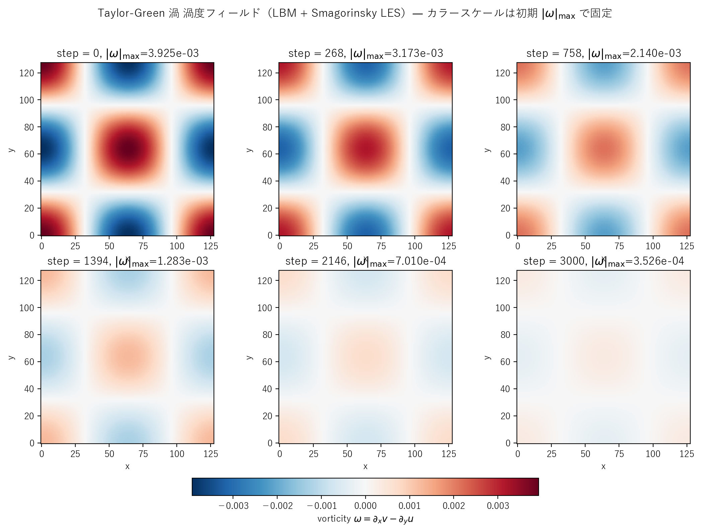

# taylor_green_les.c 説明ドキュメント

## 概要

[src/sec4/taylor_green_les.c](../../src/sec4/taylor_green_les.c) は、[taylor_green.c](taylor_green.md) と同じ完全周期・外力なしの 2 次元 Taylor-Green 渦に標準 **Smagorinsky LES** を結合した実装です。$k$-$\varepsilon$ 版（[taylor_green_keps.c](../../src/sec4/taylor_green_keps.c)）が解析減衰の **0.75 倍**（25% 加速減衰）を示すのに対し、Smagorinsky 版は**ほぼ解析解と区別できない**減衰を保ちます。

サブグリッド渦粘性は

$$
\nu_t = (C_s\,\Delta)^2 \sqrt{2 S_{ij}S_{ij}},\quad C_s = 0.16,\ \Delta = 1 \text{ LU}
$$

で局所決定し、$\tau_{\rm eff} = 1/2 + 3(\nu_0 + \nu_t)$ で BGK 衝突に取り込みます。

## 検証結果サマリー

### 振幅減衰



| 量 | Pure LBM | k-ε | **LES** |
|---|---|---|---|
| 最終ステップ $\max\|u\|$ | $3.67\times 10^{-3}$ | $2.74\times 10^{-3}$ | $3.67\times 10^{-3}$ |
| 解析解 $U_0 e^{-2\nu k^2 t}$ との比 | **1.0009** | 0.748 | **1.001** |
| 平均 $\nu_t/\nu_0$（最終） | – | 0.112 | $1.6\times 10^{-5}$ |
| 平均 $\nu_t/\nu_0$（履歴平均） | – | – | $9\times 10^{-5}$ |

LES の $\nu_t/\nu_0$ は最大でも 1e-4 程度に留まり、純 LBM とほぼ同じ減衰になります。これは Smagorinsky が**瞬時の $\|S\|$ に応答する**ため、渦が減衰するにつれ $\|S\|$ も減衰し $\nu_t$ がさらに小さくなる自己終息的な挙動を取るからです。

一方 k-ε は輸送方程式で過去に生成された $k$ が散逸 $\varepsilon$ まで時間遅れで残るため、能動的に減衰を加速します。

### 物理的意味

標準 k-ε は形式的に**等方乱流に不適**であり、過剰な追加散逸を生むことは理論的に予測されます。LES は瞬時応答型なので等方減衰場でも**解析解を破壊しない**——本ケースは「等方減衰におけるモデル設計思想の違い」を最も明確に示す比較対象です。

## Smagorinsky モデル実装

`update_les()`（[taylor_green_les.c#L99-L118](../../src/sec4/taylor_green_les.c#L99-L118)）の手順：

1. 速度勾配を周期境界の 2 次中心差分で算出
2. $|S| = \sqrt{2 S_{ij}S_{ij}}$ を計算
3. $\nu_t = C_s^2 |S|$ をセルごとに `nut_field[i]` に格納

**Taylor-Green 特有の単純さ**：周期境界のため壁処理が不要。k-ε 版では `KEPS_DT = 0.05` の追加時間刻みと安定化のための $k$ シード（$0.005 U_0^2$）が必要でしたが、Smagorinsky では**一切不要**です。

## 計算条件

| 項目 | 値 |
|---|---|
| 領域 | $128 \times 128$ |
| 緩和時間（基準） | $\tau = 1.0$ |
| 初期速度ピーク | $U_0 = 0.04$ |
| Smagorinsky 定数 | $C_s = 0.16$ |
| フィルタ幅 | $\Delta = 1$ LU |
| 分子動粘性 | $\nu_0 = 1/6$ |
| 境界条件 | 全方向周期 |
| 時間ステップ数 | NSTEPS = 3000 |
| スナップショット | step = 0, 268, 758, 1394, 2146, 3000 |

## 実行方法

```powershell
# LES 版のみ
.\scripts\run_taylor_green.ps1 -LesOnly

# 全 variant（pure, k-ε, LES）
.\scripts\run_taylor_green.ps1
```

出力先：`outputs/sec4/taylor_green_les/`（履歴 + 6 枚のスナップショット）

## 出力ファイル

- `tg_les_snapshot_*.csv`: `x,y,u,v,vorticity,nut`
- `tg_les_history.csv`: 25 ステップごとに `step,u_max,u_max_pure_theory,nut_mean`

## 参考

- Smagorinsky (1963), "General circulation experiments with the primitive equations", *Monthly Weather Review*
- Taylor & Green (1937), "Mechanism of the production of small eddies from large ones", *Proc. R. Soc. London A*
- [taylor_green.md](taylor_green.md): pure / k-ε 版の詳細
- [les_summary.md](les_summary.md), [keps_summary.md](keps_summary.md): クロスケース比較
