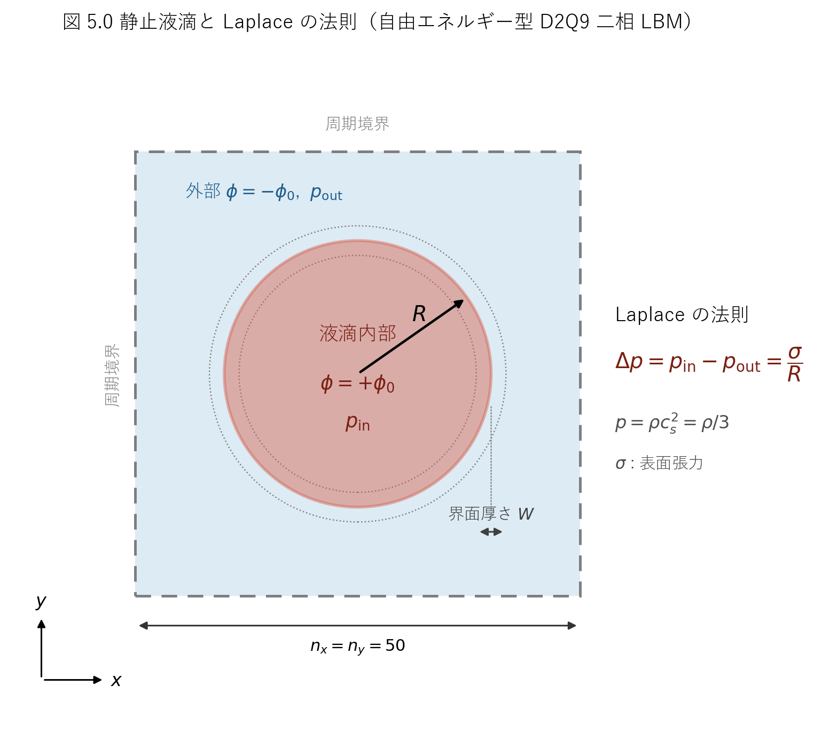
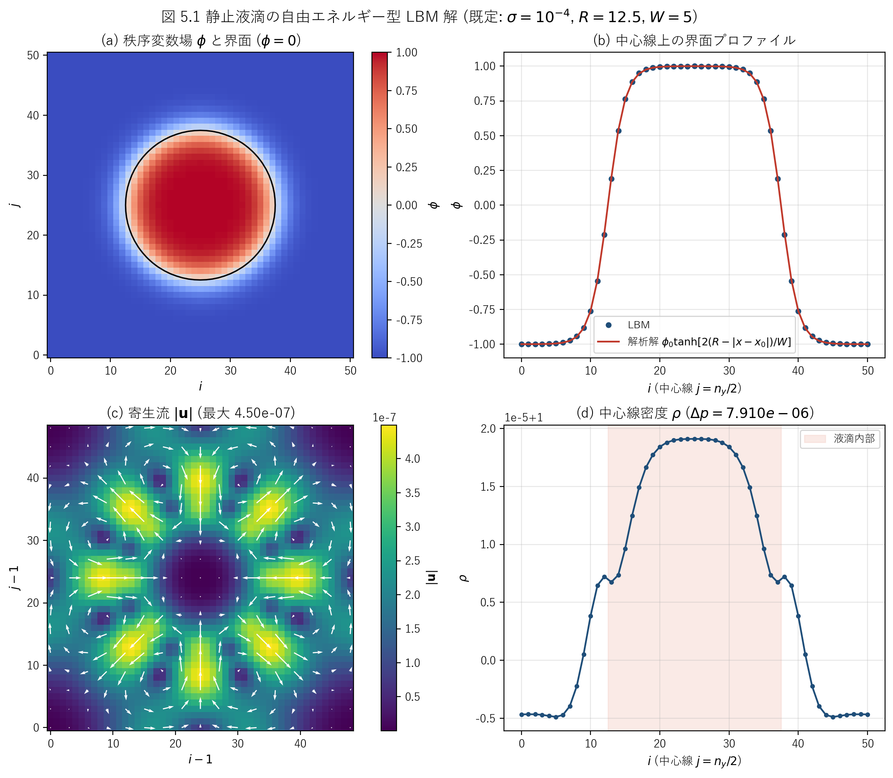
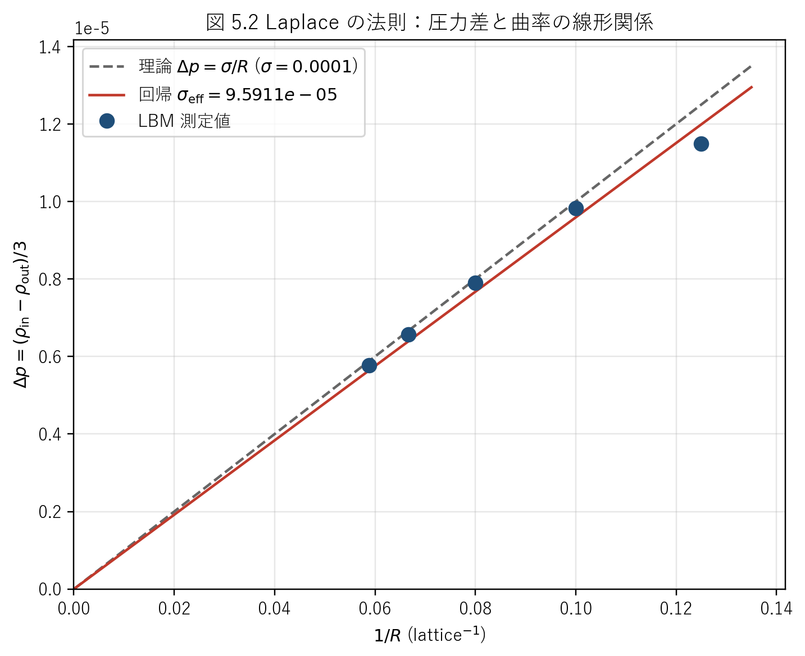

# lbmlap.c 説明ドキュメント

## 概要

[src/sec5/lbmlap.c](../../src/sec5/lbmlap.c) は、自由エネルギー型（free-energy / diffuse-interface）の二相格子ボルツマン法で **静止液滴** を解き、**Laplace の法則** $\Delta p = \sigma/R$ を検証するサンプルです。速度場（密度・運動量）を担う分布関数 $f$ と、相場（秩序変数 $\phi$）を担う分布関数 $g$ の 2 本を D2Q9 上で同時に解きます。表面張力は化学ポテンシャル勾配からの体積力 $\mathbf{F} = \mu\nabla\phi$ として速度場に作用させます。

この文書では、次の点を順に説明します。

- 自由エネルギー型二相 LBM と Cahn–Hilliard 型相場方程式の対応
- 表面張力 $\sigma$ から $\beta, \kappa$ を逆算する構成
- $f, g$ それぞれの平衡分布関数と力項
- Laplace の法則による検証結果（既定 1 点・半径スイープ）
- 界面プロファイル（tanh）と寄生流（spurious currents）の評価

このコードでは、次の処理を 1 本のプログラムで行っています。

- 中心に半径 $R = n_x/4$ の円形液滴を tanh プロファイルで初期化する
- $f$（速度場）と $g$（相場）を BGK 衝突・力項・streaming で反復する
- 全周期境界（壁なし）で力学的平衡へ収束させる
- 収束後に密度・速度・相場と Laplace 圧力差を出力する

## 扱う物理量

| 記号 | 意味 | コード変数 |
| --- | --- | --- |
| $\rho$ | 密度（圧力 $p=\rho/3$ の素） | `rho` |
| $u, v$ | 速度成分 | `u`, `v` |
| $\phi$ | 秩序変数（液滴内 $+\phi_0$, 外 $-\phi_0$） | `phi` |
| $\mu$ | 化学ポテンシャル | `che` |
| $\mathbf{F}$ | 表面張力体積力 $\mu\nabla\phi$ | `fx`, `fy` |
| $f_k$ | 速度場の分布関数 | `f` |
| $g_k$ | 相場の分布関数 | `g` |
| $\sigma$ | 表面張力 | `sig` |
| $W$ | 界面厚さ | `wid` |
| $\phi_0$ | double-well の井戸位置 | `phi0` |
| $\beta$ | double-well 係数 | `beta` |
| $\kappa$ | 勾配エネルギー係数 | `kap` |
| $\gamma$ | 移動度係数 | `gamma` |
| $\tau_f, \tau_g$ | 緩和時間（$f$, $g$） | `tauf`, `taug` |

## 対象問題：静止液滴と Laplace の法則

界面を厚さ $W$ の遷移層で表す diffuse-interface 法で、半径 $R$ の円形液滴の力学的平衡を解きます。表面張力 $\sigma$ をもつ曲率半径 $R$ の界面では、内外の圧力差が

$$
\Delta p = p_{\mathrm{in}} - p_{\mathrm{out}} = \frac{\sigma}{R}
$$

（2 次元では $\Delta p = \sigma/R$、3 次元なら $2\sigma/R$）で与えられます。これが **Laplace の法則** で、本コードはこの関係を直接出力して検証します。模式図を図 5.0 に示します。



図 5.0　全周期正方領域（$n_x = n_y = 50$）に置いた半径 $R$ の静止液滴。界面は厚さ $W$ の遷移層で表現され、内外の圧力差が Laplace の法則 $\Delta p = \sigma/R$ に従う。圧力は状態方程式 $p = \rho c_s^2 = \rho/3$ から得る。

## 自由エネルギーと化学ポテンシャル

相分離を駆動する自由エネルギー密度は double-well + 勾配項

$$
\psi(\phi) = \beta\,(\phi^2 - \phi_0^2)^2 + \frac{\kappa}{2}|\nabla\phi|^2
$$

で、化学ポテンシャルはその変分

$$
\mu = \frac{\delta \Psi}{\delta \phi}
    = 4\beta\,\phi\,(\phi^2 - \phi_0^2) - \kappa\,\nabla^2\phi
$$

です。コードでは 5 点ラプラシアン（周期境界）を使って

[lbmlap.c:243-244](../../src/sec5/lbmlap.c#L243-L244)

$$
\nabla^2\phi \approx \phi_{i+1,j} + \phi_{i-1,j} + \phi_{i,j+1} + \phi_{i,j-1} - 4\phi_{i,j}
$$

$$
\mu_{i,j} = 4\beta\,(\phi_{i,j}^2 - \phi_0^2)\,\phi_{i,j} - \kappa\,\nabla^2\phi
$$

と実装しています。

### $\sigma$ から $\beta, \kappa$ を逆算

平面界面の平衡解 $\phi(x) = \phi_0\tanh(2x/W)$ を上の自由エネルギーに代入すると、界面厚さ $W$ と表面張力 $\sigma$ が $\beta, \kappa$ で決まります。本コードはこれを逆に解いて、**入力した $\sigma$ から** [lbmlap.c:70-72](../../src/sec5/lbmlap.c#L70-L72)

$$
\beta = \frac{3}{4}\,\frac{\sigma}{W}\,\phi_0^4,\qquad
\kappa = \frac{3}{8}\,\sigma\,W\,\phi_0^{-2}
$$

と定めています。既定値 $\sigma = 10^{-4}$, $W = 5$, $\phi_0 = 1$ では

$$
\beta = 0.75\times\frac{10^{-4}}{5} = 1.5\times10^{-5},\qquad
\kappa = 0.375\times10^{-4}\times5 = 1.875\times10^{-4}
$$

です。この構成のため、ユーザは表面張力 $\sigma$ を直接与えるだけで済みます。

## 格子モデル

D2Q9 を使い、離散速度は [lbmlap.c:91-95](../../src/sec5/lbmlap.c#L91-L95)

$$
\mathbf{c}_0=(0,0),\quad
\mathbf{c}_1=(1,0),\ \mathbf{c}_2=(0,1),\ \mathbf{c}_3=(-1,0),\ \mathbf{c}_4=(0,-1),
$$

$$
\mathbf{c}_5=(1,1),\ \mathbf{c}_6=(-1,1),\ \mathbf{c}_7=(-1,-1),\ \mathbf{c}_8=(1,-1)
$$

で、重みは $w_0=4/9$, $w_{1\sim4}=1/9$, $w_{5\sim8}=1/36$ です。格子音速は $c_s = 1/\sqrt{3}$、状態方程式は $p = \rho c_s^2 = \rho/3$ です。

## 平衡分布関数

### 速度場 $f$

標準の D2Q9 平衡分布に、相場と化学ポテンシャルの積 $\phi\mu$ による熱力学的圧力補正を加えた形です。[lbmlap.c:132-145](../../src/sec5/lbmlap.c#L132-L145)

$$
f_0^{\mathrm{eq}} = \frac{4}{9}\rho\left(1 - \tfrac{3}{2}|\mathbf{u}|^2 - \tfrac{15}{4}\phi\mu\right)
$$

$$
f_k^{\mathrm{eq}} = w_k\rho\left(1 + 3\,\mathbf{c}_k\!\cdot\!\mathbf{u}
  + \tfrac{9}{2}(\mathbf{c}_k\!\cdot\!\mathbf{u})^2 - \tfrac{3}{2}|\mathbf{u}|^2
  + 3\,\phi\mu\right)\quad(k\ge1)
$$

ここで重みは $f_0$ の係数 $4/9$ に合わせ、$k=1\sim4$ で $1/9$、$k=5\sim8$ で $1/36$ です。0 次モーメント $\sum_k f_k^{\mathrm{eq}} = \rho$ が保たれます（$\phi\mu$ 項は $-\tfrac{15}{4}\cdot\tfrac{4}{9} + 3\cdot(4\cdot\tfrac19 + 4\cdot\tfrac1{36}) = 0$ で相殺）。

### 相場 $g$

相場分布の平衡は、移動度係数 $\gamma$ と化学ポテンシャル $\mu$ を含む形で [lbmlap.c:133-144](../../src/sec5/lbmlap.c#L133-L144)

$$
g_0^{\mathrm{eq}} = \phi - \frac{5}{9}\gamma\mu,\qquad
g_k^{\mathrm{eq}} = w_k\left(\gamma\mu + 3\,\phi\,\mathbf{c}_k\!\cdot\!\mathbf{u}\right)\quad(k\ge1)
$$

です（$k\ge1$ の重みは $1/9, 1/36$）。0 次モーメントは $\sum_k g_k^{\mathrm{eq}} = \phi$ となり（$-\tfrac59\gamma\mu + \gamma\mu(4\cdot\tfrac19 + 4\cdot\tfrac1{36}) = 0$）、これにより相場の輸送方程式

$$
\frac{\partial \phi}{\partial t} + \nabla\!\cdot(\phi\mathbf{u}) = M\,\nabla^2\mu
$$

（Cahn–Hilliard 型）が再現されます。移動度 $M$ は $\gamma(\tau_g - 1/2)$ に比例します。

## 時間発展

1 ステップは次の順に進みます。

### 1. Collision（BGK, $f$ と $g$）

[lbmlap.c:149-154](../../src/sec5/lbmlap.c#L149-L154)

$$
f_k \leftarrow f_k - \frac{f_k - f_k^{\mathrm{eq}}}{\tau_f},\qquad
g_k \leftarrow g_k - \frac{g_k - g_k^{\mathrm{eq}}}{\tau_g}
$$

既定では $\tau_f = \tau_g = 0.7$ です。

### 2. Forcing（表面張力の体積力）

化学ポテンシャル勾配から体積力 $\mathbf{F} = \mu\nabla\phi$ を中心差分で求め [lbmlap.c:171-172](../../src/sec5/lbmlap.c#L171-L172)

$$
F_x = \mu_{i,j}\,\frac{\phi_{i+1,j} - \phi_{i-1,j}}{2},\qquad
F_y = \mu_{i,j}\,\frac{\phi_{i,j+1} - \phi_{i,j-1}}{2}
$$

これを Guo 型の力項（$(1 - 1/(2\tau_f))$ 補正つき）として $f$ に加えます。[lbmlap.c:176-200](../../src/sec5/lbmlap.c#L176-L200)

$$
F_k = w_k\left(1 - \frac{1}{2\tau_f}\right)
  \Big[3(\mathbf{c}_k\!\cdot\!\mathbf{F}) + 9\,(\mathbf{c}_k\mathbf{c}_k\!:\!\mathbf{u}\mathbf{F}) - 3\,\mathbf{u}\!\cdot\!\mathbf{F}\Big]
$$

rest 成分は $F_0 = -\tfrac43\left(1 - \tfrac{1}{2\tau_f}\right)\mathbf{u}\!\cdot\!\mathbf{F}$ です。

### 3. Streaming

[lbmlap.c:203-216](../../src/sec5/lbmlap.c#L203-L216) で $f, g$ を `ftmp`, `gtmp` に退避してから移流させ、配列端は周期的に折り返します（**全周期境界**で、上書きする壁条件はありません）。

### 4. 巨視量の再構成

[lbmlap.c:219-235](../../src/sec5/lbmlap.c#L219-L235)

$$
\rho = \sum_k f_k,\quad
\mathbf{u} = \frac{1}{\rho}\sum_k f_k\mathbf{c}_k + \frac{\mathbf{F}}{2},\quad
\phi = \sum_k g_k
$$

ここで運動量和を $\rho$ で割ってから力項の半ステップ補正 $\tfrac12\mathbf{F}$ を加えています（Guo forcing の標準処理）。その後、化学ポテンシャル $\mu$ を更新します。

## 境界条件

本問題は **全周期境界** です。streaming の端処理は周期接続で、壁による bounce-back や速度指定は行いません。静止液滴の力学的平衡を扱う問題なので、外力も重力もありません。

## 収束判定とデータ出力

連続 2 ステップの速度差の最大値 [lbmlap.c:247-251](../../src/sec5/lbmlap.c#L247-L251)

$$
\mathrm{Norm} = \max_{i,j}\sqrt{(u^n_{i,j}-u^{n-1}_{i,j})^2 + (v^n_{i,j}-v^{n-1}_{i,j})^2}
$$

を毎ステップ計算し、外側ループ（最大 1000 回 × 内側 500 = 50 万ステップ）の中で

$$
\mathrm{Norm} < 10^{-10}\quad\text{かつ}\quad \mathrm{time} > 10000
$$

を満たした時点でデータファイルを書き出して `exit(0)` します。既定条件では time ≈ 10500 で収束し、最終 Norm は $\sim 5\times10^{-11}$ です。

500 ステップごとに次を標準出力に表示します。

- `laplace's law` : 理論値 $\sigma/R$ と測定値 $(\rho_{\mathrm{center}} - \rho_{\mathrm{corner}})/3$
- `index function` / `velocity` / `density` : $\phi$, $|\mathbf{u}|$, $\rho$ の最大・最小と ASCII コンタ図

## 数値設定

| 項目 | 値 |
| --- | ---: |
| 格子点数 $n_x = n_y$ | 50（配列 `DIM = 51`） |
| 半径 $R$ | $n_x/4 = 12.5$ |
| 界面厚さ $W$ | 5 |
| 表面張力 $\sigma$ | $10^{-4}$ |
| $\phi_0$ | 1.0 |
| $\gamma$ | 10.0 |
| $\tau_f = \tau_g$ | 0.7 |

## 解析結果

リポジトリのルートで次を実行すると、データと図を再生成できます。

```powershell
cmd /c scripts\run_one.cmd src\sec5\lbmlap.c
d:/work/LBMcode/.venv/Scripts/python.exe scripts/plot_lbmlap_schematic.py
d:/work/LBMcode/.venv/Scripts/python.exe scripts/plot_lbmlap_results.py
d:/work/LBMcode/.venv/Scripts/python.exe scripts/run_lbmlap_radius_sweep.py
```

### 主要結果図



図 5.1　既定条件（$\sigma=10^{-4}$, $R=12.5$, $W=5$）での収束場。(a) 秩序変数 $\phi$ と界面（$\phi=0$）、(b) 中心線上の界面プロファイルと tanh 解析解の比較、(c) 寄生流 $|\mathbf{u}|$ のベクトル場、(d) 中心線密度 $\rho$（内外の圧力差に対応）。

この図の見どころは次の 3 点です。

- (b) 界面プロファイルが解析解 $\phi(x) = \phi_0\tanh\!\big(2(R - |x - x_0|)/W\big)$ とよく一致する（RMS 誤差 $3.85\times10^{-3}$）
- (c) 寄生流は界面まわりに 8 回対称の典型パターンを示すが、最大でも $|\mathbf{u}|_{\max} = 4.50\times10^{-7}$ と極めて小さい
- (d) 液滴内部で密度が高く、$\Delta p = (\rho_{\mathrm{in}} - \rho_{\mathrm{out}})/3$ が正となる

### Laplace の法則ベンチマーク

既定の 1 点（$R = 12.5$）では次のとおりで、誤差は約 1.1% です。測定値は収束時に出力される `datalap` のフル精度値（`%10.8e`）から読み取っています。

| 量 | 理論 $\sigma/R$ | 測定 $\Delta p$ | 相対誤差 |
| --- | ---: | ---: | ---: |
| 圧力差 | $8.000\times10^{-6}$ | $7.909\times10^{-6}$ | 1.14% |

さらに液滴半径 $R$ を $8 \sim 17$ の範囲でふり、$\Delta p$ と $1/R$ の線形関係を検証しました（図 5.2）。



図 5.2　半径 $R$ を変えたときの圧力差 $\Delta p$ と曲率 $1/R$ の関係。破線は理論 $\Delta p = \sigma/R$（$\sigma=10^{-4}$）、実線は原点を通る最小二乗回帰、丸印は LBM 測定値。回帰の傾きから求めた実効表面張力は $\sigma_{\mathrm{eff}} = 9.59\times10^{-5}$ で、入力値との差は約 4.1% である。

対応する数値は [docs/sec5/generated/lbmlap_laplace_radius.csv](generated/lbmlap_laplace_radius.csv) に保存しています。

| $R$ | $1/R$ | 理論 $\sigma/R$ | 測定 $\Delta p$ | 相対誤差 |
| ---: | ---: | ---: | ---: | ---: |
| 8.0 | 0.12500 | $1.250\times10^{-5}$ | $1.1497\times10^{-5}$ | 8.02% |
| 10.0 | 0.10000 | $1.000\times10^{-5}$ | $9.8226\times10^{-6}$ | 1.77% |
| 12.5 | 0.08000 | $8.000\times10^{-6}$ | $7.9090\times10^{-6}$ | 1.14% |
| 15.0 | 0.06667 | $6.667\times10^{-6}$ | $6.5646\times10^{-6}$ | 1.53% |
| 17.0 | 0.05882 | $5.882\times10^{-6}$ | $5.7791\times10^{-6}$ | 1.75% |

読み取りの要点は次のとおりです。

- $\Delta p$ は $1/R$ に概ね比例し、Laplace の法則が再現されている
- 最小半径 $R = 8$ で誤差が 8% と大きいのは、界面厚さに対する半径比 $R/W = 1.6$ が小さく、diffuse-interface 近似（鋭い界面極限 $R/W \gg 1$）から外れるため
- $R/W \gtrsim 2$（$R \ge 10$）では誤差が 1〜2% に収まる

### 界面プロファイルと寄生流

界面プロファイルの数値は [docs/sec5/generated/lbmlap_interface_profile.csv](generated/lbmlap_interface_profile.csv) に保存しています（中心線上の $\phi_{\mathrm{LBM}}$, tanh 解析解, 絶対誤差）。寄生流（spurious currents）は diffuse-interface 系で界面の離散化により不可避に生じる微小な定常流ですが、本実装では Guo 型の力項と $\phi\mu$ 補正により $|\mathbf{u}|_{\max} \sim 10^{-7}$ に抑えられています。これは表面張力（$\Delta p \sim 10^{-6}$）に対しても十分小さい値です。

## このコードの見どころ

- 自由エネルギー型二相 LBM を、速度場 $f$ と相場 $g$ の最小構成（D2Q9 × 2）で実装している
- 表面張力 $\sigma$ を直接入力し、$\beta, \kappa$ を内部で逆算するため物性指定が直感的
- Laplace の法則という閉形式ベンチマークを、理論値と測定値の両方を毎ステップ出力して直接比較できる
- 寄生流の大きさ（実装品質の指標）を速度場の出力から定量評価できる

## 出力ファイル

[src/sec5/lbmlap.c](../../src/sec5/lbmlap.c) は収束後に次を出力します。今回の実行例では [outputs/sec5/lbmlap](../../outputs/sec5/lbmlap) に保存されます。

- `datalap`: 第 1 列 $n_x/2$（中心座標）、第 2 列 測定 $\Delta p$
- `dataphi2D`: 中心線 $j=n_y/2$ 上の $\phi$（$i=0\ldots n_x$, 51 値）
- `datau`: $u$ の内部場（$i,j = 1\ldots n_x{-}1$, **49 × 49**）
- `datav`, `datarho`, `dataphi`: $v$, $\rho$, $\phi$ の全体場（$0\ldots n_x$, **51 × 51**）

> **注意**：`datau` だけが内部 49 × 49、他の場は番兵込み 51 × 51 で次元が異なります。プロット時は速度の内部ブロックを揃える必要があります（[scripts/plot_lbmlap_results.py](../../scripts/plot_lbmlap_results.py) では `datav` を `[1:50, 1:50]` に切り出して整合させています）。また `datalap` の第 1 列は半径 $R=12.5$ ではなく中心座標 $n_x/2=25$ である点にも注意してください。
