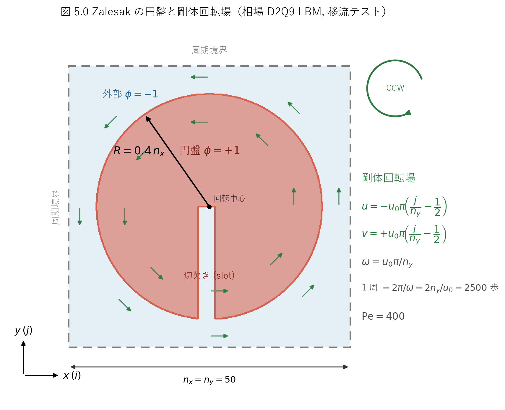
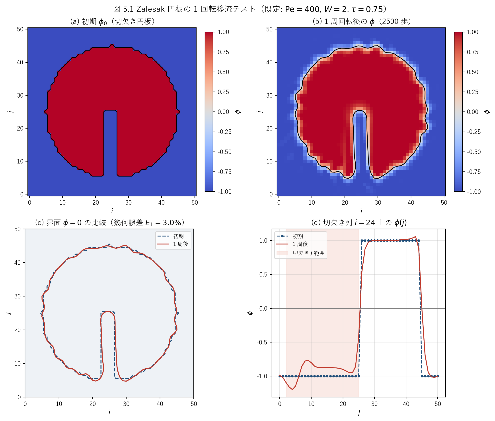
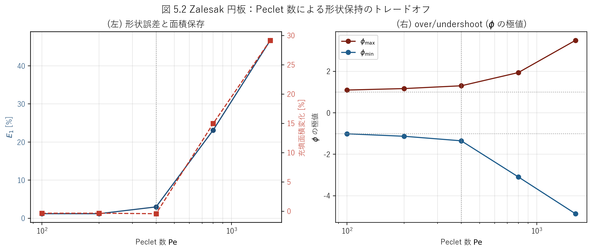

# lbmzalesak.c 説明ドキュメント

## 概要

[src/sec5/lbmzalesak.c](../../src/sec5/lbmzalesak.c) は、自由エネルギー型（free-energy / diffuse-interface）の相場（秩序変数 $\phi$）を D2Q9 LBM で移流させ、**Zalesak の円盤**（切欠き付き円板の剛体回転）で **界面移流スキームの形状保持性** を評価するサンプルです。[lbmlap.c](../../src/sec5/lbmlap.c) と異なり速度場（密度・運動量）は **解かず**、解析的に与えた剛体回転場で相場分布関数 $g$ だけを時間発展させます。

この文書では、次の点を順に説明します。

- Zalesak の円盤テストと剛体回転場の構成
- 相場（Cahn–Hilliard 型）の支配方程式と移動度 $M$・Peclet 数 $\mathrm{Pe}$ の関係
- 相場分布関数 $g$ の平衡分布（衝突ループで使う形と初期化で使う形の差異）
- SRT / MRT / 力項つきの 4 つの衝突モード（`flag`）
- 1 回転後の形状・面積・質量保存性と幾何誤差 $E_1$
- Peclet 数を変えたときの形状誤差の傾向

このコードでは、次の処理を 1 本のプログラムで行っています。

- 中心に半径 $R = 0.4\,n_x = 20$ の円板を置き、下方向に開いた切欠き（slot）をくり抜いて $\phi=\pm1$ の鋭い初期場を作る
- 各ステップで剛体回転の速度場 $\mathbf{u}$ を解析的に与える
- 相場分布 $g$ を衝突・（任意で力項・）streaming で移流する
- ちょうど 1 回転（2500 ステップ）させて $\phi$ を出力する

## 扱う物理量

| 記号 | 意味 | コード変数 |
| --- | --- | --- |
| $\phi$ | 秩序変数（円板内 $+1$, 外 $-1$） | `phi` |
| $\mu$ | 化学ポテンシャル | `che` |
| $u, v$ | 速度成分（解析的に指定） | `u`, `v` |
| $g_k$ | 相場の分布関数 | `g` |
| $g_k^{\mathrm{eq}}$ | 相場の平衡分布関数 | `g0` |
| $\sigma$ | 表面張力 | `sig` |
| $W$ | 界面厚さ | `wid` |
| $\phi_0$ | double-well の井戸位置 | `phi0` |
| $\beta$ | double-well 係数 | `beta` |
| $\kappa$ | 勾配エネルギー係数 | `kap` |
| $\gamma$ | 移動度係数 | `gamma` |
| $M$ | 移動度（Cahn–Hilliard） | `mo` |
| $\mathrm{Pe}$ | Peclet 数 | `pe` |
| $u_0$ | 回転速度スケール | `u0` |
| $\tau$ | 緩和時間 | `tau` |

## 対象問題：Zalesak の回転円盤

切欠きを入れた円板（slotted disk）を剛体回転場に置き、形状を保ったまま回転し続けられるかを見る古典的な界面移流テストです（Zalesak 1979, *J. Comput. Phys.* **31**, 335–362）。鋭い角（切欠きの隅）をもつため、数値拡散・数値分散の双方が形状の崩れとして現れ、移流スキームの品質を端的に評価できます。模式図を図 5.0 に示します。



図 5.0　全周期正方領域（$n_x = n_y = 50$）の中心に置いた半径 $R = 0.4\,n_x = 20$ の切欠き円板。各点に剛体回転速度 $\mathbf{u}$（反時計回り CCW）を与え、ちょうど 1 周（2500 ステップ）させて初期形状との一致を評価する。

### 剛体回転場

速度場は密度・運動量から求めるのではなく、毎ステップ解析的に与えます。[lbmzalesak.c:235-238](../../src/sec5/lbmzalesak.c#L235-L238)

$$
u_{i,j} = -u_0\,\pi\left(\frac{j}{n_y} - \frac12\right),\qquad
v_{i,j} = +u_0\,\pi\left(\frac{i}{n_y} - \frac12\right)
$$

これは中心 $(n_x/2, n_y/2)$ まわりの剛体回転 $\mathbf{u} = \boldsymbol{\omega}\times\mathbf{r}$ で、角速度は

$$
\omega = \frac{u_0\,\pi}{n_y}
$$

です。$u = -\omega(y-y_c)$, $v = +\omega(x-x_c)$ の符号から回転は **反時計回り（CCW）** です。既定値 $u_0 = 0.04$, $n_y = 50$ では $\omega = 0.04\pi/50 \approx 2.513\times10^{-3}$ rad/step なので、1 周に要するステップ数は

$$
T = \frac{2\pi}{\omega} = \frac{2\,n_y}{u_0} = \frac{2\times50}{0.04} = 2500
$$

です。コードの二重ループ `loop1` × `loop2` = $50\times50 = 2500$ は **ちょうど 1 回転** に対応しており（[lbmzalesak.c:231-232](../../src/sec5/lbmzalesak.c#L231-L232)）、理想的には円板は初期位置・初期形状に戻ります。

### 相場の支配方程式

界面を厚さ $W$ の遷移層で表す diffuse-interface 法で、相場は Cahn–Hilliard 型の移流方程式

$$
\frac{\partial \phi}{\partial t} + \nabla\!\cdot(\phi\mathbf{u}) = M\,\nabla^2\mu
$$

に従います。右辺の移動度項 $M\nabla^2\mu$ は界面を平衡プロファイル（tanh）に保とうとする緩和で、純粋移流テストとしては小さい方が望ましい一方、過小だと界面が数値振動を起こします。化学ポテンシャル $\mu$ は自由エネルギー密度 $\psi(\phi)=\beta(\phi^2-\phi_0^2)^2 + \tfrac{\kappa}{2}|\nabla\phi|^2$ の変分

$$
\mu = 4\beta\,\phi\,(\phi^2 - \phi_0^2) - \kappa\,\nabla^2\phi
$$

で、コードでは 5 点ラプラシアン（周期境界）で [lbmzalesak.c:411-412](../../src/sec5/lbmzalesak.c#L411-L412)

$$
\nabla^2\phi \approx \phi_{i+1,j} + \phi_{i-1,j} + \phi_{i,j+1} + \phi_{i,j-1} - 4\phi_{i,j},\qquad
\mu_{i,j} = 4\beta\,(\phi_{i,j}^2 - \phi_0^2)\,\phi_{i,j} - \kappa\,\nabla^2\phi
$$

と実装しています。

### $\sigma$ から $\beta, \kappa$, 移動度, Peclet 数の構成

[lbmlap.c](../../src/sec5/lbmlap.c) と同じ逆算で、入力した表面張力 $\sigma$ と界面厚さ $W$ から [lbmzalesak.c:80-84](../../src/sec5/lbmzalesak.c#L80-L84)

$$
\beta = \frac34\,\frac{\sigma}{W}\,\phi_0^4,\qquad
\kappa = \frac38\,\sigma\,W\,\phi_0^{-2}
$$

を定めます。さらに移動度 $M$（コード変数 `mo`）と移動度係数 $\gamma$ を Peclet 数 $\mathrm{Pe}$ から

$$
M = \frac{u_0\,W}{4\,\mathrm{Pe}\,\beta},\qquad
\gamma = \frac{M}{\tau - 1/2}\times 3
$$

で与えます。後者は自由エネルギー LBM の標準的な移動度関係 $M = \gamma\,(\tau-1/2)\,c_s^2$（$c_s^2 = 1/3$）を逆に解いた形で、Peclet 数

$$
\mathrm{Pe} = \frac{u_0\,W}{4\,M\,\beta}
$$

は界面の移流と拡散（緩和）の比を表します。$\mathrm{Pe}$ が大きいほど界面緩和が弱まり、原理的には界面が鋭く保たれますが、緩和による安定化も弱まるため、本コードの粗格子では大きな $\mathrm{Pe}$ で数値振動（over/undershoot）が成長します（図 5.2）。既定値（$\sigma=0.04$, $W=2$, $\phi_0=1$, $u_0=0.04$, $\mathrm{Pe}=400$, $\tau=0.75$）では

$$
\beta = 0.75\times\frac{0.04}{2} = 1.5\times10^{-2},\quad
\kappa = 0.375\times0.04\times2 = 3.0\times10^{-2},
$$
$$
M = \frac{0.04\times2}{4\times400\times0.015} \approx 3.333\times10^{-3},\quad
\gamma = \frac{3.333\times10^{-3}}{0.25}\times3 = 4.0\times10^{-2}
$$

となります。

## 格子モデル

D2Q9 を使い、離散速度は [lbmzalesak.c:115-119](../../src/sec5/lbmzalesak.c#L115-L119)

$$
\mathbf{c}_0=(0,0),\quad
\mathbf{c}_1=(1,0),\ \mathbf{c}_2=(0,1),\ \mathbf{c}_3=(-1,0),\ \mathbf{c}_4=(0,-1),
$$

$$
\mathbf{c}_5=(1,1),\ \mathbf{c}_6=(-1,1),\ \mathbf{c}_7=(-1,-1),\ \mathbf{c}_8=(1,-1)
$$

で、重みは $w_0=4/9$, $w_{1\sim4}=1/9$, $w_{5\sim8}=1/36$、格子音速は $c_s^2 = 1/3$ です。

## 平衡分布関数（相場 $g$）

時間発展ループで実際に使う平衡分布は [lbmzalesak.c:241-254](../../src/sec5/lbmzalesak.c#L241-L254)

$$
g_0^{\mathrm{eq}} = \phi - \frac53\,\gamma\mu,\qquad
g_k^{\mathrm{eq}} = \frac{\gamma\mu + \phi\,(\mathbf{c}_k\!\cdot\!\mathbf{u})}{3}\ (k=1\sim4),\qquad
g_k^{\mathrm{eq}} = \frac{\gamma\mu + \phi\,(\mathbf{c}_k\!\cdot\!\mathbf{u})}{12}\ (k=5\sim8)
$$

です。0 次モーメントは保存され

$$
\sum_k g_k^{\mathrm{eq}} = \phi - \frac53\gamma\mu + \gamma\mu\Big(4\cdot\tfrac13 + 4\cdot\tfrac1{12}\Big) = \phi
$$

（$\tfrac43 + \tfrac13 = \tfrac53$ で相殺）、1 次モーメントは $\sum_k \mathbf{c}_k g_k^{\mathrm{eq}} = \phi\mathbf{u}$（$\gamma\mu$ 項は $\sum_k\mathbf{c}_k=0$ で消え、移流項は重み $\tfrac13,\tfrac1{12}$ が標準重みの 3 倍であることから $3 c_s^2\,\phi\mathbf{u} = \phi\mathbf{u}$）となります。これにより上述の Cahn–Hilliard 型移流が再現されます。

> **注意（初期化と衝突ループの平衡分布の正規化が異なる）**：初期化部 [lbmzalesak.c:211-224](../../src/sec5/lbmzalesak.c#L211-L224) では化学ポテンシャル項が $g_0^{\mathrm{eq}} = \phi - \tfrac59\gamma\mu$, $g_k^{\mathrm{eq}} = (\gamma\mu + 3\phi\,\mathbf{c}_k\!\cdot\!\mathbf{u})/9,\ /36$ と書かれており、$\gamma\mu$ の重みが衝突ループの $\tfrac13$ 倍（標準重み $w_k$）です。移流項 $3\phi\,\mathbf{c}_k\!\cdot\!\mathbf{u}/9 = \phi\,\mathbf{c}_k\!\cdot\!\mathbf{u}/3$ は両者で一致します。初期化版は最初に $g=g^{\mathrm{eq}}$ を 1 回設定するだけで、初回の衝突以降は衝突ループ版（$\gamma\mu$ を 3 倍に重み付けした形）に置き換わるため、結果に効くのは衝突ループ版です。両者の不一致は初期数ステップの過渡にのみ影響します。

## 時間発展

1 ステップは次の順に進みます。`flag` で衝突モードを選びます（既定は `flag = 1`）。

### 1. 速度場の指定

[lbmzalesak.c:235-238](../../src/sec5/lbmzalesak.c#L235-L238) で剛体回転場を全格子に代入します（密度・運動量は解かない）。

### 2. 平衡分布の計算と衝突

平衡分布 $g^{\mathrm{eq}}$ を更新したのち、`flag` に応じて衝突します。

- **`flag = 1`（SRT, 既定）** [lbmzalesak.c:256-260](../../src/sec5/lbmzalesak.c#L256-L260)
  $$
  g_k \leftarrow g_k - \frac{g_k - g_k^{\mathrm{eq}}}{\tau}
  $$
- **`flag = 2`（SRT + 力項）** [lbmzalesak.c:261-278](../../src/sec5/lbmzalesak.c#L261-L278)：BGK 衝突に時間項補正 $\big(1-\tfrac1{2\tau}\big)\,\mathbf{c}_k\!\cdot\!\partial_t(\phi\mathbf{u})$ を加える。$\partial_t(\phi\mathbf{u})$ は今ステップ $\phi\mathbf{u}$ と前ステップ $\phi^n\mathbf{u}^n$（`phin`, `un`, `vn`）の差で近似します。
- **`flag = 3`（MRT）** [lbmzalesak.c:279-307](../../src/sec5/lbmzalesak.c#L279-L307)：変換行列 `mc`（[L122-193](../../src/sec5/lbmzalesak.c#L122-L193)）でモーメント空間へ移し、対角緩和行列 `sc`（$s_3=s_5=1/\tau$, 他は 1.0〜1.3）で緩和してから逆変換 `mi` で戻します。
- **`flag = 4`（MRT + 力項）** [lbmzalesak.c:309-376](../../src/sec5/lbmzalesak.c#L309-L376)：MRT 衝突に、`sf`（$=I - \tfrac12\mathrm{diag}(s_k)$）で重み付けした力項（`flag=2` と同じ $\partial_t(\phi\mathbf{u})$ 由来）をモーメント空間で加えます。

### 3. Streaming

[lbmzalesak.c:380-391](../../src/sec5/lbmzalesak.c#L380-L391) で $g$ を `gtmp` に退避してから移流させ、配列端は周期的に折り返します（**全周期境界**）。

### 4. 巨視量の再構成と化学ポテンシャル更新

[lbmzalesak.c:393-413](../../src/sec5/lbmzalesak.c#L393-L413)

$$
\phi_{i,j} = \sum_k g_k,\qquad \mu_{i,j} = 4\beta(\phi^2-\phi_0^2)\phi - \kappa\nabla^2\phi
$$

を計算し、前ステップ値 `phin`, `un`, `vn` を更新します（力項モード用）。

## 境界条件

本問題は **全周期境界** です。streaming の端処理は周期接続のみで、壁による bounce-back や速度指定はありません。

## 初期条件

[lbmzalesak.c:86-99](../../src/sec5/lbmzalesak.c#L86-L99) で次の順に鋭い $\phi=\pm1$ 場を作ります。

1. 全領域で $\phi = -1$
2. 中心 $(n_x/2, n_y/2)$ から距離 $\le 0.4\,n_x = 20$ の円内で $\phi = +1$
3. 切欠き：$i \in [93 n_x/200,\, 107 n_x/200] = [23, 26]$（整数除算）、$j \in [2,\, n_y/2] = [2, 25]$ で $\phi = -1$

これにより下方向に開いた幅 4 セルの切欠きをもつ円板になります。初期界面は tanh ではなく鋭い段差なので、最初の数ステップで界面は厚さ $W$ の遷移層に緩和します（このぶんは「完全移流」でも避けられない初期過渡です）。

## 数値設定

| 項目 | 値 |
| --- | ---: |
| 格子点数 $n_x = n_y$ | 50（配列 `DIM = 51`） |
| 円板半径 $R$ | $0.4\,n_x = 20$ |
| 切欠き | $i\in[23,26]$, $j\in[2,25]$ |
| 界面厚さ $W$ | 2.0 |
| 表面張力 $\sigma$ | 0.04 |
| $\phi_0$ | 1.0 |
| 回転速度 $u_0$ | 0.04 |
| Peclet 数 $\mathrm{Pe}$ | 400 |
| 移動度 $M$ | $3.33\times10^{-3}$ |
| $\gamma$ | 0.04 |
| $\tau$ | 0.75 |
| 総ステップ数 | $50\times50 = 2500$（1 回転） |

## 解析結果

リポジトリのルートで次を実行すると、データと図を再生成できます。

```powershell
cmd /c scripts\run_one.cmd src\sec5\lbmzalesak.c
d:/work/LBMcode/.venv/Scripts/python.exe scripts/plot_lbmzalesak_schematic.py
d:/work/LBMcode/.venv/Scripts/python.exe scripts/plot_lbmzalesak_results.py
d:/work/LBMcode/.venv/Scripts/python.exe scripts/run_lbmzalesak_peclet_sweep.py
```

### 主要結果図



図 5.1　既定条件（$\mathrm{Pe}=400$, $W=2$, $\tau=0.75$）での 1 回転移流。(a) 初期 $\phi_0$（切欠き円板）、(b) 1 周回転後の $\phi$、(c) 界面 $\phi=0$ の初期・最終の比較、(d) 切欠き列 $i=24$ 上の $\phi(j)$ プロファイル。

この図の見どころは次の 3 点です。

- (b)(c) 円板形状と切欠きは 1 回転後もよく保たれており、界面 $\phi=0$ の幾何誤差は $E_1 = 3.0\%$ にとどまる
- (d) 切欠きの段差近傍で $\phi$ が $\pm1$ をわずかに超える over/undershoot（最終値で $\phi\in[-1.35,\,1.30]$）が見える。これは高 $\mathrm{Pe}$・鋭い初期界面・力項なし（`flag=1`）の組み合わせによる数値分散の典型である
- 質量 $\sum\phi$ は streaming と保存型の移動度項により **厳密に保存**（変化 $0.000\%$）される

### 形状保持ベンチマーク

初期形状を解析的に再構成し（[plot_lbmzalesak_results.py](../../scripts/plot_lbmzalesak_results.py) の `initial_field`、C の整数演算を完全に一致させて再現）、1 回転後の場と比較しました。対応する数値は [docs/sec5/generated/lbmzalesak_advection.csv](generated/lbmzalesak_advection.csv) に保存しています。

| 量 | 初期 | 1 周後 | 相対変化 |
| --- | ---: | ---: | ---: |
| 充填面積（$\phi>0$ セル数） | 1176 | 1171 | $-0.43\%$ |
| 総質量 $\sum\phi$ | $-249.0$ | $-249.0$ | $+0.000\%$ |
| 幾何誤差 $E_1 = \sum|H_f - H_0|/\sum H_0$ | $0$ | $0.0298$ | — |
| $\phi$ 最大 | $1.000$ | $1.301$ | — |
| $\phi$ 最小 | $-1.000$ | $-1.351$ | — |

ここで $H(\phi) = \mathbb{1}[\phi>0]$ は指示関数（color function）で、$E_1$ は Zalesak (1979) / Rudman (1997) で使われる幾何誤差ノルムです。読み取りの要点は次のとおりです。

- 充填面積の変化は $-0.4\%$、質量は厳密保存で、保存性は良好
- 幾何誤差 $E_1 = 3.0\%$ は、$50\times50$ という粗い格子・幅 2 の界面・鋭い切欠きを考えれば妥当な水準（鋭い角ほど数値拡散・分散の影響を受けやすい）
- 主な誤差源は切欠きの隅の鈍り（界面厚さ $W=2$ による平滑化）と、界面段差近傍の over/undershoot

### Peclet 数スイープ

界面の移流と緩和の比 $\mathrm{Pe}$ を $100\sim1600$ で変え、1 回転後の幾何誤差 $E_1$・面積保存・$\phi$ の over/undershoot を比較しました（図 5.2）。各ケースで `pe = 400.0;` の行だけを書き換え、衝突・streaming の数値ロジックには手を触れていません。



図 5.2　Peclet 数 $\mathrm{Pe}$ を変えたときの (左) 幾何誤差 $E_1$ と充填面積変化、(右) $\phi$ の最大・最小（over/undershoot の指標）。$\mathrm{Pe}$ が大きいほど移動度（界面緩和）が弱くなり、鋭い界面・切欠きを安定化できずに数値分散が成長する。

対応する数値は [docs/sec5/generated/lbmzalesak_peclet.csv](generated/lbmzalesak_peclet.csv) に保存しています。

| $\mathrm{Pe}$ | 幾何誤差 $E_1$ | 面積変化 | $\phi_{\max}$ | $\phi_{\min}$ |
| ---: | ---: | ---: | ---: | ---: |
| 100 | $1.19\%$ | $-0.34\%$ | $1.096$ | $-1.013$ |
| 200 | $1.19\%$ | $-0.34\%$ | $1.167$ | $-1.133$ |
| 400（既定） | $2.98\%$ | $-0.43\%$ | $1.301$ | $-1.351$ |
| 800 | $23.1\%$ | $+14.97\%$ | $1.938$ | $-3.093$ |
| 1600 | $46.7\%$ | $+29.17\%$ | $3.490$ | $-4.866$ |

読み取りの要点は次のとおりです。

- この粗格子（$50\times50$, $W=2$）では、移動度の緩和が界面の安定化に効くため、**低 $\mathrm{Pe}$（100〜200）のほうが誤差が小さい**（$E_1\approx1.2\%$, $\phi$ も $\pm1$ 近傍に収まる）
- 既定の $\mathrm{Pe}=400$ は誤差が立ち上がり始める変曲点付近にある
- $\mathrm{Pe}\ge800$ では緩和が弱すぎて数値分散が成長し、$\phi$ の over/undershoot（$\phi_{\min}<-3$）と、それに伴う指示関数面積の膨張（$+15\sim29\%$）、幾何誤差の急増（$E_1=23\sim47\%$）が起こる
- 質量 $\sum\phi$ はどの $\mathrm{Pe}$ でも厳密保存される（保存型スキームのため、分散が出ても総和は不変）

## このコードの見どころ

- 速度場を解かず解析的な剛体回転場を与えることで、**相場移流スキーム単体** の品質（数値拡散・分散・保存性）を切り出して評価できる
- 総ステップ数がちょうど 1 回転（$2 n_y/u_0 = 2500$）に設定されており、初期形状との直接比較が成立する
- SRT / MRT / 力項つきの 4 モードを `flag` 一つで切り替えられ、衝突モデルが形状保持に与える影響を比較できる
- 質量 $\sum\phi$ が厳密保存される一方、鋭い界面では $\phi$ が $\pm1$ を超える over/undershoot が出る点に、保存型スキームと単調性のトレードオフが現れる

## 出力ファイル

[src/sec5/lbmzalesak.c](../../src/sec5/lbmzalesak.c) は 1 回転後に次を出力します。今回の実行例では [outputs/sec5/lbmzalesak](../../outputs/sec5/lbmzalesak) に保存されます。

- `dataphi`: 最終 $\phi$ の全体場（$j=0\ldots n_y$ を行、$i=0\ldots n_x$ を列とする **51 × 51**）

> **注意**：このコードは収束判定をせず、二重ループ完走（= 1 回転）後に一度だけ `dataphi` を書き出します。標準出力には 50 ステップごとに $\phi$ の ASCII コンタ図が表示され、回転の様子を目視できます。初期場はファイルに出力されないため、ベンチマークでは解析的に再構成しています。
