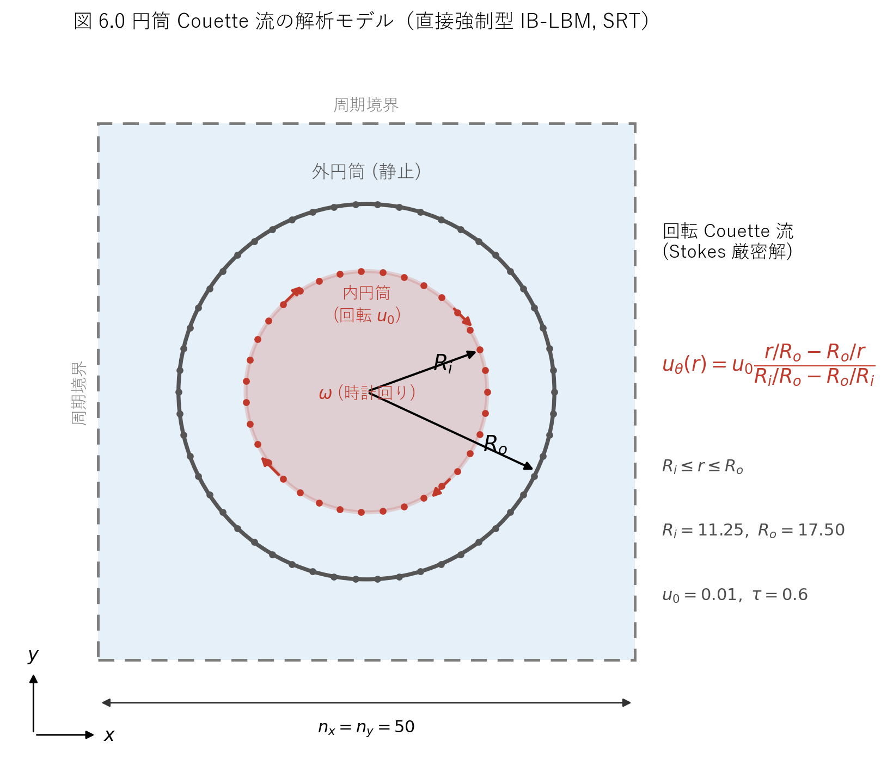
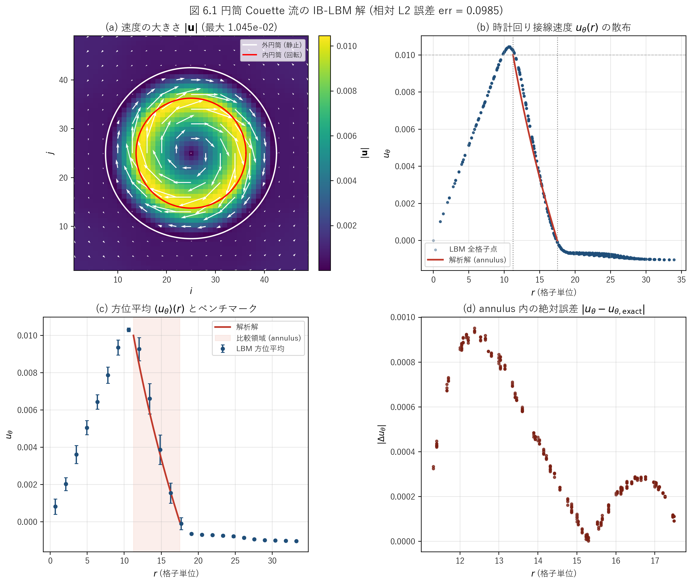

# iblbm2cdfSRT.c 説明ドキュメント

## 概要

[src/sec6/iblbm2cdfSRT.c](../../src/sec6/iblbm2cdfSRT.c) は、同心 2 重円筒のあいだの **円筒 (回転) Couette 流** を、**直接強制型 (Direct Forcing) の没入境界 — 格子ボルツマン法 (IB-LBM)** で解くサンプルです。流体は D2Q9-SRT (単一緩和時間 BGK) で解き、2 本の円筒境界は流体格子とは独立な Lagrangian 点列で表現します。外側円筒を静止、内側円筒を時計回りに回転させ、定常状態の接線速度分布を回転 Stokes 流の解析解と比較するベンチマークです。

この文書では、次の点を順に説明します。

- 対象問題 (円筒 Couette 流) と回転 Stokes 解析解の対応
- D2Q9-SRT 本体と外力項の実装
- 没入境界法 (補間 → 直接強制 → 分配) の実装
- 解析解との誤差 `err` の定義と数値結果

このコードでは、次の処理を 1 本のプログラムで行っています。

- 一様密度・静止流から計算を開始する
- BGK collision → 外力付加 → streaming → 巨視量再構成を反復する
- 各時間ステップで内・外円筒の Lagrangian 点に直接強制の体積力を計算し、Eulerian 格子へ分配する
- 定常後に接線速度の解析解との相対 L2 誤差 `err` と速度場 (`datau`, `datav`) を出力する

タイトルの `cdf` は **c**ylindrical Couette + **d**irect **f**orcing、`SRT` は collision 演算子が単一緩和時間であることを表します。本セクションには同じ問題を別の体積力法・別の collision 演算子で解く [iblbm2cicMRT.c](../../src/sec6/iblbm2cicMRT.c)・[iblbm2cicTRT.c](../../src/sec6/iblbm2cicTRT.c) があり、本コードはその最も基本的な構成です。

## 扱う物理量

| 記号 | コード | 意味 |
| --- | --- | --- |
| $\rho$ | `rho` | 密度 |
| $u, v$ | `u`, `v` | 速度成分 (Eulerian) |
| $u_\theta$ | `ut` | 時計回り接線速度 (数値解) |
| $u_{\theta}^{\mathrm{exact}}$ | `ua` | 時計回り接線速度 (解析解) |
| $u_0$ | `u0` | 内側円筒の表面速度 |
| $f_k$ | `f` | 分布関数 |
| $f_k^{\mathrm{eq}}$ | `f0` | 平衡分布関数 |
| $\tau$ | `tau` | 緩和時間 |
| $\nu$ | `nu` | 動粘性係数 |
| $\mathbf{F}=(F_x,F_y)$ | `fx`, `fy` | Eulerian 格子上の体積力 |
| $R_o, R_i$ | `rp[0]`, `rp[1]` | 外側・内側円筒の半径 |
| $(x_e,y_e)$ | `xe`, `ye` | Lagrangian 点の座標 |
| $(u_e,v_e)$ | `ue`, `ve` | Lagrangian 点の目標速度 (物体速度) |
| $(u_e^t,v_e^t)$ | `uet`, `vet` | Lagrangian 点へ補間した流体速度 |
| $(F_e^x,F_e^y)$ | `fxe`, `fye` | Lagrangian 点に作用する体積力 |
| $n_e$ | `ne` | 各円筒の Lagrangian 点数 |
| `err` | `err` | annulus 内の接線速度の相対 L2 誤差 |

## 解析モデル

解析モデルの模式図を図 6.0 に示します。



図 6.0　円筒 Couette 流の解析モデル。一辺 $n_x=n_y=50$ の周期境界正方領域の中央に、半径 $R_o=17.5$ の静止外円筒と半径 $R_i=11.25$ の回転内円筒を同心に配置する。内円筒は表面速度 $u_0=0.01$ で時計回りに回転する。赤・灰の点は各円筒を表現する Lagrangian 点で、annulus ($R_i\leq r\leq R_o$) では接線速度が回転 Stokes 解に従う。

## 対象問題

同心 2 重円筒のあいだの定常層流を考えます。内側円筒 (半径 $R_i$) が角速度 $\omega$ で回転し、外側円筒 (半径 $R_o$) は静止しています。純粋な方位流 $u_\theta(r)$ では非線形対流項が圧力勾配と釣り合うため、Navier-Stokes 方程式は

$$
\frac{d}{dr}\!\left(\frac{1}{r}\frac{d(r\,u_\theta)}{dr}\right)=0
$$

に簡約され、一般解は

$$
u_\theta(r)=A\,r+\frac{B}{r}
$$

です。境界条件 $u_\theta(R_i)=u_0$ (内円筒表面速度)、$u_\theta(R_o)=0$ (外円筒静止) を課すと

$$
u_\theta(r)=u_0\,\frac{r/R_o-R_o/r}{R_i/R_o-R_o/R_i}
\qquad (R_i\leq r\leq R_o)
$$

が得られます。[iblbm2cdfSRT.c:103](../../src/sec6/iblbm2cdfSRT.c#L103) の `ua` はこの式そのものです。`r=R_i` で分子・分母が一致して $u_\theta=u_0$、`r=R_o` で分子が 0 になり $u_\theta=0$ となることが確認できます。コードでは表示用に annulus の外側 ($r\geq R_o$) で `ua=0`、内側 ($r\leq R_i$) で `ua=u0` と置いていますが ([iblbm2cdfSRT.c:104-105](../../src/sec6/iblbm2cdfSRT.c#L104-L105))、誤差評価は annulus 内のみで行います。

本コードの既定設定では、Reynolds 数は gap $d=R_o-R_i=6.25$ を代表長さとして

$$
Re=\frac{u_0\,d}{\nu}=\frac{0.01\times 6.25}{1/30}\approx 1.9
$$

と非常に小さく、Taylor 不安定をはるかに下回る定常層流です。したがって上の $A\,r+B/r$ 解は厳密な比較対象になります。

## 格子モデル

D2Q9 モデルを使います。離散速度は

$$
\mathbf{c}_0=(0,0),\quad
\mathbf{c}_1=(1,0),\ \mathbf{c}_2=(0,1),\ \mathbf{c}_3=(-1,0),\ \mathbf{c}_4=(0,-1)
$$

$$
\mathbf{c}_5=(1,1),\ \mathbf{c}_6=(-1,1),\ \mathbf{c}_7=(-1,-1),\ \mathbf{c}_8=(1,-1)
$$

で、重みは

$$
w_0=\frac{4}{9},\quad w_{1\sim4}=\frac{1}{9},\quad w_{5\sim8}=\frac{1}{36}
$$

です。[iblbm2cdfSRT.c:112-116](../../src/sec6/iblbm2cdfSRT.c#L112-L116) の `cx`, `cy` と平衡分布の係数 `4/9`, `1/9`, `1/36` がこれに対応します。緩和時間は

$$
\tau=0.6,\qquad \nu=\frac{\tau-0.5}{3}=\frac{1}{30}\approx 0.0333
$$

です ([iblbm2cdfSRT.c:68-70](../../src/sec6/iblbm2cdfSRT.c#L68-L70))。

## 平衡分布関数

平衡分布関数は標準的な D2Q9 の二次近似で、

$$
f_k^{\mathrm{eq}}=w_k\rho\left(1+3\,\mathbf{c}_k\cdot\mathbf{u}
+\frac{9}{2}(\mathbf{c}_k\cdot\mathbf{u})^2-\frac{3}{2}|\mathbf{u}|^2\right)
$$

です。コードでは `k=0`, `k=1..4`, `k=5..8` に分け、係数 `4/9`, `1/9`, `1/36` でこの式をそのまま実装しています ([iblbm2cdfSRT.c:141-152](../../src/sec6/iblbm2cdfSRT.c#L141-L152))。

## 時間発展

1 ステップはおおむね次の順に進みます。外側ループ 20 回 × 内側ループ 100 回で、計 **2000 ステップ** 回します ([iblbm2cdfSRT.c:136-137](../../src/sec6/iblbm2cdfSRT.c#L136-L137))。

### 1. Collision (SRT-BGK)

$$
f_k^*=f_k-\frac{f_k-f_k^{\mathrm{eq}}}{\tau}
$$

([iblbm2cdfSRT.c:155](../../src/sec6/iblbm2cdfSRT.c#L155))。

### 2. 外力の付加

直前のステップで没入境界法が用意した Eulerian 体積力 $\mathbf{F}=(F_x,F_y)$ を分布関数に加えます。

$$
f_k\leftarrow f_k+3\,w_k\,(\mathbf{c}_k\cdot\mathbf{F})
$$

これは標準的な力項 $F_k=w_k\,\mathbf{c}_k\cdot\mathbf{F}/c_s^2$ ($c_s^2=1/3$) に等しく、軸方向 ($k=1\sim4$) で $3w_k=1/3$、対角方向 ($k=5\sim8$) で $3w_k=1/12$ です。コードの `/3.0`・`/12.0` がこれに一致します ([iblbm2cdfSRT.c:158-165](../../src/sec6/iblbm2cdfSRT.c#L158-L165))。

> なお本コードは最も簡素な力項であり、巨視速度の半力補正 ($\mathbf{u}=\rho^{-1}\sum f_k\mathbf{c}_k+\mathbf{F}/2$) を入れていません ([iblbm2cdfSRT.c:182-191](../../src/sec6/iblbm2cdfSRT.c#L182-L191))。このため境界での no-slip は厳密には満たされず、後述の誤差 `err` や接線速度のわずかなオーバーシュート ($\max|\mathbf{u}|\approx 0.01045>u_0$) の一因になります。

### 3. Streaming

$$
f_k(\mathbf{x}+\mathbf{c}_k,t+1)=f_k^*(\mathbf{x},t)
$$

一度 `ftmp` に退避してから移流させ、配列端では周期境界として折り返します ([iblbm2cdfSRT.c:168-179](../../src/sec6/iblbm2cdfSRT.c#L168-L179))。物体境界は周期境界ではなく没入境界 (体積力) で課されるため、円筒が領域中央に収まっていれば外周の周期境界は流れにほとんど影響しません ($R_o=17.5$ で中心 $(25,25)$ から最大到達 $42.5<50$)。

### 4. 巨視量の再構成

$$
\rho=\sum_{k}f_k,\qquad
u=\frac{1}{\rho}\sum_k f_k c_{k,x},\qquad
v=\frac{1}{\rho}\sum_k f_k c_{k,y}
$$

([iblbm2cdfSRT.c:182-191](../../src/sec6/iblbm2cdfSRT.c#L182-L191))。

## 没入境界法 (Direct Forcing)

物体境界は流体格子とは独立な Lagrangian 点列で表します。各時間ステップで次の 3 段を陽的に行います。

### 円筒と Lagrangian 点の配置

2 本の円筒は中心 $(25,25)$ に同心配置し、半径と点数は

$$
R_o=\frac{70}{200}n_x=17.5,\quad R_i=\frac{45}{200}n_x=11.25
$$

$$
n_e^{(0)}=\big\lfloor 2\pi R_o\cdot 0.5\big\rfloor=54,\quad
n_e^{(1)}=\big\lfloor 2\pi R_i\cdot 0.5\big\rfloor=35
$$

です ([iblbm2cdfSRT.c:74-77](../../src/sec6/iblbm2cdfSRT.c#L74-L77))。

> **注意 (添字の向き)**: `rp[0]` が **外側** (大きい半径)、`rp[1]` が **内側** (小さい半径) です。直感と逆なので読むときに注意してください。

係数 `0.5` のため、Lagrangian 点の弧長間隔は $2\pi R/n_e\approx 1/0.5=2$ 格子幅で、IB 法で推奨される $\approx 1$ 格子幅より粗めです。これも誤差に効きます。

各点は等角配置され ([iblbm2cdfSRT.c:84-88](../../src/sec6/iblbm2cdfSRT.c#L84-L88))、目標速度は外円筒 ($n=0$) が $\mathbf{u}_e=0$ (静止)、内円筒 ($n=1$) が

$$
u_e=u_0\sin\theta,\qquad v_e=-u_0\cos\theta
\qquad (\theta=2\pi m/n_e)
$$

です ([iblbm2cdfSRT.c:92-95](../../src/sec6/iblbm2cdfSRT.c#L92-L95))。これは角速度 $\omega=-u_0/R_i$ の **時計回り (CW) 剛体回転** に対応します ($\theta=0$ の右端の点で $\mathbf{u}_e=(0,-u_0)$、すなわち下向き = 時計回り)。

### (i) 速度の補間 (Eulerian → Lagrangian)

各 Lagrangian 点へ周囲の流体速度を離散デルタ関数で補間します。

$$
u_e^t=\sum_{i,j}u_{i,j}\,\delta_h(x_e-i)\,\delta_h(y_e-j)
$$

離散デルタは **4 点 cosine 関数** (Peskin)

$$
\delta_h(r)=\frac{1}{4}\left(1+\cos\frac{\pi r}{2}\right)\quad(|r|\leq 2),\qquad 0\ (|r|>2)
$$

を 2 方向の積として使い、各点の周囲 $[x_e-3,\,x_e+3)\times[y_e-3,\,y_e+3)$ を走査します ([iblbm2cdfSRT.c:198-218](../../src/sec6/iblbm2cdfSRT.c#L198-L218))。

### (ii) 直接強制の力 (Lagrangian)

目標速度 (物体速度) と補間流体速度の差から、各点に要する体積力を陽的に決めます ($\Delta t=1$)。

$$
F_e=\mathbf{u}_e-\mathbf{u}_e^t
$$

([iblbm2cdfSRT.c:224-227](../../src/sec6/iblbm2cdfSRT.c#L224-L227))。これが「直接強制 (Direct Forcing)」の核で、no-slip 残差をそのまま体積力に変換します。

### (iii) 力の分配 (Lagrangian → Eulerian)

同じ離散デルタで Eulerian 格子に分配します。弧長要素 $ds=2\pi R/n_e$ を重みに掛けます。

$$
\mathbf{F}_{i,j}=\sum_{e}\mathbf{F}_e\,\delta_h(x_e-i)\,\delta_h(y_e-j)\,\frac{2\pi R}{n_e}
$$

([iblbm2cdfSRT.c:229-255](../../src/sec6/iblbm2cdfSRT.c#L229-L255))。得られた $\mathbf{F}$ が次ステップの collision 後の外力項に使われます。

## 数値設定

| 項目 | 値 |
| --- | ---: |
| 格子 | $n_x=n_y=50$ (`DIM=51`) |
| $\tau$ | 0.6 |
| $\nu$ | $1/30\approx 0.0333$ |
| 外円筒半径 $R_o$ | 17.5 (静止) |
| 内円筒半径 $R_i$ | 11.25 (CW 回転) |
| 内円筒表面速度 $u_0$ | 0.01 |
| Lagrangian 点数 | 外 54 / 内 35 |
| 総ステップ数 | 2000 (= 20 × 100) |
| $Re$ (gap 基準) | $\approx 1.9$ |

## 解析結果

主要結果を図 6.1 に示します。



図 6.1　円筒 Couette 流の IB-LBM 解 (相対 L2 誤差 `err` = 0.0985)。(a) 速度の大きさ $|\mathbf{u}|$ と 2 本の円筒・速度ベクトル。内円筒まわりに高速のリングが形成され、外側へ向けて減衰する。(b) 全格子点の時計回り接線速度 $u_\theta(r)$ の散布と annulus 内の解析解 (赤線)。内円筒内部 ($r<R_i$) ではほぼ剛体回転で中心へ向け 0 に漸近し、annulus では Stokes 解に沿って減衰する。(c) 方位平均 $\langle u_\theta\rangle(r)$ と解析解の比較。(d) annulus 内の点ごとの絶対誤差。

定性的な特徴は物理直感と整合します。

- 内円筒 ($r=R_i=11.25$) で接線速度がほぼ $u_0$ にピークを持つ
- annulus ($11.25\leq r\leq 17.5$) で解析解に沿って単調減衰し、外円筒 ($r=R_o=17.5$) でほぼ 0 になる
- 内円筒内部では剛体回転に近く、中心で速度が 0 に向かう
- 回転方向は時計回り (CW) で、`ue=u0 sinθ, ve=-u0 cosθ` の設定と一致する

### ベンチマーク (解析解との比較)

接線速度の数値解 `ut` ([iblbm2cdfSRT.c:259-265](../../src/sec6/iblbm2cdfSRT.c#L259-L265)) と解析解 `ua` の差を、annulus ($R_i\leq r\leq R_o$) で相対 L2 ノルム

$$
\mathrm{err}=\sqrt{\dfrac{\displaystyle\sum_{R_i\leq r\leq R_o}\big(u_\theta-u_{\theta}^{\mathrm{exact}}\big)^2}
{\displaystyle\sum_{R_i\leq r\leq R_o}\big(u_{\theta}^{\mathrm{exact}}\big)^2}}
$$

として評価しています ([iblbm2cdfSRT.c:267-277](../../src/sec6/iblbm2cdfSRT.c#L267-L277))。既定設定での最終値は

$$
\mathrm{err}=0.0985\quad(\approx 9.9\%)
$$

です。Python 側で同じ定義を再計算しても **0.098510** となり、C コードの出力と一致します。annulus 内で方位平均した接線速度と解析解の比較を次表に示します (同じ内容を CSV [docs/sec6/generated/iblbm2cdfSRT_couette_profile.csv](generated/iblbm2cdfSRT_couette_profile.csv) にも保存)。

| $r$ | 本コード $\langle u_\theta\rangle$ | 解析解 $u_{\theta}^{\mathrm{exact}}$ | $\lvert\Delta\rvert$ | 相対誤差 |
| ---: | ---: | ---: | ---: | ---: |
| 12.02 | $9.270\times 10^{-3}$ | $8.425\times 10^{-3}$ | $8.46\times 10^{-4}$ | 10.0% |
| 13.44 | $6.610\times 10^{-3}$ | $5.860\times 10^{-3}$ | $7.50\times 10^{-4}$ | 12.8% |
| 14.85 | $3.876\times 10^{-3}$ | $3.615\times 10^{-3}$ | $2.60\times 10^{-4}$ | 7.2% |
| 16.26 | $1.543\times 10^{-3}$ | $1.607\times 10^{-3}$ | $6.45\times 10^{-5}$ | 4.0% |

全体として回転 Stokes 解の形状をよく再現していますが、約 10% の相対誤差が残ります。差が大きいのは内円筒寄り (大きな速度勾配と曲率の影響を受ける領域) です。この誤差水準は、本コードが

- gap がわずか $\approx 6$ 格子と粗いこと
- Lagrangian 点間隔が $\approx 2$ 格子と粗いこと
- 巨視速度の半力補正を持たない最も簡素な直接強制であること

の組合せによるもので、本セクションの [iblbm2cicMRT.c](../../src/sec6/iblbm2cicMRT.c) / [iblbm2cicTRT.c](../../src/sec6/iblbm2cicTRT.c) (陰的補正 + MRT/TRT) はこの誤差を下げる方向の変種です。

### ASCII 速度マップ

実行中は内側ループ 100 回ごとに、内部速度の大きさを 0–9 の文字で表した粗いマップと `err` が標準出力に表示されます ([iblbm2cdfSRT.c:282-309](../../src/sec6/iblbm2cdfSRT.c#L282-L309))。`err` は 100 ステップで 0.165、300 ステップ付近で 0.11 前後を経て、2000 ステップで 0.0985 へ収束します (初期の数百ステップでわずかな増減を経た後ほぼ一定に落ち着きます)。

## 出力ファイル

[iblbm2cdfSRT.c:313-327](../../src/sec6/iblbm2cdfSRT.c#L313-L327) は計算後に次を出力します (内部点 $i,j=1,\dots,n_x-1$ を 1 行に $j$ 固定で書き出し)。

- `datau`: $x$ 方向速度 $u$ (49 × 49)
- `datav`: $y$ 方向速度 $v$ (49 × 49)

[scripts/run_one.cmd](../../scripts/run_one.cmd) により [outputs/sec6/iblbm2cdfSRT](../../outputs/sec6/iblbm2cdfSRT) に保存されます。

## 実行例

リポジトリのルートで次を実行します。

```powershell
cmd /c scripts\run_one.cmd src\sec6\iblbm2cdfSRT.c
d:/work/LBMcode/.venv/Scripts/python.exe scripts/plot_iblbm2cdfSRT_schematic.py
d:/work/LBMcode/.venv/Scripts/python.exe scripts/plot_iblbm2cdfSRT_results.py
```

最終出力は次のとおりです。

| 項目 | 値 |
| --- | ---: |
| Time | 2000 |
| `err` (相対 L2) | 0.098510 |
| $\max\lvert\mathbf{u}\rvert$ | $1.0454\times 10^{-2}$ |
| $\min\lvert\mathbf{u}\rvert$ | $\approx 1\times 10^{-6}$ |

## ベンチマークの出典

円筒 Couette 流は、没入境界 LBM の精度検証に広く使われる定番ベンチマークです。回転 Stokes 解 $u_\theta(r)=u_0\,(r/R_o-R_o/r)/(R_i/R_o-R_o/R_i)$ との比較は、運動量交換型 IB-LBM を提案した Niu ら (2006)、および直接強制型 IB-LBM の Feng & Michaelides (2004) などで用いられています。本コードは著者 (Takeshi Seta) の LBM 教科書系列のサンプルで、同じ問題を直接強制 (本コード) と陰的補正 (MRT/TRT) で解き比べる構成になっています。

- X. D. Niu, C. Shu, Y. T. Chew, Y. Peng, "A momentum exchange-based immersed boundary-lattice Boltzmann method for simulating incompressible viscous flows," *Phys. Lett. A* **354** (2006) 173–182.
- Z.-G. Feng, E. E. Michaelides, "The immersed boundary-lattice Boltzmann method for solving fluid-particles interaction problems," *J. Comput. Phys.* **195** (2004) 602–628.
- C. S. Peskin, "The immersed boundary method," *Acta Numerica* **11** (2002) 479–517 (4 点 cosine デルタ関数の出典)。

## 特記事項 (実装上の注意)

読み解く際に注意したい実装上のクセを挙げておきます。いずれも既定設定での収束結果には実質的な影響を与えませんが、コードを改変・移植する際の落とし穴になり得ます。

- **添字の向きが直感と逆**: `rp[0]` が外側 (大きい半径 17.5)、`rp[1]` が内側 (小さい半径 11.25) です。回転するのは `rp[1]` (内側、`n=1`) の側です。
- **Lagrangian 点間隔が粗い**: 点数を `ne = (int)(2πR·0.5)` と決めているため弧長間隔が $\approx 2$ 格子幅あり、IB 法で推奨される $\approx 1$ 格子幅より粗いです。
- **半力補正なしの簡素な直接強制**: 巨視速度に $\mathbf{F}/2$ 補正を入れていないため ([iblbm2cdfSRT.c:182-191](../../src/sec6/iblbm2cdfSRT.c#L182-L191))、no-slip が厳密に満たされず約 10% の残差と速度オーバーシュート ($\max|\mathbf{u}|\approx 0.01045$) が生じます。
- **体積力配列 `fx`/`fy` の初期化が暗黙**: `fx`, `fy` はスタック配列として宣言され ([iblbm2cdfSRT.c:57](../../src/sec6/iblbm2cdfSRT.c#L57))、明示的なゼロ初期化がありません。リセットは spreading 直前 ([iblbm2cdfSRT.c:230-232](../../src/sec6/iblbm2cdfSRT.c#L230-L232)) で範囲 `i,j=0..nx-1` のみ行われ、しかも内側ループ末尾に置かれています。このため (a) 最初の 1 ステップだけは未初期化値が外力項に混入し、(b) 周期端 `i=nx`／`j=ny` の行・列は一度も初期化・書き込みされないまま毎ステップ読まれます。実害は円筒から離れた周期外周に限られ既定設定では収束結果に影響しませんが、移植時はスタートアップで `fx`/`fy` を全域ゼロ初期化しておくのが安全です。
- **ASCII マップの収束は非単調**: 初期数百ステップで `err` がわずかに増減してから定常へ落ち着きます。

## このコードの見どころ

- 円筒 Couette 流という解析解のある問題で、IB-LBM の精度を相対 L2 誤差として直接定量化している
- 没入境界法の 3 段 (補間 → 直接強制 → 分配) が最小構成でそのまま読める
- 4 点 cosine 離散デルタ関数の実装が補間・分配で共通して使われている
- collision 演算子 (SRT) と体積力法 (直接強制) を入れ替えた MRT/TRT・陰的補正版が同セクションにあり、スキームの違いが誤差にどう効くかを比較できる
