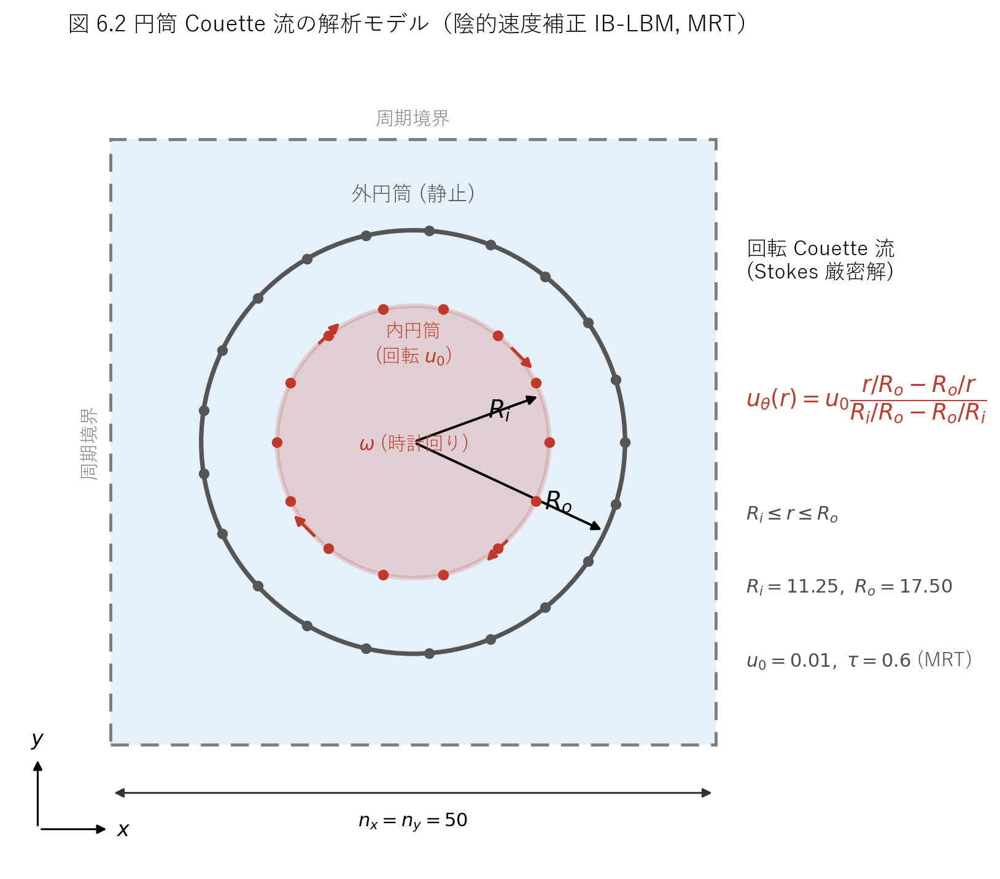
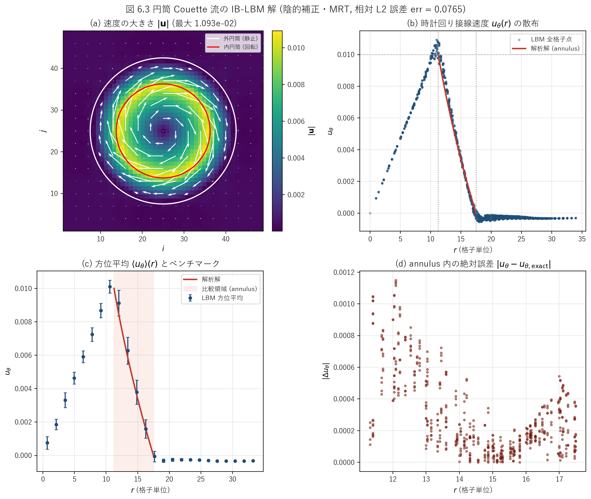

# iblbm2cicMRT.c 説明ドキュメント

## 概要

[src/sec6/iblbm2cicMRT.c](../../src/sec6/iblbm2cicMRT.c) は、同心 2 重円筒のあいだの **円筒 (回転) Couette 流** を、**陰的速度補正型 (Implicit velocity Correction) の没入境界 — 格子ボルツマン法 (IB-LBM)** で解くサンプルです。流体は D2Q9 を **MRT (多緩和時間)** collision で解き、体積力には **Guo (2002) の力項** を用います。2 本の円筒境界は流体格子とは独立な Lagrangian 点列で表現します。外側円筒を静止、内側円筒を時計回りに回転させ、定常状態の接線速度分布を回転 Stokes 流の解析解と比較するベンチマークです。

本コードは、同セクションの基本形である直接強制型 [iblbm2cdfSRT.c](../../src/sec6/iblbm2cdfSRT.c) (Direct Forcing + SRT) に対して、**衝突演算子を MRT に、体積力法を陰的速度補正に**置き換えた変種です。タイトルの `cic` は **c**ylindrical Couette + **i**mplicit **c**orrection、`MRT` は collision 演算子を表します。本セクションにはさらに TRT 版 [iblbm2cicTRT.c](../../src/sec6/iblbm2cicTRT.c) があります。

この文書では、次の点を順に説明します。

- 対象問題 (円筒 Couette 流) と回転 Stokes 解析解の対応
- D2Q9-MRT 本体と Guo の力項の実装
- 陰的速度補正 (影響行列 → 線形ソルブ → 補正) の実装と、直接強制との違い
- 解析解との誤差 `err` の定義と数値結果 (DF-SRT 版との比較)

このコードでは、次の処理を 1 本のプログラムで行っています。

- 計算開始前に、Lagrangian 点どうしの離散デルタ相関 (影響行列 `mm`) を 1 度だけ組み立てる
- 一様密度・静止流から計算を開始する
- MRT collision → Guo 力項の付加 → streaming → 巨視量再構成を反復する
- 各時間ステップで内・外円筒の Lagrangian 点に陰的速度補正の体積力を計算し、Eulerian 格子へ分配する
- 定常後に接線速度の解析解との相対 L2 誤差 `err` と速度場 (`datau`, `datav`) を出力する

## 扱う物理量

| 記号 | コード | 意味 |
| --- | --- | --- |
| $\rho$ | `rho` | 密度 |
| $u, v$ | `u`, `v` | 速度成分 (Eulerian) |
| $u_\theta$ | `ut` | 時計回り接線速度 (数値解) |
| $u_{\theta}^{\mathrm{exact}}$ | `ua` | 時計回り接線速度 (解析解) |
| $u_0$ | `u0` | 内側円筒の表面速度 |
| $f_k$ | `f` | 分布関数 |
| $f_k^{\mathrm{eq}}$ | `f0` | 平衡分布関数 |
| $F_k$ | `fi` | Guo の力項 (分布関数空間) |
| $\tau$ | `tau` | 緩和時間 |
| $\nu$ | `nu` | 動粘性係数 |
| $\mathbf{M}$ | `mc` | モーメント変換行列 |
| $\mathbf{M}^{-1}$ | `mi` | 逆変換行列 |
| $\mathbf{S}$ | `sc` | 対角緩和行列 |
| $m_k, m_k^{\mathrm{eq}}$ | `t`, `t0` | モーメント / 平衡モーメント |
| $\mathbf{F}=(F_x,F_y)$ | `fx`, `fy` | Eulerian 格子上の体積力 (= 速度補正 $\delta\mathbf{u}$ → 2 倍して体積力) |
| $R_o, R_i$ | `rp[0]`, `rp[1]` | 外側・内側円筒の半径 |
| $(x_e,y_e)$ | `xe`, `ye` | Lagrangian 点の座標 |
| $(u_e,v_e)$ | `ue`, `ve` | Lagrangian 点の目標速度 (物体速度) |
| $(u_e^t,v_e^t)$ | `uet`, `vet` | Lagrangian 点へ補間した流体速度 |
| $(F_e^x,F_e^y)$ | `fxe`, `fye` | Lagrangian 点の速度補正 (線形ソルブの解) |
| $A_{mn}$ | `mm` | Lagrangian 点間の離散デルタ相関 (影響行列) |
| $n_e$ | `ne` | 各円筒の Lagrangian 点数 |
| `err` | `err` | annulus 内の接線速度の相対 L2 誤差 |

## 解析モデル

解析モデルの模式図を図 6.2 に示します (本セクションでは図 6.0／6.1 を DF-SRT 版 [iblbm2cdfSRT.md](iblbm2cdfSRT.md) が使用しているため、本コードは図 6.2 以降を用います)。



図 6.2　円筒 Couette 流の解析モデル (陰的速度補正 IB-LBM, MRT)。一辺 $n_x=n_y=50$ の周期境界正方領域の中央に、半径 $R_o=17.5$ の静止外円筒と半径 $R_i=11.25$ の回転内円筒を同心に配置する。内円筒は表面速度 $u_0=0.01$ で時計回りに回転する。赤・灰の点は各円筒を表現する Lagrangian 点で、DF-SRT 版より粗い ($n_e$ 係数 0.2、外 21／内 14 点)。annulus ($R_i\leq r\leq R_o$) では接線速度が回転 Stokes 解に従う。

## 対象問題

同心 2 重円筒のあいだの定常層流を考えます。内側円筒 (半径 $R_i$) が角速度 $\omega$ で回転し、外側円筒 (半径 $R_o$) は静止しています。純粋な方位流 $u_\theta(r)$ では、Navier-Stokes 方程式は

$$
\frac{d}{dr}\!\left(\frac{1}{r}\frac{d(r\,u_\theta)}{dr}\right)=0
$$

に簡約され、一般解 $u_\theta(r)=A\,r+B/r$ に境界条件 $u_\theta(R_i)=u_0$、$u_\theta(R_o)=0$ を課すと

$$
u_\theta(r)=u_0\,\frac{r/R_o-R_o/r}{R_i/R_o-R_o/R_i}
\qquad (R_i\leq r\leq R_o)
$$

が得られます。[iblbm2cicMRT.c:155](../../src/sec6/iblbm2cicMRT.c#L155) の `ua` はこの式そのものです。`r=R_i` で $u_\theta=u_0$、`r=R_o` で $u_\theta=0$ となります。コードでは表示用に annulus の外側 ($r\geq R_o$) で `ua=0`、内側 ($r\leq R_i$) で `ua=u0` と置いていますが ([iblbm2cicMRT.c:156-157](../../src/sec6/iblbm2cicMRT.c#L156-L157))、誤差評価は annulus 内のみで行います。

既定設定では、Reynolds 数は gap $d=R_o-R_i=6.25$ を代表長さとして

$$
Re=\frac{u_0\,d}{\nu}=\frac{0.01\times 6.25}{1/30}\approx 1.9
$$

と非常に小さく、Taylor 不安定をはるかに下回る定常層流です。したがって上の $A\,r+B/r$ 解は厳密な比較対象になります。

## 格子モデル

D2Q9 モデルを使います。離散速度は

$$
\mathbf{c}_0=(0,0),\quad
\mathbf{c}_{1\sim4}=(\pm1,0),(0,\pm1),\quad
\mathbf{c}_{5\sim8}=(\pm1,\pm1)
$$

で ([iblbm2cicMRT.c:164-168](../../src/sec6/iblbm2cicMRT.c#L164-L168))、重みは $w_0=4/9,\ w_{1\sim4}=1/9,\ w_{5\sim8}=1/36$ です。緩和時間と粘性は

$$
\tau=0.6,\qquad \nu=\frac{\tau-0.5}{3}=\frac{1}{30}\approx 0.0333
$$

です ([iblbm2cicMRT.c:80-82](../../src/sec6/iblbm2cicMRT.c#L80-L82))。

## 平衡分布関数

平衡分布関数は標準的な D2Q9 の二次近似で、

$$
f_k^{\mathrm{eq}}=w_k\rho\left(1+3\,\mathbf{c}_k\cdot\mathbf{u}
+\frac{9}{2}(\mathbf{c}_k\cdot\mathbf{u})^2-\frac{3}{2}|\mathbf{u}|^2\right)
$$

です。コードでは `k=0`, `k=1..4`, `k=5..8` に分け、係数 `4/9`, `1/9`, `1/36` でこの式をそのまま実装しています ([iblbm2cicMRT.c:274-285](../../src/sec6/iblbm2cicMRT.c#L274-L285))。本コードは平衡を **速度空間で構成してからモーメント空間へ変換** する方式 (後述) のため、平衡モーメントを解析式で書く代わりに $\mathbf{m}^{\mathrm{eq}}=\mathbf{M}f^{\mathrm{eq}}$ を数値的に計算します。

## MRT collision

DF-SRT 版との最大の違いが衝突演算子です。SRT (BGK) が全分布関数を 1 つの緩和時間 $\tau$ で緩和するのに対し、**MRT (Multiple-Relaxation-Time)** は分布関数をモーメント空間 $\mathbf{m}=\mathbf{M}f$ に変換し、各モーメントを個別の緩和率で平衡へ近づけます。

$$
f^{*}=f-\mathbf{M}^{-1}\,\mathbf{S}\,(\mathbf{M}f-\mathbf{M}f^{\mathrm{eq}})
$$

### 変換行列 $\mathbf{M}$

[iblbm2cicMRT.c:171-205](../../src/sec6/iblbm2cicMRT.c#L171-L205) の `mc` は、Lallemand & Luo (2000) の標準的な D2Q9 変換行列そのものです。行は順にモーメント

$$
(\rho,\ e,\ \varepsilon,\ j_x,\ q_x,\ j_y,\ q_y,\ p_{xx},\ p_{xy})
$$

(密度・エネルギー・エネルギー二乗・運動量 $x$・エネルギーフラックス $x$・運動量 $y$・エネルギーフラックス $y$・法線応力・剪断応力) に対応します。逆行列 `mi` は [iblbm2cicMRT.c:208-242](../../src/sec6/iblbm2cicMRT.c#L208-L242) に明示的に与えられています。

### 緩和行列 $\mathbf{S}$

対角緩和率は [iblbm2cicMRT.c:244-249](../../src/sec6/iblbm2cicMRT.c#L244-L249) で次のように設定されます。

| モーメント | 緩和率 (記号) | 値 ($\tau=0.6$) |
| --- | --- | ---: |
| $\rho,\ j_x,\ j_y$ (保存量) | 0 | 0 |
| $e,\ \varepsilon$ | $1/\tau$ | 1.6667 |
| $q_x,\ q_y$ (エネルギーフラックス) | $\dfrac{8-4/\tau}{4+7/\tau}$ | 0.0851 |
| $p_{xx},\ p_{xy}$ (応力) | $1/\tau$ | 1.6667 |

応力モーメント $p_{xx},p_{xy}$ が物理粘性を決め、$1/\tau$ で緩和することから

$$
\nu=\frac{1}{3}\!\left(\frac{1}{s_\nu}-\frac{1}{2}\right)=\frac{\tau-1/2}{3}=\frac{1}{30}
$$

と SRT と同じ粘性になります ([iblbm2cicMRT.c:82](../../src/sec6/iblbm2cicMRT.c#L82) の `nu` と一致)。エネルギーフラックスの緩和率は境界精度を整える「magic」値で、保存量 $(\rho,j_x,j_y)$ は緩和率 0 (不変) です。

### コードでの実装手順

各格子点で次を順に計算します ([iblbm2cicMRT.c:291-312](../../src/sec6/iblbm2cicMRT.c#L291-L312))。

1. 変換: `t = mc·f`, `t0 = mc·f0` (分布関数と平衡分布をモーメント空間へ)
2. モーメント衝突: `ftmp = sc·(t - t0)`, `t = t - ftmp`
3. 逆変換: `fm = mi·t`, `f = fm`

## 時間発展

1 ステップはおおむね次の順に進みます。外側ループ 20 回 × 内側ループ 100 回で計 **2000 ステップ** 回します ([iblbm2cicMRT.c:269-270](../../src/sec6/iblbm2cicMRT.c#L269-L270))。

1. **平衡分布の計算** ([iblbm2cicMRT.c:274-285](../../src/sec6/iblbm2cicMRT.c#L274-L285))
2. **MRT collision** (上記 3 手順、[iblbm2cicMRT.c:291-312](../../src/sec6/iblbm2cicMRT.c#L291-L312))
3. **Guo の力項の付加** ([iblbm2cicMRT.c:315-341](../../src/sec6/iblbm2cicMRT.c#L315-L341))
4. **Streaming** ([iblbm2cicMRT.c:343-355](../../src/sec6/iblbm2cicMRT.c#L343-L355))
5. **巨視量の再構成** ([iblbm2cicMRT.c:357-367](../../src/sec6/iblbm2cicMRT.c#L357-L367))
6. **没入境界による陰的速度補正** ([iblbm2cicMRT.c:369-488](../../src/sec6/iblbm2cicMRT.c#L369-L488))

### Guo (2002) の力項

DF-SRT 版が最も簡素な力項 $f_k\mathrel{+}=3w_k(\mathbf{c}_k\cdot\mathbf{F})$ を使うのに対し、本コードは **Guo らの完全な力項** を実装します。

$$
F_k=\left(1-\frac{1}{2\tau}\right)w_k
\left[3(\mathbf{c}_k-\mathbf{u})\cdot\mathbf{F}
+9(\mathbf{c}_k\cdot\mathbf{u})(\mathbf{c}_k\cdot\mathbf{F})\right]
$$

[iblbm2cicMRT.c:315-336](../../src/sec6/iblbm2cicMRT.c#L315-L336) を逐行に展開すると、`u2 = u·F`、`tmp = c_k·F`、`tmp1 = (c_k·u)(c_k·F)` であり、

$$
F_k=\left(1-\frac{1}{2\tau}\right)\frac{3\,\mathbf{c}_k\!\cdot\!\mathbf{F}
+9(\mathbf{c}_k\!\cdot\!\mathbf{u})(\mathbf{c}_k\!\cdot\!\mathbf{F})-3\,\mathbf{u}\!\cdot\!\mathbf{F}}{(9\ \text{or}\ 36)}
$$

が上式に一致します ($k=0$ では `-4/3(1-0.5/τ)(u·F)` = $w_0(1-1/2\tau)(-3\,\mathbf{u}\cdot\mathbf{F})$)。係数 `(1.0 - 0.5/tau)` が前因子 $(1-1/2\tau)$ に対応します。この力項は [iblbm2cicMRT.c:339-341](../../src/sec6/iblbm2cicMRT.c#L339-L341) で `f += fi` として加えられます。ここで使う $\mathbf{u}$ と $\mathbf{F}$ は **前ステップで没入境界が用意した値** です。

### Streaming・巨視量

streaming は `ftmp` に退避してから移流し、配列端は周期境界として折り返します ([iblbm2cicMRT.c:343-355](../../src/sec6/iblbm2cicMRT.c#L343-L355))。巨視量は

$$
\rho=\sum_k f_k,\qquad
u=\frac{1}{\rho}\sum_k f_k c_{k,x},\qquad
v=\frac{1}{\rho}\sum_k f_k c_{k,y}
$$

で再構成します ([iblbm2cicMRT.c:357-367](../../src/sec6/iblbm2cicMRT.c#L357-L367))。ここでは **半力補正を加えません**。半力補正は後段の速度補正 ($\mathbf{u}\mathrel{+}=\mathbf{F}/2$ に相当) として加わります (後述)。

## 没入境界法 (陰的速度補正)

これが DF-SRT 版との 2 つめの大きな違いです。直接強制法が「補間 → 残差をそのまま体積力 → 分配」を陽的に行うのに対し、本コードは Wu & Shu (2009) の **陰的速度補正法 (implicit velocity correction)** を用います。各 Lagrangian 点で no-slip を (近似的に) 満たすように速度補正量を線形システムから解き、それを体積力に変換します。

### 円筒と Lagrangian 点の配置

2 本の円筒は中心 $(25,25)$ に同心配置し、半径と点数は

$$
R_o=\frac{70}{200}n_x=17.5,\quad R_i=\frac{45}{200}n_x=11.25
$$

$$
n_e^{(0)}=\big\lfloor 2\pi R_o\cdot 0.2\big\rfloor=21,\quad
n_e^{(1)}=\big\lfloor 2\pi R_i\cdot 0.2\big\rfloor=14
$$

です ([iblbm2cicMRT.c:85-89](../../src/sec6/iblbm2cicMRT.c#L85-L89))。

> **注意 (添字の向き)**: `rp[0]` が **外側** (大きい半径 17.5)、`rp[1]` が **内側** (小さい半径 11.25) です。回転するのは `rp[1]` (内側、`n=1`) の側です。直感と逆なので注意してください。

係数 `0.2` のため、Lagrangian 点の弧長間隔は $2\pi R/n_e\approx 1/0.2=5$ 格子幅で、DF-SRT 版 (係数 0.5、間隔 $\approx2$) よりさらに粗い設定です。それでも後述のとおり誤差はむしろ小さく、陰的速度補正と Guo 力項の効果が大きいことがわかります。目標速度は外円筒 ($n=0$) が静止、内円筒 ($n=1$) が

$$
u_e=u_0\sin\theta,\qquad v_e=-u_0\cos\theta
\qquad (\theta=2\pi m/n_e)
$$

で ([iblbm2cicMRT.c:144-147](../../src/sec6/iblbm2cicMRT.c#L144-L147))、角速度 $\omega=-u_0/R_i$ の **時計回り (CW) 剛体回転** に対応します ($\theta=0$ の右端の点で $\mathbf{u}_e=(0,-u_0)$ = 下向き = 時計回り)。

### 影響行列 `mm` の事前構築

陰的補正の核は、Lagrangian 点 $m$ と $n$ のあいだの **離散デルタ相関**

$$
A_{mn}=\left[\sum_{i,j}\delta_h(x_e^{(m)}-i)\,\delta_h(y_e^{(m)}-j)\,
\delta_h(x_e^{(n)}-i)\,\delta_h(y_e^{(n)}-j)\right]\frac{2\pi R}{n_e}
$$

を要素とする行列 `mm` です ([iblbm2cicMRT.c:104-142](../../src/sec6/iblbm2cicMRT.c#L104-L142))。これは「点 $n$ に単位の速度補正を置き、Eulerian 格子へ分配 (spread) してから点 $m$ へ補間 (interpolate) して戻したときに現れる量」を表します。すなわち $A=$ (補間 ∘ 分配) という線形作用素です。円筒は剛体で Lagrangian 点が並進しない (回転するのは目標速度だけで、点自体は固定角に留まる) ため、`mm` は **時間ループの前に 1 度だけ**組み立てれば足ります。離散デルタは補間・分配と同じ 4 点 cosine 関数

$$
\delta_h(r)=\frac{1}{4}\left(1+\cos\frac{\pi r}{2}\right)\quad(|r|\leq 2),\qquad 0\ (|r|>2)
$$

を使います。

### (i) 速度の補間 → 残差

各 Lagrangian 点へ周囲の流体速度を離散デルタで補間し ([iblbm2cicMRT.c:374-394](../../src/sec6/iblbm2cicMRT.c#L374-L394))、目標速度との残差を作ります ([iblbm2cicMRT.c:400-403](../../src/sec6/iblbm2cicMRT.c#L400-L403))。

$$
u_e^t=\sum_{i,j}u_{i,j}\,\delta_h(x_e-i)\,\delta_h(y_e-j),
\qquad
\Delta\mathbf{u}_e=\mathbf{u}_e-\mathbf{u}_e^t
$$

### (ii) 速度補正の線形ソルブ

陰的補正では、no-slip を満たす速度補正 $\delta\mathbf{u}_e$ を

$$
A\,\delta\mathbf{u}_e=\Delta\mathbf{u}_e
$$

として解きます ([iblbm2cicMRT.c:404-447](../../src/sec6/iblbm2cicMRT.c#L404-L447))。$x$ 成分 (`in==0`) と $y$ 成分 (`in==1`) を別々に、各粒子ごとに解き、結果を `fxe`/`fye` に上書きします。これが「直接強制との違い」で、残差をそのまま力にするのではなく、分配後の干渉まで織り込んで補正量を決めます。

> **特記事項 (ソルバの実装)**: コード上は「Gauss 法」と銘打たれていますが、前進消去ループ ([iblbm2cicMRT.c:408](../../src/sec6/iblbm2cicMRT.c#L408)) のピボット添字 `k` が、内側の右辺ベクトル代入ループ ([iblbm2cicMRT.c:411](../../src/sec6/iblbm2cicMRT.c#L411), [iblbm2cicMRT.c:415](../../src/sec6/iblbm2cicMRT.c#L415)) で **同じ変数 `k` のまま再利用** されています。このため内側ループ終了時に `k = ne[n]` となり、前進消去 `for(i=k+1;...)` は 1 度も実行されません。結果として `mm` は三角化されず (= 1 度だけ作った影響行列がステップを跨いで保持され)、後段の後退代入 ([iblbm2cicMRT.c:430-435](../../src/sec6/iblbm2cicMRT.c#L430-L435)) だけが元の `mm` 上で走ります。すなわち実効的には **影響行列に対する後退 Gauss-Seidel を 1 スイープ** 行う近似ソルブになっています。`mm` は対角優位 (自己相関 $A_{mm}$ が最大) なので 1 スイープでも妥当な補正が得られ、これを毎ステップ反復することで定常へ収束します。「厳密に no-slip を満たす陰的補正」ではなく「対角優位行列の 1 スイープ近似補正」である点に注意してください。

### (iii) 力の分配と速度補正

解いた補正量を同じ離散デルタで Eulerian 格子へ分配します ([iblbm2cicMRT.c:450-476](../../src/sec6/iblbm2cicMRT.c#L450-L476))。

$$
\delta\mathbf{u}_{i,j}=\sum_e \delta\mathbf{u}_e\,\delta_h(x_e-i)\,\delta_h(y_e-j)\,\frac{2\pi R}{n_e}
$$

得られた $\delta\mathbf{u}$ が `fx`, `fy` です。続いて巨視速度を補正し ([iblbm2cicMRT.c:480-483](../../src/sec6/iblbm2cicMRT.c#L480-L483))、その後 `fx`, `fy` を **2 倍** して次ステップの体積力にします ([iblbm2cicMRT.c:485-488](../../src/sec6/iblbm2cicMRT.c#L485-L488))。

$$
\mathbf{u}\leftarrow\mathbf{u}+\delta\mathbf{u},\qquad
\mathbf{F}=2\,\delta\mathbf{u}
$$

この「速度に $\delta\mathbf{u}$ を足し、体積力を $2\delta\mathbf{u}$ にする」構成が Guo 力項の半力補正と整合します。Guo スキームは巨視速度を $\mathbf{u}=\rho^{-1}\sum f_k\mathbf{c}_k+\mathbf{F}/2$ と定義しますが、$\mathbf{F}=2\delta\mathbf{u}$ なので $\mathbf{F}/2=\delta\mathbf{u}$、つまり巨視量再構成 ([iblbm2cicMRT.c:357-367](../../src/sec6/iblbm2cicMRT.c#L357-L367)) で半力補正を省いた分を、ここで $\delta\mathbf{u}$ として加えていることになります。**DF-SRT 版にはこの半力補正がなく**、これが両者の精度差の一因です。

## 数値設定

| 項目 | 値 |
| --- | ---: |
| 格子 | $n_x=n_y=50$ (`DIM=51`) |
| collision | MRT (Lallemand-Luo 行列) |
| 力項 | Guo (2002)、半力補正あり |
| 補正法 | 陰的速度補正 (影響行列 1 スイープ近似) |
| $\tau$ | 0.6 |
| $\nu$ | $1/30\approx 0.0333$ |
| 外円筒半径 $R_o$ | 17.5 (静止) |
| 内円筒半径 $R_i$ | 11.25 (CW 回転) |
| 内円筒表面速度 $u_0$ | 0.01 |
| Lagrangian 点数 | 外 21 / 内 14 ($n_e$ 係数 0.2) |
| 総ステップ数 | 2000 (= 20 × 100) |
| $Re$ (gap 基準) | $\approx 1.9$ |

## 解析結果

主要結果を図 6.3 に示します。



図 6.3　円筒 Couette 流の IB-LBM 解 (陰的補正・MRT、相対 L2 誤差 `err` = 0.0765)。(a) 速度の大きさ $|\mathbf{u}|$ と 2 本の円筒・速度ベクトル。内円筒まわりに高速のリングが形成され、外側へ向けて減衰する。(b) 全格子点の時計回り接線速度 $u_\theta(r)$ の散布と annulus 内の解析解 (赤線)。内円筒内部 ($r<R_i$) ではほぼ剛体回転で中心へ向け 0 に漸近し、annulus では Stokes 解に沿って減衰する。(c) 方位平均 $\langle u_\theta\rangle(r)$ と解析解の比較。(d) annulus 内の点ごとの絶対誤差。

定性的な特徴は物理直感と整合します。

- 内円筒 ($r=R_i=11.25$) で接線速度がほぼ $u_0$ にピークを持つ
- annulus ($11.25\leq r\leq 17.5$) で解析解に沿って単調減衰し、外円筒 ($r=R_o=17.5$) でほぼ 0 になる
- 内円筒内部では剛体回転に近く、中心で速度が 0 に向かう
- 回転方向は時計回り (CW) で、`ue=u0 sinθ, ve=-u0 cosθ` の設定と一致する

### ベンチマーク (解析解との比較)

接線速度の数値解 `ut` ([iblbm2cicMRT.c:494-499](../../src/sec6/iblbm2cicMRT.c#L494-L499)) と解析解 `ua` の差を、annulus ($R_i\leq r\leq R_o$) で相対 L2 ノルム

$$
\mathrm{err}=\sqrt{\dfrac{\displaystyle\sum_{R_i\leq r\leq R_o}\big(u_\theta-u_{\theta}^{\mathrm{exact}}\big)^2}
{\displaystyle\sum_{R_i\leq r\leq R_o}\big(u_{\theta}^{\mathrm{exact}}\big)^2}}
$$

として評価しています ([iblbm2cicMRT.c:501-511](../../src/sec6/iblbm2cicMRT.c#L501-L511))。既定設定での最終値は

$$
\mathrm{err}=0.0765\quad(\approx 7.7\%)
$$

です。Python 側で同じ定義を再計算しても **0.076505** となり、C コードの出力と一致します。annulus 内で方位平均した接線速度と解析解の比較を次表に示します (同じ内容を CSV [docs/sec6/generated/iblbm2cicMRT_couette_profile.csv](generated/iblbm2cicMRT_couette_profile.csv) にも保存)。

| $r$ | 本コード $\langle u_\theta\rangle$ | 解析解 $u_{\theta}^{\mathrm{exact}}$ | $\lvert\Delta\rvert$ | 相対誤差 |
| ---: | ---: | ---: | ---: | ---: |
| 12.02 | $9.124\times 10^{-3}$ | $8.425\times 10^{-3}$ | $7.00\times 10^{-4}$ | 8.3% |
| 13.44 | $6.275\times 10^{-3}$ | $5.860\times 10^{-3}$ | $4.15\times 10^{-4}$ | 7.1% |
| 14.85 | $3.786\times 10^{-3}$ | $3.615\times 10^{-3}$ | $1.71\times 10^{-4}$ | 4.7% |
| 16.26 | $1.592\times 10^{-3}$ | $1.607\times 10^{-3}$ | $1.57\times 10^{-5}$ | 1.0% |

### DF-SRT 版との比較

同じ問題・同じ格子・同じ $\tau$ を、直接強制型 + SRT で解いた [iblbm2cdfSRT.c](../../src/sec6/iblbm2cdfSRT.c) との比較を示します。

| 項目 | DF-SRT (`iblbm2cdfSRT`) | IC-MRT (`iblbm2cicMRT`) |
| --- | ---: | ---: |
| collision | SRT (BGK) | MRT |
| 力項 | 簡素 (半力補正なし) | Guo (2002)、半力補正あり |
| 補正法 | 直接強制 (陽的) | 陰的速度補正 (1 スイープ) |
| Lagrangian 点数 (外/内) | 54 / 35 | 21 / 14 |
| 点間隔 | $\approx 2$ 格子 | $\approx 5$ 格子 |
| $\max\lvert\mathbf{u}\rvert$ | $1.0454\times 10^{-2}$ | $1.0930\times 10^{-2}$ |
| 相対 L2 誤差 `err` | 0.0985 (9.9%) | **0.0765 (7.7%)** |

IC-MRT は Lagrangian 点が **2.5 倍ほど粗い**にもかかわらず、誤差は約 2 ポイント小さくなります。主因は半力補正を含む Guo 力項と MRT で、陰的補正が近似 1 スイープであっても改善が得られています。一方で内円筒寄りの速度オーバーシュート ($\max|\mathbf{u}|\approx 0.01093>u_0$) は DF-SRT よりむしろ大きく、Lagrangian 点が粗いことで境界の表現が荒くなる影響が出ています。

### 収束履歴 (ASCII 速度マップ)

実行中は内側ループ 100 回ごとに、内部速度の大きさを 0–9 の文字で表した粗いマップと `err` が標準出力に表示されます ([iblbm2cicMRT.c:516-543](../../src/sec6/iblbm2cicMRT.c#L516-L543))。DF-SRT 版が初期に非単調だったのに対し、本コードは **単調に減衰** します。

| step | 100 | 300 | 500 | 1000 | 2000 |
| ---: | ---: | ---: | ---: | ---: | ---: |
| `err` | 0.2616 | 0.0853 | 0.0808 | 0.0775 | 0.0765 |

## 出力ファイル

[iblbm2cicMRT.c:547-561](../../src/sec6/iblbm2cicMRT.c#L547-L561) は計算後に次を出力します (内部点 $i,j=1,\dots,n_x-1$ を 1 行に $j$ 固定で書き出し)。

- `datau`: $x$ 方向速度 $u$ (49 × 49)
- `datav`: $y$ 方向速度 $v$ (49 × 49)

[scripts/run_one.cmd](../../scripts/run_one.cmd) により [outputs/sec6/iblbm2cicMRT](../../outputs/sec6/iblbm2cicMRT) に保存されます。

## 実行例

リポジトリのルートで次を実行します。

```powershell
cmd /c scripts\run_one.cmd src\sec6\iblbm2cicMRT.c
d:/work/LBMcode/.venv/Scripts/python.exe scripts/plot_iblbm2cicMRT_schematic.py
d:/work/LBMcode/.venv/Scripts/python.exe scripts/plot_iblbm2cicMRT_results.py
```

最終出力は次のとおりです。

| 項目 | 値 |
| --- | ---: |
| Time | 2000 |
| `err` (相対 L2) | 0.076505 |
| $\max\lvert\mathbf{u}\rvert$ | $1.0930\times 10^{-2}$ |
| $\min\lvert\mathbf{u}\rvert$ | $\approx 1\times 10^{-5}$ |

## ベンチマークの出典

円筒 Couette 流は、没入境界 LBM の精度検証に広く使われる定番ベンチマークです。本コードの「陰的速度補正 + Guo 力項」という構成は、Wu & Shu (2009) が提案し回転 Couette 流で第 2 次精度を確認した implicit velocity correction-based IB-LBM に対応します。MRT collision は Lallemand & Luo (2000) の標準 D2Q9 行列、Guo の力項は Guo ら (2002) によります。本コードは著者 (Takeshi Seta) の LBM 教科書系列のサンプルで、同じ問題を直接強制 (SRT) と陰的補正 (MRT/TRT) で解き比べる構成になっています。

- J. Wu, C. Shu, "Implicit velocity correction-based immersed boundary-lattice Boltzmann method and its applications," *J. Comput. Phys.* **228** (2009) 1963–1979. (陰的速度補正法・回転 Couette 流ベンチマークの出典)
- P. Lallemand, L.-S. Luo, "Theory of the lattice Boltzmann method: Dispersion, dissipation, isotropy, Galilean invariance, and stability," *Phys. Rev. E* **61** (2000) 6546–6562. (MRT 変換行列の出典)
- Z. Guo, C. Zheng, B. Shi, "Discrete lattice effects on the forcing term in the lattice Boltzmann method," *Phys. Rev. E* **65** (2002) 046308. (力項の出典)
- C. S. Peskin, "The immersed boundary method," *Acta Numerica* **11** (2002) 479–517. (4 点 cosine デルタ関数の出典)

## 特記事項 (実装上の注意)

読み解く際に注意したい実装上のクセを挙げておきます。

- **「Gauss 法」ソルバは実効的に 1 スイープ近似**: 前述のとおり、前進消去のピボット添字 `k` が右辺代入ループで再利用されるため前進消去がスキップされ、後退代入のみが影響行列上で走ります ([iblbm2cicMRT.c:404-447](../../src/sec6/iblbm2cicMRT.c#L404-L447))。厳密な陰的補正ではなく、対角優位行列に対する 1 スイープ近似補正です。なお、この「副作用」のおかげで `mm` がステップを跨いで破壊されずに済んでいます (もし正しく前進消去すると `mm` が三角化され、1 度だけ構築する現在の作りでは 2 ステップ目以降が破綻します)。
- **添字の向きが直感と逆**: `rp[0]` が外側 (17.5)、`rp[1]` が内側 (11.25) です。回転するのは内側 (`n=1`)。
- **Lagrangian 点間隔が DF-SRT 版より粗い**: $n_e$ 係数が 0.2 のため弧長間隔 $\approx 5$ 格子幅 (DF-SRT は 0.5、$\approx 2$)。それでも誤差はむしろ小さいですが、速度オーバーシュートはやや大きくなります。
- **平衡をモーメント空間ではなく速度空間で構成**: `t0 = mc·f0` と、速度空間の平衡分布を変換して平衡モーメントを得ています ([iblbm2cicMRT.c:295](../../src/sec6/iblbm2cicMRT.c#L295))。解析的なモーメント平衡を直接書く実装と数学的には等価です。
- **力配列 `fx`/`fy` の初期化が暗黙・順序依存**: `fx`, `fy` はスタック配列で明示初期化がなく、リセットは spreading 直前 ([iblbm2cicMRT.c:451-453](../../src/sec6/iblbm2cicMRT.c#L451-L453)) で範囲 `i,j=0..nx-1` のみ行われます。最初の 1 ステップだけ Guo 力項に未初期化値が混入し、周期端 `i=nx`／`j=ny` の行・列は初期化されないまま読まれます。既定設定では円筒から離れた外周に限られ収束結果に影響しませんが、移植時は全域ゼロ初期化が安全です。
- **半力補正は速度補正として実装**: 巨視量再構成では半力補正を加えず ([iblbm2cicMRT.c:357-367](../../src/sec6/iblbm2cicMRT.c#L357-L367))、速度補正 $\delta\mathbf{u}=$`fx` を後段で加える ([iblbm2cicMRT.c:480-483](../../src/sec6/iblbm2cicMRT.c#L480-L483)) ことで $\mathbf{F}/2$ 補正と整合させています。

## このコードの見どころ

- DF-SRT 版と同じ円筒 Couette 問題を、**MRT collision・Guo 力項・陰的速度補正**で解き、スキームの違いが精度に与える影響を相対 L2 誤差で直接比較できる
- Lagrangian 点間の離散デルタ相関 (影響行列 `mm`) を事前に組み立て、速度補正を線形システムとして扱う陰的補正の骨格が読める
- 速度補正 $\delta\mathbf{u}$ が「巨視速度の半力補正」と「次ステップの体積力 (の 1/2)」の二役を兼ねる Wu-Shu 構成が確認できる
- 標準 D2Q9 MRT 変換行列と Guo 力項の係数が、コード値と数式で逐行に一致することを追える
