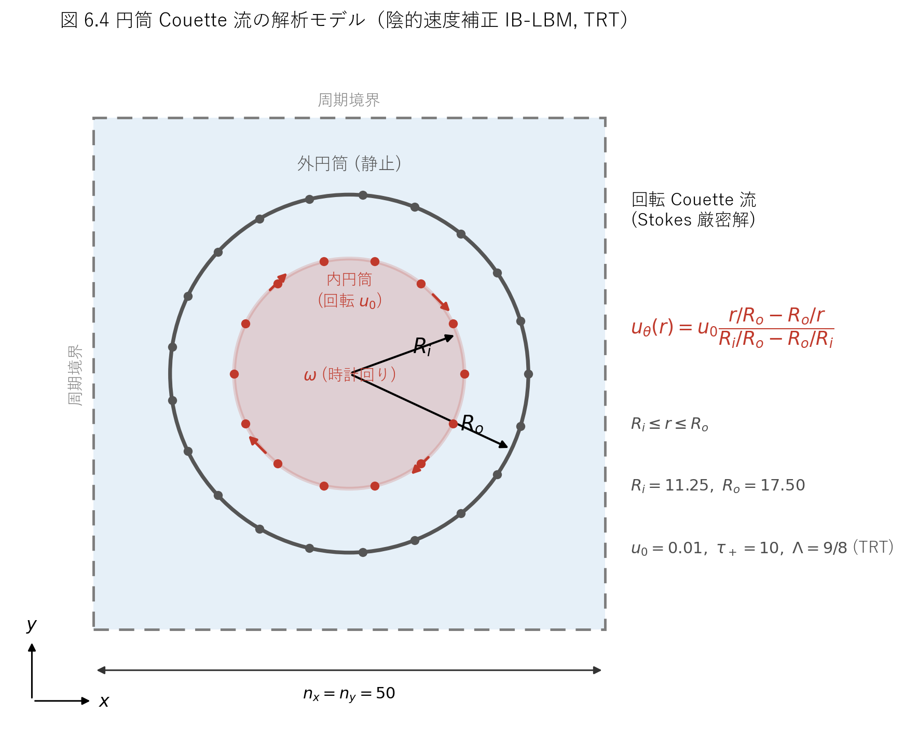
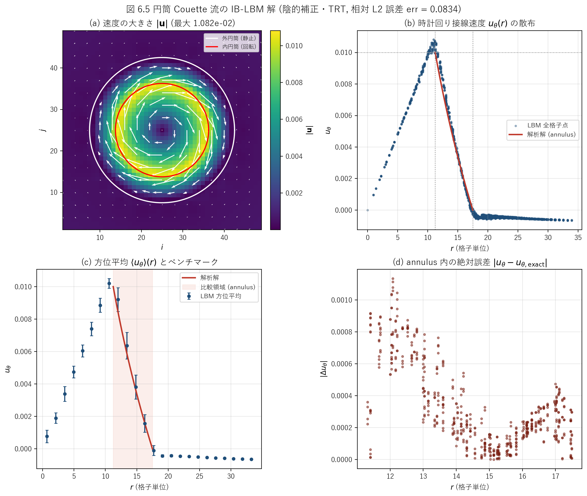

# iblbm2cicTRT.c 説明ドキュメント

## 概要

[src/sec6/iblbm2cicTRT.c](../../src/sec6/iblbm2cicTRT.c) は、同心 2 重円筒のあいだの **円筒 (回転) Couette 流** を、**陰的速度補正型 (Implicit velocity Correction) の没入境界 — 格子ボルツマン法 (IB-LBM)** で解くサンプルです。流体は D2Q9 を **TRT (二緩和時間)** collision で解き、体積力には **Guo (2002) の力項を偶奇 (even/odd) に分解した TRT 整合形**を用います。2 本の円筒境界は流体格子とは独立な Lagrangian 点列で表現します。外側円筒を静止、内側円筒を時計回りに回転させ、定常状態の接線速度分布を回転 Stokes 流の解析解と比較するベンチマークです。

本コードは、同セクションの MRT 版 [iblbm2cicMRT.c](../../src/sec6/iblbm2cicMRT.c) と問題設定・没入境界の実装をほぼ共有し、**衝突演算子だけを MRT から TRT に**置き換えた姉妹コードです。タイトルの `cic` は **c**ylindrical Couette + **i**mplicit **c**orrection、`TRT` は collision 演算子を表します。基本形は直接強制型 [iblbm2cdfSRT.c](../../src/sec6/iblbm2cdfSRT.c) (Direct Forcing + SRT) です。

この文書では、次の点を順に説明します。

- 対象問題 (円筒 Couette 流) と回転 Stokes 解析解の対応
- D2Q9-TRT 本体 (偶奇分解と 2 緩和時間) と、TRT 整合形の Guo 力項の実装
- 陰的速度補正 (影響行列 → 線形ソルブ → 補正) の実装
- 解析解との誤差 `err` の定義と数値結果 (DF-SRT 版・IC-MRT 版との 3 者比較)

このコードでは、次の処理を 1 本のプログラムで行っています。

- 計算開始前に、Lagrangian 点どうしの離散デルタ相関 (影響行列 `mm`) を 1 度だけ組み立てる
- 一様密度・静止流から計算を開始する
- TRT collision → Guo 力項 (偶奇分解) の付加 → streaming → 巨視量再構成を反復する
- 各時間ステップで内・外円筒の Lagrangian 点に陰的速度補正の体積力を計算し、Eulerian 格子へ分配する
- 定常後に接線速度の解析解との相対 L2 誤差 `err` と速度場 (`datau`, `datav`) を出力する

## 扱う物理量

| 記号 | コード | 意味 |
| --- | --- | --- |
| $\rho$ | `rho` | 密度 |
| $u, v$ | `u`, `v` | 速度成分 (Eulerian) |
| $u_\theta$ | `ut` | 時計回り接線速度 (数値解) |
| $u_{\theta}^{\mathrm{exact}}$ | `ua` | 時計回り接線速度 (解析解) |
| $u_0$ | `u0` | 内側円筒の表面速度 |
| $f_k$ | `f` | 分布関数 |
| $f_k^{\mathrm{eq}}$ | `f0` | 平衡分布関数 |
| $f_k^{+}, f_k^{-}$ | `fp`, `fm` | 分布関数の偶部・奇部 |
| $f_k^{\mathrm{eq},+}, f_k^{\mathrm{eq},-}$ | `f0p`, `f0m` | 平衡分布の偶部・奇部 |
| $F_k$ | `fi` | Guo の力項 (分布関数空間) |
| $F_k^{+}, F_k^{-}$ | `fip`, `fim` | 力項の偶部・奇部 |
| $\tau_+$ | `taup` | 偶部 (対称モーメント) の緩和時間 |
| $\tau_-$ | `taum` | 奇部 (反対称モーメント) の緩和時間 |
| $\nu$ | `nu` | 動粘性係数 |
| $\mathbf{F}=(F_x,F_y)$ | `fx`, `fy` | Eulerian 格子上の体積力 (= 速度補正 $\delta\mathbf{u}$ → 2 倍して体積力) |
| $R_o, R_i$ | `rp[0]`, `rp[1]` | 外側・内側円筒の半径 |
| $(x_e,y_e)$ | `xe`, `ye` | Lagrangian 点の座標 |
| $(u_e,v_e)$ | `ue`, `ve` | Lagrangian 点の目標速度 (物体速度) |
| $(u_e^t,v_e^t)$ | `uet`, `vet` | Lagrangian 点へ補間した流体速度 |
| $(F_e^x,F_e^y)$ | `fxe`, `fye` | Lagrangian 点の速度補正 (線形ソルブの解) |
| $A_{mn}$ | `mm` | Lagrangian 点間の離散デルタ相関 (影響行列) |
| $n_e$ | `ne` | 各円筒の Lagrangian 点数 |
| `err` | `err` | annulus 内の接線速度の相対 L2 誤差 |

## 解析モデル

解析モデルの模式図を図 6.4 に示します (本セクションでは図 6.0／6.1 を DF-SRT 版 [iblbm2cdfSRT.md](iblbm2cdfSRT.md)、図 6.2／6.3 を IC-MRT 版 [iblbm2cicMRT.md](iblbm2cicMRT.md) が使用しているため、本コードは図 6.4 以降を用います)。



図 6.4　円筒 Couette 流の解析モデル (陰的速度補正 IB-LBM, TRT)。一辺 $n_x=n_y=50$ の周期境界正方領域の中央に、半径 $R_o=17.5$ の静止外円筒と半径 $R_i=11.25$ の回転内円筒を同心に配置する。内円筒は表面速度 $u_0=0.01$ で時計回りに回転する。赤・灰の点は各円筒を表現する Lagrangian 点 (IC-MRT 版と同じく外 21／内 14 点)。緩和時間は $\tau_+=10$ と大きく、TRT の磁数 $\Lambda=(\tau_+-1/2)(\tau_--1/2)=9/8$ を満たすように $\tau_-$ を選ぶ。annulus ($R_i\leq r\leq R_o$) では接線速度が回転 Stokes 解に従う。

## 対象問題

同心 2 重円筒のあいだの定常層流を考えます。内側円筒 (半径 $R_i$) が角速度 $\omega$ で回転し、外側円筒 (半径 $R_o$) は静止しています。純粋な方位流 $u_\theta(r)$ では、Navier-Stokes 方程式は

$$
\frac{d}{dr}\!\left(\frac{1}{r}\frac{d(r\,u_\theta)}{dr}\right)=0
$$

に簡約され、一般解 $u_\theta(r)=A\,r+B/r$ に境界条件 $u_\theta(R_i)=u_0$、$u_\theta(R_o)=0$ を課すと

$$
u_\theta(r)=u_0\,\frac{r/R_o-R_o/r}{R_i/R_o-R_o/R_i}
\qquad (R_i\leq r\leq R_o)
$$

が得られます。[iblbm2cicTRT.c:161](../../src/sec6/iblbm2cicTRT.c#L161) の `ua` はこの式そのものです。`r=R_i` で $u_\theta=u_0$、`r=R_o` で $u_\theta=0$ となります。コードでは表示用に annulus の外側 ($r\geq R_o$) で `ua=0`、内側 ($r\leq R_i$) で `ua=u0` と置いていますが ([iblbm2cicTRT.c:162-163](../../src/sec6/iblbm2cicTRT.c#L162-L163))、誤差評価は annulus 内のみで行います。この解析解は粘性 $\nu$ に依存しない Stokes 解なので、本コードのように $\nu$ が大きくても比較対象は不変です。

既定設定では、Reynolds 数は gap $d=R_o-R_i=6.25$ を代表長さとして

$$
Re=\frac{u_0\,d}{\nu}=\frac{0.01\times 6.25}{19/6}\approx 0.020
$$

と極めて小さく (MRT 版の $Re\approx 1.9$ よりさらに 2 桁小さい)、Taylor 不安定をはるかに下回る深い Stokes 領域の定常層流です。

## 格子モデル

D2Q9 モデルを使います。離散速度は

$$
\mathbf{c}_0=(0,0),\quad
\mathbf{c}_{1\sim4}=(\pm1,0),(0,\pm1),\quad
\mathbf{c}_{5\sim8}=(\pm1,\pm1)
$$

で ([iblbm2cicTRT.c:170-174](../../src/sec6/iblbm2cicTRT.c#L170-L174))、重みは $w_0=4/9,\ w_{1\sim4}=1/9,\ w_{5\sim8}=1/36$ です。

緩和時間は **偶部 $\tau_+$ と奇部 $\tau_-$ の 2 つ**で、コードでは

```c
taup = 0.6;
taup = 10.0;        // 直前の 0.6 を上書き。実効値は 10.0
nu = (taup - 0.5)/3.0;
taum = (4.0*taup + 7.0)/(8.0*taup - 4.0);
```

となっています ([iblbm2cicTRT.c:83-88](../../src/sec6/iblbm2cicTRT.c#L83-L88))。`taup` は一度 0.6 に設定された直後に **10.0 で上書き**されるため、実効値は $\tau_+=10$ です。物理粘性は偶部 (応力モーメント) の緩和で決まり、

$$
\nu=\frac{1}{3}\!\left(\tau_+-\frac{1}{2}\right)=\frac{1}{3}\!\left(10-\frac{1}{2}\right)=\frac{19}{6}\approx 3.167
$$

です。MRT 版 ($\tau=0.6,\ \nu=1/30$) と比べて粘性が約 95 倍大きく、これが Re を 2 桁下げています。

## 平衡分布関数

平衡分布関数は標準的な D2Q9 の二次近似で、

$$
f_k^{\mathrm{eq}}=w_k\rho\left(1+3\,\mathbf{c}_k\cdot\mathbf{u}
+\frac{9}{2}(\mathbf{c}_k\cdot\mathbf{u})^2-\frac{3}{2}|\mathbf{u}|^2\right)
$$

です。コードでは `k=0`, `k=1..4`, `k=5..8` に分け、係数 `4/9`, `1/9`, `1/36` でこの式をそのまま実装しています ([iblbm2cicTRT.c:199-210](../../src/sec6/iblbm2cicTRT.c#L199-L210))。

## TRT collision

MRT 版との唯一の本質的な違いが衝突演算子です。**TRT (Two-Relaxation-Time)** は、各分布関数をその反対向き $\bar k$ (例: $1\leftrightarrow3$, $2\leftrightarrow4$, $5\leftrightarrow7$, $6\leftrightarrow8$) と組にして、**偶部 (対称) と奇部 (反対称)** に分解し、それぞれを別の緩和時間で平衡へ近づけます。

$$
f_k^{+}=\frac{f_k+f_{\bar k}}{2},\qquad
f_k^{-}=\frac{f_k-f_{\bar k}}{2}
$$

$$
f_k^{*}=f_k-\frac{f_k^{+}-f_k^{\mathrm{eq},+}}{\tau_+}-\frac{f_k^{-}-f_k^{\mathrm{eq},-}}{\tau_-}
$$

コードでは [iblbm2cicTRT.c:212-252](../../src/sec6/iblbm2cicTRT.c#L212-L252) で `fp`/`fm` と `f0p`/`f0m` を上式どおり組み立て (静止成分 `k=0` は偶部のみ、奇部 0)、[iblbm2cicTRT.c:254-257](../../src/sec6/iblbm2cicTRT.c#L254-L257) で

```c
f[k] = f[k] - (fp[k]-f0p[k])/taup - (fm[k]-f0m[k])/taum;
```

と緩和します。偶部の緩和率 $1/\tau_+$ が物理粘性を、奇部の緩和率 $1/\tau_-$ が境界精度 (壁面の有効位置・slip 速度) を決めます。

### 磁数 (magic number) $\Lambda$ と slip 速度

$\tau_-$ は独立な自由パラメータではなく、TRT の磁数

$$
\Lambda=\left(\tau_+-\frac{1}{2}\right)\!\left(\tau_--\frac{1}{2}\right)
$$

を一定に保つよう設定されます。コードの

$$
\tau_-=\frac{4\tau_++7}{8\tau_+-4}
$$

は代入すると **$\tau_+$ によらず $\Lambda=9/8$** を与えます ($\tau_-=47/76\approx 0.618$)。ソース冒頭のコメント [iblbm2cicTRT.c:86](../../src/sec6/iblbm2cicTRT.c#L86) はこれを **slip velocity ($u_s/u_0=0$)** と注記しており、この $\Lambda$ の選択が境界での数値的すべり速度を打ち消す狙いであることを示します。コメントアウトされた `taum = taup` ([iblbm2cicTRT.c:87](../../src/sec6/iblbm2cicTRT.c#L87)) は $\tau_-=\tau_+$、すなわち SRT (BGK) と等価な設定で、その場合は有限の slip が残ります。

> **補足**: bounce-back 壁を半セル位置に固定する古典的な磁数 $\Lambda=3/16$ とは異なる値です。本コードは bounce-back ではなく没入境界 (連続的な力分配) なので、slip を打ち消す $\Lambda$ も別の値 ($9/8$) になります。

## 時間発展

1 ステップはおおむね次の順に進みます。外側ループ 20 回 × 内側ループ 100 回で計 **2000 ステップ** 回します ([iblbm2cicTRT.c:194-195](../../src/sec6/iblbm2cicTRT.c#L194-L195))。

1. **平衡分布の計算** ([iblbm2cicTRT.c:199-210](../../src/sec6/iblbm2cicTRT.c#L199-L210))
2. **TRT collision** (偶奇分解 → 2 緩和、[iblbm2cicTRT.c:212-257](../../src/sec6/iblbm2cicTRT.c#L212-L257))
3. **Guo の力項の付加** (偶奇分解、[iblbm2cicTRT.c:260-311](../../src/sec6/iblbm2cicTRT.c#L260-L311))
4. **Streaming** ([iblbm2cicTRT.c:317-329](../../src/sec6/iblbm2cicTRT.c#L317-L329))
5. **巨視量の再構成** ([iblbm2cicTRT.c:331-341](../../src/sec6/iblbm2cicTRT.c#L331-L341))
6. **没入境界による陰的速度補正** ([iblbm2cicTRT.c:343-460](../../src/sec6/iblbm2cicTRT.c#L343-L460))

### Guo (2002) の力項 (TRT 整合形)

体積力にはまず Guo らの完全な力項

$$
F_k=w_k\left[3(\mathbf{c}_k-\mathbf{u})\cdot\mathbf{F}
+9(\mathbf{c}_k\cdot\mathbf{u})(\mathbf{c}_k\cdot\mathbf{F})\right]
$$

を **前因子 $(1-1/2\tau)$ を付けずに** 構成します ([iblbm2cicTRT.c:260-282](../../src/sec6/iblbm2cicTRT.c#L260-L282))。逐行に見ると `u2 = u·F`、`tmp = c_k·F`、`tmp1 = (c_k·u)(c_k·F)` で、

$$
F_k=w_k\big(3\,\mathbf{c}_k\!\cdot\!\mathbf{F}+9(\mathbf{c}_k\!\cdot\!\mathbf{u})(\mathbf{c}_k\!\cdot\!\mathbf{F})-3\,\mathbf{u}\!\cdot\!\mathbf{F}\big)
$$

が上式に一致します ($k=0$ では `-4/3 (u·F)` $=w_0(-3\,\mathbf{u}\cdot\mathbf{F})$)。

ここが MRT 版との実装上の違いです。MRT 版は前因子 $(1-1/2\tau)$ を 1 つの $\tau$ で掛けますが、TRT 版は力項も衝突と同じく **偶奇に分解し、偶部に $(1-1/2\tau_+)$、奇部に $(1-1/2\tau_-)$** を掛けます ([iblbm2cicTRT.c:284-311](../../src/sec6/iblbm2cicTRT.c#L284-L311))。

```c
f[k] += (1.0 - 0.5/taup)*fip[k] + (1.0 - 0.5/taum)*fim[k];
```

既定値では偶部前因子 $1-1/(2\tau_+)=0.95$、奇部前因子 $1-1/(2\tau_-)\approx 0.191$ です。これは TRT における Guo 力項の正しい (緩和率と整合した) 形です。コード下部にはこの分解を行わず素朴に `f += fi` とする版がコメントとして残されています ([iblbm2cicTRT.c:313-315](../../src/sec6/iblbm2cicTRT.c#L313-L315))。ここで使う $\mathbf{u}$ と $\mathbf{F}$ は **前ステップで没入境界が用意した値**です。

### Streaming・巨視量

streaming は `ftmp` に退避してから移流し、配列端は周期境界として折り返します ([iblbm2cicTRT.c:317-329](../../src/sec6/iblbm2cicTRT.c#L317-L329))。巨視量は

$$
\rho=\sum_k f_k,\qquad
u=\frac{1}{\rho}\sum_k f_k c_{k,x},\qquad
v=\frac{1}{\rho}\sum_k f_k c_{k,y}
$$

で再構成します ([iblbm2cicTRT.c:331-341](../../src/sec6/iblbm2cicTRT.c#L331-L341))。ここでは **半力補正を加えません**。半力補正は後段の速度補正 ($\mathbf{u}\mathrel{+}=\mathbf{F}/2$ に相当) として加わります (後述)。

## 没入境界法 (陰的速度補正)

没入境界の実装は MRT 版と完全に共通で、Wu & Shu (2009) の **陰的速度補正法 (implicit velocity correction)** です。各 Lagrangian 点で no-slip を (近似的に) 満たすように速度補正量を線形システムから解き、それを体積力に変換します。

### 円筒と Lagrangian 点の配置

2 本の円筒は中心 $(25,25)$ に同心配置し、半径と点数は

$$
R_o=\frac{70}{200}n_x=17.5,\quad R_i=\frac{45}{200}n_x=11.25
$$

$$
n_e^{(0)}=\big\lfloor 2\pi R_o\cdot 0.2\big\rfloor=21,\quad
n_e^{(1)}=\big\lfloor 2\pi R_i\cdot 0.2\big\rfloor=14
$$

です ([iblbm2cicTRT.c:91-95](../../src/sec6/iblbm2cicTRT.c#L91-L95))。

> **注意 (添字の向き)**: `rp[0]` が **外側** (大きい半径 17.5)、`rp[1]` が **内側** (小さい半径 11.25) です。回転するのは `rp[1]` (内側、`n=1`) の側です。直感と逆なので注意してください。

目標速度は外円筒 ($n=0$) が静止、内円筒 ($n=1$) が

$$
u_e=u_0\sin\theta,\qquad v_e=-u_0\cos\theta
\qquad (\theta=2\pi m/n_e)
$$

で ([iblbm2cicTRT.c:150-153](../../src/sec6/iblbm2cicTRT.c#L150-L153))、角速度 $\omega=-u_0/R_i$ の **時計回り (CW) 剛体回転** に対応します ($\theta=0$ の右端の点で $\mathbf{u}_e=(0,-u_0)$ = 下向き = 時計回り)。

### 影響行列 `mm` の事前構築

陰的補正の核は、Lagrangian 点 $m$ と $n$ のあいだの **離散デルタ相関**

$$
A_{mn}=\left[\sum_{i,j}\delta_h(x_e^{(m)}-i)\,\delta_h(y_e^{(m)}-j)\,
\delta_h(x_e^{(n)}-i)\,\delta_h(y_e^{(n)}-j)\right]\frac{2\pi R}{n_e}
$$

を要素とする行列 `mm` です ([iblbm2cicTRT.c:110-148](../../src/sec6/iblbm2cicTRT.c#L110-L148))。これは「点 $n$ に単位の速度補正を置き、Eulerian 格子へ分配 (spread) してから点 $m$ へ補間 (interpolate) して戻したときに現れる量」、すなわち $A=$ (補間 ∘ 分配) という線形作用素です。円筒は剛体で Lagrangian 点が並進しないため、`mm` は **時間ループの前に 1 度だけ**組み立てれば足ります。離散デルタは補間・分配と同じ 4 点 cosine 関数

$$
\delta_h(r)=\frac{1}{4}\left(1+\cos\frac{\pi r}{2}\right)\quad(|r|\leq 2),\qquad 0\ (|r|>2)
$$

を使います。

### (i) 速度の補間 → 残差

各 Lagrangian 点へ周囲の流体速度を離散デルタで補間し ([iblbm2cicTRT.c:348-368](../../src/sec6/iblbm2cicTRT.c#L348-L368))、目標速度との残差を作ります ([iblbm2cicTRT.c:374-377](../../src/sec6/iblbm2cicTRT.c#L374-L377))。

$$
u_e^t=\sum_{i,j}u_{i,j}\,\delta_h(x_e-i)\,\delta_h(y_e-j),
\qquad
\Delta\mathbf{u}_e=\mathbf{u}_e-\mathbf{u}_e^t
$$

### (ii) 速度補正の線形ソルブ

陰的補正では、no-slip を満たす速度補正 $\delta\mathbf{u}_e$ を

$$
A\,\delta\mathbf{u}_e=\Delta\mathbf{u}_e
$$

として解きます ([iblbm2cicTRT.c:378-421](../../src/sec6/iblbm2cicTRT.c#L378-L421))。$x$ 成分 (`in==0`) と $y$ 成分 (`in==1`) を別々に、各粒子ごとに解き、結果を `fxe`/`fye` に上書きします。残差をそのまま力にするのではなく、分配後の干渉まで織り込んで補正量を決めるのが直接強制 (DF) との違いです。

> **特記事項 (ソルバの実装)**: MRT 版と同一で、コード上は「Gauss 法」と銘打たれていますが、前進消去ループ ([iblbm2cicTRT.c:394](../../src/sec6/iblbm2cicTRT.c#L394)) のピボット添字 `k` が、内側の右辺ベクトル代入ループ ([iblbm2cicTRT.c:385](../../src/sec6/iblbm2cicTRT.c#L385), [iblbm2cicTRT.c:389](../../src/sec6/iblbm2cicTRT.c#L389)) で **同じ変数 `k` のまま再利用**されています。このため右辺代入の終了時に `k = ne[n]` となり、前進消去 `for(i=k+1;...)` は 1 度も実行されません。結果として `mm` は三角化されず、後段の後退代入 ([iblbm2cicTRT.c:404-409](../../src/sec6/iblbm2cicTRT.c#L404-L409)) だけが元の `mm` 上で走ります。すなわち実効的には **影響行列に対する後退 Gauss-Seidel を 1 スイープ**行う近似ソルブです。`mm` は対角優位 (自己相関 $A_{mm}$ が最大) なので 1 スイープでも妥当な補正が得られ、毎ステップ反復して定常へ収束します。なおこの「副作用」のおかげで `mm` がステップを跨いで破壊されずに済んでいます (もし正しく前進消去すると 1 度だけ構築する現在の作りでは 2 ステップ目以降が破綻します)。

### (iii) 力の分配と速度補正

解いた補正量を同じ離散デルタで Eulerian 格子へ分配します ([iblbm2cicTRT.c:424-450](../../src/sec6/iblbm2cicTRT.c#L424-L450))。

$$
\delta\mathbf{u}_{i,j}=\sum_e \delta\mathbf{u}_e\,\delta_h(x_e-i)\,\delta_h(y_e-j)\,\frac{2\pi R}{n_e}
$$

得られた $\delta\mathbf{u}$ が `fx`, `fy` です。続いて巨視速度を補正し ([iblbm2cicTRT.c:452-455](../../src/sec6/iblbm2cicTRT.c#L452-L455))、その後 `fx`, `fy` を **2 倍**して次ステップの体積力にします ([iblbm2cicTRT.c:457-460](../../src/sec6/iblbm2cicTRT.c#L457-L460))。

$$
\mathbf{u}\leftarrow\mathbf{u}+\delta\mathbf{u},\qquad
\mathbf{F}=2\,\delta\mathbf{u}
$$

巨視量再構成 ([iblbm2cicTRT.c:331-341](../../src/sec6/iblbm2cicTRT.c#L331-L341)) で半力補正を省いた分を、ここで $\delta\mathbf{u}=\mathbf{F}/2$ として加えていることになり、Guo スキームの半力補正と整合します。

## 数値設定

| 項目 | 値 |
| --- | ---: |
| 格子 | $n_x=n_y=50$ (`DIM=51`) |
| collision | TRT (偶奇 2 緩和) |
| 力項 | Guo (2002)、偶奇分解 (TRT 整合形)、半力補正あり |
| 補正法 | 陰的速度補正 (影響行列 1 スイープ近似) |
| $\tau_+$ | 10.0 (0.6 を上書き) |
| $\tau_-$ | $47/76\approx 0.618$ ($\Lambda=9/8$) |
| $\nu$ | $19/6\approx 3.167$ |
| 外円筒半径 $R_o$ | 17.5 (静止) |
| 内円筒半径 $R_i$ | 11.25 (CW 回転) |
| 内円筒表面速度 $u_0$ | 0.01 |
| Lagrangian 点数 | 外 21 / 内 14 ($n_e$ 係数 0.2) |
| 総ステップ数 | 2000 (= 20 × 100) |
| $Re$ (gap 基準) | $\approx 0.020$ |

## 解析結果

主要結果を図 6.5 に示します。



図 6.5　円筒 Couette 流の IB-LBM 解 (陰的補正・TRT、相対 L2 誤差 `err` = 0.0834)。(a) 速度の大きさ $|\mathbf{u}|$ と 2 本の円筒・速度ベクトル。内円筒まわりに高速のリングが形成され、外側へ向けて減衰する。(b) 全格子点の時計回り接線速度 $u_\theta(r)$ の散布と annulus 内の解析解 (赤線)。内円筒内部 ($r<R_i$) ではほぼ剛体回転で中心へ向け 0 に漸近し、annulus では Stokes 解に沿って減衰する。(c) 方位平均 $\langle u_\theta\rangle(r)$ と解析解の比較。(d) annulus 内の点ごとの絶対誤差。

定性的な特徴は物理直感と整合します。

- 内円筒 ($r=R_i=11.25$) で接線速度がほぼ $u_0$ にピークを持つ
- annulus ($11.25\leq r\leq 17.5$) で解析解に沿って単調減衰し、外円筒 ($r=R_o=17.5$) でほぼ 0 になる
- 内円筒内部では剛体回転に近く、中心で速度が 0 に向かう
- 回転方向は時計回り (CW) で、`ue=u0 sinθ, ve=-u0 cosθ` の設定と一致する

### ベンチマーク (解析解との比較)

接線速度の数値解 `ut` ([iblbm2cicTRT.c:466-471](../../src/sec6/iblbm2cicTRT.c#L466-L471)) と解析解 `ua` の差を、annulus ($R_i\leq r\leq R_o$) で相対 L2 ノルム

$$
\mathrm{err}=\sqrt{\dfrac{\displaystyle\sum_{R_i\leq r\leq R_o}\big(u_\theta-u_{\theta}^{\mathrm{exact}}\big)^2}
{\displaystyle\sum_{R_i\leq r\leq R_o}\big(u_{\theta}^{\mathrm{exact}}\big)^2}}
$$

として評価しています ([iblbm2cicTRT.c:473-483](../../src/sec6/iblbm2cicTRT.c#L473-L483))。既定設定での最終値は

$$
\mathrm{err}=0.0834\quad(\approx 8.3\%)
$$

です。Python 側で同じ定義を再計算しても **0.083419** となり、C コードの出力と一致します。annulus 内で方位平均した接線速度と解析解の比較を次表に示します (同じ内容を CSV [docs/sec6/generated/iblbm2cicTRT_couette_profile.csv](generated/iblbm2cicTRT_couette_profile.csv) にも保存)。

| $r$ | 本コード $\langle u_\theta\rangle$ | 解析解 $u_{\theta}^{\mathrm{exact}}$ | $\lvert\Delta\rvert$ | 相対誤差 |
| ---: | ---: | ---: | ---: | ---: |
| 12.02 | $9.203\times 10^{-3}$ | $8.425\times 10^{-3}$ | $7.78\times 10^{-4}$ | 9.2% |
| 13.44 | $6.367\times 10^{-3}$ | $5.860\times 10^{-3}$ | $5.07\times 10^{-4}$ | 8.6% |
| 14.85 | $3.809\times 10^{-3}$ | $3.615\times 10^{-3}$ | $1.94\times 10^{-4}$ | 5.4% |
| 16.26 | $1.569\times 10^{-3}$ | $1.607\times 10^{-3}$ | $3.79\times 10^{-5}$ | 2.4% |

### DF-SRT 版・IC-MRT 版との比較

同じ問題・同じ格子を、3 種の collision／体積力法で解いた結果の比較を示します。$\tau_+$ (粘性) が版ごとに異なる点に注意してください (解析解は $\nu$ 非依存なので比較は妥当)。

| 項目 | DF-SRT (`iblbm2cdfSRT`) | IC-MRT (`iblbm2cicMRT`) | IC-TRT (`iblbm2cicTRT`) |
| --- | ---: | ---: | ---: |
| collision | SRT (BGK) | MRT | TRT |
| 力項 | 簡素 (半力補正なし) | Guo、半力補正あり | Guo (偶奇分解)、半力補正あり |
| 補正法 | 直接強制 (陽的) | 陰的速度補正 (1 スイープ) | 陰的速度補正 (1 スイープ) |
| $\tau$ ($\tau_+$) | 0.6 | 0.6 | 10.0 |
| $\nu$ | $1/30$ | $1/30$ | $19/6$ |
| Lagrangian 点数 (外/内) | 54 / 35 | 21 / 14 | 21 / 14 |
| $\max\lvert\mathbf{u}\rvert$ | $1.0454\times 10^{-2}$ | $1.0930\times 10^{-2}$ | $1.0818\times 10^{-2}$ |
| 相対 L2 誤差 `err` | 0.0985 (9.9%) | **0.0765 (7.7%)** | 0.0834 (8.3%) |

IC-TRT は陰的補正・Guo 力項・半力補正を備える点で IC-MRT と同じ骨格を持ち、DF-SRT より高精度です。IC-MRT よりわずかに誤差が大きいのは、$\tau_+=10$ という極端に大きい緩和時間 (高粘性) の設定差が主因と考えられ、collision 自体の優劣ではありません。速度オーバーシュート ($\max|\mathbf{u}|\approx 0.0108>u_0$) は IC-MRT と同程度で、いずれも Lagrangian 点が粗い ($n_e$ 係数 0.2) ことの影響です。

### 収束履歴 (ASCII 速度マップ)

実行中は内側ループ 100 回ごとに、内部速度の大きさを 0–9 の文字で表した粗いマップと `err` が標準出力に表示されます ([iblbm2cicTRT.c:484-515](../../src/sec6/iblbm2cicTRT.c#L484-L515))。$\tau_+=10$ と粘性が極めて大きいため拡散時間が短く、本コードは **わずか 100 ステップでほぼ定常**に達し、以降ほとんど変化しません (MRT 版は step 100 で `err`≈0.26 だった)。

| step | 100 | 200 | 300 | 500 | 1000 | 2000 |
| ---: | ---: | ---: | ---: | ---: | ---: | ---: |
| `err` | 0.0835 | 0.0835 | 0.0834 | 0.0834 | 0.0834 | 0.0834 |

## 出力ファイル

[iblbm2cicTRT.c:519-533](../../src/sec6/iblbm2cicTRT.c#L519-L533) は計算後に次を出力します (内部点 $i,j=1,\dots,n_x-1$ を 1 行に $j$ 固定で書き出し)。

- `datau`: $x$ 方向速度 $u$ (49 × 49)
- `datav`: $y$ 方向速度 $v$ (49 × 49)

[scripts/run_one.cmd](../../scripts/run_one.cmd) により [outputs/sec6/iblbm2cicTRT](../../outputs/sec6/iblbm2cicTRT) に保存されます。

## 実行例

リポジトリのルートで次を実行します。

```powershell
cmd /c scripts\run_one.cmd src\sec6\iblbm2cicTRT.c
d:/work/LBMcode/.venv/Scripts/python.exe scripts/plot_iblbm2cicTRT_schematic.py
d:/work/LBMcode/.venv/Scripts/python.exe scripts/plot_iblbm2cicTRT_results.py
```

最終出力は次のとおりです。

| 項目 | 値 |
| --- | ---: |
| Time | 2000 |
| `err` (相対 L2) | 0.083419 |
| $\max\lvert\mathbf{u}\rvert$ | $1.0818\times 10^{-2}$ |
| $\min\lvert\mathbf{u}\rvert$ | $\approx 1\times 10^{-5}$ |

## ベンチマークの出典

円筒 Couette 流は、没入境界 LBM の精度検証に広く使われる定番ベンチマークです。本コードの「陰的速度補正 + Guo 力項」という構成は、Wu & Shu (2009) が提案し回転 Couette 流で第 2 次精度を確認した implicit velocity correction-based IB-LBM に対応します。TRT collision は Ginzburg らによる二緩和時間モデル、Guo の力項は Guo ら (2002) によります。本コードは著者 (Takeshi Seta) の LBM 教科書系列のサンプルで、同じ問題を直接強制 (SRT)・陰的補正 (MRT/TRT) で解き比べる構成になっています。

- J. Wu, C. Shu, "Implicit velocity correction-based immersed boundary-lattice Boltzmann method and its applications," *J. Comput. Phys.* **228** (2009) 1963–1979. (陰的速度補正法・回転 Couette 流ベンチマークの出典)
- I. Ginzburg, F. Verhaeghe, D. d'Humières, "Two-relaxation-time lattice Boltzmann scheme: About parametrization, velocity, pressure and mixed boundary conditions," *Commun. Comput. Phys.* **3** (2008) 427–478. (TRT モデルと磁数 $\Lambda$ の出典)
- Z. Guo, C. Zheng, B. Shi, "Discrete lattice effects on the forcing term in the lattice Boltzmann method," *Phys. Rev. E* **65** (2002) 046308. (力項の出典)
- C. S. Peskin, "The immersed boundary method," *Acta Numerica* **11** (2002) 479–517. (4 点 cosine デルタ関数の出典)

## 特記事項 (実装上の注意)

読み解く際に注意したい実装上のクセを挙げておきます。

- **`taup` は二重代入で 10.0 が有効**: [iblbm2cicTRT.c:83-84](../../src/sec6/iblbm2cicTRT.c#L83-L84) で `taup=0.6;` の直後に `taup=10.0;` と上書きされます。実効粘性は $\nu=19/6\approx 3.167$ (MRT/SRT 版の約 95 倍)、$Re\approx 0.02$ です。0.6 の行は前の設定の名残りと思われます。
- **磁数は $\Lambda=9/8$ で一定**: $\tau_-=(4\tau_++7)/(8\tau_+-4)$ は $\tau_+$ によらず $\Lambda=(\tau_+-1/2)(\tau_--1/2)=9/8$ を与えます。冒頭コメントはこれを slip 速度 $u_s/u_0=0$ の条件と注記。bounce-back の $\Lambda=3/16$ とは別物 (没入境界なので) です。
- **力項も偶奇分解**: TRT 版では Guo 力項を衝突と同じく偶部・奇部に分け、前因子を $(1-1/2\tau_+)$ と $(1-1/2\tau_-)$ に分けて掛けます ([iblbm2cicTRT.c:284-311](../../src/sec6/iblbm2cicTRT.c#L284-L311))。MRT 版が単一 $\tau$ の前因子を掛けるのと対照的で、TRT 整合の正しい形です。
- **「Gauss 法」ソルバは実効的に 1 スイープ近似**: 前進消去のピボット添字 `k` が右辺代入ループで再利用されるため前進消去がスキップされ、後退代入のみが影響行列上で走ります ([iblbm2cicTRT.c:378-421](../../src/sec6/iblbm2cicTRT.c#L378-L421))。MRT 版と同一のクセです。この副作用で `mm` がステップを跨いで保持されます。
- **添字の向きが直感と逆**: `rp[0]` が外側 (17.5)、`rp[1]` が内側 (11.25) です。回転するのは内側 (`n=1`)。
- **力配列 `fx`/`fy` の初期化が暗黙・順序依存**: `fx`, `fy` はスタック配列で明示初期化がなく、リセットは spreading 直前 ([iblbm2cicTRT.c:425-427](../../src/sec6/iblbm2cicTRT.c#L425-L427)) で範囲 `i,j=0..nx-1` のみ行われます。最初の 1 ステップだけ Guo 力項に未初期化値が混入し、周期端 `i=nx`／`j=ny` の行・列は初期化されないまま読まれます。既定設定では収束結果に影響しませんが、移植時は全域ゼロ初期化が安全です。
- **半力補正は速度補正として実装**: 巨視量再構成では半力補正を加えず ([iblbm2cicTRT.c:331-341](../../src/sec6/iblbm2cicTRT.c#L331-L341))、速度補正 $\delta\mathbf{u}=$`fx` を後段で加える ([iblbm2cicTRT.c:452-455](../../src/sec6/iblbm2cicTRT.c#L452-L455)) ことで $\mathbf{F}/2$ 補正と整合させています。

## このコードの見どころ

- IC-MRT 版と同じ円筒 Couette 問題・同じ没入境界実装を、**collision だけ TRT に替えて**解き比べられる。3 兄弟 (SRT/MRT/TRT) で精度を相対 L2 誤差で直接比較できる
- TRT の核である **偶奇分解と 2 緩和時間**、および磁数 $\Lambda$ による slip 速度制御がコードで追える
- **Guo 力項を偶奇に分解して各緩和時間と整合させる**、TRT における正しい体積力の実装が確認できる
- 高粘性 ($\tau_+=10$) ゆえに 100 ステップでほぼ定常へ達する、深い Stokes 領域の挙動が観察できる
